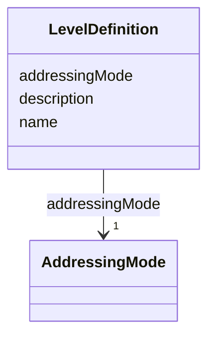

# Class: LevelDefinition 


_Named nesting level within a feature hierarchy (Feature 053, FR-010). Defines how addresses at this level are interpreted._


URI: [debrief:class/LevelDefinition](https://debrief.info/schemas/class/LevelDefinition)





<!-- no inheritance hierarchy -->


## Slots

| Name | Cardinality and Range | Description | Inheritance |
| ---  | --- | --- | --- |
| [name](../slots/name.md) | 1 <br/> [String](../types/String.md) | Level identifier used in selection paths | direct |
| [addressingMode](../slots/addressingMode.md) | 1 <br/> [AddressingMode](../enums/AddressingMode.md) | How addresses at this level are interpreted | direct |
| [description](../slots/description.md) | 0..1 <br/> [String](../types/String.md) | Human-readable description | direct |


## Identifier and Mapping Information


### Schema Source


* from schema: https://debrief.info/schemas/debrief


## Mappings

| Mapping Type | Mapped Value |
| ---  | ---  |
| self | debrief:LevelDefinition |
| native | debrief:LevelDefinition |


## LinkML Source

<!-- TODO: investigate https://stackoverflow.com/questions/37606292/how-to-create-tabbed-code-blocks-in-mkdocs-or-sphinx -->

### Direct

<details>
```yaml
name: LevelDefinition
description: Named nesting level within a feature hierarchy (Feature 053, FR-010).
  Defines how addresses at this level are interpreted.
from_schema: https://debrief.info/schemas/debrief
attributes:
  name:
    name: name
    description: Level identifier used in selection paths
    from_schema: https://debrief.info/schemas/session-state
    domain_of:
    - SegmentMetadata
    - SensorData
    - TUAData
    - PointMetadataEntry
    - ReferenceLocationProperties
    - Tool
    - ToolParameter
    - PlatformRecord
    - LevelDefinition
    - DatasetSeries
    - StoryboardProperties
    - MCPToolDefinition
    - ToolDefinition
    range: string
    required: true
  addressingMode:
    name: addressingMode
    description: How addresses at this level are interpreted
    from_schema: https://debrief.info/schemas/session-state
    rank: 1000
    domain_of:
    - LevelDefinition
    range: AddressingMode
    required: true
  description:
    name: description
    description: Human-readable description
    from_schema: https://debrief.info/schemas/session-state
    domain_of:
    - ReferenceLocationProperties
    - MultiPointFeatureProperties
    - MultiPolygonFeatureProperties
    - Tool
    - ToolParameter
    - LevelDefinition
    - StoryboardProperties
    - SceneProperties
    - MCPParamSchema
    - MCPToolDefinition
    - ToolDefinition
    range: string

```
</details>

### Induced

<details>
```yaml
name: LevelDefinition
description: Named nesting level within a feature hierarchy (Feature 053, FR-010).
  Defines how addresses at this level are interpreted.
from_schema: https://debrief.info/schemas/debrief
attributes:
  name:
    name: name
    description: Level identifier used in selection paths
    from_schema: https://debrief.info/schemas/session-state
    alias: name
    owner: LevelDefinition
    domain_of:
    - SegmentMetadata
    - SensorData
    - TUAData
    - PointMetadataEntry
    - ReferenceLocationProperties
    - Tool
    - ToolParameter
    - PlatformRecord
    - LevelDefinition
    - DatasetSeries
    - StoryboardProperties
    - MCPToolDefinition
    - ToolDefinition
    range: string
    required: true
  addressingMode:
    name: addressingMode
    description: How addresses at this level are interpreted
    from_schema: https://debrief.info/schemas/session-state
    rank: 1000
    alias: addressingMode
    owner: LevelDefinition
    domain_of:
    - LevelDefinition
    range: AddressingMode
    required: true
  description:
    name: description
    description: Human-readable description
    from_schema: https://debrief.info/schemas/session-state
    alias: description
    owner: LevelDefinition
    domain_of:
    - ReferenceLocationProperties
    - MultiPointFeatureProperties
    - MultiPolygonFeatureProperties
    - Tool
    - ToolParameter
    - LevelDefinition
    - StoryboardProperties
    - SceneProperties
    - MCPParamSchema
    - MCPToolDefinition
    - ToolDefinition
    range: string

```
</details>