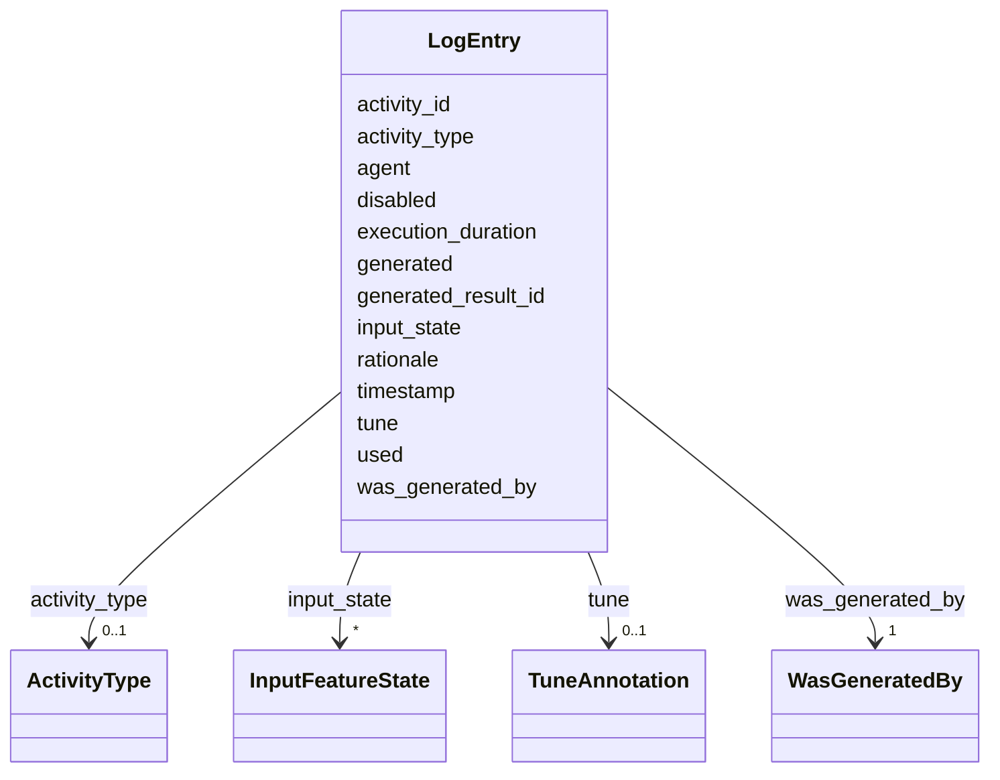

# Class: LogEntry 


_A PROV-aligned provenance record stored on GeoJSON features. Contains activity identity, timestamp, generator information, input/output references, execution duration, and tuning annotations._


URI: [debrief:class/LogEntry](https://debrief.info/schemas/class/LogEntry)





<!-- no inheritance hierarchy -->


## Slots

| Name | Cardinality and Range | Description | Inheritance |
| ---  | --- | --- | --- |
| [activity_id](../slots/activity_id.md) | 1 <br/> [String](../types/String.md) | Unique operation identifier (UUID v4) | direct |
| [timestamp](../slots/timestamp.md) | 1 <br/> [datetime](../slots/datetime.md) | When the operation occurred (ISO 8601 with timezone) | direct |
| [was_generated_by](../slots/was_generated_by.md) | 1 <br/> [WasGeneratedBy](../classes/WasGeneratedBy.md) | Tool identity and parameters for this invocation | direct |
| [used](../slots/used.md) | 1..* <br/> [String](../types/String.md) | Feature IDs of inputs | direct |
| [generated](../slots/generated.md) | 1..* <br/> [String](../types/String.md) | Feature IDs or versioned asset paths of outputs | direct |
| [execution_duration](../slots/execution_duration.md) | 1 <br/> [String](../types/String.md) | Wall-clock execution time in ISO 8601 duration format (e | direct |
| [generated_result_id](../slots/generated_result_id.md) | 0..1 <br/> [String](../types/String.md) | Stable logical identity for artifact-producing tools | direct |
| [tune](../slots/tune.md) | 0..1 <br/> [TuneAnnotation](../classes/TuneAnnotation.md) | Parameter tuning record | direct |
| [input_state](../slots/input_state.md) | * <br/> [InputFeatureState](../classes/InputFeatureState.md) | Pre-operation feature states for coordinate-mutating tools | direct |
| [disabled](../slots/disabled.md) | 0..1 <br/> [Boolean](../types/Boolean.md) | Whether this entry is skipped during replay | direct |
| [rationale](../slots/rationale.md) | 0..1 <br/> [String](../types/String.md) | Free-text analyst annotation explaining the reasoning for this operation | direct |
| [agent](../slots/agent.md) | 0..1 <br/> [String](../types/String.md) | Human actor (e | direct |
| [activity_type](../slots/activity_type.md) | 0..1 <br/> [ActivityType](../enums/ActivityType.md) | Semantic kind of this provenance record | direct |


## Usages

| used by | used in | type | used |
| ---  | --- | --- | --- |
| [BaseFeatureProperties](../classes/BaseFeatureProperties.md) | [provenance](../slots/provenance.md) | range | [LogEntry](../classes/LogEntry.md) |
| [TrackProperties](../classes/TrackProperties.md) | [provenance](../slots/provenance.md) | range | [LogEntry](../classes/LogEntry.md) |
| [ReferenceLocationProperties](../classes/ReferenceLocationProperties.md) | [provenance](../slots/provenance.md) | range | [LogEntry](../classes/LogEntry.md) |
| [SystemStateProperties](../classes/SystemStateProperties.md) | [provenance](../slots/provenance.md) | range | [LogEntry](../classes/LogEntry.md) |
| [MultiPointFeatureProperties](../classes/MultiPointFeatureProperties.md) | [provenance](../slots/provenance.md) | range | [LogEntry](../classes/LogEntry.md) |
| [MultiPolygonFeatureProperties](../classes/MultiPolygonFeatureProperties.md) | [provenance](../slots/provenance.md) | range | [LogEntry](../classes/LogEntry.md) |
| [NarrativeEntryProperties](../classes/NarrativeEntryProperties.md) | [provenance](../slots/provenance.md) | range | [LogEntry](../classes/LogEntry.md) |
| [CircleAnnotationProperties](../classes/CircleAnnotationProperties.md) | [provenance](../slots/provenance.md) | range | [LogEntry](../classes/LogEntry.md) |
| [RectangleAnnotationProperties](../classes/RectangleAnnotationProperties.md) | [provenance](../slots/provenance.md) | range | [LogEntry](../classes/LogEntry.md) |
| [LineAnnotationProperties](../classes/LineAnnotationProperties.md) | [provenance](../slots/provenance.md) | range | [LogEntry](../classes/LogEntry.md) |
| [TextAnnotationProperties](../classes/TextAnnotationProperties.md) | [provenance](../slots/provenance.md) | range | [LogEntry](../classes/LogEntry.md) |
| [VectorAnnotationProperties](../classes/VectorAnnotationProperties.md) | [provenance](../slots/provenance.md) | range | [LogEntry](../classes/LogEntry.md) |
| [PolyAnnotationProperties](../classes/PolyAnnotationProperties.md) | [provenance](../slots/provenance.md) | range | [LogEntry](../classes/LogEntry.md) |
| [StoryboardProperties](../classes/StoryboardProperties.md) | [provenance](../slots/provenance.md) | range | [LogEntry](../classes/LogEntry.md) |
| [SceneProperties](../classes/SceneProperties.md) | [provenance](../slots/provenance.md) | range | [LogEntry](../classes/LogEntry.md) |


## Identifier and Mapping Information


### Schema Source


* from schema: https://debrief.info/schemas/debrief


## Mappings

| Mapping Type | Mapped Value |
| ---  | ---  |
| self | debrief:LogEntry |
| native | debrief:LogEntry |


## LinkML Source

<!-- TODO: investigate https://stackoverflow.com/questions/37606292/how-to-create-tabbed-code-blocks-in-mkdocs-or-sphinx -->

### Direct

<details>
```yaml
name: LogEntry
description: A PROV-aligned provenance record stored on GeoJSON features. Contains
  activity identity, timestamp, generator information, input/output references, execution
  duration, and tuning annotations.
from_schema: https://debrief.info/schemas/debrief
attributes:
  activity_id:
    name: activity_id
    description: Unique operation identifier (UUID v4). Shared across features in
      multi-feature operations.
    from_schema: https://debrief.info/schemas/log-entry
    rank: 1000
    domain_of:
    - LogEntry
    - FileProvEntry
    - PropertiesProvenanceEntry
    range: string
    required: true
  timestamp:
    name: timestamp
    description: When the operation occurred (ISO 8601 with timezone).
    from_schema: https://debrief.info/schemas/log-entry
    rank: 1000
    domain_of:
    - LogEntry
    - TuneAnnotation
    - FileProvEntry
    - PropertiesProvenanceEntry
    - FeatureSelection
    - SceneProperties
    range: datetime
    required: true
  was_generated_by:
    name: was_generated_by
    description: Tool identity and parameters for this invocation.
    from_schema: https://debrief.info/schemas/log-entry
    rank: 1000
    domain_of:
    - LogEntry
    range: WasGeneratedBy
    required: true
  used:
    name: used
    description: Feature IDs of inputs. May be empty for operations with no explicit
      inputs.
    from_schema: https://debrief.info/schemas/log-entry
    rank: 1000
    domain_of:
    - LogEntry
    range: string
    required: true
    multivalued: true
  generated:
    name: generated
    description: Feature IDs or versioned asset paths of outputs. May be empty for
      in-place modifications.
    from_schema: https://debrief.info/schemas/log-entry
    rank: 1000
    domain_of:
    - LogEntry
    range: string
    required: true
    multivalued: true
  execution_duration:
    name: execution_duration
    description: Wall-clock execution time in ISO 8601 duration format (e.g., PT0.3S).
    from_schema: https://debrief.info/schemas/log-entry
    rank: 1000
    domain_of:
    - LogEntry
    range: string
    required: true
    pattern: ^PT[0-9]+(\.[0-9]+)?S$
  generated_result_id:
    name: generated_result_id
    description: Stable logical identity for artifact-producing tools. Null for non-artifact
      tools.
    from_schema: https://debrief.info/schemas/log-entry
    rank: 1000
    domain_of:
    - LogEntry
    range: string
    required: false
  tune:
    name: tune
    description: Parameter tuning record. Null until a tuning operation modifies this
      entry.
    from_schema: https://debrief.info/schemas/log-entry
    rank: 1000
    domain_of:
    - LogEntry
    range: TuneAnnotation
    required: false
  input_state:
    name: input_state
    description: Pre-operation feature states for coordinate-mutating tools. Captures
      geometry and spatial properties as they were immediately before the operation,
      enabling correct replay with modified parameters. Null for non-mutation tools.
    from_schema: https://debrief.info/schemas/log-entry
    rank: 1000
    domain_of:
    - LogEntry
    - ToolResultForLog
    range: InputFeatureState
    required: false
    multivalued: true
    inlined: true
    inlined_as_list: true
  disabled:
    name: disabled
    description: Whether this entry is skipped during replay. Toggled via the flip-card
      edit face.
    from_schema: https://debrief.info/schemas/log-entry
    rank: 1000
    ifabsent: 'false'
    domain_of:
    - LogEntry
    range: boolean
    required: false
  rationale:
    name: rationale
    description: Free-text analyst annotation explaining the reasoning for this operation.
    from_schema: https://debrief.info/schemas/log-entry
    rank: 1000
    domain_of:
    - LogEntry
    range: string
    required: false
  agent:
    name: agent
    description: 'Human actor (e.g. analyst username) who triggered the operation.
      Added by #215 for Storyboarding CRUD provenance; optional and useful to any
      tool emitting LogEntry records.'
    from_schema: https://debrief.info/schemas/log-entry
    rank: 1000
    domain_of:
    - LogEntry
    range: string
    required: false
  activity_type:
    name: activity_type
    description: Semantic kind of this provenance record. Optional; absent records
      are treated as `tool` by consumers. Introduced by feature 208 so future entry
      types (manual checkpoint, standalone tune, manual rationale) can be distinguished
      without overloading visual tool-category. See `shared/components/src/LogPanel/types.ts`
      `TimelineEntryKind` for the UI-side mirror.
    from_schema: https://debrief.info/schemas/log-entry
    rank: 1000
    domain_of:
    - LogEntry
    range: ActivityType
    required: false

```
</details>

### Induced

<details>
```yaml
name: LogEntry
description: A PROV-aligned provenance record stored on GeoJSON features. Contains
  activity identity, timestamp, generator information, input/output references, execution
  duration, and tuning annotations.
from_schema: https://debrief.info/schemas/debrief
attributes:
  activity_id:
    name: activity_id
    description: Unique operation identifier (UUID v4). Shared across features in
      multi-feature operations.
    from_schema: https://debrief.info/schemas/log-entry
    rank: 1000
    alias: activity_id
    owner: LogEntry
    domain_of:
    - LogEntry
    - FileProvEntry
    - PropertiesProvenanceEntry
    range: string
    required: true
  timestamp:
    name: timestamp
    description: When the operation occurred (ISO 8601 with timezone).
    from_schema: https://debrief.info/schemas/log-entry
    rank: 1000
    alias: timestamp
    owner: LogEntry
    domain_of:
    - LogEntry
    - TuneAnnotation
    - FileProvEntry
    - PropertiesProvenanceEntry
    - FeatureSelection
    - SceneProperties
    range: datetime
    required: true
  was_generated_by:
    name: was_generated_by
    description: Tool identity and parameters for this invocation.
    from_schema: https://debrief.info/schemas/log-entry
    rank: 1000
    alias: was_generated_by
    owner: LogEntry
    domain_of:
    - LogEntry
    range: WasGeneratedBy
    required: true
  used:
    name: used
    description: Feature IDs of inputs. May be empty for operations with no explicit
      inputs.
    from_schema: https://debrief.info/schemas/log-entry
    rank: 1000
    alias: used
    owner: LogEntry
    domain_of:
    - LogEntry
    range: string
    required: true
    multivalued: true
  generated:
    name: generated
    description: Feature IDs or versioned asset paths of outputs. May be empty for
      in-place modifications.
    from_schema: https://debrief.info/schemas/log-entry
    rank: 1000
    alias: generated
    owner: LogEntry
    domain_of:
    - LogEntry
    range: string
    required: true
    multivalued: true
  execution_duration:
    name: execution_duration
    description: Wall-clock execution time in ISO 8601 duration format (e.g., PT0.3S).
    from_schema: https://debrief.info/schemas/log-entry
    rank: 1000
    alias: execution_duration
    owner: LogEntry
    domain_of:
    - LogEntry
    range: string
    required: true
    pattern: ^PT[0-9]+(\.[0-9]+)?S$
  generated_result_id:
    name: generated_result_id
    description: Stable logical identity for artifact-producing tools. Null for non-artifact
      tools.
    from_schema: https://debrief.info/schemas/log-entry
    rank: 1000
    alias: generated_result_id
    owner: LogEntry
    domain_of:
    - LogEntry
    range: string
    required: false
  tune:
    name: tune
    description: Parameter tuning record. Null until a tuning operation modifies this
      entry.
    from_schema: https://debrief.info/schemas/log-entry
    rank: 1000
    alias: tune
    owner: LogEntry
    domain_of:
    - LogEntry
    range: TuneAnnotation
    required: false
  input_state:
    name: input_state
    description: Pre-operation feature states for coordinate-mutating tools. Captures
      geometry and spatial properties as they were immediately before the operation,
      enabling correct replay with modified parameters. Null for non-mutation tools.
    from_schema: https://debrief.info/schemas/log-entry
    rank: 1000
    alias: input_state
    owner: LogEntry
    domain_of:
    - LogEntry
    - ToolResultForLog
    range: InputFeatureState
    required: false
    multivalued: true
    inlined: true
    inlined_as_list: true
  disabled:
    name: disabled
    description: Whether this entry is skipped during replay. Toggled via the flip-card
      edit face.
    from_schema: https://debrief.info/schemas/log-entry
    rank: 1000
    ifabsent: 'false'
    alias: disabled
    owner: LogEntry
    domain_of:
    - LogEntry
    range: boolean
    required: false
  rationale:
    name: rationale
    description: Free-text analyst annotation explaining the reasoning for this operation.
    from_schema: https://debrief.info/schemas/log-entry
    rank: 1000
    alias: rationale
    owner: LogEntry
    domain_of:
    - LogEntry
    range: string
    required: false
  agent:
    name: agent
    description: 'Human actor (e.g. analyst username) who triggered the operation.
      Added by #215 for Storyboarding CRUD provenance; optional and useful to any
      tool emitting LogEntry records.'
    from_schema: https://debrief.info/schemas/log-entry
    rank: 1000
    alias: agent
    owner: LogEntry
    domain_of:
    - LogEntry
    range: string
    required: false
  activity_type:
    name: activity_type
    description: Semantic kind of this provenance record. Optional; absent records
      are treated as `tool` by consumers. Introduced by feature 208 so future entry
      types (manual checkpoint, standalone tune, manual rationale) can be distinguished
      without overloading visual tool-category. See `shared/components/src/LogPanel/types.ts`
      `TimelineEntryKind` for the UI-side mirror.
    from_schema: https://debrief.info/schemas/log-entry
    rank: 1000
    alias: activity_type
    owner: LogEntry
    domain_of:
    - LogEntry
    range: ActivityType
    required: false

```
</details>