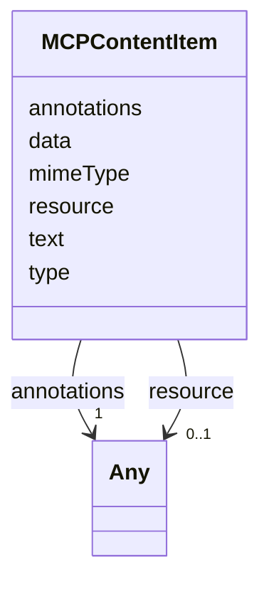

# Class: MCPContentItem 


_A single MCP content item (resource, text, or image). Carries Debrief-specific annotations (debrief:* keys) on every item. Closes audit §3.1 row 15._


URI: [debrief:class/MCPContentItem](https://debrief.info/schemas/class/MCPContentItem)





<!-- no inheritance hierarchy -->


## Slots

| Name | Cardinality and Range | Description | Inheritance |
| ---  | --- | --- | --- |
| [type](../slots/type.md) | 1 <br/> [String](../types/String.md) | Content-item discriminator | direct |
| [resource](../slots/resource.md) | 0..1 <br/> [Any](../classes/Any.md) | Nested resource descriptor `{ uri, mimeType, text }` when type=resource | direct |
| [text](../slots/text.md) | 0..1 <br/> [String](../types/String.md) | Body text when type=text | direct |
| [data](../slots/data.md) | 0..1 <br/> [String](../types/String.md) | Base64-encoded payload when type=image | direct |
| [mimeType](../slots/mimeType.md) | 0..1 <br/> [String](../types/String.md) | IANA media type when type=image or type=resource | direct |
| [annotations](../slots/annotations.md) | 1 <br/> [Any](../classes/Any.md) | Debrief-specific annotations (`debrief:resultType`, `debrief:label`, `debrief... | direct |


## Usages

| used by | used in | type | used |
| ---  | --- | --- | --- |
| [MCPToolResponse](../classes/MCPToolResponse.md) | [content](../slots/content.md) | range | [MCPContentItem](../classes/MCPContentItem.md) |


## Identifier and Mapping Information


### Schema Source


* from schema: https://debrief.info/schemas/debrief


## Mappings

| Mapping Type | Mapped Value |
| ---  | ---  |
| self | debrief:MCPContentItem |
| native | debrief:MCPContentItem |


## LinkML Source

<!-- TODO: investigate https://stackoverflow.com/questions/37606292/how-to-create-tabbed-code-blocks-in-mkdocs-or-sphinx -->

### Direct

<details>
```yaml
name: MCPContentItem
description: A single MCP content item (resource, text, or image). Carries Debrief-specific
  annotations (debrief:* keys) on every item. Closes audit §3.1 row 15.
from_schema: https://debrief.info/schemas/debrief
attributes:
  type:
    name: type
    description: Content-item discriminator. Current consumers emit `resource`, `text`,
      `image`. Kept as string to remain additive over any future MCP content-item
      types.
    from_schema: https://debrief.info/schemas/mcp
    domain_of:
    - GeoJSONPoint
    - GeoJSONEmptyPoint
    - GeoJSONLineString
    - GeoJSONPolygon
    - GeoJSONMultiPoint
    - GeoJSONMultiLineString
    - GeoJSONMultiPolygon
    - TrackFeature
    - ReferenceLocation
    - SystemState
    - MultiPointFeature
    - MultiPolygonFeature
    - NarrativeEntry
    - CircleAnnotation
    - RectangleAnnotation
    - LineAnnotation
    - TextAnnotation
    - VectorAnnotation
    - PolyAnnotation
    - ToolParameter
    - FileProvEntry
    - RawGeoJSONFeature
    - RawGeoJSONFeatureCollection
    - DatasetAxisMetadata
    - DatasetEntry
    - StoryboardFeature
    - SceneFeature
    - SceneThumbnailAssetEntry
    - MCPContentItem
    - MCPParamSchema
    - ToolsUpdateMessage
    range: string
    required: true
  resource:
    name: resource
    description: Nested resource descriptor `{ uri, mimeType, text }` when type=resource.
      Free-form per Article XV.2 (the inner shape is driven by individual tool authors).
    from_schema: https://debrief.info/schemas/mcp
    rank: 1000
    domain_of:
    - MCPContentItem
    range: Any
  text:
    name: text
    description: Body text when type=text.
    from_schema: https://debrief.info/schemas/mcp
    domain_of:
    - NarrativeEntryProperties
    - TextAnnotationProperties
    - MCPContentItem
    range: string
  data:
    name: data
    description: Base64-encoded payload when type=image.
    from_schema: https://debrief.info/schemas/mcp
    rank: 1000
    domain_of:
    - MCPContentItem
    range: string
  mimeType:
    name: mimeType
    description: IANA media type when type=image or type=resource.
    from_schema: https://debrief.info/schemas/mcp
    rank: 1000
    domain_of:
    - MCPContentItem
    range: string
  annotations:
    name: annotations
    description: Debrief-specific annotations (`debrief:resultType`, `debrief:label`,
      `debrief:sourceFeatures`, etc). Free-form per Article XV.2 because the key set
      is open-ended and uses colons (`debrief:*`) that LinkML cannot constrain as
      slot names.
    from_schema: https://debrief.info/schemas/mcp
    rank: 1000
    domain_of:
    - MCPContentItem
    - MCPToolDefinition
    range: Any
    required: true

```
</details>

### Induced

<details>
```yaml
name: MCPContentItem
description: A single MCP content item (resource, text, or image). Carries Debrief-specific
  annotations (debrief:* keys) on every item. Closes audit §3.1 row 15.
from_schema: https://debrief.info/schemas/debrief
attributes:
  type:
    name: type
    description: Content-item discriminator. Current consumers emit `resource`, `text`,
      `image`. Kept as string to remain additive over any future MCP content-item
      types.
    from_schema: https://debrief.info/schemas/mcp
    alias: type
    owner: MCPContentItem
    domain_of:
    - GeoJSONPoint
    - GeoJSONEmptyPoint
    - GeoJSONLineString
    - GeoJSONPolygon
    - GeoJSONMultiPoint
    - GeoJSONMultiLineString
    - GeoJSONMultiPolygon
    - TrackFeature
    - ReferenceLocation
    - SystemState
    - MultiPointFeature
    - MultiPolygonFeature
    - NarrativeEntry
    - CircleAnnotation
    - RectangleAnnotation
    - LineAnnotation
    - TextAnnotation
    - VectorAnnotation
    - PolyAnnotation
    - ToolParameter
    - FileProvEntry
    - RawGeoJSONFeature
    - RawGeoJSONFeatureCollection
    - DatasetAxisMetadata
    - DatasetEntry
    - StoryboardFeature
    - SceneFeature
    - SceneThumbnailAssetEntry
    - MCPContentItem
    - MCPParamSchema
    - ToolsUpdateMessage
    range: string
    required: true
  resource:
    name: resource
    description: Nested resource descriptor `{ uri, mimeType, text }` when type=resource.
      Free-form per Article XV.2 (the inner shape is driven by individual tool authors).
    from_schema: https://debrief.info/schemas/mcp
    rank: 1000
    alias: resource
    owner: MCPContentItem
    domain_of:
    - MCPContentItem
    range: Any
  text:
    name: text
    description: Body text when type=text.
    from_schema: https://debrief.info/schemas/mcp
    alias: text
    owner: MCPContentItem
    domain_of:
    - NarrativeEntryProperties
    - TextAnnotationProperties
    - MCPContentItem
    range: string
  data:
    name: data
    description: Base64-encoded payload when type=image.
    from_schema: https://debrief.info/schemas/mcp
    rank: 1000
    alias: data
    owner: MCPContentItem
    domain_of:
    - MCPContentItem
    range: string
  mimeType:
    name: mimeType
    description: IANA media type when type=image or type=resource.
    from_schema: https://debrief.info/schemas/mcp
    rank: 1000
    alias: mimeType
    owner: MCPContentItem
    domain_of:
    - MCPContentItem
    range: string
  annotations:
    name: annotations
    description: Debrief-specific annotations (`debrief:resultType`, `debrief:label`,
      `debrief:sourceFeatures`, etc). Free-form per Article XV.2 because the key set
      is open-ended and uses colons (`debrief:*`) that LinkML cannot constrain as
      slot names.
    from_schema: https://debrief.info/schemas/mcp
    rank: 1000
    alias: annotations
    owner: MCPContentItem
    domain_of:
    - MCPContentItem
    - MCPToolDefinition
    range: Any
    required: true

```
</details>