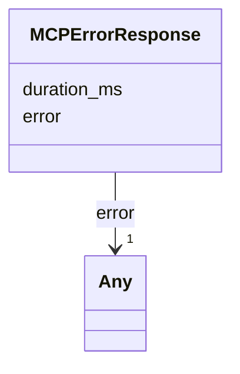

# Class: MCPErrorResponse 


_MCP error response envelope. Closes audit §3.1 row 17. The error payload is nested (matches the JSON-RPC convention used by the live server)._


URI: [debrief:class/MCPErrorResponse](https://debrief.info/schemas/class/MCPErrorResponse)





<!-- no inheritance hierarchy -->


## Slots

| Name | Cardinality and Range | Description | Inheritance |
| ---  | --- | --- | --- |
| [error](../slots/error.md) | 1 <br/> [Any](../classes/Any.md) | Nested error object `{ code, message, data: { debrief:errorCategory, debrief:... | direct |
| [duration_ms](../slots/duration_ms.md) | 0..1 <br/> [Integer](../types/Integer.md) | Wall-clock duration before failure | direct |


## Identifier and Mapping Information


### Schema Source


* from schema: https://debrief.info/schemas/debrief


## Mappings

| Mapping Type | Mapped Value |
| ---  | ---  |
| self | debrief:MCPErrorResponse |
| native | debrief:MCPErrorResponse |


## LinkML Source

<!-- TODO: investigate https://stackoverflow.com/questions/37606292/how-to-create-tabbed-code-blocks-in-mkdocs-or-sphinx -->

### Direct

<details>
```yaml
name: MCPErrorResponse
description: MCP error response envelope. Closes audit §3.1 row 17. The error payload
  is nested (matches the JSON-RPC convention used by the live server).
from_schema: https://debrief.info/schemas/debrief
attributes:
  error:
    name: error
    description: 'Nested error object `{ code, message, data: { debrief:errorCategory,
      debrief:affectedFeatures } }`. Free-form per Article XV.2 because the inner
      `data` map uses colon-bearing keys outside LinkML slot syntax.'
    from_schema: https://debrief.info/schemas/mcp
    rank: 1000
    domain_of:
    - MCPErrorResponse
    range: Any
    required: true
  duration_ms:
    name: duration_ms
    description: Wall-clock duration before failure.
    from_schema: https://debrief.info/schemas/mcp
    domain_of:
    - MCPToolResponse
    - MCPErrorResponse
    - ToolResultForLog
    - ToolExecutionResultForReplay
    range: integer

```
</details>

### Induced

<details>
```yaml
name: MCPErrorResponse
description: MCP error response envelope. Closes audit §3.1 row 17. The error payload
  is nested (matches the JSON-RPC convention used by the live server).
from_schema: https://debrief.info/schemas/debrief
attributes:
  error:
    name: error
    description: 'Nested error object `{ code, message, data: { debrief:errorCategory,
      debrief:affectedFeatures } }`. Free-form per Article XV.2 because the inner
      `data` map uses colon-bearing keys outside LinkML slot syntax.'
    from_schema: https://debrief.info/schemas/mcp
    rank: 1000
    alias: error
    owner: MCPErrorResponse
    domain_of:
    - MCPErrorResponse
    range: Any
    required: true
  duration_ms:
    name: duration_ms
    description: Wall-clock duration before failure.
    from_schema: https://debrief.info/schemas/mcp
    alias: duration_ms
    owner: MCPErrorResponse
    domain_of:
    - MCPToolResponse
    - MCPErrorResponse
    - ToolResultForLog
    - ToolExecutionResultForReplay
    range: integer

```
</details>