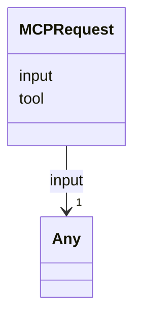

# Class: MCPRequest 


_MCP tool invocation envelope. Sent by consumers (VS Code, web-shell) to the MCP server. Closes audit §3.1 row 13._


URI: [debrief:class/MCPRequest](https://debrief.info/schemas/class/MCPRequest)





<!-- no inheritance hierarchy -->


## Slots

| Name | Cardinality and Range | Description | Inheritance |
| ---  | --- | --- | --- |
| [tool](../slots/tool.md) | 1 <br/> [String](../types/String.md) | Tool name (one of SessionMCPToolName for the session-state server) | direct |
| [input](../slots/input.md) | 1 <br/> [Any](../classes/Any.md) | Free-form per-tool input payload (Article XV | direct |


## Identifier and Mapping Information


### Schema Source


* from schema: https://debrief.info/schemas/debrief


## Mappings

| Mapping Type | Mapped Value |
| ---  | ---  |
| self | debrief:MCPRequest |
| native | debrief:MCPRequest |


## LinkML Source

<!-- TODO: investigate https://stackoverflow.com/questions/37606292/how-to-create-tabbed-code-blocks-in-mkdocs-or-sphinx -->

### Direct

<details>
```yaml
name: MCPRequest
description: MCP tool invocation envelope. Sent by consumers (VS Code, web-shell)
  to the MCP server. Closes audit §3.1 row 13.
from_schema: https://debrief.info/schemas/debrief
attributes:
  tool:
    name: tool
    description: Tool name (one of SessionMCPToolName for the session-state server).
    from_schema: https://debrief.info/schemas/mcp
    domain_of:
    - WasGeneratedBy
    - PropertiesProvenanceEntry
    - MCPRequest
    range: string
    required: true
  input:
    name: input
    description: Free-form per-tool input payload (Article XV.2 exception — narrowed
      by per-tool Pydantic input model at dispatch).
    from_schema: https://debrief.info/schemas/mcp
    rank: 1000
    domain_of:
    - MCPRequest
    range: Any
    required: true

```
</details>

### Induced

<details>
```yaml
name: MCPRequest
description: MCP tool invocation envelope. Sent by consumers (VS Code, web-shell)
  to the MCP server. Closes audit §3.1 row 13.
from_schema: https://debrief.info/schemas/debrief
attributes:
  tool:
    name: tool
    description: Tool name (one of SessionMCPToolName for the session-state server).
    from_schema: https://debrief.info/schemas/mcp
    alias: tool
    owner: MCPRequest
    domain_of:
    - WasGeneratedBy
    - PropertiesProvenanceEntry
    - MCPRequest
    range: string
    required: true
  input:
    name: input
    description: Free-form per-tool input payload (Article XV.2 exception — narrowed
      by per-tool Pydantic input model at dispatch).
    from_schema: https://debrief.info/schemas/mcp
    rank: 1000
    alias: input
    owner: MCPRequest
    domain_of:
    - MCPRequest
    range: Any
    required: true

```
</details>