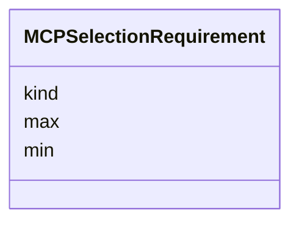

# Class: MCPSelectionRequirement 


_Predicate describing what feature selection a tool needs (e.g. "at least one Track", "exactly one Point"). Closes audit §3.1 row 18. Slot names match shared/utils/src/mcp-types.ts (`kind`, `min`, `max`)._


URI: [debrief:class/MCPSelectionRequirement](https://debrief.info/schemas/class/MCPSelectionRequirement)





<!-- no inheritance hierarchy -->


## Slots

| Name | Cardinality and Range | Description | Inheritance |
| ---  | --- | --- | --- |
| [kind](../slots/kind.md) | 1 <br/> [String](../types/String.md) | Feature kind this requirement applies to | direct |
| [min](../slots/min.md) | 1 <br/> [Integer](../types/Integer.md) | Minimum number of features of this kind required | direct |
| [max](../slots/max.md) | 0..1 <br/> [Integer](../types/Integer.md) | Maximum number of features of this kind allowed | direct |


## Identifier and Mapping Information


### Schema Source


* from schema: https://debrief.info/schemas/debrief


## Mappings

| Mapping Type | Mapped Value |
| ---  | ---  |
| self | debrief:MCPSelectionRequirement |
| native | debrief:MCPSelectionRequirement |


## LinkML Source

<!-- TODO: investigate https://stackoverflow.com/questions/37606292/how-to-create-tabbed-code-blocks-in-mkdocs-or-sphinx -->

### Direct

<details>
```yaml
name: MCPSelectionRequirement
description: Predicate describing what feature selection a tool needs (e.g. "at least
  one Track", "exactly one Point"). Closes audit §3.1 row 18. Slot names match shared/utils/src/mcp-types.ts
  (`kind`, `min`, `max`).
from_schema: https://debrief.info/schemas/debrief
attributes:
  kind:
    name: kind
    description: Feature kind this requirement applies to. Supports flat values (e.g.
      "TRACK", "POINT") and dot-delimited hierarchical paths (e.g. "TRACK.SEGMENT").
    from_schema: https://debrief.info/schemas/mcp
    domain_of:
    - BaseFeatureProperties
    - TrackProperties
    - ReferenceLocationProperties
    - SystemStateProperties
    - MultiPointFeatureProperties
    - MultiPolygonFeatureProperties
    - NarrativeEntryProperties
    - CircleAnnotationProperties
    - RectangleAnnotationProperties
    - LineAnnotationProperties
    - TextAnnotationProperties
    - VectorAnnotationProperties
    - PolyAnnotationProperties
    - SelectionRequirement
    - SystemRecordProperties
    - StoryboardProperties
    - SceneProperties
    - MCPSelectionRequirement
    range: string
    required: true
  min:
    name: min
    description: Minimum number of features of this kind required.
    from_schema: https://debrief.info/schemas/mcp
    domain_of:
    - SelectionRequirement
    - MCPSelectionRequirement
    range: integer
    required: true
  max:
    name: max
    description: Maximum number of features of this kind allowed.
    from_schema: https://debrief.info/schemas/mcp
    domain_of:
    - SelectionRequirement
    - MCPSelectionRequirement
    range: integer

```
</details>

### Induced

<details>
```yaml
name: MCPSelectionRequirement
description: Predicate describing what feature selection a tool needs (e.g. "at least
  one Track", "exactly one Point"). Closes audit §3.1 row 18. Slot names match shared/utils/src/mcp-types.ts
  (`kind`, `min`, `max`).
from_schema: https://debrief.info/schemas/debrief
attributes:
  kind:
    name: kind
    description: Feature kind this requirement applies to. Supports flat values (e.g.
      "TRACK", "POINT") and dot-delimited hierarchical paths (e.g. "TRACK.SEGMENT").
    from_schema: https://debrief.info/schemas/mcp
    alias: kind
    owner: MCPSelectionRequirement
    domain_of:
    - BaseFeatureProperties
    - TrackProperties
    - ReferenceLocationProperties
    - SystemStateProperties
    - MultiPointFeatureProperties
    - MultiPolygonFeatureProperties
    - NarrativeEntryProperties
    - CircleAnnotationProperties
    - RectangleAnnotationProperties
    - LineAnnotationProperties
    - TextAnnotationProperties
    - VectorAnnotationProperties
    - PolyAnnotationProperties
    - SelectionRequirement
    - SystemRecordProperties
    - StoryboardProperties
    - SceneProperties
    - MCPSelectionRequirement
    range: string
    required: true
  min:
    name: min
    description: Minimum number of features of this kind required.
    from_schema: https://debrief.info/schemas/mcp
    alias: min
    owner: MCPSelectionRequirement
    domain_of:
    - SelectionRequirement
    - MCPSelectionRequirement
    range: integer
    required: true
  max:
    name: max
    description: Maximum number of features of this kind allowed.
    from_schema: https://debrief.info/schemas/mcp
    alias: max
    owner: MCPSelectionRequirement
    domain_of:
    - SelectionRequirement
    - MCPSelectionRequirement
    range: integer

```
</details>