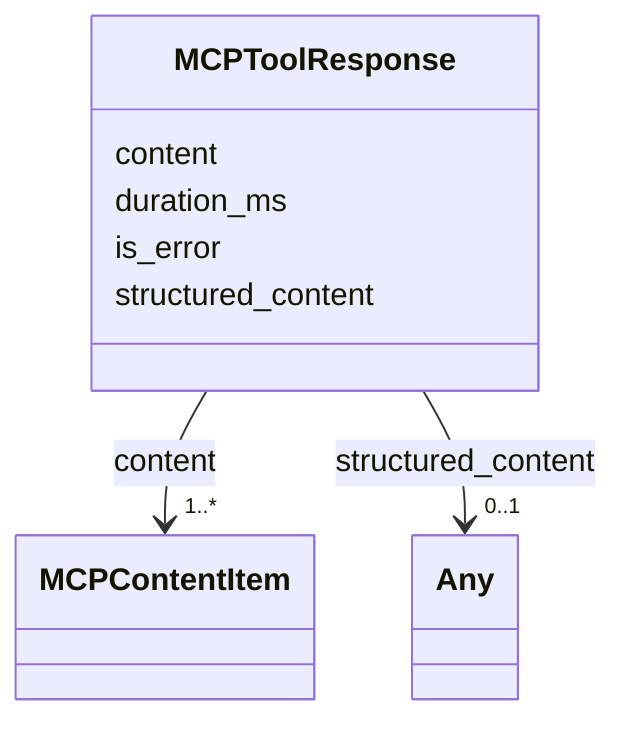

# Class: MCPToolResponse 


_Successful MCP tool response. Closes audit §3.1 row 16. The `duration_ms` slot preserves the wire format used by the live MCP server and replay subsystem._


URI: [debrief:class/MCPToolResponse](https://debrief.info/schemas/class/MCPToolResponse)





<!-- no inheritance hierarchy -->


## Slots

| Name | Cardinality and Range | Description | Inheritance |
| ---  | --- | --- | --- |
| [content](../slots/content.md) | 1..* <br/> [MCPContentItem](../classes/MCPContentItem.md) | Ordered list of content items returned by the tool | direct |
| [duration_ms](../slots/duration_ms.md) | 1 <br/> [Integer](../types/Integer.md) | Wall-clock duration of the tool invocation in milliseconds | direct |
| [is_error](../slots/is_error.md) | 0..1 <br/> [Boolean](../types/Boolean.md) | Reserved for streaming partial-error responses (additive over the live wire f... | direct |
| [structured_content](../slots/structured_content.md) | 0..1 <br/> [Any](../classes/Any.md) | Reserved for top-level free-form payload (e | direct |


## Identifier and Mapping Information


### Schema Source


* from schema: https://debrief.info/schemas/debrief


## Mappings

| Mapping Type | Mapped Value |
| ---  | ---  |
| self | debrief:MCPToolResponse |
| native | debrief:MCPToolResponse |


## LinkML Source

<!-- TODO: investigate https://stackoverflow.com/questions/37606292/how-to-create-tabbed-code-blocks-in-mkdocs-or-sphinx -->

### Direct

<details>
```yaml
name: MCPToolResponse
description: Successful MCP tool response. Closes audit §3.1 row 16. The `duration_ms`
  slot preserves the wire format used by the live MCP server and replay subsystem.
from_schema: https://debrief.info/schemas/debrief
attributes:
  content:
    name: content
    description: Ordered list of content items returned by the tool.
    from_schema: https://debrief.info/schemas/mcp
    rank: 1000
    domain_of:
    - MCPToolResponse
    range: MCPContentItem
    required: true
    multivalued: true
  duration_ms:
    name: duration_ms
    description: Wall-clock duration of the tool invocation in milliseconds.
    from_schema: https://debrief.info/schemas/mcp
    rank: 1000
    domain_of:
    - MCPToolResponse
    - MCPErrorResponse
    - ToolResultForLog
    - ToolExecutionResultForReplay
    range: integer
    required: true
  is_error:
    name: is_error
    description: Reserved for streaming partial-error responses (additive over the
      live wire format).
    from_schema: https://debrief.info/schemas/mcp
    rank: 1000
    domain_of:
    - MCPToolResponse
    range: boolean
  structured_content:
    name: structured_content
    description: Reserved for top-level free-form payload (e.g. vega-spec) — Article
      XV.2 exception. Additive over the live wire format.
    from_schema: https://debrief.info/schemas/mcp
    rank: 1000
    domain_of:
    - MCPToolResponse
    range: Any

```
</details>

### Induced

<details>
```yaml
name: MCPToolResponse
description: Successful MCP tool response. Closes audit §3.1 row 16. The `duration_ms`
  slot preserves the wire format used by the live MCP server and replay subsystem.
from_schema: https://debrief.info/schemas/debrief
attributes:
  content:
    name: content
    description: Ordered list of content items returned by the tool.
    from_schema: https://debrief.info/schemas/mcp
    rank: 1000
    alias: content
    owner: MCPToolResponse
    domain_of:
    - MCPToolResponse
    range: MCPContentItem
    required: true
    multivalued: true
  duration_ms:
    name: duration_ms
    description: Wall-clock duration of the tool invocation in milliseconds.
    from_schema: https://debrief.info/schemas/mcp
    rank: 1000
    alias: duration_ms
    owner: MCPToolResponse
    domain_of:
    - MCPToolResponse
    - MCPErrorResponse
    - ToolResultForLog
    - ToolExecutionResultForReplay
    range: integer
    required: true
  is_error:
    name: is_error
    description: Reserved for streaming partial-error responses (additive over the
      live wire format).
    from_schema: https://debrief.info/schemas/mcp
    rank: 1000
    alias: is_error
    owner: MCPToolResponse
    domain_of:
    - MCPToolResponse
    range: boolean
  structured_content:
    name: structured_content
    description: Reserved for top-level free-form payload (e.g. vega-spec) — Article
      XV.2 exception. Additive over the live wire format.
    from_schema: https://debrief.info/schemas/mcp
    rank: 1000
    alias: structured_content
    owner: MCPToolResponse
    domain_of:
    - MCPToolResponse
    range: Any

```
</details>