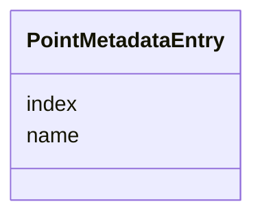

# Class: PointMetadataEntry 


_Metadata for a single point within a MultiPoint reference set. Entries are parallel to the MultiPoint coordinates array. Downstream tools (#081 classifier) extend entries with zone/color fields._


URI: [debrief:class/PointMetadataEntry](https://debrief.info/schemas/class/PointMetadataEntry)





<!-- no inheritance hierarchy -->


## Slots

| Name | Cardinality and Range | Description | Inheritance |
| ---  | --- | --- | --- |
| [index](../slots/index.md) | 1 <br/> [Integer](../types/Integer.md) | 0-based ordinal matching coordinates array position | direct |
| [name](../slots/name.md) | 1 <br/> [String](../types/String.md) | Human-readable point label (e | direct |


## Usages

| used by | used in | type | used |
| ---  | --- | --- | --- |
| [ReferenceLocationProperties](../classes/ReferenceLocationProperties.md) | [point_metadata](../slots/point_metadata.md) | range | [PointMetadataEntry](../classes/PointMetadataEntry.md) |


## Identifier and Mapping Information


### Schema Source


* from schema: https://debrief.info/schemas/debrief


## Mappings

| Mapping Type | Mapped Value |
| ---  | ---  |
| self | debrief:PointMetadataEntry |
| native | debrief:PointMetadataEntry |


## LinkML Source

<!-- TODO: investigate https://stackoverflow.com/questions/37606292/how-to-create-tabbed-code-blocks-in-mkdocs-or-sphinx -->

### Direct

<details>
```yaml
name: PointMetadataEntry
description: Metadata for a single point within a MultiPoint reference set. Entries
  are parallel to the MultiPoint coordinates array. Downstream tools (#081 classifier)
  extend entries with zone/color fields.
from_schema: https://debrief.info/schemas/debrief
attributes:
  index:
    name: index
    description: 0-based ordinal matching coordinates array position
    from_schema: https://debrief.info/schemas/geojson
    rank: 1000
    domain_of:
    - PointMetadataEntry
    range: integer
    required: true
  name:
    name: name
    description: Human-readable point label (e.g., "Ref 1")
    from_schema: https://debrief.info/schemas/geojson
    domain_of:
    - SegmentMetadata
    - SensorData
    - TUAData
    - PointMetadataEntry
    - ReferenceLocationProperties
    - Tool
    - ToolParameter
    - PlatformRecord
    - LevelDefinition
    - DatasetSeries
    - StoryboardProperties
    - MCPToolDefinition
    - ToolDefinition
    range: string
    required: true

```
</details>

### Induced

<details>
```yaml
name: PointMetadataEntry
description: Metadata for a single point within a MultiPoint reference set. Entries
  are parallel to the MultiPoint coordinates array. Downstream tools (#081 classifier)
  extend entries with zone/color fields.
from_schema: https://debrief.info/schemas/debrief
attributes:
  index:
    name: index
    description: 0-based ordinal matching coordinates array position
    from_schema: https://debrief.info/schemas/geojson
    rank: 1000
    alias: index
    owner: PointMetadataEntry
    domain_of:
    - PointMetadataEntry
    range: integer
    required: true
  name:
    name: name
    description: Human-readable point label (e.g., "Ref 1")
    from_schema: https://debrief.info/schemas/geojson
    alias: name
    owner: PointMetadataEntry
    domain_of:
    - SegmentMetadata
    - SensorData
    - TUAData
    - PointMetadataEntry
    - ReferenceLocationProperties
    - Tool
    - ToolParameter
    - PlatformRecord
    - LevelDefinition
    - DatasetSeries
    - StoryboardProperties
    - MCPToolDefinition
    - ToolDefinition
    range: string
    required: true

```
</details>