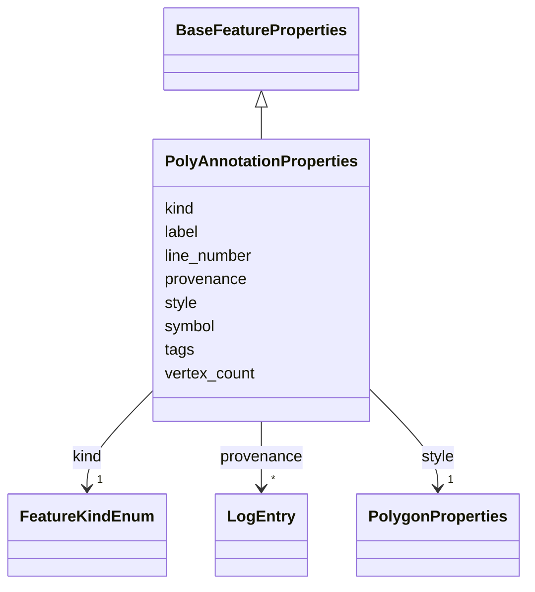

# Class: PolyAnnotationProperties 


_Properties for a PolyAnnotation_


URI: [debrief:class/PolyAnnotationProperties](https://debrief.info/schemas/class/PolyAnnotationProperties)





## Inheritance
* [BaseFeatureProperties](../classes/BaseFeatureProperties.md)
    * **PolyAnnotationProperties**


## Slots

| Name | Cardinality and Range | Description | Inheritance |
| ---  | --- | --- | --- |
| [kind](../slots/kind.md) | 1 <br/> [FeatureKindEnum](../enums/FeatureKindEnum.md) | Feature type discriminator | direct |
| [vertex_count](../slots/vertex_count.md) | 1 <br/> [Integer](../types/Integer.md) | Number of unique vertices (excluding ring closure point) | direct |
| [label](../slots/label.md) | 0..1 <br/> [String](../types/String.md) | Annotation label text | direct |
| [symbol](../slots/symbol.md) | 0..1 <br/> [String](../types/String.md) | Display symbol code from REP file | direct |
| [style](../slots/style.md) | 1 <br/> [PolygonProperties](../classes/PolygonProperties.md) | Polygon styling properties for the polygon area | direct |
| [line_number](../slots/line_number.md) | 0..1 <br/> [Integer](../types/Integer.md) | Source line number for debugging | direct |
| [tags](../slots/tags.md) | * <br/> [String](../types/String.md) | Free-text labels assigned to this feature by the analyst | [BaseFeatureProperties](../classes/BaseFeatureProperties.md) |
| [provenance](../slots/provenance.md) | * <br/> [LogEntry](../classes/LogEntry.md) | PROV-aligned provenance records (append-only log of tool operations) | [BaseFeatureProperties](../classes/BaseFeatureProperties.md) |


## Usages

| used by | used in | type | used |
| ---  | --- | --- | --- |
| [PolyAnnotation](../classes/PolyAnnotation.md) | [properties](../slots/properties.md) | range | [PolyAnnotationProperties](../classes/PolyAnnotationProperties.md) |


## Identifier and Mapping Information


### Schema Source


* from schema: https://debrief.info/schemas/debrief


## Mappings

| Mapping Type | Mapped Value |
| ---  | ---  |
| self | debrief:PolyAnnotationProperties |
| native | debrief:PolyAnnotationProperties |


## LinkML Source

<!-- TODO: investigate https://stackoverflow.com/questions/37606292/how-to-create-tabbed-code-blocks-in-mkdocs-or-sphinx -->

### Direct

<details>
```yaml
name: PolyAnnotationProperties
description: Properties for a PolyAnnotation
from_schema: https://debrief.info/schemas/debrief
is_a: BaseFeatureProperties
attributes:
  kind:
    name: kind
    description: Feature type discriminator
    from_schema: https://debrief.info/schemas/annotations
    domain_of:
    - BaseFeatureProperties
    - TrackProperties
    - ReferenceLocationProperties
    - SystemStateProperties
    - MultiPointFeatureProperties
    - MultiPolygonFeatureProperties
    - NarrativeEntryProperties
    - CircleAnnotationProperties
    - RectangleAnnotationProperties
    - LineAnnotationProperties
    - TextAnnotationProperties
    - VectorAnnotationProperties
    - PolyAnnotationProperties
    - SelectionRequirement
    - SystemRecordProperties
    - StoryboardProperties
    - SceneProperties
    - MCPSelectionRequirement
    range: FeatureKindEnum
    required: true
    equals_string: POLY
  vertex_count:
    name: vertex_count
    description: Number of unique vertices (excluding ring closure point)
    from_schema: https://debrief.info/schemas/annotations
    rank: 1000
    domain_of:
    - PolyAnnotationProperties
    range: integer
    required: true
    minimum_value: 3
  label:
    name: label
    description: Annotation label text
    from_schema: https://debrief.info/schemas/annotations
    domain_of:
    - PositionStyleOverride
    - SensorContact
    - TUASolution
    - MultiPointFeatureProperties
    - MultiPolygonFeatureProperties
    - CircleAnnotationProperties
    - RectangleAnnotationProperties
    - LineAnnotationProperties
    - VectorAnnotationProperties
    - PolyAnnotationProperties
    - ToolResultAnnotations
    - DatasetAxisMetadata
  symbol:
    name: symbol
    description: Display symbol code from REP file
    from_schema: https://debrief.info/schemas/annotations
    domain_of:
    - PositionStyle
    - PositionStyleOverride
    - ReferenceLocationProperties
    - NarrativeEntryProperties
    - CircleAnnotationProperties
    - RectangleAnnotationProperties
    - LineAnnotationProperties
    - TextAnnotationProperties
    - VectorAnnotationProperties
    - PolyAnnotationProperties
  style:
    name: style
    description: Polygon styling properties for the polygon area
    from_schema: https://debrief.info/schemas/annotations
    domain_of:
    - SegmentMetadata
    - TrackProperties
    - ReferenceLocationProperties
    - MultiPointFeatureProperties
    - MultiPolygonFeatureProperties
    - NarrativeEntryProperties
    - CircleAnnotationProperties
    - RectangleAnnotationProperties
    - LineAnnotationProperties
    - TextAnnotationProperties
    - VectorAnnotationProperties
    - PolyAnnotationProperties
    range: PolygonProperties
    required: true
  line_number:
    name: line_number
    description: Source line number for debugging
    from_schema: https://debrief.info/schemas/annotations
    rank: 1000
    domain_of:
    - PolyAnnotationProperties
    range: integer

```
</details>

### Induced

<details>
```yaml
name: PolyAnnotationProperties
description: Properties for a PolyAnnotation
from_schema: https://debrief.info/schemas/debrief
is_a: BaseFeatureProperties
attributes:
  kind:
    name: kind
    description: Feature type discriminator
    from_schema: https://debrief.info/schemas/annotations
    alias: kind
    owner: PolyAnnotationProperties
    domain_of:
    - BaseFeatureProperties
    - TrackProperties
    - ReferenceLocationProperties
    - SystemStateProperties
    - MultiPointFeatureProperties
    - MultiPolygonFeatureProperties
    - NarrativeEntryProperties
    - CircleAnnotationProperties
    - RectangleAnnotationProperties
    - LineAnnotationProperties
    - TextAnnotationProperties
    - VectorAnnotationProperties
    - PolyAnnotationProperties
    - SelectionRequirement
    - SystemRecordProperties
    - StoryboardProperties
    - SceneProperties
    - MCPSelectionRequirement
    range: FeatureKindEnum
    required: true
    equals_string: POLY
  vertex_count:
    name: vertex_count
    description: Number of unique vertices (excluding ring closure point)
    from_schema: https://debrief.info/schemas/annotations
    rank: 1000
    alias: vertex_count
    owner: PolyAnnotationProperties
    domain_of:
    - PolyAnnotationProperties
    range: integer
    required: true
    minimum_value: 3
  label:
    name: label
    description: Annotation label text
    from_schema: https://debrief.info/schemas/annotations
    alias: label
    owner: PolyAnnotationProperties
    domain_of:
    - PositionStyleOverride
    - SensorContact
    - TUASolution
    - MultiPointFeatureProperties
    - MultiPolygonFeatureProperties
    - CircleAnnotationProperties
    - RectangleAnnotationProperties
    - LineAnnotationProperties
    - VectorAnnotationProperties
    - PolyAnnotationProperties
    - ToolResultAnnotations
    - DatasetAxisMetadata
    range: string
  symbol:
    name: symbol
    description: Display symbol code from REP file
    from_schema: https://debrief.info/schemas/annotations
    alias: symbol
    owner: PolyAnnotationProperties
    domain_of:
    - PositionStyle
    - PositionStyleOverride
    - ReferenceLocationProperties
    - NarrativeEntryProperties
    - CircleAnnotationProperties
    - RectangleAnnotationProperties
    - LineAnnotationProperties
    - TextAnnotationProperties
    - VectorAnnotationProperties
    - PolyAnnotationProperties
    range: string
  style:
    name: style
    description: Polygon styling properties for the polygon area
    from_schema: https://debrief.info/schemas/annotations
    alias: style
    owner: PolyAnnotationProperties
    domain_of:
    - SegmentMetadata
    - TrackProperties
    - ReferenceLocationProperties
    - MultiPointFeatureProperties
    - MultiPolygonFeatureProperties
    - NarrativeEntryProperties
    - CircleAnnotationProperties
    - RectangleAnnotationProperties
    - LineAnnotationProperties
    - TextAnnotationProperties
    - VectorAnnotationProperties
    - PolyAnnotationProperties
    range: PolygonProperties
    required: true
  line_number:
    name: line_number
    description: Source line number for debugging
    from_schema: https://debrief.info/schemas/annotations
    rank: 1000
    alias: line_number
    owner: PolyAnnotationProperties
    domain_of:
    - PolyAnnotationProperties
    range: integer
  tags:
    name: tags
    description: Free-text labels assigned to this feature by the analyst
    from_schema: https://debrief.info/schemas/common
    rank: 1000
    alias: tags
    owner: PolyAnnotationProperties
    domain_of:
    - BaseFeatureProperties
    - StacExtensionProperties
    - StacItemSummary
    range: string
    required: false
    multivalued: true
  provenance:
    name: provenance
    description: PROV-aligned provenance records (append-only log of tool operations)
    from_schema: https://debrief.info/schemas/common
    rank: 1000
    alias: provenance
    owner: PolyAnnotationProperties
    domain_of:
    - BaseFeatureProperties
    - SystemStateProperties
    - SystemRecordProperties
    range: LogEntry
    multivalued: true
    inlined: true
    inlined_as_list: true

```
</details>