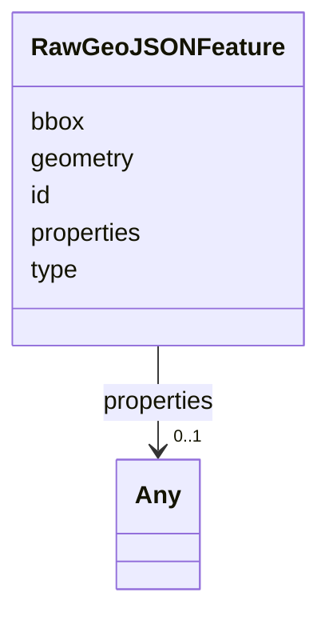

# Class: RawGeoJSONFeature 


_Parse-boundary GeoJSON Feature (RFC 7946 §3.2). Consumers narrow this to a domain feature (TrackFeature, ReferenceLocation, SystemState, MultiPointFeature, MultiPolygonFeature) after validating the properties.kind discriminator. Narrowing is done via the existing isDebriefFeature / isTrackFeature / isReferenceLocation type guards in @debrief/schemas/unions.ts (TypeScript) and debrief_schemas.unions (Python). Note: geometry is REQUIRED — callers handling possibly-null geometry payloads (e.g. NarrativeEntry features) either narrow at the parse boundary or defer to the domain-specific feature class that allows the looser shape (see ADR-021 for the ingress-coercion deferral)._


URI: [debrief:class/RawGeoJSONFeature](https://debrief.info/schemas/class/RawGeoJSONFeature)





<!-- no inheritance hierarchy -->


## Slots

| Name | Cardinality and Range | Description | Inheritance |
| ---  | --- | --- | --- |
| [type](../slots/type.md) | 1 <br/> [String](../types/String.md) | GeoJSON object type — always "Feature" | direct |
| [id](../slots/id.md) | 0..1 <br/> [String](../types/String.md)&nbsp;or&nbsp;<br />[String](../types/String.md)&nbsp;or&nbsp;<br />[Integer](../types/Integer.md) | Optional feature identifier | direct |
| [geometry](../slots/geometry.md) | 1 <br/> [String](../types/String.md)&nbsp;or&nbsp;<br />[GeoJSONPoint](../classes/GeoJSONPoint.md)&nbsp;or&nbsp;<br />[GeoJSONEmptyPoint](../classes/GeoJSONEmptyPoint.md)&nbsp;or&nbsp;<br />[GeoJSONLineString](../classes/GeoJSONLineString.md)&nbsp;or&nbsp;<br />[GeoJSONPolygon](../classes/GeoJSONPolygon.md)&nbsp;or&nbsp;<br />[GeoJSONMultiPoint](../classes/GeoJSONMultiPoint.md)&nbsp;or&nbsp;<br />[GeoJSONMultiLineString](../classes/GeoJSONMultiLineString.md)&nbsp;or&nbsp;<br />[GeoJSONMultiPolygon](../classes/GeoJSONMultiPolygon.md) | GeoJSON geometry — any_of union over the seven existing geometry classes in g... | direct |
| [properties](../slots/properties.md) | 0..1 <br/> [Any](../classes/Any.md) | Free-form properties dictionary | direct |
| [bbox](../slots/bbox.md) | * <br/> [Float](../types/Float.md) | Optional bounding box | direct |


## Usages

| used by | used in | type | used |
| ---  | --- | --- | --- |
| [RawGeoJSONFeatureCollection](../classes/RawGeoJSONFeatureCollection.md) | [features](../slots/features.md) | range | [RawGeoJSONFeature](../classes/RawGeoJSONFeature.md) |
| [ResultsSlice](../classes/ResultsSlice.md) | [result_layers](../slots/result_layers.md) | range | [RawGeoJSONFeature](../classes/RawGeoJSONFeature.md) |


## Identifier and Mapping Information


### Schema Source


* from schema: https://debrief.info/schemas/debrief


## Mappings

| Mapping Type | Mapped Value |
| ---  | ---  |
| self | debrief:RawGeoJSONFeature |
| native | debrief:RawGeoJSONFeature |


## LinkML Source

<!-- TODO: investigate https://stackoverflow.com/questions/37606292/how-to-create-tabbed-code-blocks-in-mkdocs-or-sphinx -->

### Direct

<details>
```yaml
name: RawGeoJSONFeature
description: 'Parse-boundary GeoJSON Feature (RFC 7946 §3.2). Consumers narrow this
  to a domain feature (TrackFeature, ReferenceLocation, SystemState, MultiPointFeature,
  MultiPolygonFeature) after validating the properties.kind discriminator. Narrowing
  is done via the existing isDebriefFeature / isTrackFeature / isReferenceLocation
  type guards in @debrief/schemas/unions.ts (TypeScript) and debrief_schemas.unions
  (Python). Note: geometry is REQUIRED — callers handling possibly-null geometry payloads
  (e.g. NarrativeEntry features) either narrow at the parse boundary or defer to the
  domain-specific feature class that allows the looser shape (see ADR-021 for the
  ingress-coercion deferral).'
from_schema: https://debrief.info/schemas/debrief
attributes:
  type:
    name: type
    description: GeoJSON object type — always "Feature".
    from_schema: https://debrief.info/schemas/raw-geojson
    domain_of:
    - GeoJSONPoint
    - GeoJSONEmptyPoint
    - GeoJSONLineString
    - GeoJSONPolygon
    - GeoJSONMultiPoint
    - GeoJSONMultiLineString
    - GeoJSONMultiPolygon
    - TrackFeature
    - ReferenceLocation
    - SystemState
    - MultiPointFeature
    - MultiPolygonFeature
    - NarrativeEntry
    - CircleAnnotation
    - RectangleAnnotation
    - LineAnnotation
    - TextAnnotation
    - VectorAnnotation
    - PolyAnnotation
    - ToolParameter
    - FileProvEntry
    - RawGeoJSONFeature
    - RawGeoJSONFeatureCollection
    - DatasetAxisMetadata
    - DatasetEntry
    - StoryboardFeature
    - SceneFeature
    - SceneThumbnailAssetEntry
    - MCPContentItem
    - MCPParamSchema
    - ToolsUpdateMessage
    range: string
    required: true
    equals_string: Feature
  id:
    name: id
    description: Optional feature identifier. RFC 7946 permits either a string or
      an integer; both are retained without coercion.
    from_schema: https://debrief.info/schemas/raw-geojson
    domain_of:
    - TrackFeature
    - ReferenceLocation
    - SystemState
    - MultiPointFeature
    - MultiPolygonFeature
    - NarrativeEntry
    - CircleAnnotation
    - RectangleAnnotation
    - LineAnnotation
    - TextAnnotation
    - VectorAnnotation
    - PolyAnnotation
    - Tool
    - PlatformRecord
    - PlotSummary
    - StacItemSummary
    - RawGeoJSONFeature
    - StoryboardProperties
    - SceneProperties
    - StoryboardFeature
    - SceneFeature
    - ToolDefinition
    required: false
    any_of:
    - range: string
    - range: integer
  geometry:
    name: geometry
    description: GeoJSON geometry — any_of union over the seven existing geometry
      classes in geojson.yaml (GeoJSONPoint, GeoJSONEmptyPoint, GeoJSONLineString,
      GeoJSONPolygon, GeoJSONMultiPoint, GeoJSONMultiLineString, GeoJSONMultiPolygon).
      Pydantic validates via try-each-alternative; observed cost is ~25µs per feature
      (10 000 features in ~250ms).
    from_schema: https://debrief.info/schemas/raw-geojson
    domain_of:
    - TrackFeature
    - ReferenceLocation
    - SystemState
    - MultiPointFeature
    - MultiPolygonFeature
    - InputFeatureState
    - NarrativeEntry
    - CircleAnnotation
    - RectangleAnnotation
    - LineAnnotation
    - TextAnnotation
    - VectorAnnotation
    - PolyAnnotation
    - RawGeoJSONFeature
    - StoryboardFeature
    - SceneFeature
    required: true
    any_of:
    - range: GeoJSONPoint
    - range: GeoJSONEmptyPoint
    - range: GeoJSONLineString
    - range: GeoJSONPolygon
    - range: GeoJSONMultiPoint
    - range: GeoJSONMultiLineString
    - range: GeoJSONMultiPolygon
  properties:
    name: properties
    description: Free-form properties dictionary. Consumers narrow to a domain properties
      class (TrackProperties, ReferenceLocationProperties, etc.) after validating
      the kind discriminator. May be absent or null per RFC 7946 §3.2.
    from_schema: https://debrief.info/schemas/raw-geojson
    domain_of:
    - TrackFeature
    - ReferenceLocation
    - SystemState
    - MultiPointFeature
    - MultiPolygonFeature
    - InputFeatureState
    - NarrativeEntry
    - CircleAnnotation
    - RectangleAnnotation
    - LineAnnotation
    - TextAnnotation
    - VectorAnnotation
    - PolyAnnotation
    - RawGeoJSONFeature
    - StoryboardFeature
    - SceneFeature
    range: Any
    required: false
  bbox:
    name: bbox
    description: Optional bounding box. Either [minLon, minLat, maxLon, maxLat] (length
      4) or [minLon, minLat, minAlt, maxLon, maxLat, maxAlt] (length 6).
    from_schema: https://debrief.info/schemas/raw-geojson
    domain_of:
    - TrackFeature
    - SystemStateProperties
    - MultiPointFeature
    - MultiPolygonFeature
    - PlotSummary
    - StacItemSummary
    - RawGeoJSONFeature
    - RawGeoJSONFeatureCollection
    range: float
    required: false
    multivalued: true

```
</details>

### Induced

<details>
```yaml
name: RawGeoJSONFeature
description: 'Parse-boundary GeoJSON Feature (RFC 7946 §3.2). Consumers narrow this
  to a domain feature (TrackFeature, ReferenceLocation, SystemState, MultiPointFeature,
  MultiPolygonFeature) after validating the properties.kind discriminator. Narrowing
  is done via the existing isDebriefFeature / isTrackFeature / isReferenceLocation
  type guards in @debrief/schemas/unions.ts (TypeScript) and debrief_schemas.unions
  (Python). Note: geometry is REQUIRED — callers handling possibly-null geometry payloads
  (e.g. NarrativeEntry features) either narrow at the parse boundary or defer to the
  domain-specific feature class that allows the looser shape (see ADR-021 for the
  ingress-coercion deferral).'
from_schema: https://debrief.info/schemas/debrief
attributes:
  type:
    name: type
    description: GeoJSON object type — always "Feature".
    from_schema: https://debrief.info/schemas/raw-geojson
    alias: type
    owner: RawGeoJSONFeature
    domain_of:
    - GeoJSONPoint
    - GeoJSONEmptyPoint
    - GeoJSONLineString
    - GeoJSONPolygon
    - GeoJSONMultiPoint
    - GeoJSONMultiLineString
    - GeoJSONMultiPolygon
    - TrackFeature
    - ReferenceLocation
    - SystemState
    - MultiPointFeature
    - MultiPolygonFeature
    - NarrativeEntry
    - CircleAnnotation
    - RectangleAnnotation
    - LineAnnotation
    - TextAnnotation
    - VectorAnnotation
    - PolyAnnotation
    - ToolParameter
    - FileProvEntry
    - RawGeoJSONFeature
    - RawGeoJSONFeatureCollection
    - DatasetAxisMetadata
    - DatasetEntry
    - StoryboardFeature
    - SceneFeature
    - SceneThumbnailAssetEntry
    - MCPContentItem
    - MCPParamSchema
    - ToolsUpdateMessage
    range: string
    required: true
    equals_string: Feature
  id:
    name: id
    description: Optional feature identifier. RFC 7946 permits either a string or
      an integer; both are retained without coercion.
    from_schema: https://debrief.info/schemas/raw-geojson
    alias: id
    owner: RawGeoJSONFeature
    domain_of:
    - TrackFeature
    - ReferenceLocation
    - SystemState
    - MultiPointFeature
    - MultiPolygonFeature
    - NarrativeEntry
    - CircleAnnotation
    - RectangleAnnotation
    - LineAnnotation
    - TextAnnotation
    - VectorAnnotation
    - PolyAnnotation
    - Tool
    - PlatformRecord
    - PlotSummary
    - StacItemSummary
    - RawGeoJSONFeature
    - StoryboardProperties
    - SceneProperties
    - StoryboardFeature
    - SceneFeature
    - ToolDefinition
    range: string
    required: false
    any_of:
    - range: string
    - range: integer
  geometry:
    name: geometry
    description: GeoJSON geometry — any_of union over the seven existing geometry
      classes in geojson.yaml (GeoJSONPoint, GeoJSONEmptyPoint, GeoJSONLineString,
      GeoJSONPolygon, GeoJSONMultiPoint, GeoJSONMultiLineString, GeoJSONMultiPolygon).
      Pydantic validates via try-each-alternative; observed cost is ~25µs per feature
      (10 000 features in ~250ms).
    from_schema: https://debrief.info/schemas/raw-geojson
    alias: geometry
    owner: RawGeoJSONFeature
    domain_of:
    - TrackFeature
    - ReferenceLocation
    - SystemState
    - MultiPointFeature
    - MultiPolygonFeature
    - InputFeatureState
    - NarrativeEntry
    - CircleAnnotation
    - RectangleAnnotation
    - LineAnnotation
    - TextAnnotation
    - VectorAnnotation
    - PolyAnnotation
    - RawGeoJSONFeature
    - StoryboardFeature
    - SceneFeature
    range: string
    required: true
    any_of:
    - range: GeoJSONPoint
    - range: GeoJSONEmptyPoint
    - range: GeoJSONLineString
    - range: GeoJSONPolygon
    - range: GeoJSONMultiPoint
    - range: GeoJSONMultiLineString
    - range: GeoJSONMultiPolygon
  properties:
    name: properties
    description: Free-form properties dictionary. Consumers narrow to a domain properties
      class (TrackProperties, ReferenceLocationProperties, etc.) after validating
      the kind discriminator. May be absent or null per RFC 7946 §3.2.
    from_schema: https://debrief.info/schemas/raw-geojson
    alias: properties
    owner: RawGeoJSONFeature
    domain_of:
    - TrackFeature
    - ReferenceLocation
    - SystemState
    - MultiPointFeature
    - MultiPolygonFeature
    - InputFeatureState
    - NarrativeEntry
    - CircleAnnotation
    - RectangleAnnotation
    - LineAnnotation
    - TextAnnotation
    - VectorAnnotation
    - PolyAnnotation
    - RawGeoJSONFeature
    - StoryboardFeature
    - SceneFeature
    range: Any
    required: false
  bbox:
    name: bbox
    description: Optional bounding box. Either [minLon, minLat, maxLon, maxLat] (length
      4) or [minLon, minLat, minAlt, maxLon, maxLat, maxAlt] (length 6).
    from_schema: https://debrief.info/schemas/raw-geojson
    alias: bbox
    owner: RawGeoJSONFeature
    domain_of:
    - TrackFeature
    - SystemStateProperties
    - MultiPointFeature
    - MultiPolygonFeature
    - PlotSummary
    - StacItemSummary
    - RawGeoJSONFeature
    - RawGeoJSONFeatureCollection
    range: float
    required: false
    multivalued: true

```
</details>