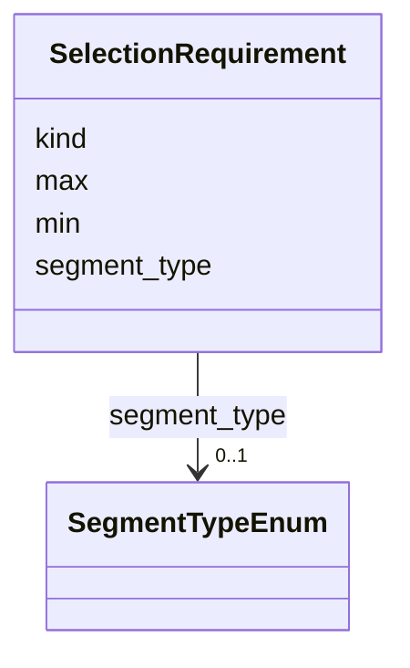

# Class: SelectionRequirement 


_A constraint specifying which feature kinds a tool accepts, with minimum and maximum counts. Used to determine if a tool is applicable to the current selection._


URI: [debrief:class/SelectionRequirement](https://debrief.info/schemas/class/SelectionRequirement)





<!-- no inheritance hierarchy -->


## Slots

| Name | Cardinality and Range | Description | Inheritance |
| ---  | --- | --- | --- |
| [kind](../slots/kind.md) | 1 <br/> [String](../types/String.md) | The feature kind this requirement applies to | direct |
| [segment_type](../slots/segment_type.md) | 0..1 <br/> [SegmentTypeEnum](../enums/SegmentTypeEnum.md) | Optional filter for segment type when kind targets TRACK | direct |
| [min](../slots/min.md) | 0..1 <br/> [Integer](../types/Integer.md) | Minimum number of features of this kind required | direct |
| [max](../slots/max.md) | 0..1 <br/> [Integer](../types/Integer.md) | Maximum number of features of this kind allowed | direct |


## Usages

| used by | used in | type | used |
| ---  | --- | --- | --- |
| [Tool](../classes/Tool.md) | [requirements](../slots/requirements.md) | range | [SelectionRequirement](../classes/SelectionRequirement.md) |


## Identifier and Mapping Information


### Schema Source


* from schema: https://debrief.info/schemas/debrief


## Mappings

| Mapping Type | Mapped Value |
| ---  | ---  |
| self | debrief:SelectionRequirement |
| native | debrief:SelectionRequirement |


## LinkML Source

<!-- TODO: investigate https://stackoverflow.com/questions/37606292/how-to-create-tabbed-code-blocks-in-mkdocs-or-sphinx -->

### Direct

<details>
```yaml
name: SelectionRequirement
description: A constraint specifying which feature kinds a tool accepts, with minimum
  and maximum counts. Used to determine if a tool is applicable to the current selection.
from_schema: https://debrief.info/schemas/debrief
attributes:
  kind:
    name: kind
    description: The feature kind this requirement applies to. Supports flat values
      (e.g., "TRACK", "POINT") matching the 'kind' property of GeoJSON features, and
      dot-delimited hierarchical paths (e.g., "TRACK.SENSOR", "TRACK.SEGMENT") for
      targeting embedded children within compound features.
    from_schema: https://debrief.info/schemas/tool
    domain_of:
    - BaseFeatureProperties
    - TrackProperties
    - ReferenceLocationProperties
    - SystemStateProperties
    - MultiPointFeatureProperties
    - MultiPolygonFeatureProperties
    - NarrativeEntryProperties
    - CircleAnnotationProperties
    - RectangleAnnotationProperties
    - LineAnnotationProperties
    - TextAnnotationProperties
    - VectorAnnotationProperties
    - PolyAnnotationProperties
    - SelectionRequirement
    - SystemRecordProperties
    - StoryboardProperties
    - SceneProperties
    - MCPSelectionRequirement
    range: string
    required: true
  segment_type:
    name: segment_type
    description: Optional filter for segment type when kind targets TRACK.SEGMENT.
      Must be a valid SegmentTypeEnum value (e.g., "ABSOLUTE_TMA"). Only meaningful
      when kind is "TRACK.SEGMENT".
    from_schema: https://debrief.info/schemas/tool
    domain_of:
    - SegmentMetadata
    - SelectionRequirement
    range: SegmentTypeEnum
  min:
    name: min
    description: Minimum number of features of this kind required. Must be >= 0. Defaults
      to 0 if not specified.
    from_schema: https://debrief.info/schemas/tool
    rank: 1000
    domain_of:
    - SelectionRequirement
    - MCPSelectionRequirement
    range: integer
    required: false
    minimum_value: 0
  max:
    name: max
    description: Maximum number of features of this kind allowed. Must be >= min if
      both specified. Null means no upper limit.
    from_schema: https://debrief.info/schemas/tool
    rank: 1000
    domain_of:
    - SelectionRequirement
    - MCPSelectionRequirement
    range: integer
    required: false
    minimum_value: 0

```
</details>

### Induced

<details>
```yaml
name: SelectionRequirement
description: A constraint specifying which feature kinds a tool accepts, with minimum
  and maximum counts. Used to determine if a tool is applicable to the current selection.
from_schema: https://debrief.info/schemas/debrief
attributes:
  kind:
    name: kind
    description: The feature kind this requirement applies to. Supports flat values
      (e.g., "TRACK", "POINT") matching the 'kind' property of GeoJSON features, and
      dot-delimited hierarchical paths (e.g., "TRACK.SENSOR", "TRACK.SEGMENT") for
      targeting embedded children within compound features.
    from_schema: https://debrief.info/schemas/tool
    alias: kind
    owner: SelectionRequirement
    domain_of:
    - BaseFeatureProperties
    - TrackProperties
    - ReferenceLocationProperties
    - SystemStateProperties
    - MultiPointFeatureProperties
    - MultiPolygonFeatureProperties
    - NarrativeEntryProperties
    - CircleAnnotationProperties
    - RectangleAnnotationProperties
    - LineAnnotationProperties
    - TextAnnotationProperties
    - VectorAnnotationProperties
    - PolyAnnotationProperties
    - SelectionRequirement
    - SystemRecordProperties
    - StoryboardProperties
    - SceneProperties
    - MCPSelectionRequirement
    range: string
    required: true
  segment_type:
    name: segment_type
    description: Optional filter for segment type when kind targets TRACK.SEGMENT.
      Must be a valid SegmentTypeEnum value (e.g., "ABSOLUTE_TMA"). Only meaningful
      when kind is "TRACK.SEGMENT".
    from_schema: https://debrief.info/schemas/tool
    alias: segment_type
    owner: SelectionRequirement
    domain_of:
    - SegmentMetadata
    - SelectionRequirement
    range: SegmentTypeEnum
  min:
    name: min
    description: Minimum number of features of this kind required. Must be >= 0. Defaults
      to 0 if not specified.
    from_schema: https://debrief.info/schemas/tool
    rank: 1000
    alias: min
    owner: SelectionRequirement
    domain_of:
    - SelectionRequirement
    - MCPSelectionRequirement
    range: integer
    required: false
    minimum_value: 0
  max:
    name: max
    description: Maximum number of features of this kind allowed. Must be >= min if
      both specified. Null means no upper limit.
    from_schema: https://debrief.info/schemas/tool
    rank: 1000
    alias: max
    owner: SelectionRequirement
    domain_of:
    - SelectionRequirement
    - MCPSelectionRequirement
    range: integer
    required: false
    minimum_value: 0

```
</details>