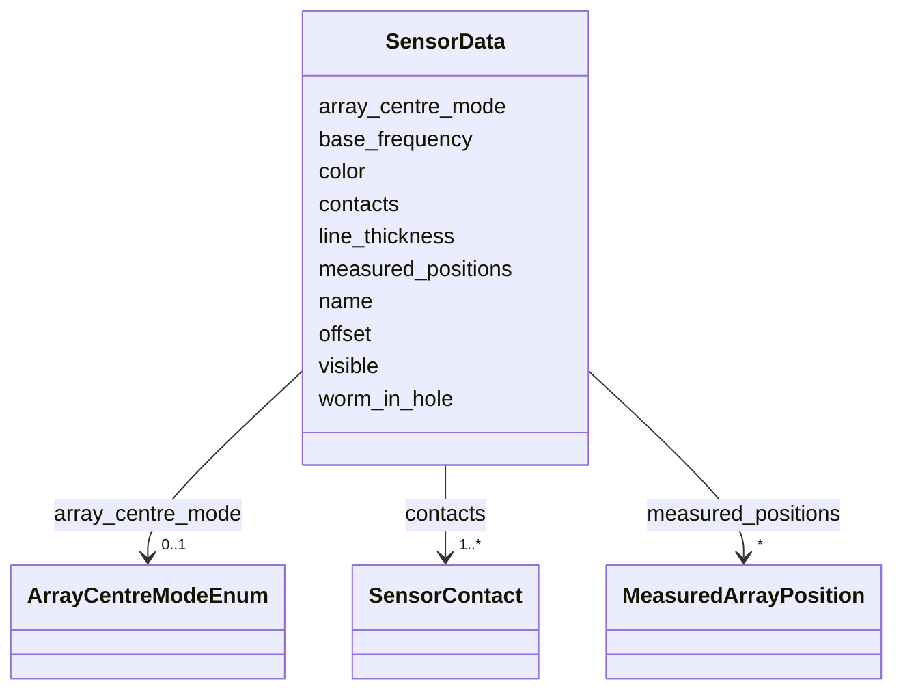

# Class: SensorData 


_Named sensor with contact measurements. Embedded in TrackProperties to associate sensor data with the host track._


URI: [debrief:class/SensorData](https://debrief.info/schemas/class/SensorData)





<!-- no inheritance hierarchy -->


## Slots

| Name | Cardinality and Range | Description | Inheritance |
| ---  | --- | --- | --- |
| [name](../slots/name.md) | 1 <br/> [String](../types/String.md) | Sensor identifier (e | direct |
| [base_frequency](../slots/base_frequency.md) | 0..1 <br/> [Float](../types/Float.md) | Reference frequency in Hz | direct |
| [offset](../slots/offset.md) | 0..1 <br/> [Float](../types/Float.md) | Sensor offset from host platform in metres | direct |
| [array_centre_mode](../slots/array_centre_mode.md) | 0..1 <br/> [ArrayCentreModeEnum](../enums/ArrayCentreModeEnum.md) | How bearing line origin is calculated relative to host platform | direct |
| [worm_in_hole](../slots/worm_in_hole.md) | 0..1 <br/> [Boolean](../types/Boolean.md) | Display mode flag | direct |
| [color](../slots/color.md) | 0..1 <br/> [CSSColor](../types/CSSColor.md) | Default color for all contacts in this sensor | direct |
| [visible](../slots/visible.md) | 0..1 <br/> [Boolean](../types/Boolean.md) | Sensor visibility | direct |
| [line_thickness](../slots/line_thickness.md) | 0..1 <br/> [Integer](../types/Integer.md) | Bearing line width in pixels | direct |
| [contacts](../slots/contacts.md) | 1..* <br/> [SensorContact](../classes/SensorContact.md) | Array of sensor measurements | direct |
| [measured_positions](../slots/measured_positions.md) | * <br/> [MeasuredArrayPosition](../classes/MeasuredArrayPosition.md) | Actual towed array positions for MEASURED array centre mode | direct |


## Usages

| used by | used in | type | used |
| ---  | --- | --- | --- |
| [TrackProperties](../classes/TrackProperties.md) | [sensors](../slots/sensors.md) | range | [SensorData](../classes/SensorData.md) |


## Identifier and Mapping Information


### Schema Source


* from schema: https://debrief.info/schemas/debrief


## Mappings

| Mapping Type | Mapped Value |
| ---  | ---  |
| self | debrief:SensorData |
| native | debrief:SensorData |


## LinkML Source

<!-- TODO: investigate https://stackoverflow.com/questions/37606292/how-to-create-tabbed-code-blocks-in-mkdocs-or-sphinx -->

### Direct

<details>
```yaml
name: SensorData
description: Named sensor with contact measurements. Embedded in TrackProperties to
  associate sensor data with the host track.
from_schema: https://debrief.info/schemas/debrief
attributes:
  name:
    name: name
    description: Sensor identifier (e.g., "TOWED_ARRAY")
    from_schema: https://debrief.info/schemas/geojson
    domain_of:
    - SegmentMetadata
    - SensorData
    - TUAData
    - PointMetadataEntry
    - ReferenceLocationProperties
    - Tool
    - ToolParameter
    - PlatformRecord
    - LevelDefinition
    - DatasetSeries
    - StoryboardProperties
    - MCPToolDefinition
    - ToolDefinition
    required: true
  base_frequency:
    name: base_frequency
    description: Reference frequency in Hz
    from_schema: https://debrief.info/schemas/geojson
    domain_of:
    - SegmentMetadata
    - SensorData
    range: float
  offset:
    name: offset
    description: Sensor offset from host platform in metres
    from_schema: https://debrief.info/schemas/geojson
    rank: 1000
    domain_of:
    - SensorData
    range: float
  array_centre_mode:
    name: array_centre_mode
    description: How bearing line origin is calculated relative to host platform
    from_schema: https://debrief.info/schemas/geojson
    rank: 1000
    domain_of:
    - SensorData
    range: ArrayCentreModeEnum
  worm_in_hole:
    name: worm_in_hole
    description: Display mode flag
    from_schema: https://debrief.info/schemas/geojson
    rank: 1000
    domain_of:
    - SensorData
    range: boolean
  color:
    name: color
    description: Default color for all contacts in this sensor
    from_schema: https://debrief.info/schemas/geojson
    domain_of:
    - PointProperties
    - LineProperties
    - PolygonProperties
    - SensorContact
    - SensorData
    range: CSSColor
  visible:
    name: visible
    description: Sensor visibility
    from_schema: https://debrief.info/schemas/geojson
    domain_of:
    - SensorContact
    - SensorData
    range: boolean
  line_thickness:
    name: line_thickness
    description: Bearing line width in pixels
    from_schema: https://debrief.info/schemas/geojson
    rank: 1000
    domain_of:
    - SensorData
    range: integer
  contacts:
    name: contacts
    description: Array of sensor measurements
    from_schema: https://debrief.info/schemas/geojson
    rank: 1000
    domain_of:
    - SensorData
    range: SensorContact
    required: true
    multivalued: true
    inlined: true
    inlined_as_list: true
  measured_positions:
    name: measured_positions
    description: Actual towed array positions for MEASURED array centre mode
    from_schema: https://debrief.info/schemas/geojson
    rank: 1000
    domain_of:
    - SensorData
    range: MeasuredArrayPosition
    multivalued: true
    inlined: true
    inlined_as_list: true

```
</details>

### Induced

<details>
```yaml
name: SensorData
description: Named sensor with contact measurements. Embedded in TrackProperties to
  associate sensor data with the host track.
from_schema: https://debrief.info/schemas/debrief
attributes:
  name:
    name: name
    description: Sensor identifier (e.g., "TOWED_ARRAY")
    from_schema: https://debrief.info/schemas/geojson
    alias: name
    owner: SensorData
    domain_of:
    - SegmentMetadata
    - SensorData
    - TUAData
    - PointMetadataEntry
    - ReferenceLocationProperties
    - Tool
    - ToolParameter
    - PlatformRecord
    - LevelDefinition
    - DatasetSeries
    - StoryboardProperties
    - MCPToolDefinition
    - ToolDefinition
    range: string
    required: true
  base_frequency:
    name: base_frequency
    description: Reference frequency in Hz
    from_schema: https://debrief.info/schemas/geojson
    alias: base_frequency
    owner: SensorData
    domain_of:
    - SegmentMetadata
    - SensorData
    range: float
  offset:
    name: offset
    description: Sensor offset from host platform in metres
    from_schema: https://debrief.info/schemas/geojson
    rank: 1000
    alias: offset
    owner: SensorData
    domain_of:
    - SensorData
    range: float
  array_centre_mode:
    name: array_centre_mode
    description: How bearing line origin is calculated relative to host platform
    from_schema: https://debrief.info/schemas/geojson
    rank: 1000
    alias: array_centre_mode
    owner: SensorData
    domain_of:
    - SensorData
    range: ArrayCentreModeEnum
  worm_in_hole:
    name: worm_in_hole
    description: Display mode flag
    from_schema: https://debrief.info/schemas/geojson
    rank: 1000
    alias: worm_in_hole
    owner: SensorData
    domain_of:
    - SensorData
    range: boolean
  color:
    name: color
    description: Default color for all contacts in this sensor
    from_schema: https://debrief.info/schemas/geojson
    alias: color
    owner: SensorData
    domain_of:
    - PointProperties
    - LineProperties
    - PolygonProperties
    - SensorContact
    - SensorData
    range: CSSColor
  visible:
    name: visible
    description: Sensor visibility
    from_schema: https://debrief.info/schemas/geojson
    alias: visible
    owner: SensorData
    domain_of:
    - SensorContact
    - SensorData
    range: boolean
  line_thickness:
    name: line_thickness
    description: Bearing line width in pixels
    from_schema: https://debrief.info/schemas/geojson
    rank: 1000
    alias: line_thickness
    owner: SensorData
    domain_of:
    - SensorData
    range: integer
  contacts:
    name: contacts
    description: Array of sensor measurements
    from_schema: https://debrief.info/schemas/geojson
    rank: 1000
    alias: contacts
    owner: SensorData
    domain_of:
    - SensorData
    range: SensorContact
    required: true
    multivalued: true
    inlined: true
    inlined_as_list: true
  measured_positions:
    name: measured_positions
    description: Actual towed array positions for MEASURED array centre mode
    from_schema: https://debrief.info/schemas/geojson
    rank: 1000
    alias: measured_positions
    owner: SensorData
    domain_of:
    - SensorData
    range: MeasuredArrayPosition
    multivalued: true
    inlined: true
    inlined_as_list: true

```
</details>