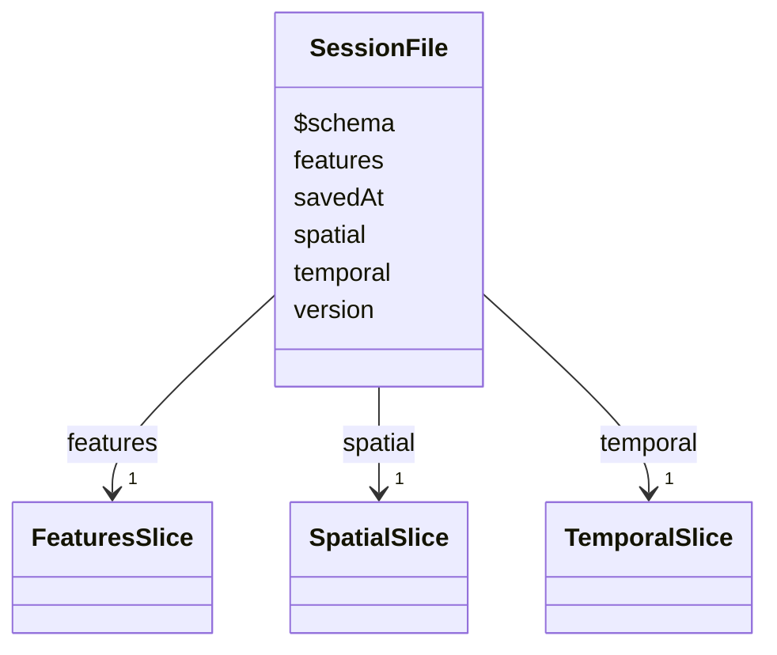

# Class: SessionFile 


_Persisted session file format (FR-024)_


URI: [debrief:class/SessionFile](https://debrief.info/schemas/class/SessionFile)





<!-- no inheritance hierarchy -->


## Slots

| Name | Cardinality and Range | Description | Inheritance |
| ---  | --- | --- | --- |
| [$schema](../slots/$schema.md) | 0..1 <br/> [String](../types/String.md) | JSON Schema URI | direct |
| [version](../slots/version.md) | 1 <br/> [String](../types/String.md) | Schema version | direct |
| [savedAt](../slots/savedAt.md) | 1 <br/> [String](../types/String.md) | When the session was saved (ISO 8601) | direct |
| [temporal](../slots/temporal.md) | 1 <br/> [TemporalSlice](../classes/TemporalSlice.md) | Temporal state (excluding ephemeral playbackState) | direct |
| [spatial](../slots/spatial.md) | 1 <br/> [SpatialSlice](../classes/SpatialSlice.md) | Spatial state | direct |
| [features](../slots/features.md) | 1 <br/> [FeaturesSlice](../classes/FeaturesSlice.md) | Features state | direct |


## Identifier and Mapping Information


### Schema Source


* from schema: https://debrief.info/schemas/debrief


## Mappings

| Mapping Type | Mapped Value |
| ---  | ---  |
| self | debrief:SessionFile |
| native | debrief:SessionFile |


## LinkML Source

<!-- TODO: investigate https://stackoverflow.com/questions/37606292/how-to-create-tabbed-code-blocks-in-mkdocs-or-sphinx -->

### Direct

<details>
```yaml
name: SessionFile
description: Persisted session file format (FR-024)
from_schema: https://debrief.info/schemas/debrief
attributes:
  $schema:
    name: $schema
    description: JSON Schema URI
    from_schema: https://debrief.info/schemas/session-state
    rank: 1000
    domain_of:
    - SessionFile
    range: string
  version:
    name: version
    description: Schema version
    from_schema: https://debrief.info/schemas/session-state
    domain_of:
    - Tool
    - SessionFile
    range: string
    required: true
    pattern: ^\d+\.\d+\.\d+$
  savedAt:
    name: savedAt
    description: When the session was saved (ISO 8601)
    from_schema: https://debrief.info/schemas/session-state
    rank: 1000
    domain_of:
    - SessionFile
    range: string
    required: true
  temporal:
    name: temporal
    description: Temporal state (excluding ephemeral playbackState)
    from_schema: https://debrief.info/schemas/session-state
    domain_of:
    - SessionState
    - SessionFile
    range: TemporalSlice
    required: true
  spatial:
    name: spatial
    description: Spatial state
    from_schema: https://debrief.info/schemas/session-state
    domain_of:
    - SessionState
    - SessionFile
    range: SpatialSlice
    required: true
  features:
    name: features
    description: Features state
    from_schema: https://debrief.info/schemas/session-state
    domain_of:
    - RawGeoJSONFeatureCollection
    - SessionState
    - SessionFile
    - ToolResultForLog
    - ToolExecutionResultForReplay
    range: FeaturesSlice
    required: true

```
</details>

### Induced

<details>
```yaml
name: SessionFile
description: Persisted session file format (FR-024)
from_schema: https://debrief.info/schemas/debrief
attributes:
  $schema:
    name: $schema
    description: JSON Schema URI
    from_schema: https://debrief.info/schemas/session-state
    rank: 1000
    alias: $schema
    owner: SessionFile
    domain_of:
    - SessionFile
    range: string
  version:
    name: version
    description: Schema version
    from_schema: https://debrief.info/schemas/session-state
    alias: version
    owner: SessionFile
    domain_of:
    - Tool
    - SessionFile
    range: string
    required: true
    pattern: ^\d+\.\d+\.\d+$
  savedAt:
    name: savedAt
    description: When the session was saved (ISO 8601)
    from_schema: https://debrief.info/schemas/session-state
    rank: 1000
    alias: savedAt
    owner: SessionFile
    domain_of:
    - SessionFile
    range: string
    required: true
  temporal:
    name: temporal
    description: Temporal state (excluding ephemeral playbackState)
    from_schema: https://debrief.info/schemas/session-state
    alias: temporal
    owner: SessionFile
    domain_of:
    - SessionState
    - SessionFile
    range: TemporalSlice
    required: true
  spatial:
    name: spatial
    description: Spatial state
    from_schema: https://debrief.info/schemas/session-state
    alias: spatial
    owner: SessionFile
    domain_of:
    - SessionState
    - SessionFile
    range: SpatialSlice
    required: true
  features:
    name: features
    description: Features state
    from_schema: https://debrief.info/schemas/session-state
    alias: features
    owner: SessionFile
    domain_of:
    - RawGeoJSONFeatureCollection
    - SessionState
    - SessionFile
    - ToolResultForLog
    - ToolExecutionResultForReplay
    range: FeaturesSlice
    required: true

```
</details>