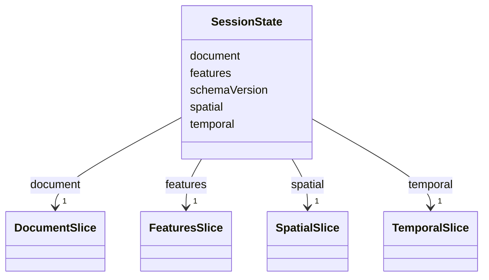

# Class: SessionState 


_Root entity containing all session state slices (FR-001, FR-002)_


URI: [debrief:class/SessionState](https://debrief.info/schemas/class/SessionState)





<!-- no inheritance hierarchy -->


## Slots

| Name | Cardinality and Range | Description | Inheritance |
| ---  | --- | --- | --- |
| [schemaVersion](../slots/schemaVersion.md) | 1 <br/> [String](../types/String.md) | Schema version for persistence compatibility (FR-026) | direct |
| [temporal](../slots/temporal.md) | 1 <br/> [TemporalSlice](../classes/TemporalSlice.md) | Time-related state | direct |
| [spatial](../slots/spatial.md) | 1 <br/> [SpatialSlice](../classes/SpatialSlice.md) | Geographic view state | direct |
| [features](../slots/features.md) | 1 <br/> [FeaturesSlice](../classes/FeaturesSlice.md) | Feature-related state | direct |
| [document](../slots/document.md) | 1 <br/> [DocumentSlice](../classes/DocumentSlice.md) | Editor state | direct |


## Identifier and Mapping Information


### Schema Source


* from schema: https://debrief.info/schemas/debrief


## Mappings

| Mapping Type | Mapped Value |
| ---  | ---  |
| self | debrief:SessionState |
| native | debrief:SessionState |


## LinkML Source

<!-- TODO: investigate https://stackoverflow.com/questions/37606292/how-to-create-tabbed-code-blocks-in-mkdocs-or-sphinx -->

### Direct

<details>
```yaml
name: SessionState
description: Root entity containing all session state slices (FR-001, FR-002)
from_schema: https://debrief.info/schemas/debrief
attributes:
  schemaVersion:
    name: schemaVersion
    description: Schema version for persistence compatibility (FR-026)
    from_schema: https://debrief.info/schemas/session-state
    rank: 1000
    domain_of:
    - SessionState
    range: string
    required: true
    pattern: ^\d+\.\d+\.\d+$
  temporal:
    name: temporal
    description: Time-related state
    from_schema: https://debrief.info/schemas/session-state
    rank: 1000
    domain_of:
    - SessionState
    - SessionFile
    range: TemporalSlice
    required: true
  spatial:
    name: spatial
    description: Geographic view state
    from_schema: https://debrief.info/schemas/session-state
    rank: 1000
    domain_of:
    - SessionState
    - SessionFile
    range: SpatialSlice
    required: true
  features:
    name: features
    description: Feature-related state
    from_schema: https://debrief.info/schemas/session-state
    domain_of:
    - RawGeoJSONFeatureCollection
    - SessionState
    - SessionFile
    - ToolResultForLog
    - ToolExecutionResultForReplay
    range: FeaturesSlice
    required: true
  document:
    name: document
    description: Editor state
    from_schema: https://debrief.info/schemas/session-state
    rank: 1000
    domain_of:
    - SessionState
    range: DocumentSlice
    required: true
tree_root: true

```
</details>

### Induced

<details>
```yaml
name: SessionState
description: Root entity containing all session state slices (FR-001, FR-002)
from_schema: https://debrief.info/schemas/debrief
attributes:
  schemaVersion:
    name: schemaVersion
    description: Schema version for persistence compatibility (FR-026)
    from_schema: https://debrief.info/schemas/session-state
    rank: 1000
    alias: schemaVersion
    owner: SessionState
    domain_of:
    - SessionState
    range: string
    required: true
    pattern: ^\d+\.\d+\.\d+$
  temporal:
    name: temporal
    description: Time-related state
    from_schema: https://debrief.info/schemas/session-state
    rank: 1000
    alias: temporal
    owner: SessionState
    domain_of:
    - SessionState
    - SessionFile
    range: TemporalSlice
    required: true
  spatial:
    name: spatial
    description: Geographic view state
    from_schema: https://debrief.info/schemas/session-state
    rank: 1000
    alias: spatial
    owner: SessionState
    domain_of:
    - SessionState
    - SessionFile
    range: SpatialSlice
    required: true
  features:
    name: features
    description: Feature-related state
    from_schema: https://debrief.info/schemas/session-state
    alias: features
    owner: SessionState
    domain_of:
    - RawGeoJSONFeatureCollection
    - SessionState
    - SessionFile
    - ToolResultForLog
    - ToolExecutionResultForReplay
    range: FeaturesSlice
    required: true
  document:
    name: document
    description: Editor state
    from_schema: https://debrief.info/schemas/session-state
    rank: 1000
    alias: document
    owner: SessionState
    domain_of:
    - SessionState
    range: DocumentSlice
    required: true
tree_root: true

```
</details>