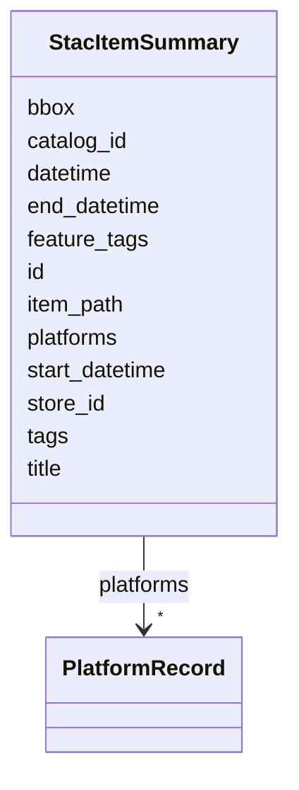

# Class: StacItemSummary 


_Minimal STAC Item projection for browser tree display and metadata filtering. Unifies StacItemSummary (apps/vscode/src/types/stac.ts) and CatalogOverviewItem (shared/components/src/filter-engine/types.ts) into a single canonical summary type that carries both navigation fields and the full set of debrief: extension properties needed for filtering._

__


URI: [debrief:class/StacItemSummary](https://debrief.info/schemas/class/StacItemSummary)





<!-- no inheritance hierarchy -->


## Slots

| Name | Cardinality and Range | Description | Inheritance |
| ---  | --- | --- | --- |
| [id](../slots/id.md) | 1 <br/> [String](../types/String.md) | STAC Item ID | direct |
| [title](../slots/title.md) | 1 <br/> [String](../types/String.md) | Item title | direct |
| [datetime](../slots/datetime.md) | 0..1 <br/> [String](../types/String.md) | Single datetime (ISO 8601) — fallback when start/end not available | direct |
| [item_path](../slots/item_path.md) | 1 <br/> [String](../types/String.md) | Path to item | direct |
| [catalog_id](../slots/catalog_id.md) | 1 <br/> [String](../types/String.md) | Parent catalog identifier | direct |
| [store_id](../slots/store_id.md) | 1 <br/> [String](../types/String.md) | Parent store identifier (needed for URI construction) | direct |
| [bbox](../slots/bbox.md) | 4..* <br/> [Float](../types/Float.md) | Geographic bounding box as [west, south, east, north] | direct |
| [start_datetime](../slots/start_datetime.md) | 0..1 <br/> [String](../types/String.md) | Range start datetime (ISO 8601) | direct |
| [end_datetime](../slots/end_datetime.md) | 0..1 <br/> [String](../types/String.md) | Range end datetime (ISO 8601) | direct |
| [platforms](../slots/platforms.md) | * <br/> [PlatformRecord](../classes/PlatformRecord.md) | Fully-resolved per-platform metadata array for filtering | direct |
| [tags](../slots/tags.md) | * <br/> [String](../types/String.md) | Plot-level tags from debrief:tags | direct |
| [feature_tags](../slots/feature_tags.md) | * <br/> [String](../types/String.md) | Feature-level tags from debrief:feature_tags | direct |


## Identifier and Mapping Information


### Schema Source


* from schema: https://debrief.info/schemas/debrief


## Mappings

| Mapping Type | Mapped Value |
| ---  | ---  |
| self | debrief:StacItemSummary |
| native | debrief:StacItemSummary |


## LinkML Source

<!-- TODO: investigate https://stackoverflow.com/questions/37606292/how-to-create-tabbed-code-blocks-in-mkdocs-or-sphinx -->

### Direct

<details>
```yaml
name: StacItemSummary
description: 'Minimal STAC Item projection for browser tree display and metadata filtering.
  Unifies StacItemSummary (apps/vscode/src/types/stac.ts) and CatalogOverviewItem
  (shared/components/src/filter-engine/types.ts) into a single canonical summary type
  that carries both navigation fields and the full set of debrief: extension properties
  needed for filtering.

  '
from_schema: https://debrief.info/schemas/debrief
attributes:
  id:
    name: id
    description: STAC Item ID
    from_schema: https://debrief.info/schemas/stac-extension
    domain_of:
    - TrackFeature
    - ReferenceLocation
    - SystemState
    - MultiPointFeature
    - MultiPolygonFeature
    - NarrativeEntry
    - CircleAnnotation
    - RectangleAnnotation
    - LineAnnotation
    - TextAnnotation
    - VectorAnnotation
    - PolyAnnotation
    - Tool
    - PlatformRecord
    - PlotSummary
    - StacItemSummary
    - RawGeoJSONFeature
    - StoryboardProperties
    - SceneProperties
    - StoryboardFeature
    - SceneFeature
    - ToolDefinition
    range: string
    required: true
  title:
    name: title
    description: Item title
    from_schema: https://debrief.info/schemas/stac-extension
    domain_of:
    - PlotSummary
    - StacItemSummary
    - DatasetEntry
    - SceneProperties
    - SceneThumbnailAssetEntry
    range: string
    required: true
  datetime:
    name: datetime
    description: Single datetime (ISO 8601) — fallback when start/end not available
    from_schema: https://debrief.info/schemas/stac-extension
    domain_of:
    - PlotSummary
    - StacItemSummary
    range: string
    required: false
  item_path:
    name: item_path
    description: Path to item.json relative to store root
    from_schema: https://debrief.info/schemas/stac-extension
    domain_of:
    - PlotSummary
    - StacItemSummary
    range: string
    required: true
  catalog_id:
    name: catalog_id
    description: Parent catalog identifier
    from_schema: https://debrief.info/schemas/stac-extension
    domain_of:
    - PlotSummary
    - StacItemSummary
    range: string
    required: true
  store_id:
    name: store_id
    description: Parent store identifier (needed for URI construction)
    from_schema: https://debrief.info/schemas/stac-extension
    rank: 1000
    domain_of:
    - StacItemSummary
    range: string
    required: true
  bbox:
    name: bbox
    description: Geographic bounding box as [west, south, east, north]
    from_schema: https://debrief.info/schemas/stac-extension
    domain_of:
    - TrackFeature
    - SystemStateProperties
    - MultiPointFeature
    - MultiPolygonFeature
    - PlotSummary
    - StacItemSummary
    - RawGeoJSONFeature
    - RawGeoJSONFeatureCollection
    range: float
    required: false
    multivalued: true
    minimum_cardinality: 4
    maximum_cardinality: 4
  start_datetime:
    name: start_datetime
    description: Range start datetime (ISO 8601)
    from_schema: https://debrief.info/schemas/stac-extension
    rank: 1000
    domain_of:
    - StacItemSummary
    range: string
    required: false
  end_datetime:
    name: end_datetime
    description: Range end datetime (ISO 8601)
    from_schema: https://debrief.info/schemas/stac-extension
    rank: 1000
    domain_of:
    - StacItemSummary
    range: string
    required: false
  platforms:
    name: platforms
    description: 'Fully-resolved per-platform metadata array for filtering. Same structure
      as StacExtensionProperties.platforms.

      '
    from_schema: https://debrief.info/schemas/stac-extension
    domain_of:
    - StacExtensionProperties
    - StacItemSummary
    range: PlatformRecord
    required: false
    multivalued: true
    inlined: true
    inlined_as_list: true
  tags:
    name: tags
    description: Plot-level tags from debrief:tags
    from_schema: https://debrief.info/schemas/stac-extension
    domain_of:
    - BaseFeatureProperties
    - StacExtensionProperties
    - StacItemSummary
    range: string
    required: false
    multivalued: true
  feature_tags:
    name: feature_tags
    description: Feature-level tags from debrief:feature_tags
    from_schema: https://debrief.info/schemas/stac-extension
    domain_of:
    - StacExtensionProperties
    - StacItemSummary
    range: string
    required: false
    multivalued: true

```
</details>

### Induced

<details>
```yaml
name: StacItemSummary
description: 'Minimal STAC Item projection for browser tree display and metadata filtering.
  Unifies StacItemSummary (apps/vscode/src/types/stac.ts) and CatalogOverviewItem
  (shared/components/src/filter-engine/types.ts) into a single canonical summary type
  that carries both navigation fields and the full set of debrief: extension properties
  needed for filtering.

  '
from_schema: https://debrief.info/schemas/debrief
attributes:
  id:
    name: id
    description: STAC Item ID
    from_schema: https://debrief.info/schemas/stac-extension
    alias: id
    owner: StacItemSummary
    domain_of:
    - TrackFeature
    - ReferenceLocation
    - SystemState
    - MultiPointFeature
    - MultiPolygonFeature
    - NarrativeEntry
    - CircleAnnotation
    - RectangleAnnotation
    - LineAnnotation
    - TextAnnotation
    - VectorAnnotation
    - PolyAnnotation
    - Tool
    - PlatformRecord
    - PlotSummary
    - StacItemSummary
    - RawGeoJSONFeature
    - StoryboardProperties
    - SceneProperties
    - StoryboardFeature
    - SceneFeature
    - ToolDefinition
    range: string
    required: true
  title:
    name: title
    description: Item title
    from_schema: https://debrief.info/schemas/stac-extension
    alias: title
    owner: StacItemSummary
    domain_of:
    - PlotSummary
    - StacItemSummary
    - DatasetEntry
    - SceneProperties
    - SceneThumbnailAssetEntry
    range: string
    required: true
  datetime:
    name: datetime
    description: Single datetime (ISO 8601) — fallback when start/end not available
    from_schema: https://debrief.info/schemas/stac-extension
    alias: datetime
    owner: StacItemSummary
    domain_of:
    - PlotSummary
    - StacItemSummary
    range: string
    required: false
  item_path:
    name: item_path
    description: Path to item.json relative to store root
    from_schema: https://debrief.info/schemas/stac-extension
    alias: item_path
    owner: StacItemSummary
    domain_of:
    - PlotSummary
    - StacItemSummary
    range: string
    required: true
  catalog_id:
    name: catalog_id
    description: Parent catalog identifier
    from_schema: https://debrief.info/schemas/stac-extension
    alias: catalog_id
    owner: StacItemSummary
    domain_of:
    - PlotSummary
    - StacItemSummary
    range: string
    required: true
  store_id:
    name: store_id
    description: Parent store identifier (needed for URI construction)
    from_schema: https://debrief.info/schemas/stac-extension
    rank: 1000
    alias: store_id
    owner: StacItemSummary
    domain_of:
    - StacItemSummary
    range: string
    required: true
  bbox:
    name: bbox
    description: Geographic bounding box as [west, south, east, north]
    from_schema: https://debrief.info/schemas/stac-extension
    alias: bbox
    owner: StacItemSummary
    domain_of:
    - TrackFeature
    - SystemStateProperties
    - MultiPointFeature
    - MultiPolygonFeature
    - PlotSummary
    - StacItemSummary
    - RawGeoJSONFeature
    - RawGeoJSONFeatureCollection
    range: float
    required: false
    multivalued: true
    minimum_cardinality: 4
    maximum_cardinality: 4
  start_datetime:
    name: start_datetime
    description: Range start datetime (ISO 8601)
    from_schema: https://debrief.info/schemas/stac-extension
    rank: 1000
    alias: start_datetime
    owner: StacItemSummary
    domain_of:
    - StacItemSummary
    range: string
    required: false
  end_datetime:
    name: end_datetime
    description: Range end datetime (ISO 8601)
    from_schema: https://debrief.info/schemas/stac-extension
    rank: 1000
    alias: end_datetime
    owner: StacItemSummary
    domain_of:
    - StacItemSummary
    range: string
    required: false
  platforms:
    name: platforms
    description: 'Fully-resolved per-platform metadata array for filtering. Same structure
      as StacExtensionProperties.platforms.

      '
    from_schema: https://debrief.info/schemas/stac-extension
    alias: platforms
    owner: StacItemSummary
    domain_of:
    - StacExtensionProperties
    - StacItemSummary
    range: PlatformRecord
    required: false
    multivalued: true
    inlined: true
    inlined_as_list: true
  tags:
    name: tags
    description: Plot-level tags from debrief:tags
    from_schema: https://debrief.info/schemas/stac-extension
    alias: tags
    owner: StacItemSummary
    domain_of:
    - BaseFeatureProperties
    - StacExtensionProperties
    - StacItemSummary
    range: string
    required: false
    multivalued: true
  feature_tags:
    name: feature_tags
    description: Feature-level tags from debrief:feature_tags
    from_schema: https://debrief.info/schemas/stac-extension
    alias: feature_tags
    owner: StacItemSummary
    domain_of:
    - StacExtensionProperties
    - StacItemSummary
    range: string
    required: false
    multivalued: true

```
</details>