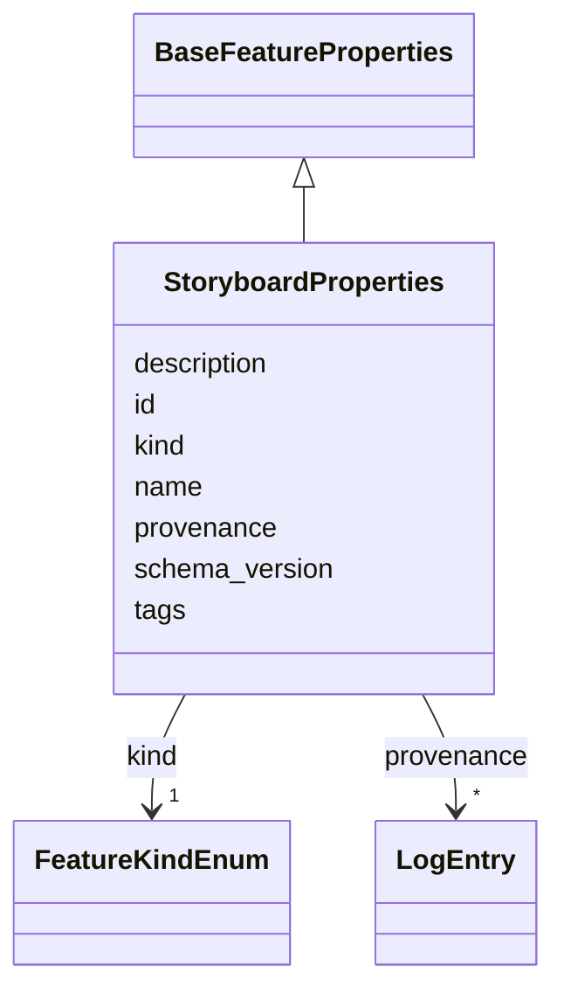

# Class: StoryboardProperties 


_Properties class for a Storyboard parent Feature. A Storyboard is a named, ordered collection of Scenes attached to a single plot._


URI: [debrief:class/StoryboardProperties](https://debrief.info/schemas/class/StoryboardProperties)





## Inheritance
* [BaseFeatureProperties](../classes/BaseFeatureProperties.md)
    * **StoryboardProperties**


## Slots

| Name | Cardinality and Range | Description | Inheritance |
| ---  | --- | --- | --- |
| [kind](../slots/kind.md) | 1 <br/> [FeatureKindEnum](../enums/FeatureKindEnum.md) | Feature kind discriminator (pinned to STORYBOARD) | direct |
| [id](../slots/id.md) | 1 <br/> [String](../types/String.md) | ULID (26 chars, Crockford base-32) | direct |
| [name](../slots/name.md) | 1 <br/> [String](../types/String.md) | Display title | direct |
| [description](../slots/description.md) | 0..1 <br/> [String](../types/String.md) | Markdown narrative description | direct |
| [schema_version](../slots/schema_version.md) | 1 <br/> [Integer](../types/Integer.md) | Schema version | direct |
| [tags](../slots/tags.md) | * <br/> [String](../types/String.md) | Free-text labels assigned to this feature by the analyst | [BaseFeatureProperties](../classes/BaseFeatureProperties.md) |
| [provenance](../slots/provenance.md) | * <br/> [LogEntry](../classes/LogEntry.md) | PROV-aligned provenance records (append-only log of tool operations) | [BaseFeatureProperties](../classes/BaseFeatureProperties.md) |


## Usages

| used by | used in | type | used |
| ---  | --- | --- | --- |
| [StoryboardFeature](../classes/StoryboardFeature.md) | [properties](../slots/properties.md) | range | [StoryboardProperties](../classes/StoryboardProperties.md) |


## Identifier and Mapping Information


### Schema Source


* from schema: https://debrief.info/schemas/debrief


## Mappings

| Mapping Type | Mapped Value |
| ---  | ---  |
| self | debrief:StoryboardProperties |
| native | debrief:StoryboardProperties |


## LinkML Source

<!-- TODO: investigate https://stackoverflow.com/questions/37606292/how-to-create-tabbed-code-blocks-in-mkdocs-or-sphinx -->

### Direct

<details>
```yaml
name: StoryboardProperties
description: Properties class for a Storyboard parent Feature. A Storyboard is a named,
  ordered collection of Scenes attached to a single plot.
from_schema: https://debrief.info/schemas/debrief
is_a: BaseFeatureProperties
attributes:
  kind:
    name: kind
    description: Feature kind discriminator (pinned to STORYBOARD)
    from_schema: https://debrief.info/schemas/storyboard
    domain_of:
    - BaseFeatureProperties
    - TrackProperties
    - ReferenceLocationProperties
    - SystemStateProperties
    - MultiPointFeatureProperties
    - MultiPolygonFeatureProperties
    - NarrativeEntryProperties
    - CircleAnnotationProperties
    - RectangleAnnotationProperties
    - LineAnnotationProperties
    - TextAnnotationProperties
    - VectorAnnotationProperties
    - PolyAnnotationProperties
    - SelectionRequirement
    - SystemRecordProperties
    - StoryboardProperties
    - SceneProperties
    - MCPSelectionRequirement
    range: FeatureKindEnum
    required: true
    equals_string: STORYBOARD
  id:
    name: id
    description: ULID (26 chars, Crockford base-32). Immutable after create.
    from_schema: https://debrief.info/schemas/storyboard
    domain_of:
    - TrackFeature
    - ReferenceLocation
    - SystemState
    - MultiPointFeature
    - MultiPolygonFeature
    - NarrativeEntry
    - CircleAnnotation
    - RectangleAnnotation
    - LineAnnotation
    - TextAnnotation
    - VectorAnnotation
    - PolyAnnotation
    - Tool
    - PlatformRecord
    - PlotSummary
    - StacItemSummary
    - RawGeoJSONFeature
    - StoryboardProperties
    - SceneProperties
    - StoryboardFeature
    - SceneFeature
    - ToolDefinition
    range: string
    required: true
    pattern: ^[0-9A-HJKMNP-TV-Z]{26}$
  name:
    name: name
    description: Display title. Non-empty. Unique within plot FeatureCollection.
    from_schema: https://debrief.info/schemas/storyboard
    domain_of:
    - SegmentMetadata
    - SensorData
    - TUAData
    - PointMetadataEntry
    - ReferenceLocationProperties
    - Tool
    - ToolParameter
    - PlatformRecord
    - LevelDefinition
    - DatasetSeries
    - StoryboardProperties
    - MCPToolDefinition
    - ToolDefinition
    range: string
    required: true
  description:
    name: description
    description: Markdown narrative description
    from_schema: https://debrief.info/schemas/storyboard
    domain_of:
    - ReferenceLocationProperties
    - MultiPointFeatureProperties
    - MultiPolygonFeatureProperties
    - Tool
    - ToolParameter
    - LevelDefinition
    - StoryboardProperties
    - SceneProperties
    - MCPParamSchema
    - MCPToolDefinition
    - ToolDefinition
    range: string
    required: false
  schema_version:
    name: schema_version
    description: Schema version. Starts at 1. Monotonically non-decreasing across
      edits; bumped only by migrations.
    from_schema: https://debrief.info/schemas/storyboard
    rank: 1000
    domain_of:
    - StoryboardProperties
    range: integer
    required: true
    minimum_value: 1

```
</details>

### Induced

<details>
```yaml
name: StoryboardProperties
description: Properties class for a Storyboard parent Feature. A Storyboard is a named,
  ordered collection of Scenes attached to a single plot.
from_schema: https://debrief.info/schemas/debrief
is_a: BaseFeatureProperties
attributes:
  kind:
    name: kind
    description: Feature kind discriminator (pinned to STORYBOARD)
    from_schema: https://debrief.info/schemas/storyboard
    alias: kind
    owner: StoryboardProperties
    domain_of:
    - BaseFeatureProperties
    - TrackProperties
    - ReferenceLocationProperties
    - SystemStateProperties
    - MultiPointFeatureProperties
    - MultiPolygonFeatureProperties
    - NarrativeEntryProperties
    - CircleAnnotationProperties
    - RectangleAnnotationProperties
    - LineAnnotationProperties
    - TextAnnotationProperties
    - VectorAnnotationProperties
    - PolyAnnotationProperties
    - SelectionRequirement
    - SystemRecordProperties
    - StoryboardProperties
    - SceneProperties
    - MCPSelectionRequirement
    range: FeatureKindEnum
    required: true
    equals_string: STORYBOARD
  id:
    name: id
    description: ULID (26 chars, Crockford base-32). Immutable after create.
    from_schema: https://debrief.info/schemas/storyboard
    alias: id
    owner: StoryboardProperties
    domain_of:
    - TrackFeature
    - ReferenceLocation
    - SystemState
    - MultiPointFeature
    - MultiPolygonFeature
    - NarrativeEntry
    - CircleAnnotation
    - RectangleAnnotation
    - LineAnnotation
    - TextAnnotation
    - VectorAnnotation
    - PolyAnnotation
    - Tool
    - PlatformRecord
    - PlotSummary
    - StacItemSummary
    - RawGeoJSONFeature
    - StoryboardProperties
    - SceneProperties
    - StoryboardFeature
    - SceneFeature
    - ToolDefinition
    range: string
    required: true
    pattern: ^[0-9A-HJKMNP-TV-Z]{26}$
  name:
    name: name
    description: Display title. Non-empty. Unique within plot FeatureCollection.
    from_schema: https://debrief.info/schemas/storyboard
    alias: name
    owner: StoryboardProperties
    domain_of:
    - SegmentMetadata
    - SensorData
    - TUAData
    - PointMetadataEntry
    - ReferenceLocationProperties
    - Tool
    - ToolParameter
    - PlatformRecord
    - LevelDefinition
    - DatasetSeries
    - StoryboardProperties
    - MCPToolDefinition
    - ToolDefinition
    range: string
    required: true
  description:
    name: description
    description: Markdown narrative description
    from_schema: https://debrief.info/schemas/storyboard
    alias: description
    owner: StoryboardProperties
    domain_of:
    - ReferenceLocationProperties
    - MultiPointFeatureProperties
    - MultiPolygonFeatureProperties
    - Tool
    - ToolParameter
    - LevelDefinition
    - StoryboardProperties
    - SceneProperties
    - MCPParamSchema
    - MCPToolDefinition
    - ToolDefinition
    range: string
    required: false
  schema_version:
    name: schema_version
    description: Schema version. Starts at 1. Monotonically non-decreasing across
      edits; bumped only by migrations.
    from_schema: https://debrief.info/schemas/storyboard
    rank: 1000
    alias: schema_version
    owner: StoryboardProperties
    domain_of:
    - StoryboardProperties
    range: integer
    required: true
    minimum_value: 1
  tags:
    name: tags
    description: Free-text labels assigned to this feature by the analyst
    from_schema: https://debrief.info/schemas/common
    rank: 1000
    alias: tags
    owner: StoryboardProperties
    domain_of:
    - BaseFeatureProperties
    - StacExtensionProperties
    - StacItemSummary
    range: string
    required: false
    multivalued: true
  provenance:
    name: provenance
    description: PROV-aligned provenance records (append-only log of tool operations)
    from_schema: https://debrief.info/schemas/common
    rank: 1000
    alias: provenance
    owner: StoryboardProperties
    domain_of:
    - BaseFeatureProperties
    - SystemStateProperties
    - SystemRecordProperties
    range: LogEntry
    multivalued: true
    inlined: true
    inlined_as_list: true

```
</details>