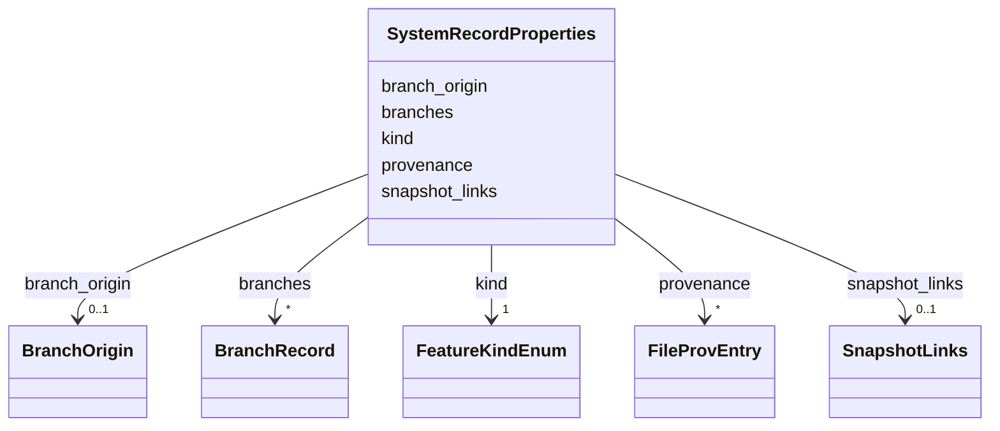

# Class: SystemRecordProperties 


_Properties for the non-spatial system record feature. A system record is a GeoJSON Feature with kind SYSTEM_RECORD and Point geometry with empty coordinates._


URI: [debrief:class/SystemRecordProperties](https://debrief.info/schemas/class/SystemRecordProperties)





<!-- no inheritance hierarchy -->


## Slots

| Name | Cardinality and Range | Description | Inheritance |
| ---  | --- | --- | --- |
| [kind](../slots/kind.md) | 1 <br/> [FeatureKindEnum](../enums/FeatureKindEnum.md) | Feature type discriminator | direct |
| [snapshot_links](../slots/snapshot_links.md) | 0..1 <br/> [SnapshotLinks](../classes/SnapshotLinks.md) | Doubly-linked snapshot chain | direct |
| [branches](../slots/branches.md) | * <br/> [BranchRecord](../classes/BranchRecord.md) | Branch records | direct |
| [branch_origin](../slots/branch_origin.md) | 0..1 <br/> [BranchOrigin](../classes/BranchOrigin.md) | Reverse link to source plot (set when this plot is a branch) | direct |
| [provenance](../slots/provenance.md) | * <br/> [FileProvEntry](../classes/FileProvEntry.md) | File-level provenance events (snapshot and branch creation) | direct |


## Identifier and Mapping Information


### Schema Source


* from schema: https://debrief.info/schemas/debrief


## Mappings

| Mapping Type | Mapped Value |
| ---  | ---  |
| self | debrief:SystemRecordProperties |
| native | debrief:SystemRecordProperties |


## LinkML Source

<!-- TODO: investigate https://stackoverflow.com/questions/37606292/how-to-create-tabbed-code-blocks-in-mkdocs-or-sphinx -->

### Direct

<details>
```yaml
name: SystemRecordProperties
description: Properties for the non-spatial system record feature. A system record
  is a GeoJSON Feature with kind SYSTEM_RECORD and Point geometry with empty coordinates.
from_schema: https://debrief.info/schemas/debrief
attributes:
  kind:
    name: kind
    description: Feature type discriminator
    from_schema: https://debrief.info/schemas/system-record
    domain_of:
    - BaseFeatureProperties
    - TrackProperties
    - ReferenceLocationProperties
    - SystemStateProperties
    - MultiPointFeatureProperties
    - MultiPolygonFeatureProperties
    - NarrativeEntryProperties
    - CircleAnnotationProperties
    - RectangleAnnotationProperties
    - LineAnnotationProperties
    - TextAnnotationProperties
    - VectorAnnotationProperties
    - PolyAnnotationProperties
    - SelectionRequirement
    - SystemRecordProperties
    - StoryboardProperties
    - SceneProperties
    - MCPSelectionRequirement
    range: FeatureKindEnum
    required: true
    equals_string: SYSTEM_RECORD
  snapshot_links:
    name: snapshot_links
    description: Doubly-linked snapshot chain. Null when no snapshots exist.
    from_schema: https://debrief.info/schemas/system-record
    rank: 1000
    domain_of:
    - SystemRecordProperties
    range: SnapshotLinks
    required: false
  branches:
    name: branches
    description: Branch records. Empty array when no branches exist.
    from_schema: https://debrief.info/schemas/system-record
    rank: 1000
    domain_of:
    - SystemRecordProperties
    range: BranchRecord
    required: false
    multivalued: true
  branch_origin:
    name: branch_origin
    description: Reverse link to source plot (set when this plot is a branch).
    from_schema: https://debrief.info/schemas/system-record
    rank: 1000
    domain_of:
    - SystemRecordProperties
    range: BranchOrigin
    required: false
  provenance:
    name: provenance
    description: File-level provenance events (snapshot and branch creation).
    from_schema: https://debrief.info/schemas/system-record
    domain_of:
    - BaseFeatureProperties
    - SystemStateProperties
    - SystemRecordProperties
    range: FileProvEntry
    required: false
    multivalued: true

```
</details>

### Induced

<details>
```yaml
name: SystemRecordProperties
description: Properties for the non-spatial system record feature. A system record
  is a GeoJSON Feature with kind SYSTEM_RECORD and Point geometry with empty coordinates.
from_schema: https://debrief.info/schemas/debrief
attributes:
  kind:
    name: kind
    description: Feature type discriminator
    from_schema: https://debrief.info/schemas/system-record
    alias: kind
    owner: SystemRecordProperties
    domain_of:
    - BaseFeatureProperties
    - TrackProperties
    - ReferenceLocationProperties
    - SystemStateProperties
    - MultiPointFeatureProperties
    - MultiPolygonFeatureProperties
    - NarrativeEntryProperties
    - CircleAnnotationProperties
    - RectangleAnnotationProperties
    - LineAnnotationProperties
    - TextAnnotationProperties
    - VectorAnnotationProperties
    - PolyAnnotationProperties
    - SelectionRequirement
    - SystemRecordProperties
    - StoryboardProperties
    - SceneProperties
    - MCPSelectionRequirement
    range: FeatureKindEnum
    required: true
    equals_string: SYSTEM_RECORD
  snapshot_links:
    name: snapshot_links
    description: Doubly-linked snapshot chain. Null when no snapshots exist.
    from_schema: https://debrief.info/schemas/system-record
    rank: 1000
    alias: snapshot_links
    owner: SystemRecordProperties
    domain_of:
    - SystemRecordProperties
    range: SnapshotLinks
    required: false
  branches:
    name: branches
    description: Branch records. Empty array when no branches exist.
    from_schema: https://debrief.info/schemas/system-record
    rank: 1000
    alias: branches
    owner: SystemRecordProperties
    domain_of:
    - SystemRecordProperties
    range: BranchRecord
    required: false
    multivalued: true
  branch_origin:
    name: branch_origin
    description: Reverse link to source plot (set when this plot is a branch).
    from_schema: https://debrief.info/schemas/system-record
    rank: 1000
    alias: branch_origin
    owner: SystemRecordProperties
    domain_of:
    - SystemRecordProperties
    range: BranchOrigin
    required: false
  provenance:
    name: provenance
    description: File-level provenance events (snapshot and branch creation).
    from_schema: https://debrief.info/schemas/system-record
    alias: provenance
    owner: SystemRecordProperties
    domain_of:
    - BaseFeatureProperties
    - SystemStateProperties
    - SystemRecordProperties
    range: FileProvEntry
    required: false
    multivalued: true

```
</details>