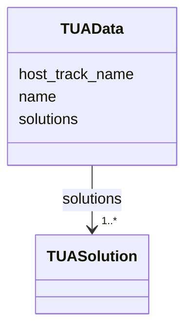

# Class: TUAData 


_Named TUA solution collection. Embedded in TrackProperties to associate TUA data with the host track._


URI: [debrief:class/TUAData](https://debrief.info/schemas/class/TUAData)





<!-- no inheritance hierarchy -->


## Slots

| Name | Cardinality and Range | Description | Inheritance |
| ---  | --- | --- | --- |
| [name](../slots/name.md) | 1 <br/> [String](../types/String.md) | TUA collection name | direct |
| [host_track_name](../slots/host_track_name.md) | 1 <br/> [String](../types/String.md) | Name of track this TUA set relates to | direct |
| [solutions](../slots/solutions.md) | 1..* <br/> [TUASolution](../classes/TUASolution.md) | Array of TUA estimates | direct |


## Usages

| used by | used in | type | used |
| ---  | --- | --- | --- |
| [TrackProperties](../classes/TrackProperties.md) | [tuas](../slots/tuas.md) | range | [TUAData](../classes/TUAData.md) |


## Identifier and Mapping Information


### Schema Source


* from schema: https://debrief.info/schemas/debrief


## Mappings

| Mapping Type | Mapped Value |
| ---  | ---  |
| self | debrief:TUAData |
| native | debrief:TUAData |


## LinkML Source

<!-- TODO: investigate https://stackoverflow.com/questions/37606292/how-to-create-tabbed-code-blocks-in-mkdocs-or-sphinx -->

### Direct

<details>
```yaml
name: TUAData
description: Named TUA solution collection. Embedded in TrackProperties to associate
  TUA data with the host track.
from_schema: https://debrief.info/schemas/debrief
attributes:
  name:
    name: name
    description: TUA collection name
    from_schema: https://debrief.info/schemas/geojson
    domain_of:
    - SegmentMetadata
    - SensorData
    - TUAData
    - PointMetadataEntry
    - ReferenceLocationProperties
    - Tool
    - ToolParameter
    - PlatformRecord
    - LevelDefinition
    - DatasetSeries
    - StoryboardProperties
    - MCPToolDefinition
    - ToolDefinition
    required: true
  host_track_name:
    name: host_track_name
    description: Name of track this TUA set relates to
    from_schema: https://debrief.info/schemas/geojson
    rank: 1000
    domain_of:
    - TUAData
    required: true
  solutions:
    name: solutions
    description: Array of TUA estimates
    from_schema: https://debrief.info/schemas/geojson
    rank: 1000
    domain_of:
    - TUAData
    range: TUASolution
    required: true
    multivalued: true
    inlined: true
    inlined_as_list: true

```
</details>

### Induced

<details>
```yaml
name: TUAData
description: Named TUA solution collection. Embedded in TrackProperties to associate
  TUA data with the host track.
from_schema: https://debrief.info/schemas/debrief
attributes:
  name:
    name: name
    description: TUA collection name
    from_schema: https://debrief.info/schemas/geojson
    alias: name
    owner: TUAData
    domain_of:
    - SegmentMetadata
    - SensorData
    - TUAData
    - PointMetadataEntry
    - ReferenceLocationProperties
    - Tool
    - ToolParameter
    - PlatformRecord
    - LevelDefinition
    - DatasetSeries
    - StoryboardProperties
    - MCPToolDefinition
    - ToolDefinition
    range: string
    required: true
  host_track_name:
    name: host_track_name
    description: Name of track this TUA set relates to
    from_schema: https://debrief.info/schemas/geojson
    rank: 1000
    alias: host_track_name
    owner: TUAData
    domain_of:
    - TUAData
    range: string
    required: true
  solutions:
    name: solutions
    description: Array of TUA estimates
    from_schema: https://debrief.info/schemas/geojson
    rank: 1000
    alias: solutions
    owner: TUAData
    domain_of:
    - TUAData
    range: TUASolution
    required: true
    multivalued: true
    inlined: true
    inlined_as_list: true

```
</details>