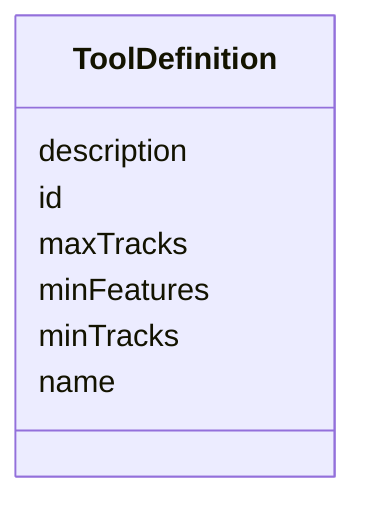

# Class: ToolDefinition 


_Consumer-facing flattened view of a tool catalogue entry. Closes audit §3.1 row 22. Slot names match `apps/web-shell/src/mocks/calcService.ts` (`min_tracks`, `max_tracks`, `min_features` — preserved as-is)._


URI: [debrief:class/ToolDefinition](https://debrief.info/schemas/class/ToolDefinition)





<!-- no inheritance hierarchy -->


## Slots

| Name | Cardinality and Range | Description | Inheritance |
| ---  | --- | --- | --- |
| [id](../slots/id.md) | 1 <br/> [String](../types/String.md) | Unique tool identifier | direct |
| [name](../slots/name.md) | 1 <br/> [String](../types/String.md) | Human-readable name | direct |
| [description](../slots/description.md) | 1 <br/> [String](../types/String.md) | Brief description | direct |
| [minTracks](../slots/minTracks.md) | 0..1 <br/> [Integer](../types/Integer.md) | Minimum number of tracks required | direct |
| [maxTracks](../slots/maxTracks.md) | 0..1 <br/> [Integer](../types/Integer.md) | Maximum number of tracks (absent = no upper limit) | direct |
| [minFeatures](../slots/minFeatures.md) | 0..1 <br/> [Integer](../types/Integer.md) | Minimum number of features required (any type) | direct |


## Identifier and Mapping Information


### Schema Source


* from schema: https://debrief.info/schemas/debrief


## Mappings

| Mapping Type | Mapped Value |
| ---  | ---  |
| self | debrief:ToolDefinition |
| native | debrief:ToolDefinition |


## LinkML Source

<!-- TODO: investigate https://stackoverflow.com/questions/37606292/how-to-create-tabbed-code-blocks-in-mkdocs-or-sphinx -->

### Direct

<details>
```yaml
name: ToolDefinition
description: Consumer-facing flattened view of a tool catalogue entry. Closes audit
  §3.1 row 22. Slot names match `apps/web-shell/src/mocks/calcService.ts` (`min_tracks`,
  `max_tracks`, `min_features` — preserved as-is).
from_schema: https://debrief.info/schemas/debrief
attributes:
  id:
    name: id
    description: Unique tool identifier.
    from_schema: https://debrief.info/schemas/mcp
    domain_of:
    - TrackFeature
    - ReferenceLocation
    - SystemState
    - MultiPointFeature
    - MultiPolygonFeature
    - NarrativeEntry
    - CircleAnnotation
    - RectangleAnnotation
    - LineAnnotation
    - TextAnnotation
    - VectorAnnotation
    - PolyAnnotation
    - Tool
    - PlatformRecord
    - PlotSummary
    - StacItemSummary
    - RawGeoJSONFeature
    - StoryboardProperties
    - SceneProperties
    - StoryboardFeature
    - SceneFeature
    - ToolDefinition
    range: string
    required: true
  name:
    name: name
    description: Human-readable name.
    from_schema: https://debrief.info/schemas/mcp
    domain_of:
    - SegmentMetadata
    - SensorData
    - TUAData
    - PointMetadataEntry
    - ReferenceLocationProperties
    - Tool
    - ToolParameter
    - PlatformRecord
    - LevelDefinition
    - DatasetSeries
    - StoryboardProperties
    - MCPToolDefinition
    - ToolDefinition
    range: string
    required: true
  description:
    name: description
    description: Brief description.
    from_schema: https://debrief.info/schemas/mcp
    domain_of:
    - ReferenceLocationProperties
    - MultiPointFeatureProperties
    - MultiPolygonFeatureProperties
    - Tool
    - ToolParameter
    - LevelDefinition
    - StoryboardProperties
    - SceneProperties
    - MCPParamSchema
    - MCPToolDefinition
    - ToolDefinition
    range: string
    required: true
  minTracks:
    name: minTracks
    description: Minimum number of tracks required.
    from_schema: https://debrief.info/schemas/mcp
    rank: 1000
    domain_of:
    - ToolDefinition
    range: integer
  maxTracks:
    name: maxTracks
    description: Maximum number of tracks (absent = no upper limit).
    from_schema: https://debrief.info/schemas/mcp
    rank: 1000
    domain_of:
    - ToolDefinition
    range: integer
  minFeatures:
    name: minFeatures
    description: Minimum number of features required (any type).
    from_schema: https://debrief.info/schemas/mcp
    rank: 1000
    domain_of:
    - ToolDefinition
    range: integer

```
</details>

### Induced

<details>
```yaml
name: ToolDefinition
description: Consumer-facing flattened view of a tool catalogue entry. Closes audit
  §3.1 row 22. Slot names match `apps/web-shell/src/mocks/calcService.ts` (`min_tracks`,
  `max_tracks`, `min_features` — preserved as-is).
from_schema: https://debrief.info/schemas/debrief
attributes:
  id:
    name: id
    description: Unique tool identifier.
    from_schema: https://debrief.info/schemas/mcp
    alias: id
    owner: ToolDefinition
    domain_of:
    - TrackFeature
    - ReferenceLocation
    - SystemState
    - MultiPointFeature
    - MultiPolygonFeature
    - NarrativeEntry
    - CircleAnnotation
    - RectangleAnnotation
    - LineAnnotation
    - TextAnnotation
    - VectorAnnotation
    - PolyAnnotation
    - Tool
    - PlatformRecord
    - PlotSummary
    - StacItemSummary
    - RawGeoJSONFeature
    - StoryboardProperties
    - SceneProperties
    - StoryboardFeature
    - SceneFeature
    - ToolDefinition
    range: string
    required: true
  name:
    name: name
    description: Human-readable name.
    from_schema: https://debrief.info/schemas/mcp
    alias: name
    owner: ToolDefinition
    domain_of:
    - SegmentMetadata
    - SensorData
    - TUAData
    - PointMetadataEntry
    - ReferenceLocationProperties
    - Tool
    - ToolParameter
    - PlatformRecord
    - LevelDefinition
    - DatasetSeries
    - StoryboardProperties
    - MCPToolDefinition
    - ToolDefinition
    range: string
    required: true
  description:
    name: description
    description: Brief description.
    from_schema: https://debrief.info/schemas/mcp
    alias: description
    owner: ToolDefinition
    domain_of:
    - ReferenceLocationProperties
    - MultiPointFeatureProperties
    - MultiPolygonFeatureProperties
    - Tool
    - ToolParameter
    - LevelDefinition
    - StoryboardProperties
    - SceneProperties
    - MCPParamSchema
    - MCPToolDefinition
    - ToolDefinition
    range: string
    required: true
  minTracks:
    name: minTracks
    description: Minimum number of tracks required.
    from_schema: https://debrief.info/schemas/mcp
    rank: 1000
    alias: minTracks
    owner: ToolDefinition
    domain_of:
    - ToolDefinition
    range: integer
  maxTracks:
    name: maxTracks
    description: Maximum number of tracks (absent = no upper limit).
    from_schema: https://debrief.info/schemas/mcp
    rank: 1000
    alias: maxTracks
    owner: ToolDefinition
    domain_of:
    - ToolDefinition
    range: integer
  minFeatures:
    name: minFeatures
    description: Minimum number of features required (any type).
    from_schema: https://debrief.info/schemas/mcp
    rank: 1000
    alias: minFeatures
    owner: ToolDefinition
    domain_of:
    - ToolDefinition
    range: integer

```
</details>