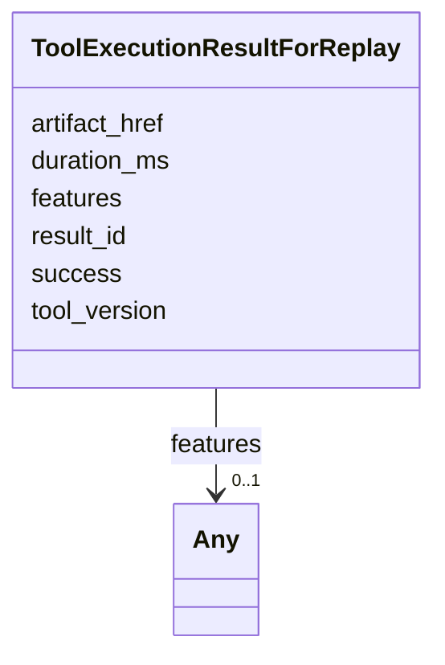

# Class: ToolExecutionResultForReplay 


_Minimal tool-execution result returned by the Replay Engine's `execute_tool` callback. Closes audit §3.1 row 6. Distinct from `ToolResultForLog` (no inheritance) because the replay path's observable surface is intentionally narrower — see services/session-state/src/log/types.ts:373._


URI: [debrief:class/ToolExecutionResultForReplay](https://debrief.info/schemas/class/ToolExecutionResultForReplay)





<!-- no inheritance hierarchy -->


## Slots

| Name | Cardinality and Range | Description | Inheritance |
| ---  | --- | --- | --- |
| [success](../slots/success.md) | 1 <br/> [Boolean](../types/Boolean.md) | Whether the tool succeeded | direct |
| [features](../slots/features.md) | 0..1 <br/> [Any](../classes/Any.md) | GeoJSON FeatureCollection produced by the tool during replay | direct |
| [duration_ms](../slots/duration_ms.md) | 1 <br/> [Integer](../types/Integer.md) | Wall-clock duration of the replay invocation in milliseconds | direct |
| [tool_version](../slots/tool_version.md) | 0..1 <br/> [String](../types/String.md) | Tool version observed at replay time | direct |
| [artifact_href](../slots/artifact_href.md) | 0..1 <br/> [String](../types/String.md) | Path to an exported artifact (for non-GeoJSON tool results) | direct |
| [result_id](../slots/result_id.md) | 0..1 <br/> [String](../types/String.md) | Stable result identifier (used by the activity panel) | direct |


## Identifier and Mapping Information


### Schema Source


* from schema: https://debrief.info/schemas/debrief


## Mappings

| Mapping Type | Mapped Value |
| ---  | ---  |
| self | debrief:ToolExecutionResultForReplay |
| native | debrief:ToolExecutionResultForReplay |


## LinkML Source

<!-- TODO: investigate https://stackoverflow.com/questions/37606292/how-to-create-tabbed-code-blocks-in-mkdocs-or-sphinx -->

### Direct

<details>
```yaml
name: ToolExecutionResultForReplay
description: Minimal tool-execution result returned by the Replay Engine's `execute_tool`
  callback. Closes audit §3.1 row 6. Distinct from `ToolResultForLog` (no inheritance)
  because the replay path's observable surface is intentionally narrower — see services/session-state/src/log/types.ts:373.
from_schema: https://debrief.info/schemas/debrief
attributes:
  success:
    name: success
    description: Whether the tool succeeded.
    from_schema: https://debrief.info/schemas/mcp
    domain_of:
    - ToolResult
    - ToolResultForLog
    - ToolExecutionResultForReplay
    range: boolean
    required: true
  features:
    name: features
    description: GeoJSON FeatureCollection produced by the tool during replay. Free-form
      per Article XV.2.
    from_schema: https://debrief.info/schemas/mcp
    domain_of:
    - RawGeoJSONFeatureCollection
    - SessionState
    - SessionFile
    - ToolResultForLog
    - ToolExecutionResultForReplay
    range: Any
  duration_ms:
    name: duration_ms
    description: Wall-clock duration of the replay invocation in milliseconds.
    from_schema: https://debrief.info/schemas/mcp
    domain_of:
    - MCPToolResponse
    - MCPErrorResponse
    - ToolResultForLog
    - ToolExecutionResultForReplay
    range: integer
    required: true
  tool_version:
    name: tool_version
    description: Tool version observed at replay time.
    from_schema: https://debrief.info/schemas/mcp
    domain_of:
    - WasGeneratedBy
    - ToolExecutionResultForReplay
    range: string
  artifact_href:
    name: artifact_href
    description: Path to an exported artifact (for non-GeoJSON tool results).
    from_schema: https://debrief.info/schemas/mcp
    domain_of:
    - ToolResultForLog
    - ToolExecutionResultForReplay
    range: string
  result_id:
    name: result_id
    description: Stable result identifier (used by the activity panel).
    from_schema: https://debrief.info/schemas/mcp
    rank: 1000
    domain_of:
    - ToolExecutionResultForReplay
    range: string

```
</details>

### Induced

<details>
```yaml
name: ToolExecutionResultForReplay
description: Minimal tool-execution result returned by the Replay Engine's `execute_tool`
  callback. Closes audit §3.1 row 6. Distinct from `ToolResultForLog` (no inheritance)
  because the replay path's observable surface is intentionally narrower — see services/session-state/src/log/types.ts:373.
from_schema: https://debrief.info/schemas/debrief
attributes:
  success:
    name: success
    description: Whether the tool succeeded.
    from_schema: https://debrief.info/schemas/mcp
    alias: success
    owner: ToolExecutionResultForReplay
    domain_of:
    - ToolResult
    - ToolResultForLog
    - ToolExecutionResultForReplay
    range: boolean
    required: true
  features:
    name: features
    description: GeoJSON FeatureCollection produced by the tool during replay. Free-form
      per Article XV.2.
    from_schema: https://debrief.info/schemas/mcp
    alias: features
    owner: ToolExecutionResultForReplay
    domain_of:
    - RawGeoJSONFeatureCollection
    - SessionState
    - SessionFile
    - ToolResultForLog
    - ToolExecutionResultForReplay
    range: Any
  duration_ms:
    name: duration_ms
    description: Wall-clock duration of the replay invocation in milliseconds.
    from_schema: https://debrief.info/schemas/mcp
    alias: duration_ms
    owner: ToolExecutionResultForReplay
    domain_of:
    - MCPToolResponse
    - MCPErrorResponse
    - ToolResultForLog
    - ToolExecutionResultForReplay
    range: integer
    required: true
  tool_version:
    name: tool_version
    description: Tool version observed at replay time.
    from_schema: https://debrief.info/schemas/mcp
    alias: tool_version
    owner: ToolExecutionResultForReplay
    domain_of:
    - WasGeneratedBy
    - ToolExecutionResultForReplay
    range: string
  artifact_href:
    name: artifact_href
    description: Path to an exported artifact (for non-GeoJSON tool results).
    from_schema: https://debrief.info/schemas/mcp
    alias: artifact_href
    owner: ToolExecutionResultForReplay
    domain_of:
    - ToolResultForLog
    - ToolExecutionResultForReplay
    range: string
  result_id:
    name: result_id
    description: Stable result identifier (used by the activity panel).
    from_schema: https://debrief.info/schemas/mcp
    rank: 1000
    alias: result_id
    owner: ToolExecutionResultForReplay
    domain_of:
    - ToolExecutionResultForReplay
    range: string

```
</details>