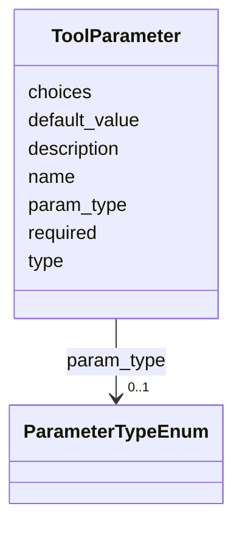

# Class: ToolParameter 


_A configurable parameter for a tool. Supports string, number, boolean, and enum types with optional default values, explicit choices, and schema-defined parameter type references._


URI: [debrief:class/ToolParameter](https://debrief.info/schemas/class/ToolParameter)





<!-- no inheritance hierarchy -->


## Slots

| Name | Cardinality and Range | Description | Inheritance |
| ---  | --- | --- | --- |
| [name](../slots/name.md) | 1 <br/> [String](../types/String.md) | Parameter identifier (kebab-case) | direct |
| [type](../slots/type.md) | 1 <br/> [String](../types/String.md) | Value type discriminator: string, number, boolean, enum | direct |
| [description](../slots/description.md) | 1 <br/> [String](../types/String.md) | Human-readable parameter description | direct |
| [required](../slots/required.md) | 0..1 <br/> [Boolean](../types/Boolean.md) | Whether parameter must be provided | direct |
| [default_value](../slots/default_value.md) | 0..1 <br/> [String](../types/String.md) | Default value if not provided | direct |
| [param_type](../slots/param_type.md) | 0..1 <br/> [ParameterTypeEnum](../enums/ParameterTypeEnum.md) | References a schema-defined parameter-type enum by name | direct |
| [choices](../slots/choices.md) | * <br/> [String](../types/String.md) | Explicit choice list for enum-typed parameters when the client cannot (or cho... | direct |


## Identifier and Mapping Information


### Schema Source


* from schema: https://debrief.info/schemas/debrief


## Mappings

| Mapping Type | Mapped Value |
| ---  | ---  |
| self | debrief:ToolParameter |
| native | debrief:ToolParameter |


## LinkML Source

<!-- TODO: investigate https://stackoverflow.com/questions/37606292/how-to-create-tabbed-code-blocks-in-mkdocs-or-sphinx -->

### Direct

<details>
```yaml
name: ToolParameter
description: A configurable parameter for a tool. Supports string, number, boolean,
  and enum types with optional default values, explicit choices, and schema-defined
  parameter type references.
from_schema: https://debrief.info/schemas/debrief
attributes:
  name:
    name: name
    description: Parameter identifier (kebab-case)
    from_schema: https://debrief.info/schemas/tool
    domain_of:
    - SegmentMetadata
    - SensorData
    - TUAData
    - PointMetadataEntry
    - ReferenceLocationProperties
    - Tool
    - ToolParameter
    - PlatformRecord
    - LevelDefinition
    - DatasetSeries
    - StoryboardProperties
    - MCPToolDefinition
    - ToolDefinition
    range: string
    required: true
  type:
    name: type
    description: 'Value type discriminator: string, number, boolean, enum'
    from_schema: https://debrief.info/schemas/tool
    domain_of:
    - GeoJSONPoint
    - GeoJSONEmptyPoint
    - GeoJSONLineString
    - GeoJSONPolygon
    - GeoJSONMultiPoint
    - GeoJSONMultiLineString
    - GeoJSONMultiPolygon
    - TrackFeature
    - ReferenceLocation
    - SystemState
    - MultiPointFeature
    - MultiPolygonFeature
    - NarrativeEntry
    - CircleAnnotation
    - RectangleAnnotation
    - LineAnnotation
    - TextAnnotation
    - VectorAnnotation
    - PolyAnnotation
    - ToolParameter
    - FileProvEntry
    - RawGeoJSONFeature
    - RawGeoJSONFeatureCollection
    - DatasetAxisMetadata
    - DatasetEntry
    - StoryboardFeature
    - SceneFeature
    - SceneThumbnailAssetEntry
    - MCPContentItem
    - MCPParamSchema
    - ToolsUpdateMessage
    range: string
    required: true
  description:
    name: description
    description: Human-readable parameter description
    from_schema: https://debrief.info/schemas/tool
    domain_of:
    - ReferenceLocationProperties
    - MultiPointFeatureProperties
    - MultiPolygonFeatureProperties
    - Tool
    - ToolParameter
    - LevelDefinition
    - StoryboardProperties
    - SceneProperties
    - MCPParamSchema
    - MCPToolDefinition
    - ToolDefinition
    range: string
    required: true
  required:
    name: required
    description: Whether parameter must be provided
    from_schema: https://debrief.info/schemas/tool
    rank: 1000
    domain_of:
    - ToolParameter
    range: boolean
    required: false
  default_value:
    name: default_value
    description: Default value if not provided
    from_schema: https://debrief.info/schemas/tool
    rank: 1000
    domain_of:
    - ToolParameter
    range: string
    required: false
  param_type:
    name: param_type
    description: References a schema-defined parameter-type enum by name. When set,
      the client resolves enum values from generated types rather than using inline
      choices.
    from_schema: https://debrief.info/schemas/tool
    rank: 1000
    domain_of:
    - ToolParameter
    range: ParameterTypeEnum
    required: false
  choices:
    name: choices
    description: Explicit choice list for enum-typed parameters when the client cannot
      (or chooses not to) resolve a schema-defined `param_type`. Used by both the
      ToolMatch picker (shared/components) and the VS Code activity-panel adapter
      (apps/vscode/src/services/mcpToolAdapter.ts). Added under spec 222 (P2) to collapse
      the drift cluster attributed to ToolParameter (audit §3.2 rows 37 and 86).
    from_schema: https://debrief.info/schemas/tool
    rank: 1000
    domain_of:
    - ToolParameter
    range: string
    required: false
    multivalued: true

```
</details>

### Induced

<details>
```yaml
name: ToolParameter
description: A configurable parameter for a tool. Supports string, number, boolean,
  and enum types with optional default values, explicit choices, and schema-defined
  parameter type references.
from_schema: https://debrief.info/schemas/debrief
attributes:
  name:
    name: name
    description: Parameter identifier (kebab-case)
    from_schema: https://debrief.info/schemas/tool
    alias: name
    owner: ToolParameter
    domain_of:
    - SegmentMetadata
    - SensorData
    - TUAData
    - PointMetadataEntry
    - ReferenceLocationProperties
    - Tool
    - ToolParameter
    - PlatformRecord
    - LevelDefinition
    - DatasetSeries
    - StoryboardProperties
    - MCPToolDefinition
    - ToolDefinition
    range: string
    required: true
  type:
    name: type
    description: 'Value type discriminator: string, number, boolean, enum'
    from_schema: https://debrief.info/schemas/tool
    alias: type
    owner: ToolParameter
    domain_of:
    - GeoJSONPoint
    - GeoJSONEmptyPoint
    - GeoJSONLineString
    - GeoJSONPolygon
    - GeoJSONMultiPoint
    - GeoJSONMultiLineString
    - GeoJSONMultiPolygon
    - TrackFeature
    - ReferenceLocation
    - SystemState
    - MultiPointFeature
    - MultiPolygonFeature
    - NarrativeEntry
    - CircleAnnotation
    - RectangleAnnotation
    - LineAnnotation
    - TextAnnotation
    - VectorAnnotation
    - PolyAnnotation
    - ToolParameter
    - FileProvEntry
    - RawGeoJSONFeature
    - RawGeoJSONFeatureCollection
    - DatasetAxisMetadata
    - DatasetEntry
    - StoryboardFeature
    - SceneFeature
    - SceneThumbnailAssetEntry
    - MCPContentItem
    - MCPParamSchema
    - ToolsUpdateMessage
    range: string
    required: true
  description:
    name: description
    description: Human-readable parameter description
    from_schema: https://debrief.info/schemas/tool
    alias: description
    owner: ToolParameter
    domain_of:
    - ReferenceLocationProperties
    - MultiPointFeatureProperties
    - MultiPolygonFeatureProperties
    - Tool
    - ToolParameter
    - LevelDefinition
    - StoryboardProperties
    - SceneProperties
    - MCPParamSchema
    - MCPToolDefinition
    - ToolDefinition
    range: string
    required: true
  required:
    name: required
    description: Whether parameter must be provided
    from_schema: https://debrief.info/schemas/tool
    rank: 1000
    alias: required
    owner: ToolParameter
    domain_of:
    - ToolParameter
    range: boolean
    required: false
  default_value:
    name: default_value
    description: Default value if not provided
    from_schema: https://debrief.info/schemas/tool
    rank: 1000
    alias: default_value
    owner: ToolParameter
    domain_of:
    - ToolParameter
    range: string
    required: false
  param_type:
    name: param_type
    description: References a schema-defined parameter-type enum by name. When set,
      the client resolves enum values from generated types rather than using inline
      choices.
    from_schema: https://debrief.info/schemas/tool
    rank: 1000
    alias: param_type
    owner: ToolParameter
    domain_of:
    - ToolParameter
    range: ParameterTypeEnum
    required: false
  choices:
    name: choices
    description: Explicit choice list for enum-typed parameters when the client cannot
      (or chooses not to) resolve a schema-defined `param_type`. Used by both the
      ToolMatch picker (shared/components) and the VS Code activity-panel adapter
      (apps/vscode/src/services/mcpToolAdapter.ts). Added under spec 222 (P2) to collapse
      the drift cluster attributed to ToolParameter (audit §3.2 rows 37 and 86).
    from_schema: https://debrief.info/schemas/tool
    rank: 1000
    alias: choices
    owner: ToolParameter
    domain_of:
    - ToolParameter
    range: string
    required: false
    multivalued: true

```
</details>