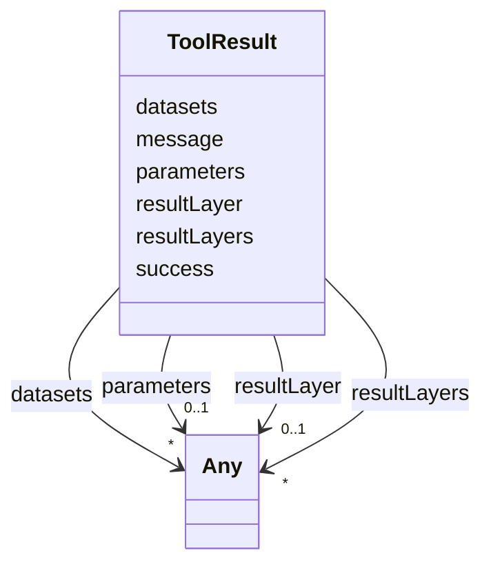

# Class: ToolResult 


_Logical tool invocation result as seen by the consumer (after the MCP layer has unwrapped MCPToolResponse). Closes audit §3.1 row 20. Slot names match `apps/web-shell/src/mocks/calcService.ts` — includes `resultLayer`, `resultLayers`, `parameters`, `datasets` which are free-form per Article XV.2 (their inner shapes are tool-specific)._


URI: [debrief:class/ToolResult](https://debrief.info/schemas/class/ToolResult)





<!-- no inheritance hierarchy -->


## Slots

| Name | Cardinality and Range | Description | Inheritance |
| ---  | --- | --- | --- |
| [success](../slots/success.md) | 1 <br/> [Boolean](../types/Boolean.md) | Whether the tool succeeded | direct |
| [message](../slots/message.md) | 1 <br/> [String](../types/String.md) | Status / explanation message | direct |
| [resultLayer](../slots/resultLayer.md) | 0..1 <br/> [Any](../classes/Any.md) | Optional single result layer (e | direct |
| [resultLayers](../slots/resultLayers.md) | * <br/> [Any](../classes/Any.md) | Optional multiple result layers (e | direct |
| [parameters](../slots/parameters.md) | 0..1 <br/> [Any](../classes/Any.md) | Optional record of operator-tunable parameters and their values (keyed by par... | direct |
| [datasets](../slots/datasets.md) | * <br/> [Any](../classes/Any.md) | Optional dataset results for the Results panel (range-bearing charts, etc) | direct |


## Identifier and Mapping Information


### Schema Source


* from schema: https://debrief.info/schemas/debrief


## Mappings

| Mapping Type | Mapped Value |
| ---  | ---  |
| self | debrief:ToolResult |
| native | debrief:ToolResult |


## LinkML Source

<!-- TODO: investigate https://stackoverflow.com/questions/37606292/how-to-create-tabbed-code-blocks-in-mkdocs-or-sphinx -->

### Direct

<details>
```yaml
name: ToolResult
description: Logical tool invocation result as seen by the consumer (after the MCP
  layer has unwrapped MCPToolResponse). Closes audit §3.1 row 20. Slot names match
  `apps/web-shell/src/mocks/calcService.ts` — includes `resultLayer`, `resultLayers`,
  `parameters`, `datasets` which are free-form per Article XV.2 (their inner shapes
  are tool-specific).
from_schema: https://debrief.info/schemas/debrief
attributes:
  success:
    name: success
    description: Whether the tool succeeded.
    from_schema: https://debrief.info/schemas/mcp
    rank: 1000
    domain_of:
    - ToolResult
    - ToolResultForLog
    - ToolExecutionResultForReplay
    range: boolean
    required: true
  message:
    name: message
    description: Status / explanation message.
    from_schema: https://debrief.info/schemas/mcp
    rank: 1000
    domain_of:
    - ToolResult
    range: string
    required: true
  resultLayer:
    name: resultLayer
    description: Optional single result layer (e.g. bounding-box polygon).
    from_schema: https://debrief.info/schemas/mcp
    rank: 1000
    domain_of:
    - ToolResult
    range: Any
  resultLayers:
    name: resultLayers
    description: Optional multiple result layers (e.g. buffer-zone polygons).
    from_schema: https://debrief.info/schemas/mcp
    rank: 1000
    domain_of:
    - ToolResult
    range: Any
    multivalued: true
  parameters:
    name: parameters
    description: Optional record of operator-tunable parameters and their values (keyed
      by parameter name, values shaped like ToolParameterMeta). Free-form per Article
      XV.2 (a LinkML `inlined_as_dict` of ToolParameterMeta would express it, but
      consumers already build a plain `Record<string, ToolParameterMeta>` and narrow
      on the way out — keeping it free-form preserves the live wire shape).
    from_schema: https://debrief.info/schemas/mcp
    domain_of:
    - WasGeneratedBy
    - ToolResult
    range: Any
  datasets:
    name: datasets
    description: 'Optional dataset results for the Results panel (range-bearing charts,
      etc). Each entry shaped like `{ filename: string, envelope: Record<string, unknown>
      }`.'
    from_schema: https://debrief.info/schemas/mcp
    rank: 1000
    domain_of:
    - ToolResult
    range: Any
    multivalued: true

```
</details>

### Induced

<details>
```yaml
name: ToolResult
description: Logical tool invocation result as seen by the consumer (after the MCP
  layer has unwrapped MCPToolResponse). Closes audit §3.1 row 20. Slot names match
  `apps/web-shell/src/mocks/calcService.ts` — includes `resultLayer`, `resultLayers`,
  `parameters`, `datasets` which are free-form per Article XV.2 (their inner shapes
  are tool-specific).
from_schema: https://debrief.info/schemas/debrief
attributes:
  success:
    name: success
    description: Whether the tool succeeded.
    from_schema: https://debrief.info/schemas/mcp
    rank: 1000
    alias: success
    owner: ToolResult
    domain_of:
    - ToolResult
    - ToolResultForLog
    - ToolExecutionResultForReplay
    range: boolean
    required: true
  message:
    name: message
    description: Status / explanation message.
    from_schema: https://debrief.info/schemas/mcp
    rank: 1000
    alias: message
    owner: ToolResult
    domain_of:
    - ToolResult
    range: string
    required: true
  resultLayer:
    name: resultLayer
    description: Optional single result layer (e.g. bounding-box polygon).
    from_schema: https://debrief.info/schemas/mcp
    rank: 1000
    alias: resultLayer
    owner: ToolResult
    domain_of:
    - ToolResult
    range: Any
  resultLayers:
    name: resultLayers
    description: Optional multiple result layers (e.g. buffer-zone polygons).
    from_schema: https://debrief.info/schemas/mcp
    rank: 1000
    alias: resultLayers
    owner: ToolResult
    domain_of:
    - ToolResult
    range: Any
    multivalued: true
  parameters:
    name: parameters
    description: Optional record of operator-tunable parameters and their values (keyed
      by parameter name, values shaped like ToolParameterMeta). Free-form per Article
      XV.2 (a LinkML `inlined_as_dict` of ToolParameterMeta would express it, but
      consumers already build a plain `Record<string, ToolParameterMeta>` and narrow
      on the way out — keeping it free-form preserves the live wire shape).
    from_schema: https://debrief.info/schemas/mcp
    alias: parameters
    owner: ToolResult
    domain_of:
    - WasGeneratedBy
    - ToolResult
    range: Any
  datasets:
    name: datasets
    description: 'Optional dataset results for the Results panel (range-bearing charts,
      etc). Each entry shaped like `{ filename: string, envelope: Record<string, unknown>
      }`.'
    from_schema: https://debrief.info/schemas/mcp
    rank: 1000
    alias: datasets
    owner: ToolResult
    domain_of:
    - ToolResult
    range: Any
    multivalued: true

```
</details>