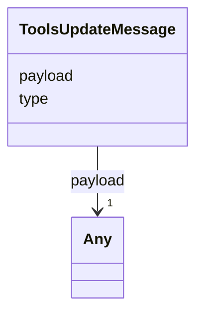

# Class: ToolsUpdateMessage 


_Push notification from the extension host to the activity-panel webview when the tool catalogue changes. Closes audit §3.1 row 28. `payload` is free-form per Article XV.2 — its inner shape `{ tools: ToolsPanelItem[], hasToolInventory?, hasSelection? }` is narrowed at the activity-panel consumer._


URI: [debrief:class/ToolsUpdateMessage](https://debrief.info/schemas/class/ToolsUpdateMessage)





<!-- no inheritance hierarchy -->


## Slots

| Name | Cardinality and Range | Description | Inheritance |
| ---  | --- | --- | --- |
| [type](../slots/type.md) | 1 <br/> [String](../types/String.md) | Discriminator — always the literal `tools:update` | direct |
| [payload](../slots/payload.md) | 1 <br/> [Any](../classes/Any.md) | Nested payload `{ tools, hasToolInventory?, hasSelection? }` | direct |


## Identifier and Mapping Information


### Schema Source


* from schema: https://debrief.info/schemas/debrief


## Mappings

| Mapping Type | Mapped Value |
| ---  | ---  |
| self | debrief:ToolsUpdateMessage |
| native | debrief:ToolsUpdateMessage |


## LinkML Source

<!-- TODO: investigate https://stackoverflow.com/questions/37606292/how-to-create-tabbed-code-blocks-in-mkdocs-or-sphinx -->

### Direct

<details>
```yaml
name: ToolsUpdateMessage
description: 'Push notification from the extension host to the activity-panel webview
  when the tool catalogue changes. Closes audit §3.1 row 28. `payload` is free-form
  per Article XV.2 — its inner shape `{ tools: ToolsPanelItem[], hasToolInventory?,
  hasSelection? }` is narrowed at the activity-panel consumer.'
from_schema: https://debrief.info/schemas/debrief
attributes:
  type:
    name: type
    description: Discriminator — always the literal `tools:update`.
    from_schema: https://debrief.info/schemas/mcp
    domain_of:
    - GeoJSONPoint
    - GeoJSONEmptyPoint
    - GeoJSONLineString
    - GeoJSONPolygon
    - GeoJSONMultiPoint
    - GeoJSONMultiLineString
    - GeoJSONMultiPolygon
    - TrackFeature
    - ReferenceLocation
    - SystemState
    - MultiPointFeature
    - MultiPolygonFeature
    - NarrativeEntry
    - CircleAnnotation
    - RectangleAnnotation
    - LineAnnotation
    - TextAnnotation
    - VectorAnnotation
    - PolyAnnotation
    - ToolParameter
    - FileProvEntry
    - RawGeoJSONFeature
    - RawGeoJSONFeatureCollection
    - DatasetAxisMetadata
    - DatasetEntry
    - StoryboardFeature
    - SceneFeature
    - SceneThumbnailAssetEntry
    - MCPContentItem
    - MCPParamSchema
    - ToolsUpdateMessage
    range: string
    required: true
    equals_string: tools:update
  payload:
    name: payload
    description: Nested payload `{ tools, hasToolInventory?, hasSelection? }`. Free-form
      per Article XV.2.
    from_schema: https://debrief.info/schemas/mcp
    rank: 1000
    domain_of:
    - ToolsUpdateMessage
    range: Any
    required: true

```
</details>

### Induced

<details>
```yaml
name: ToolsUpdateMessage
description: 'Push notification from the extension host to the activity-panel webview
  when the tool catalogue changes. Closes audit §3.1 row 28. `payload` is free-form
  per Article XV.2 — its inner shape `{ tools: ToolsPanelItem[], hasToolInventory?,
  hasSelection? }` is narrowed at the activity-panel consumer.'
from_schema: https://debrief.info/schemas/debrief
attributes:
  type:
    name: type
    description: Discriminator — always the literal `tools:update`.
    from_schema: https://debrief.info/schemas/mcp
    alias: type
    owner: ToolsUpdateMessage
    domain_of:
    - GeoJSONPoint
    - GeoJSONEmptyPoint
    - GeoJSONLineString
    - GeoJSONPolygon
    - GeoJSONMultiPoint
    - GeoJSONMultiLineString
    - GeoJSONMultiPolygon
    - TrackFeature
    - ReferenceLocation
    - SystemState
    - MultiPointFeature
    - MultiPolygonFeature
    - NarrativeEntry
    - CircleAnnotation
    - RectangleAnnotation
    - LineAnnotation
    - TextAnnotation
    - VectorAnnotation
    - PolyAnnotation
    - ToolParameter
    - FileProvEntry
    - RawGeoJSONFeature
    - RawGeoJSONFeatureCollection
    - DatasetAxisMetadata
    - DatasetEntry
    - StoryboardFeature
    - SceneFeature
    - SceneThumbnailAssetEntry
    - MCPContentItem
    - MCPParamSchema
    - ToolsUpdateMessage
    range: string
    required: true
    equals_string: tools:update
  payload:
    name: payload
    description: Nested payload `{ tools, hasToolInventory?, hasSelection? }`. Free-form
      per Article XV.2.
    from_schema: https://debrief.info/schemas/mcp
    rank: 1000
    alias: payload
    owner: ToolsUpdateMessage
    domain_of:
    - ToolsUpdateMessage
    range: Any
    required: true

```
</details>