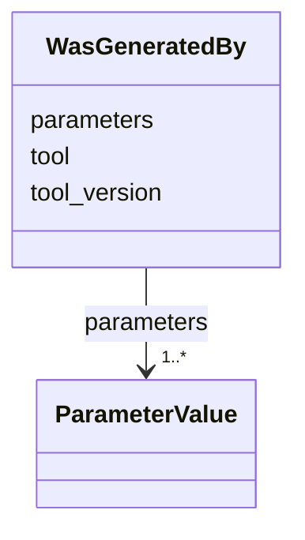

# Class: WasGeneratedBy 


_Identifies the tool and its parameters for a specific invocation. Named after the W3C PROV vocabulary term._


URI: [debrief:class/WasGeneratedBy](https://debrief.info/schemas/class/WasGeneratedBy)





<!-- no inheritance hierarchy -->


## Slots

| Name | Cardinality and Range | Description | Inheritance |
| ---  | --- | --- | --- |
| [tool](../slots/tool.md) | 1 <br/> [String](../types/String.md) | Tool identifier (kebab-case, e | direct |
| [tool_version](../slots/tool_version.md) | 1 <br/> [String](../types/String.md) | Semantic version of the tool (e | direct |
| [parameters](../slots/parameters.md) | 1..* <br/> [ParameterValue](../classes/ParameterValue.md) | Full resolved parameter set | direct |


## Usages

| used by | used in | type | used |
| ---  | --- | --- | --- |
| [LogEntry](../classes/LogEntry.md) | [was_generated_by](../slots/was_generated_by.md) | range | [WasGeneratedBy](../classes/WasGeneratedBy.md) |


## Identifier and Mapping Information


### Schema Source


* from schema: https://debrief.info/schemas/debrief


## Mappings

| Mapping Type | Mapped Value |
| ---  | ---  |
| self | debrief:WasGeneratedBy |
| native | debrief:WasGeneratedBy |


## LinkML Source

<!-- TODO: investigate https://stackoverflow.com/questions/37606292/how-to-create-tabbed-code-blocks-in-mkdocs-or-sphinx -->

### Direct

<details>
```yaml
name: WasGeneratedBy
description: Identifies the tool and its parameters for a specific invocation. Named
  after the W3C PROV vocabulary term.
from_schema: https://debrief.info/schemas/debrief
attributes:
  tool:
    name: tool
    description: Tool identifier (kebab-case, e.g., calculate-range).
    from_schema: https://debrief.info/schemas/log-entry
    rank: 1000
    domain_of:
    - WasGeneratedBy
    - PropertiesProvenanceEntry
    - MCPRequest
    range: string
    required: true
  tool_version:
    name: tool_version
    description: Semantic version of the tool (e.g., 1.2.0).
    from_schema: https://debrief.info/schemas/log-entry
    rank: 1000
    domain_of:
    - WasGeneratedBy
    - ToolExecutionResultForReplay
    range: string
    required: true
  parameters:
    name: parameters
    description: Full resolved parameter set. Keys are parameter names, values are
      ParameterValue objects. May be empty dict.
    from_schema: https://debrief.info/schemas/log-entry
    rank: 1000
    domain_of:
    - WasGeneratedBy
    - ToolResult
    range: ParameterValue
    required: true
    multivalued: true
    inlined: true

```
</details>

### Induced

<details>
```yaml
name: WasGeneratedBy
description: Identifies the tool and its parameters for a specific invocation. Named
  after the W3C PROV vocabulary term.
from_schema: https://debrief.info/schemas/debrief
attributes:
  tool:
    name: tool
    description: Tool identifier (kebab-case, e.g., calculate-range).
    from_schema: https://debrief.info/schemas/log-entry
    rank: 1000
    alias: tool
    owner: WasGeneratedBy
    domain_of:
    - WasGeneratedBy
    - PropertiesProvenanceEntry
    - MCPRequest
    range: string
    required: true
  tool_version:
    name: tool_version
    description: Semantic version of the tool (e.g., 1.2.0).
    from_schema: https://debrief.info/schemas/log-entry
    rank: 1000
    alias: tool_version
    owner: WasGeneratedBy
    domain_of:
    - WasGeneratedBy
    - ToolExecutionResultForReplay
    range: string
    required: true
  parameters:
    name: parameters
    description: Full resolved parameter set. Keys are parameter names, values are
      ParameterValue objects. May be empty dict.
    from_schema: https://debrief.info/schemas/log-entry
    rank: 1000
    alias: parameters
    owner: WasGeneratedBy
    domain_of:
    - WasGeneratedBy
    - ToolResult
    range: ParameterValue
    required: true
    multivalued: true
    inlined: true

```
</details>