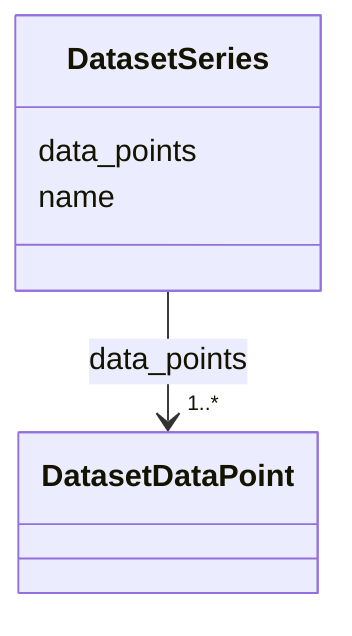

# Class: DatasetSeries 


_A named data series within a multi-series dataset. Replaces the earlier float[] data field with a list of structured DatasetDataPoint records to match the runtime DataSeries shape from shared/components/src/ChartRenderer/types.ts (Record<string, unknown>[])._

__


URI: [debrief:class/DatasetSeries](https://debrief.info/schemas/class/DatasetSeries)





<!-- no inheritance hierarchy -->


## Slots

| Name | Cardinality and Range | Description | Inheritance |
| ---  | --- | --- | --- |
| [name](../slots/name.md) | 1 <br/> [String](../types/String.md) | Series display name (shown in chart legend) | direct |
| [data_points](../slots/data_points.md) | 1..* <br/> [DatasetDataPoint](../classes/DatasetDataPoint.md) | Array of structured data records for this series | direct |


## Usages

| used by | used in | type | used |
| ---  | --- | --- | --- |
| [DatasetEntry](../classes/DatasetEntry.md) | [series](../slots/series.md) | range | [DatasetSeries](../classes/DatasetSeries.md) |


## Identifier and Mapping Information


### Schema Source


* from schema: https://debrief.info/schemas/debrief


## Mappings

| Mapping Type | Mapped Value |
| ---  | ---  |
| self | debrief:DatasetSeries |
| native | debrief:DatasetSeries |


## LinkML Source

<!-- TODO: investigate https://stackoverflow.com/questions/37606292/how-to-create-tabbed-code-blocks-in-mkdocs-or-sphinx -->

### Direct

<details>
```yaml
name: DatasetSeries
description: 'A named data series within a multi-series dataset. Replaces the earlier
  float[] data field with a list of structured DatasetDataPoint records to match the
  runtime DataSeries shape from shared/components/src/ChartRenderer/types.ts (Record<string,
  unknown>[]).

  '
from_schema: https://debrief.info/schemas/debrief
attributes:
  name:
    name: name
    description: Series display name (shown in chart legend)
    from_schema: https://debrief.com/schemas/tool-result
    domain_of:
    - SegmentMetadata
    - SensorData
    - TUAData
    - PointMetadataEntry
    - ReferenceLocationProperties
    - Tool
    - ToolParameter
    - PlatformRecord
    - StacProvider
    - LevelDefinition
    - DatasetSeries
    - StoryboardProperties
    - MCPToolDefinition
    - ToolDefinition
    range: string
    required: true
  data_points:
    name: data_points
    description: 'Array of structured data records for this series. Each record carries
      open x/y/domain fields; see DatasetDataPoint.

      '
    from_schema: https://debrief.com/schemas/tool-result
    rank: 1000
    domain_of:
    - DatasetSeries
    - DatasetEntry
    range: DatasetDataPoint
    required: true
    multivalued: true
    inlined: true
    inlined_as_list: true

```
</details>

### Induced

<details>
```yaml
name: DatasetSeries
description: 'A named data series within a multi-series dataset. Replaces the earlier
  float[] data field with a list of structured DatasetDataPoint records to match the
  runtime DataSeries shape from shared/components/src/ChartRenderer/types.ts (Record<string,
  unknown>[]).

  '
from_schema: https://debrief.info/schemas/debrief
attributes:
  name:
    name: name
    description: Series display name (shown in chart legend)
    from_schema: https://debrief.com/schemas/tool-result
    alias: name
    owner: DatasetSeries
    domain_of:
    - SegmentMetadata
    - SensorData
    - TUAData
    - PointMetadataEntry
    - ReferenceLocationProperties
    - Tool
    - ToolParameter
    - PlatformRecord
    - StacProvider
    - LevelDefinition
    - DatasetSeries
    - StoryboardProperties
    - MCPToolDefinition
    - ToolDefinition
    range: string
    required: true
  data_points:
    name: data_points
    description: 'Array of structured data records for this series. Each record carries
      open x/y/domain fields; see DatasetDataPoint.

      '
    from_schema: https://debrief.com/schemas/tool-result
    rank: 1000
    alias: data_points
    owner: DatasetSeries
    domain_of:
    - DatasetSeries
    - DatasetEntry
    range: DatasetDataPoint
    required: true
    multivalued: true
    inlined: true
    inlined_as_list: true

```
</details>