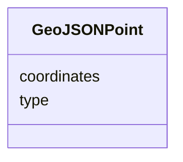

# Class: GeoJSONPoint 


_GeoJSON Point geometry_


URI: [debrief:class/GeoJSONPoint](https://debrief.info/schemas/class/GeoJSONPoint)





<!-- no inheritance hierarchy -->


## Slots

| Name | Cardinality and Range | Description | Inheritance |
| ---  | --- | --- | --- |
| [type](../slots/type.md) | 1 <br/> [String](../types/String.md) | Geometry type discriminator | direct |
| [coordinates](../slots/coordinates.md) | 1..* <br/> [Float](../types/Float.md) | [longitude, latitude] in degrees | direct |


## Usages

| used by | used in | type | used |
| ---  | --- | --- | --- |
| [ReferenceLocation](../classes/ReferenceLocation.md) | [geometry](../slots/geometry.md) | any_of[range] | [GeoJSONPoint](../classes/GeoJSONPoint.md) |
| [NarrativeEntry](../classes/NarrativeEntry.md) | [geometry](../slots/geometry.md) | range | [GeoJSONPoint](../classes/GeoJSONPoint.md) |
| [TextAnnotation](../classes/TextAnnotation.md) | [geometry](../slots/geometry.md) | range | [GeoJSONPoint](../classes/GeoJSONPoint.md) |
| [StacItem](../classes/StacItem.md) | [geometry](../slots/geometry.md) | any_of[range] | [GeoJSONPoint](../classes/GeoJSONPoint.md) |
| [RawGeoJSONFeature](../classes/RawGeoJSONFeature.md) | [geometry](../slots/geometry.md) | any_of[range] | [GeoJSONPoint](../classes/GeoJSONPoint.md) |


## Identifier and Mapping Information


### Schema Source


* from schema: https://debrief.info/schemas/debrief


## Mappings

| Mapping Type | Mapped Value |
| ---  | ---  |
| self | debrief:GeoJSONPoint |
| native | debrief:GeoJSONPoint |


## LinkML Source

<!-- TODO: investigate https://stackoverflow.com/questions/37606292/how-to-create-tabbed-code-blocks-in-mkdocs-or-sphinx -->

### Direct

<details>
```yaml
name: GeoJSONPoint
description: GeoJSON Point geometry
from_schema: https://debrief.info/schemas/debrief
attributes:
  type:
    name: type
    description: Geometry type discriminator
    from_schema: https://debrief.info/schemas/geojson
    rank: 1000
    domain_of:
    - GeoJSONPoint
    - GeoJSONEmptyPoint
    - GeoJSONLineString
    - GeoJSONPolygon
    - GeoJSONMultiPoint
    - GeoJSONMultiLineString
    - GeoJSONMultiPolygon
    - TrackFeature
    - ReferenceLocation
    - SystemState
    - MultiPointFeature
    - MultiPolygonFeature
    - NarrativeEntry
    - CircleAnnotation
    - RectangleAnnotation
    - LineAnnotation
    - TextAnnotation
    - VectorAnnotation
    - PolyAnnotation
    - ToolParameter
    - FileProvEntry
    - StacItem
    - StacCatalog
    - StacLink
    - StacAsset
    - StacItemAssetDefinition
    - StacCollection
    - RawGeoJSONFeature
    - RawGeoJSONFeatureCollection
    - DatasetAxisMetadata
    - DatasetEntry
    - StoryboardFeature
    - SceneFeature
    - SceneThumbnailAssetEntry
    - MCPContentItem
    - MCPParamSchema
    - ToolsUpdateMessage
    range: string
    required: true
    equals_string: Point
  coordinates:
    name: coordinates
    description: '[longitude, latitude] in degrees'
    from_schema: https://debrief.info/schemas/geojson
    rank: 1000
    domain_of:
    - GeoJSONPoint
    - GeoJSONEmptyPoint
    - GeoJSONLineString
    - GeoJSONPolygon
    - GeoJSONMultiPoint
    - GeoJSONMultiLineString
    - GeoJSONMultiPolygon
    - ViewportPolygon
    range: float
    required: true
    multivalued: true
    minimum_cardinality: 2
    maximum_cardinality: 2

```
</details>

### Induced

<details>
```yaml
name: GeoJSONPoint
description: GeoJSON Point geometry
from_schema: https://debrief.info/schemas/debrief
attributes:
  type:
    name: type
    description: Geometry type discriminator
    from_schema: https://debrief.info/schemas/geojson
    rank: 1000
    alias: type
    owner: GeoJSONPoint
    domain_of:
    - GeoJSONPoint
    - GeoJSONEmptyPoint
    - GeoJSONLineString
    - GeoJSONPolygon
    - GeoJSONMultiPoint
    - GeoJSONMultiLineString
    - GeoJSONMultiPolygon
    - TrackFeature
    - ReferenceLocation
    - SystemState
    - MultiPointFeature
    - MultiPolygonFeature
    - NarrativeEntry
    - CircleAnnotation
    - RectangleAnnotation
    - LineAnnotation
    - TextAnnotation
    - VectorAnnotation
    - PolyAnnotation
    - ToolParameter
    - FileProvEntry
    - StacItem
    - StacCatalog
    - StacLink
    - StacAsset
    - StacItemAssetDefinition
    - StacCollection
    - RawGeoJSONFeature
    - RawGeoJSONFeatureCollection
    - DatasetAxisMetadata
    - DatasetEntry
    - StoryboardFeature
    - SceneFeature
    - SceneThumbnailAssetEntry
    - MCPContentItem
    - MCPParamSchema
    - ToolsUpdateMessage
    range: string
    required: true
    equals_string: Point
  coordinates:
    name: coordinates
    description: '[longitude, latitude] in degrees'
    from_schema: https://debrief.info/schemas/geojson
    rank: 1000
    alias: coordinates
    owner: GeoJSONPoint
    domain_of:
    - GeoJSONPoint
    - GeoJSONEmptyPoint
    - GeoJSONLineString
    - GeoJSONPolygon
    - GeoJSONMultiPoint
    - GeoJSONMultiLineString
    - GeoJSONMultiPolygon
    - ViewportPolygon
    range: float
    required: true
    multivalued: true
    minimum_cardinality: 2
    maximum_cardinality: 2

```
</details>