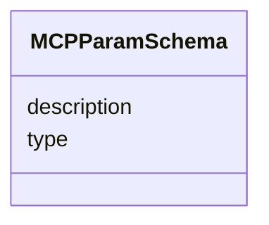

# Class: MCPParamSchema 


_JSON-Schema-like parameter fragment used inside MCPToolDefinition.input_schema. Closes audit §3.1 rows 1 and 27 (two-site drift). Open at the wire level — consumers narrow with additional fields (`enum`, `default`, `x-debrief-param-type`) via intersection in the local adapter modules._


URI: [debrief:class/MCPParamSchema](https://debrief.info/schemas/class/MCPParamSchema)





<!-- no inheritance hierarchy -->


## Slots

| Name | Cardinality and Range | Description | Inheritance |
| ---  | --- | --- | --- |
| [type](../slots/type.md) | 0..1 <br/> [String](../types/String.md) | JSON-Schema primitive type (string / number / integer / boolean / array / obj... | direct |
| [description](../slots/description.md) | 0..1 <br/> [String](../types/String.md) | Human-readable parameter description | direct |


## Identifier and Mapping Information


### Schema Source


* from schema: https://debrief.info/schemas/debrief


## Mappings

| Mapping Type | Mapped Value |
| ---  | ---  |
| self | debrief:MCPParamSchema |
| native | debrief:MCPParamSchema |


## LinkML Source

<!-- TODO: investigate https://stackoverflow.com/questions/37606292/how-to-create-tabbed-code-blocks-in-mkdocs-or-sphinx -->

### Direct

<details>
```yaml
name: MCPParamSchema
description: JSON-Schema-like parameter fragment used inside MCPToolDefinition.input_schema.
  Closes audit §3.1 rows 1 and 27 (two-site drift). Open at the wire level — consumers
  narrow with additional fields (`enum`, `default`, `x-debrief-param-type`) via intersection
  in the local adapter modules.
from_schema: https://debrief.info/schemas/debrief
attributes:
  type:
    name: type
    description: JSON-Schema primitive type (string / number / integer / boolean /
      array / object).
    from_schema: https://debrief.info/schemas/mcp
    domain_of:
    - GeoJSONPoint
    - GeoJSONEmptyPoint
    - GeoJSONLineString
    - GeoJSONPolygon
    - GeoJSONMultiPoint
    - GeoJSONMultiLineString
    - GeoJSONMultiPolygon
    - TrackFeature
    - ReferenceLocation
    - SystemState
    - MultiPointFeature
    - MultiPolygonFeature
    - NarrativeEntry
    - CircleAnnotation
    - RectangleAnnotation
    - LineAnnotation
    - TextAnnotation
    - VectorAnnotation
    - PolyAnnotation
    - ToolParameter
    - FileProvEntry
    - StacItem
    - StacCatalog
    - StacLink
    - StacAsset
    - StacItemAssetDefinition
    - StacCollection
    - RawGeoJSONFeature
    - RawGeoJSONFeatureCollection
    - DatasetAxisMetadata
    - DatasetEntry
    - StoryboardFeature
    - SceneFeature
    - SceneThumbnailAssetEntry
    - MCPContentItem
    - MCPParamSchema
    - ToolsUpdateMessage
    range: string
  description:
    name: description
    description: Human-readable parameter description.
    from_schema: https://debrief.info/schemas/mcp
    domain_of:
    - ReferenceLocationProperties
    - MultiPointFeatureProperties
    - MultiPolygonFeatureProperties
    - Tool
    - ToolParameter
    - StacProvider
    - StacItemProperties
    - StacCatalog
    - StacAsset
    - StacItemAssetDefinition
    - StacCollection
    - LevelDefinition
    - StoryboardProperties
    - SceneProperties
    - MCPParamSchema
    - MCPToolDefinition
    - ToolDefinition
    range: string

```
</details>

### Induced

<details>
```yaml
name: MCPParamSchema
description: JSON-Schema-like parameter fragment used inside MCPToolDefinition.input_schema.
  Closes audit §3.1 rows 1 and 27 (two-site drift). Open at the wire level — consumers
  narrow with additional fields (`enum`, `default`, `x-debrief-param-type`) via intersection
  in the local adapter modules.
from_schema: https://debrief.info/schemas/debrief
attributes:
  type:
    name: type
    description: JSON-Schema primitive type (string / number / integer / boolean /
      array / object).
    from_schema: https://debrief.info/schemas/mcp
    alias: type
    owner: MCPParamSchema
    domain_of:
    - GeoJSONPoint
    - GeoJSONEmptyPoint
    - GeoJSONLineString
    - GeoJSONPolygon
    - GeoJSONMultiPoint
    - GeoJSONMultiLineString
    - GeoJSONMultiPolygon
    - TrackFeature
    - ReferenceLocation
    - SystemState
    - MultiPointFeature
    - MultiPolygonFeature
    - NarrativeEntry
    - CircleAnnotation
    - RectangleAnnotation
    - LineAnnotation
    - TextAnnotation
    - VectorAnnotation
    - PolyAnnotation
    - ToolParameter
    - FileProvEntry
    - StacItem
    - StacCatalog
    - StacLink
    - StacAsset
    - StacItemAssetDefinition
    - StacCollection
    - RawGeoJSONFeature
    - RawGeoJSONFeatureCollection
    - DatasetAxisMetadata
    - DatasetEntry
    - StoryboardFeature
    - SceneFeature
    - SceneThumbnailAssetEntry
    - MCPContentItem
    - MCPParamSchema
    - ToolsUpdateMessage
    range: string
  description:
    name: description
    description: Human-readable parameter description.
    from_schema: https://debrief.info/schemas/mcp
    alias: description
    owner: MCPParamSchema
    domain_of:
    - ReferenceLocationProperties
    - MultiPointFeatureProperties
    - MultiPolygonFeatureProperties
    - Tool
    - ToolParameter
    - StacProvider
    - StacItemProperties
    - StacCatalog
    - StacAsset
    - StacItemAssetDefinition
    - StacCollection
    - LevelDefinition
    - StoryboardProperties
    - SceneProperties
    - MCPParamSchema
    - MCPToolDefinition
    - ToolDefinition
    range: string

```
</details>