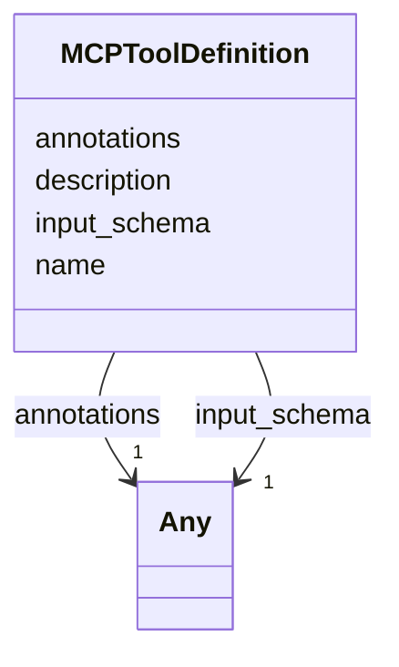

# Class: MCPToolDefinition 


_Static catalogue entry advertised by the MCP server. Closes audit §3.1 row 19. `input_schema` and `annotations` are free-form per Article XV.2 — `input_schema` is a JSON-Schema fragment and `annotations` carries open-ended `debrief:*` keys (colons in key names cannot be slot-modelled)._


URI: [debrief:class/MCPToolDefinition](https://debrief.info/schemas/class/MCPToolDefinition)





<!-- no inheritance hierarchy -->


## Slots

| Name | Cardinality and Range | Description | Inheritance |
| ---  | --- | --- | --- |
| [name](../slots/name.md) | 1 <br/> [String](../types/String.md) | Tool identifier | direct |
| [description](../slots/description.md) | 1 <br/> [String](../types/String.md) | Human-readable tool description | direct |
| [input_schema](../slots/input_schema.md) | 1 <br/> [Any](../classes/Any.md) | JSON-Schema fragment describing the tool's input payload | direct |
| [annotations](../slots/annotations.md) | 1 <br/> [Any](../classes/Any.md) | Debrief-specific annotations (`debrief:selectionRequirements`, `debrief:categ... | direct |


## Identifier and Mapping Information


### Schema Source


* from schema: https://debrief.info/schemas/debrief


## Mappings

| Mapping Type | Mapped Value |
| ---  | ---  |
| self | debrief:MCPToolDefinition |
| native | debrief:MCPToolDefinition |


## LinkML Source

<!-- TODO: investigate https://stackoverflow.com/questions/37606292/how-to-create-tabbed-code-blocks-in-mkdocs-or-sphinx -->

### Direct

<details>
```yaml
name: MCPToolDefinition
description: Static catalogue entry advertised by the MCP server. Closes audit §3.1
  row 19. `input_schema` and `annotations` are free-form per Article XV.2 — `input_schema`
  is a JSON-Schema fragment and `annotations` carries open-ended `debrief:*` keys
  (colons in key names cannot be slot-modelled).
from_schema: https://debrief.info/schemas/debrief
attributes:
  name:
    name: name
    description: Tool identifier.
    from_schema: https://debrief.info/schemas/mcp
    domain_of:
    - SegmentMetadata
    - SensorData
    - TUAData
    - PointMetadataEntry
    - ReferenceLocationProperties
    - Tool
    - ToolParameter
    - PlatformRecord
    - StacProvider
    - LevelDefinition
    - DatasetSeries
    - StoryboardProperties
    - MCPToolDefinition
    - ToolDefinition
    range: string
    required: true
  description:
    name: description
    description: Human-readable tool description.
    from_schema: https://debrief.info/schemas/mcp
    domain_of:
    - ReferenceLocationProperties
    - MultiPointFeatureProperties
    - MultiPolygonFeatureProperties
    - Tool
    - ToolParameter
    - StacProvider
    - StacItemProperties
    - StacCatalog
    - StacAsset
    - StacItemAssetDefinition
    - StacCollection
    - LevelDefinition
    - StoryboardProperties
    - SceneProperties
    - MCPParamSchema
    - MCPToolDefinition
    - ToolDefinition
    range: string
    required: true
  input_schema:
    name: input_schema
    description: JSON-Schema fragment describing the tool's input payload. Free-form
      per Article XV.2 — consumers narrow at point of use.
    from_schema: https://debrief.info/schemas/mcp
    rank: 1000
    domain_of:
    - MCPToolDefinition
    range: Any
    required: true
  annotations:
    name: annotations
    description: Debrief-specific annotations (`debrief:selectionRequirements`, `debrief:category`,
      `debrief:version`, `debrief:outputKind`, `debrief:uiCategory`). Free-form per
      Article XV.2.
    from_schema: https://debrief.info/schemas/mcp
    domain_of:
    - MCPContentItem
    - MCPToolDefinition
    range: Any
    required: true

```
</details>

### Induced

<details>
```yaml
name: MCPToolDefinition
description: Static catalogue entry advertised by the MCP server. Closes audit §3.1
  row 19. `input_schema` and `annotations` are free-form per Article XV.2 — `input_schema`
  is a JSON-Schema fragment and `annotations` carries open-ended `debrief:*` keys
  (colons in key names cannot be slot-modelled).
from_schema: https://debrief.info/schemas/debrief
attributes:
  name:
    name: name
    description: Tool identifier.
    from_schema: https://debrief.info/schemas/mcp
    alias: name
    owner: MCPToolDefinition
    domain_of:
    - SegmentMetadata
    - SensorData
    - TUAData
    - PointMetadataEntry
    - ReferenceLocationProperties
    - Tool
    - ToolParameter
    - PlatformRecord
    - StacProvider
    - LevelDefinition
    - DatasetSeries
    - StoryboardProperties
    - MCPToolDefinition
    - ToolDefinition
    range: string
    required: true
  description:
    name: description
    description: Human-readable tool description.
    from_schema: https://debrief.info/schemas/mcp
    alias: description
    owner: MCPToolDefinition
    domain_of:
    - ReferenceLocationProperties
    - MultiPointFeatureProperties
    - MultiPolygonFeatureProperties
    - Tool
    - ToolParameter
    - StacProvider
    - StacItemProperties
    - StacCatalog
    - StacAsset
    - StacItemAssetDefinition
    - StacCollection
    - LevelDefinition
    - StoryboardProperties
    - SceneProperties
    - MCPParamSchema
    - MCPToolDefinition
    - ToolDefinition
    range: string
    required: true
  input_schema:
    name: input_schema
    description: JSON-Schema fragment describing the tool's input payload. Free-form
      per Article XV.2 — consumers narrow at point of use.
    from_schema: https://debrief.info/schemas/mcp
    rank: 1000
    alias: input_schema
    owner: MCPToolDefinition
    domain_of:
    - MCPToolDefinition
    range: Any
    required: true
  annotations:
    name: annotations
    description: Debrief-specific annotations (`debrief:selectionRequirements`, `debrief:category`,
      `debrief:version`, `debrief:outputKind`, `debrief:uiCategory`). Free-form per
      Article XV.2.
    from_schema: https://debrief.info/schemas/mcp
    alias: annotations
    owner: MCPToolDefinition
    domain_of:
    - MCPContentItem
    - MCPToolDefinition
    range: Any
    required: true

```
</details>