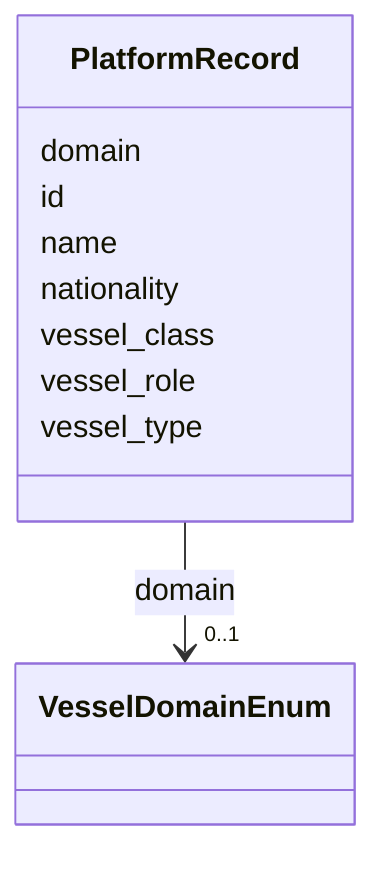

# Class: PlatformRecord 


_Fully-resolved metadata for a single platform within a STAC item. Produced by save-time resolution merging registry lookups with analyst overrides. Only id is required; all other fields may be absent for unregistered platforms._

__


URI: [debrief:class/PlatformRecord](https://debrief.info/schemas/class/PlatformRecord)





<!-- no inheritance hierarchy -->


## Slots

| Name | Cardinality and Range | Description | Inheritance |
| ---  | --- | --- | --- |
| [id](../slots/id.md) | 1 <br/> [String](../types/String.md) | Platform identifier (e | direct |
| [name](../slots/name.md) | 0..1 <br/> [String](../types/String.md) | Human-readable platform name (e | direct |
| [nationality](../slots/nationality.md) | 0..1 <br/> [String](../types/String.md) | ISO 3166-1 alpha-2 country code (e | direct |
| [vessel_class](../slots/vessel_class.md) | 0..1 <br/> [String](../types/String.md) | Full vessel classification path using slash-separated notation (e | direct |
| [vessel_type](../slots/vessel_type.md) | 0..1 <br/> [String](../types/String.md) | Vessel type — leaf of classification path (e | direct |
| [vessel_role](../slots/vessel_role.md) | 0..1 <br/> [String](../types/String.md) | Vessel role — parent of leaf in classification path (e | direct |
| [domain](../slots/domain.md) | 0..1 <br/> [VesselDomainEnum](../enums/VesselDomainEnum.md) | Top-level vessel domain classification | direct |


## Usages

| used by | used in | type | used |
| ---  | --- | --- | --- |
| [StacExtensionProperties](../classes/StacExtensionProperties.md) | [platforms](../slots/platforms.md) | range | [PlatformRecord](../classes/PlatformRecord.md) |
| [StacItemSummary](../classes/StacItemSummary.md) | [platforms](../slots/platforms.md) | range | [PlatformRecord](../classes/PlatformRecord.md) |
| [StacItemProperties](../classes/StacItemProperties.md) | [platforms](../slots/platforms.md) | range | [PlatformRecord](../classes/PlatformRecord.md) |
| [StacSummaries](../classes/StacSummaries.md) | [debrief_platforms](../slots/debrief_platforms.md) | range | [PlatformRecord](../classes/PlatformRecord.md) |


## Identifier and Mapping Information


### Schema Source


* from schema: https://debrief.info/schemas/debrief


## Mappings

| Mapping Type | Mapped Value |
| ---  | ---  |
| self | debrief:PlatformRecord |
| native | debrief:PlatformRecord |


## LinkML Source

<!-- TODO: investigate https://stackoverflow.com/questions/37606292/how-to-create-tabbed-code-blocks-in-mkdocs-or-sphinx -->

### Direct

<details>
```yaml
name: PlatformRecord
description: 'Fully-resolved metadata for a single platform within a STAC item. Produced
  by save-time resolution merging registry lookups with analyst overrides. Only id
  is required; all other fields may be absent for unregistered platforms.

  '
from_schema: https://debrief.info/schemas/debrief
attributes:
  id:
    name: id
    description: Platform identifier (e.g., "NELSON"). Matches platform_id on TrackProperties.
    from_schema: https://debrief.info/schemas/stac-extension
    domain_of:
    - TrackFeature
    - ReferenceLocation
    - SystemState
    - MultiPointFeature
    - MultiPolygonFeature
    - NarrativeEntry
    - CircleAnnotation
    - RectangleAnnotation
    - LineAnnotation
    - TextAnnotation
    - VectorAnnotation
    - PolyAnnotation
    - Tool
    - PlatformRecord
    - PlotSummary
    - StacItemSummary
    - StacItem
    - StacCatalog
    - StacCollection
    - RawGeoJSONFeature
    - StoryboardProperties
    - SceneProperties
    - StoryboardFeature
    - SceneFeature
    - ToolDefinition
    required: true
  name:
    name: name
    description: Human-readable platform name (e.g., "HMS Nelson")
    from_schema: https://debrief.info/schemas/stac-extension
    domain_of:
    - SegmentMetadata
    - SensorData
    - TUAData
    - PointMetadataEntry
    - ReferenceLocationProperties
    - Tool
    - ToolParameter
    - PlatformRecord
    - StacProvider
    - LevelDefinition
    - DatasetSeries
    - StoryboardProperties
    - MCPToolDefinition
    - ToolDefinition
    required: false
  nationality:
    name: nationality
    description: ISO 3166-1 alpha-2 country code (e.g., GB, US)
    from_schema: https://debrief.info/schemas/stac-extension
    domain_of:
    - TrackProperties
    - PlatformRecord
    required: false
    pattern: ^[A-Z]{2}$
  vessel_class:
    name: vessel_class
    description: 'Full vessel classification path using slash-separated notation (e.g.,
      surface/warship/frigate/type23).

      '
    from_schema: https://debrief.info/schemas/stac-extension
    domain_of:
    - TrackProperties
    - PlatformRecord
    required: false
    pattern: ^[a-z0-9-]+(/[a-z0-9-]+){0,3}$
  vessel_type:
    name: vessel_type
    description: Vessel type — leaf of classification path (e.g., type23)
    from_schema: https://debrief.info/schemas/stac-extension
    domain_of:
    - TrackProperties
    - PlatformRecord
    required: false
    pattern: ^[a-z0-9-]+$
  vessel_role:
    name: vessel_role
    description: Vessel role — parent of leaf in classification path (e.g., frigate)
    from_schema: https://debrief.info/schemas/stac-extension
    domain_of:
    - TrackProperties
    - PlatformRecord
    required: false
    pattern: ^[a-z0-9-]+$
  domain:
    name: domain
    description: Top-level vessel domain classification
    from_schema: https://debrief.info/schemas/stac-extension
    domain_of:
    - TrackProperties
    - PlatformRecord
    range: VesselDomainEnum
    required: false

```
</details>

### Induced

<details>
```yaml
name: PlatformRecord
description: 'Fully-resolved metadata for a single platform within a STAC item. Produced
  by save-time resolution merging registry lookups with analyst overrides. Only id
  is required; all other fields may be absent for unregistered platforms.

  '
from_schema: https://debrief.info/schemas/debrief
attributes:
  id:
    name: id
    description: Platform identifier (e.g., "NELSON"). Matches platform_id on TrackProperties.
    from_schema: https://debrief.info/schemas/stac-extension
    alias: id
    owner: PlatformRecord
    domain_of:
    - TrackFeature
    - ReferenceLocation
    - SystemState
    - MultiPointFeature
    - MultiPolygonFeature
    - NarrativeEntry
    - CircleAnnotation
    - RectangleAnnotation
    - LineAnnotation
    - TextAnnotation
    - VectorAnnotation
    - PolyAnnotation
    - Tool
    - PlatformRecord
    - PlotSummary
    - StacItemSummary
    - StacItem
    - StacCatalog
    - StacCollection
    - RawGeoJSONFeature
    - StoryboardProperties
    - SceneProperties
    - StoryboardFeature
    - SceneFeature
    - ToolDefinition
    range: string
    required: true
  name:
    name: name
    description: Human-readable platform name (e.g., "HMS Nelson")
    from_schema: https://debrief.info/schemas/stac-extension
    alias: name
    owner: PlatformRecord
    domain_of:
    - SegmentMetadata
    - SensorData
    - TUAData
    - PointMetadataEntry
    - ReferenceLocationProperties
    - Tool
    - ToolParameter
    - PlatformRecord
    - StacProvider
    - LevelDefinition
    - DatasetSeries
    - StoryboardProperties
    - MCPToolDefinition
    - ToolDefinition
    range: string
    required: false
  nationality:
    name: nationality
    description: ISO 3166-1 alpha-2 country code (e.g., GB, US)
    from_schema: https://debrief.info/schemas/stac-extension
    alias: nationality
    owner: PlatformRecord
    domain_of:
    - TrackProperties
    - PlatformRecord
    range: string
    required: false
    pattern: ^[A-Z]{2}$
  vessel_class:
    name: vessel_class
    description: 'Full vessel classification path using slash-separated notation (e.g.,
      surface/warship/frigate/type23).

      '
    from_schema: https://debrief.info/schemas/stac-extension
    alias: vessel_class
    owner: PlatformRecord
    domain_of:
    - TrackProperties
    - PlatformRecord
    range: string
    required: false
    pattern: ^[a-z0-9-]+(/[a-z0-9-]+){0,3}$
  vessel_type:
    name: vessel_type
    description: Vessel type — leaf of classification path (e.g., type23)
    from_schema: https://debrief.info/schemas/stac-extension
    alias: vessel_type
    owner: PlatformRecord
    domain_of:
    - TrackProperties
    - PlatformRecord
    range: string
    required: false
    pattern: ^[a-z0-9-]+$
  vessel_role:
    name: vessel_role
    description: Vessel role — parent of leaf in classification path (e.g., frigate)
    from_schema: https://debrief.info/schemas/stac-extension
    alias: vessel_role
    owner: PlatformRecord
    domain_of:
    - TrackProperties
    - PlatformRecord
    range: string
    required: false
    pattern: ^[a-z0-9-]+$
  domain:
    name: domain
    description: Top-level vessel domain classification
    from_schema: https://debrief.info/schemas/stac-extension
    alias: domain
    owner: PlatformRecord
    domain_of:
    - TrackProperties
    - PlatformRecord
    range: VesselDomainEnum
    required: false

```
</details>