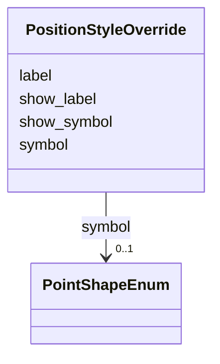

# Class: PositionStyleOverride 


_Per-position style override. Index in array determines which position. No time field - array index i applies to positions[i]. Use null for positions without custom styling._


URI: [debrief:class/PositionStyleOverride](https://debrief.info/schemas/class/PositionStyleOverride)





<!-- no inheritance hierarchy -->


## Slots

| Name | Cardinality and Range | Description | Inheritance |
| ---  | --- | --- | --- |
| [show_symbol](../slots/show_symbol.md) | 0..1 <br/> [Boolean](../types/Boolean.md) | Override whether to show symbol (null = use default/interval) | direct |
| [symbol](../slots/symbol.md) | 0..1 <br/> [PointShapeEnum](../enums/PointShapeEnum.md) | Override symbol shape | direct |
| [show_label](../slots/show_label.md) | 0..1 <br/> [Boolean](../types/Boolean.md) | Override whether to show label | direct |
| [label](../slots/label.md) | 0..1 <br/> [String](../types/String.md) | Custom label text (null = use timestamp) | direct |


## Usages

| used by | used in | type | used |
| ---  | --- | --- | --- |
| [TrackProperties](../classes/TrackProperties.md) | [position_style_overrides](../slots/position_style_overrides.md) | range | [PositionStyleOverride](../classes/PositionStyleOverride.md) |


## Identifier and Mapping Information


### Schema Source


* from schema: https://debrief.info/schemas/debrief


## Mappings

| Mapping Type | Mapped Value |
| ---  | ---  |
| self | debrief:PositionStyleOverride |
| native | debrief:PositionStyleOverride |


## LinkML Source

<!-- TODO: investigate https://stackoverflow.com/questions/37606292/how-to-create-tabbed-code-blocks-in-mkdocs-or-sphinx -->

### Direct

<details>
```yaml
name: PositionStyleOverride
description: Per-position style override. Index in array determines which position.
  No time field - array index i applies to positions[i]. Use null for positions without
  custom styling.
from_schema: https://debrief.info/schemas/debrief
attributes:
  show_symbol:
    name: show_symbol
    description: Override whether to show symbol (null = use default/interval)
    from_schema: https://debrief.info/schemas/styling
    domain_of:
    - PositionStyle
    - PositionStyleOverride
    range: boolean
  symbol:
    name: symbol
    description: Override symbol shape
    from_schema: https://debrief.info/schemas/styling
    domain_of:
    - PositionStyle
    - PositionStyleOverride
    - ReferenceLocationProperties
    - NarrativeEntryProperties
    - CircleAnnotationProperties
    - RectangleAnnotationProperties
    - LineAnnotationProperties
    - TextAnnotationProperties
    - VectorAnnotationProperties
    - PolyAnnotationProperties
    range: PointShapeEnum
  show_label:
    name: show_label
    description: Override whether to show label
    from_schema: https://debrief.info/schemas/styling
    domain_of:
    - PositionStyle
    - PositionStyleOverride
    - SensorContact
    range: boolean
  label:
    name: label
    description: Custom label text (null = use timestamp)
    from_schema: https://debrief.info/schemas/styling
    domain_of:
    - VertexMetadata
    - PositionStyleOverride
    - SensorContact
    - TUASolution
    - MultiPointFeatureProperties
    - MultiPolygonFeatureProperties
    - CircleAnnotationProperties
    - RectangleAnnotationProperties
    - LineAnnotationProperties
    - VectorAnnotationProperties
    - PolyAnnotationProperties
    - ToolResultAnnotations
    - DatasetAxisMetadata

```
</details>

### Induced

<details>
```yaml
name: PositionStyleOverride
description: Per-position style override. Index in array determines which position.
  No time field - array index i applies to positions[i]. Use null for positions without
  custom styling.
from_schema: https://debrief.info/schemas/debrief
attributes:
  show_symbol:
    name: show_symbol
    description: Override whether to show symbol (null = use default/interval)
    from_schema: https://debrief.info/schemas/styling
    alias: show_symbol
    owner: PositionStyleOverride
    domain_of:
    - PositionStyle
    - PositionStyleOverride
    range: boolean
  symbol:
    name: symbol
    description: Override symbol shape
    from_schema: https://debrief.info/schemas/styling
    alias: symbol
    owner: PositionStyleOverride
    domain_of:
    - PositionStyle
    - PositionStyleOverride
    - ReferenceLocationProperties
    - NarrativeEntryProperties
    - CircleAnnotationProperties
    - RectangleAnnotationProperties
    - LineAnnotationProperties
    - TextAnnotationProperties
    - VectorAnnotationProperties
    - PolyAnnotationProperties
    range: PointShapeEnum
  show_label:
    name: show_label
    description: Override whether to show label
    from_schema: https://debrief.info/schemas/styling
    alias: show_label
    owner: PositionStyleOverride
    domain_of:
    - PositionStyle
    - PositionStyleOverride
    - SensorContact
    range: boolean
  label:
    name: label
    description: Custom label text (null = use timestamp)
    from_schema: https://debrief.info/schemas/styling
    alias: label
    owner: PositionStyleOverride
    domain_of:
    - VertexMetadata
    - PositionStyleOverride
    - SensorContact
    - TUASolution
    - MultiPointFeatureProperties
    - MultiPolygonFeatureProperties
    - CircleAnnotationProperties
    - RectangleAnnotationProperties
    - LineAnnotationProperties
    - VectorAnnotationProperties
    - PolyAnnotationProperties
    - ToolResultAnnotations
    - DatasetAxisMetadata
    range: string

```
</details>