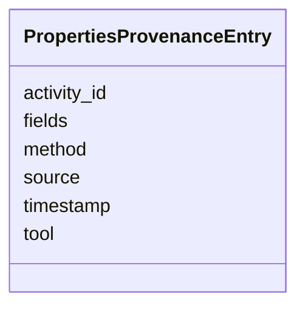

# Class: PropertiesProvenanceEntry 


_Single entry in item.properties["debrief:provenance_log"] recording one Properties Panel commit. Appended by stacService.updateItemMetadata (single writer — Article IV.2). Immutable once written (Article III.3); archive rotation preserves entries by moving to a sibling provenance_log_archive.jsonl — entries are never mutated or deleted in place._

__


URI: [debrief:class/PropertiesProvenanceEntry](https://debrief.info/schemas/class/PropertiesProvenanceEntry)





<!-- no inheritance hierarchy -->


## Slots

| Name | Cardinality and Range | Description | Inheritance |
| ---  | --- | --- | --- |
| [activity_id](../slots/activity_id.md) | 1 <br/> [String](../types/String.md) | ULID generated by the service writer at commit time | direct |
| [timestamp](../slots/timestamp.md) | 1 <br/> [String](../types/String.md) | ISO-8601 UTC timestamp set by the service at write time | direct |
| [tool](../slots/tool.md) | 1 <br/> [String](../types/String.md) | Sentinel identifying the Properties Panel as the writer | direct |
| [method](../slots/method.md) | 1 <br/> [String](../types/String.md) | Versioned method identifier matching ^properties-panel@ | direct |
| [fields](../slots/fields.md) | 1..* <br/> [String](../types/String.md) | Non-empty list of field names touched in this commit | direct |
| [source](../slots/source.md) | 1 <br/> [String](../types/String.md) | Origin of the edit | direct |


## Usages

| used by | used in | type | used |
| ---  | --- | --- | --- |
| [StacExtensionProperties](../classes/StacExtensionProperties.md) | [provenance_log](../slots/provenance_log.md) | range | [PropertiesProvenanceEntry](../classes/PropertiesProvenanceEntry.md) |
| [StacItemProperties](../classes/StacItemProperties.md) | [provenance_log](../slots/provenance_log.md) | range | [PropertiesProvenanceEntry](../classes/PropertiesProvenanceEntry.md) |


## Identifier and Mapping Information


### Schema Source


* from schema: https://debrief.info/schemas/debrief


## Mappings

| Mapping Type | Mapped Value |
| ---  | ---  |
| self | debrief:PropertiesProvenanceEntry |
| native | debrief:PropertiesProvenanceEntry |


## LinkML Source

<!-- TODO: investigate https://stackoverflow.com/questions/37606292/how-to-create-tabbed-code-blocks-in-mkdocs-or-sphinx -->

### Direct

<details>
```yaml
name: PropertiesProvenanceEntry
description: 'Single entry in item.properties["debrief:provenance_log"] recording
  one Properties Panel commit. Appended by stacService.updateItemMetadata (single
  writer — Article IV.2). Immutable once written (Article III.3); archive rotation
  preserves entries by moving to a sibling provenance_log_archive.jsonl — entries
  are never mutated or deleted in place.

  '
from_schema: https://debrief.info/schemas/debrief
attributes:
  activity_id:
    name: activity_id
    description: 'ULID generated by the service writer at commit time. Monotonic sort
      key for replay, undo, and LogPanel cross-referencing.

      '
    from_schema: https://debrief.info/schemas/stac-extension
    domain_of:
    - LogEntry
    - FileProvEntry
    - PropertiesProvenanceEntry
    range: string
    required: true
  timestamp:
    name: timestamp
    description: ISO-8601 UTC timestamp set by the service at write time.
    from_schema: https://debrief.info/schemas/stac-extension
    domain_of:
    - LogEntry
    - TuneAnnotation
    - FileProvEntry
    - PropertiesProvenanceEntry
    - FeatureSelection
    - SceneProperties
    range: string
    required: true
  tool:
    name: tool
    description: 'Sentinel identifying the Properties Panel as the writer. MUST equal
      "debrief.propertiesPanel".

      '
    from_schema: https://debrief.info/schemas/stac-extension
    domain_of:
    - WasGeneratedBy
    - PropertiesProvenanceEntry
    - MCPRequest
    range: string
    required: true
    pattern: ^debrief\.propertiesPanel$
  method:
    name: method
    description: 'Versioned method identifier matching ^properties-panel@.+$, populated
      from the @debrief/components package.json version.

      '
    from_schema: https://debrief.info/schemas/stac-extension
    rank: 1000
    domain_of:
    - PropertiesProvenanceEntry
    range: string
    required: true
    pattern: ^properties-panel@.+$
  fields:
    name: fields
    description: 'Non-empty list of field names touched in this commit. Sorted alphabetically
      for deterministic replay.

      '
    from_schema: https://debrief.info/schemas/stac-extension
    rank: 1000
    domain_of:
    - PropertiesProvenanceEntry
    range: string
    required: true
    multivalued: true
    minimum_cardinality: 1
  source:
    name: source
    description: 'Origin of the edit. MUST equal "user" — Properties Panel edits are
      human-initiated.

      '
    from_schema: https://debrief.info/schemas/stac-extension
    rank: 1000
    domain_of:
    - PropertiesProvenanceEntry
    range: string
    required: true
    pattern: ^user$

```
</details>

### Induced

<details>
```yaml
name: PropertiesProvenanceEntry
description: 'Single entry in item.properties["debrief:provenance_log"] recording
  one Properties Panel commit. Appended by stacService.updateItemMetadata (single
  writer — Article IV.2). Immutable once written (Article III.3); archive rotation
  preserves entries by moving to a sibling provenance_log_archive.jsonl — entries
  are never mutated or deleted in place.

  '
from_schema: https://debrief.info/schemas/debrief
attributes:
  activity_id:
    name: activity_id
    description: 'ULID generated by the service writer at commit time. Monotonic sort
      key for replay, undo, and LogPanel cross-referencing.

      '
    from_schema: https://debrief.info/schemas/stac-extension
    alias: activity_id
    owner: PropertiesProvenanceEntry
    domain_of:
    - LogEntry
    - FileProvEntry
    - PropertiesProvenanceEntry
    range: string
    required: true
  timestamp:
    name: timestamp
    description: ISO-8601 UTC timestamp set by the service at write time.
    from_schema: https://debrief.info/schemas/stac-extension
    alias: timestamp
    owner: PropertiesProvenanceEntry
    domain_of:
    - LogEntry
    - TuneAnnotation
    - FileProvEntry
    - PropertiesProvenanceEntry
    - FeatureSelection
    - SceneProperties
    range: string
    required: true
  tool:
    name: tool
    description: 'Sentinel identifying the Properties Panel as the writer. MUST equal
      "debrief.propertiesPanel".

      '
    from_schema: https://debrief.info/schemas/stac-extension
    alias: tool
    owner: PropertiesProvenanceEntry
    domain_of:
    - WasGeneratedBy
    - PropertiesProvenanceEntry
    - MCPRequest
    range: string
    required: true
    pattern: ^debrief\.propertiesPanel$
  method:
    name: method
    description: 'Versioned method identifier matching ^properties-panel@.+$, populated
      from the @debrief/components package.json version.

      '
    from_schema: https://debrief.info/schemas/stac-extension
    rank: 1000
    alias: method
    owner: PropertiesProvenanceEntry
    domain_of:
    - PropertiesProvenanceEntry
    range: string
    required: true
    pattern: ^properties-panel@.+$
  fields:
    name: fields
    description: 'Non-empty list of field names touched in this commit. Sorted alphabetically
      for deterministic replay.

      '
    from_schema: https://debrief.info/schemas/stac-extension
    rank: 1000
    alias: fields
    owner: PropertiesProvenanceEntry
    domain_of:
    - PropertiesProvenanceEntry
    range: string
    required: true
    multivalued: true
    minimum_cardinality: 1
  source:
    name: source
    description: 'Origin of the edit. MUST equal "user" — Properties Panel edits are
      human-initiated.

      '
    from_schema: https://debrief.info/schemas/stac-extension
    rank: 1000
    alias: source
    owner: PropertiesProvenanceEntry
    domain_of:
    - PropertiesProvenanceEntry
    range: string
    required: true
    pattern: ^user$

```
</details>