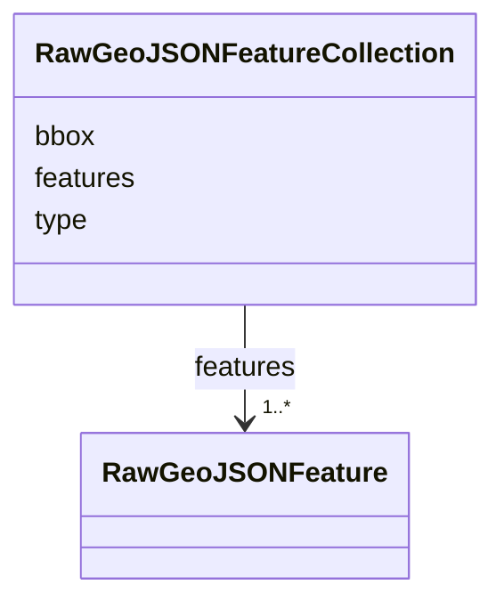

# Class: RawGeoJSONFeatureCollection 


_Parse-boundary GeoJSON FeatureCollection (RFC 7946 §3.3). Used by STAC item payloads and tool-result layers before narrowing._


URI: [debrief:class/RawGeoJSONFeatureCollection](https://debrief.info/schemas/class/RawGeoJSONFeatureCollection)





<!-- no inheritance hierarchy -->


## Slots

| Name | Cardinality and Range | Description | Inheritance |
| ---  | --- | --- | --- |
| [type](../slots/type.md) | 1 <br/> [String](../types/String.md) | GeoJSON object type — always "FeatureCollection" | direct |
| [features](../slots/features.md) | 1..* <br/> [RawGeoJSONFeature](../classes/RawGeoJSONFeature.md) | The collection's features, in document order | direct |
| [bbox](../slots/bbox.md) | * <br/> [Float](../types/Float.md) | Optional bounding box, shaped as in RawGeoJSONFeature | direct |


## Identifier and Mapping Information


### Schema Source


* from schema: https://debrief.info/schemas/debrief


## Mappings

| Mapping Type | Mapped Value |
| ---  | ---  |
| self | debrief:RawGeoJSONFeatureCollection |
| native | debrief:RawGeoJSONFeatureCollection |


## LinkML Source

<!-- TODO: investigate https://stackoverflow.com/questions/37606292/how-to-create-tabbed-code-blocks-in-mkdocs-or-sphinx -->

### Direct

<details>
```yaml
name: RawGeoJSONFeatureCollection
description: Parse-boundary GeoJSON FeatureCollection (RFC 7946 §3.3). Used by STAC
  item payloads and tool-result layers before narrowing.
from_schema: https://debrief.info/schemas/debrief
attributes:
  type:
    name: type
    description: GeoJSON object type — always "FeatureCollection".
    from_schema: https://debrief.info/schemas/raw-geojson
    domain_of:
    - GeoJSONPoint
    - GeoJSONEmptyPoint
    - GeoJSONLineString
    - GeoJSONPolygon
    - GeoJSONMultiPoint
    - GeoJSONMultiLineString
    - GeoJSONMultiPolygon
    - TrackFeature
    - ReferenceLocation
    - SystemState
    - MultiPointFeature
    - MultiPolygonFeature
    - NarrativeEntry
    - CircleAnnotation
    - RectangleAnnotation
    - LineAnnotation
    - TextAnnotation
    - VectorAnnotation
    - PolyAnnotation
    - ToolParameter
    - FileProvEntry
    - StacItem
    - StacCatalog
    - StacLink
    - StacAsset
    - StacItemAssetDefinition
    - StacCollection
    - RawGeoJSONFeature
    - RawGeoJSONFeatureCollection
    - DatasetAxisMetadata
    - DatasetEntry
    - StoryboardFeature
    - SceneFeature
    - SceneThumbnailAssetEntry
    - MCPContentItem
    - MCPParamSchema
    - ToolsUpdateMessage
    range: string
    required: true
    equals_string: FeatureCollection
  features:
    name: features
    description: The collection's features, in document order.
    from_schema: https://debrief.info/schemas/raw-geojson
    rank: 1000
    domain_of:
    - RawGeoJSONFeatureCollection
    - SessionState
    - SessionFile
    - ToolResultForLog
    - ToolExecutionResultForReplay
    range: RawGeoJSONFeature
    required: true
    multivalued: true
    inlined: true
    inlined_as_list: true
  bbox:
    name: bbox
    description: Optional bounding box, shaped as in RawGeoJSONFeature.bbox.
    from_schema: https://debrief.info/schemas/raw-geojson
    domain_of:
    - TrackFeature
    - SystemStateProperties
    - MultiPointFeature
    - MultiPolygonFeature
    - PlotSummary
    - StacItemSummary
    - StacItem
    - StacSpatialExtent
    - RawGeoJSONFeature
    - RawGeoJSONFeatureCollection
    range: float
    required: false
    multivalued: true

```
</details>

### Induced

<details>
```yaml
name: RawGeoJSONFeatureCollection
description: Parse-boundary GeoJSON FeatureCollection (RFC 7946 §3.3). Used by STAC
  item payloads and tool-result layers before narrowing.
from_schema: https://debrief.info/schemas/debrief
attributes:
  type:
    name: type
    description: GeoJSON object type — always "FeatureCollection".
    from_schema: https://debrief.info/schemas/raw-geojson
    alias: type
    owner: RawGeoJSONFeatureCollection
    domain_of:
    - GeoJSONPoint
    - GeoJSONEmptyPoint
    - GeoJSONLineString
    - GeoJSONPolygon
    - GeoJSONMultiPoint
    - GeoJSONMultiLineString
    - GeoJSONMultiPolygon
    - TrackFeature
    - ReferenceLocation
    - SystemState
    - MultiPointFeature
    - MultiPolygonFeature
    - NarrativeEntry
    - CircleAnnotation
    - RectangleAnnotation
    - LineAnnotation
    - TextAnnotation
    - VectorAnnotation
    - PolyAnnotation
    - ToolParameter
    - FileProvEntry
    - StacItem
    - StacCatalog
    - StacLink
    - StacAsset
    - StacItemAssetDefinition
    - StacCollection
    - RawGeoJSONFeature
    - RawGeoJSONFeatureCollection
    - DatasetAxisMetadata
    - DatasetEntry
    - StoryboardFeature
    - SceneFeature
    - SceneThumbnailAssetEntry
    - MCPContentItem
    - MCPParamSchema
    - ToolsUpdateMessage
    range: string
    required: true
    equals_string: FeatureCollection
  features:
    name: features
    description: The collection's features, in document order.
    from_schema: https://debrief.info/schemas/raw-geojson
    rank: 1000
    alias: features
    owner: RawGeoJSONFeatureCollection
    domain_of:
    - RawGeoJSONFeatureCollection
    - SessionState
    - SessionFile
    - ToolResultForLog
    - ToolExecutionResultForReplay
    range: RawGeoJSONFeature
    required: true
    multivalued: true
    inlined: true
    inlined_as_list: true
  bbox:
    name: bbox
    description: Optional bounding box, shaped as in RawGeoJSONFeature.bbox.
    from_schema: https://debrief.info/schemas/raw-geojson
    alias: bbox
    owner: RawGeoJSONFeatureCollection
    domain_of:
    - TrackFeature
    - SystemStateProperties
    - MultiPointFeature
    - MultiPolygonFeature
    - PlotSummary
    - StacItemSummary
    - StacItem
    - StacSpatialExtent
    - RawGeoJSONFeature
    - RawGeoJSONFeatureCollection
    range: float
    required: false
    multivalued: true

```
</details>