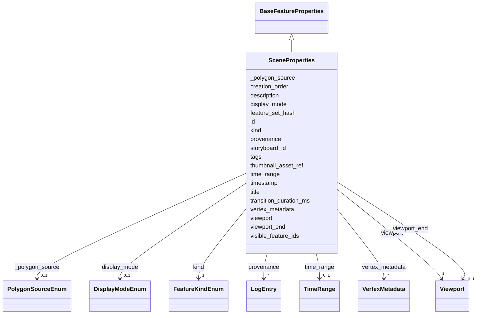

# Class: SceneProperties 


_Properties class for a Scene child Feature. A Scene is a single captured moment in a Storyboard — viewport, timestamp, and per-feature visibility._


URI: [debrief:class/SceneProperties](https://debrief.info/schemas/class/SceneProperties)





## Inheritance
* [BaseFeatureProperties](../classes/BaseFeatureProperties.md)
    * **SceneProperties**


## Slots

| Name | Cardinality and Range | Description | Inheritance |
| ---  | --- | --- | --- |
| [kind](../slots/kind.md) | 1 <br/> [FeatureKindEnum](../enums/FeatureKindEnum.md) | Feature kind discriminator (pinned to STORYBOARD_SCENE) | direct |
| [id](../slots/id.md) | 1 <br/> [String](../types/String.md) | ULID (26 chars, Crockford base-32) | direct |
| [storyboard_id](../slots/storyboard_id.md) | 1 <br/> [String](../types/String.md) | Foreign key to parent Storyboard | direct |
| [title](../slots/title.md) | 1 <br/> [String](../types/String.md) | Display title | direct |
| [description](../slots/description.md) | 0..1 <br/> [String](../types/String.md) | Markdown per-scene narrative | direct |
| [viewport](../slots/viewport.md) | 1 <br/> [Viewport](../classes/Viewport.md) | Map viewport camera state at capture time | direct |
| [timestamp](../slots/timestamp.md) | 1 <br/> [datetime](../slots/datetime.md) | ISO-8601 instant when the Scene was captured | direct |
| [creation_order](../slots/creation_order.md) | 1 <br/> [Integer](../types/Integer.md) | Per-Storyboard monotonic sequence value assigned by the platform at capture t... | direct |
| [time_range](../slots/time_range.md) | 0..1 <br/> [TimeRange](../classes/TimeRange.md) | For instant Scenes (#215 default): MUST be absent | direct |
| [viewport_end](../slots/viewport_end.md) | 0..1 <br/> [Viewport](../classes/Viewport.md) | Map viewport camera state at the end of a time-range Scene (#263) | direct |
| [visible_feature_ids](../slots/visible_feature_ids.md) | 1..* <br/> [String](../types/String.md) | Stable feature IDs visible at capture | direct |
| [feature_set_hash](../slots/feature_set_hash.md) | 1 <br/> [String](../types/String.md) | SHA-256 hex (lowercase, 64 chars) of JSON | direct |
| [thumbnail_asset_ref](../slots/thumbnail_asset_ref.md) | 1 <br/> [String](../types/String.md) | STAC asset key (path + name within the plot's STAC item) | direct |
| [transition_duration_ms](../slots/transition_duration_ms.md) | 1 <br/> [Integer](../types/Integer.md) | Playback transition duration in milliseconds | direct |
| [display_mode](../slots/display_mode.md) | 0..1 <br/> [DisplayModeEnum](../enums/DisplayModeEnum.md) | Time-controller display mode at capture time (full = entire track history; tr... | direct |
| [_polygon_source](../slots/_polygon_source.md) | 0..1 <br/> [PolygonSourceEnum](../enums/PolygonSourceEnum.md) | Provenance of the scene's stored polygon geometry (Spec #258) | direct |
| [tags](../slots/tags.md) | * <br/> [String](../types/String.md) | Free-text labels assigned to this feature by the analyst | [BaseFeatureProperties](../classes/BaseFeatureProperties.md) |
| [provenance](../slots/provenance.md) | * <br/> [LogEntry](../classes/LogEntry.md) | PROV-aligned provenance records (append-only log of tool operations) | [BaseFeatureProperties](../classes/BaseFeatureProperties.md) |
| [vertex_metadata](../slots/vertex_metadata.md) | * <br/> [VertexMetadata](../classes/VertexMetadata.md) | Sparse list of per-vertex metadata, keyed by `path` | [BaseFeatureProperties](../classes/BaseFeatureProperties.md) |


## Usages

| used by | used in | type | used |
| ---  | --- | --- | --- |
| [SceneFeature](../classes/SceneFeature.md) | [properties](../slots/properties.md) | range | [SceneProperties](../classes/SceneProperties.md) |


## Rules


### 

| Rule Applied | Preconditions | Postconditions | Elseconditions |
|--------------|---------------|----------------|----------------|| slot_conditions |```{'time_range': {'value_presence': 'PRESENT'}}``` |```{'viewport_end': {'value_presence': 'PRESENT'}}``` | |


### 

| Rule Applied | Preconditions | Postconditions | Elseconditions |
|--------------|---------------|----------------|----------------|| slot_conditions |```{'viewport_end': {'value_presence': 'PRESENT'}}``` |```{'time_range': {'value_presence': 'PRESENT'}}``` | |


## Identifier and Mapping Information


### Schema Source


* from schema: https://debrief.info/schemas/debrief


## Mappings

| Mapping Type | Mapped Value |
| ---  | ---  |
| self | debrief:SceneProperties |
| native | debrief:SceneProperties |


## LinkML Source

<!-- TODO: investigate https://stackoverflow.com/questions/37606292/how-to-create-tabbed-code-blocks-in-mkdocs-or-sphinx -->

### Direct

<details>
```yaml
name: SceneProperties
description: Properties class for a Scene child Feature. A Scene is a single captured
  moment in a Storyboard — viewport, timestamp, and per-feature visibility.
from_schema: https://debrief.info/schemas/debrief
is_a: BaseFeatureProperties
attributes:
  kind:
    name: kind
    description: Feature kind discriminator (pinned to STORYBOARD_SCENE)
    from_schema: https://debrief.info/schemas/storyboard
    domain_of:
    - BaseFeatureProperties
    - TrackProperties
    - ReferenceLocationProperties
    - SystemStateProperties
    - MultiPointFeatureProperties
    - MultiPolygonFeatureProperties
    - NarrativeEntryProperties
    - CircleAnnotationProperties
    - RectangleAnnotationProperties
    - LineAnnotationProperties
    - TextAnnotationProperties
    - VectorAnnotationProperties
    - PolyAnnotationProperties
    - SelectionRequirement
    - SystemRecordProperties
    - StoryboardProperties
    - SceneProperties
    - MCPSelectionRequirement
    range: FeatureKindEnum
    required: true
    equals_string: STORYBOARD_SCENE
  id:
    name: id
    description: ULID (26 chars, Crockford base-32). Immutable after create.
    from_schema: https://debrief.info/schemas/storyboard
    domain_of:
    - TrackFeature
    - ReferenceLocation
    - SystemState
    - MultiPointFeature
    - MultiPolygonFeature
    - NarrativeEntry
    - CircleAnnotation
    - RectangleAnnotation
    - LineAnnotation
    - TextAnnotation
    - VectorAnnotation
    - PolyAnnotation
    - Tool
    - PlatformRecord
    - PlotSummary
    - StacItemSummary
    - RawGeoJSONFeature
    - StoryboardProperties
    - SceneProperties
    - StoryboardFeature
    - SceneFeature
    - ToolDefinition
    range: string
    required: true
    pattern: ^[0-9A-HJKMNP-TV-Z]{26}$
  storyboard_id:
    name: storyboard_id
    description: Foreign key to parent Storyboard.properties.id (ULID).
    from_schema: https://debrief.info/schemas/storyboard
    rank: 1000
    domain_of:
    - SceneProperties
    range: string
    required: true
    pattern: ^[0-9A-HJKMNP-TV-Z]{26}$
  title:
    name: title
    description: Display title. Defaults to DTG of timestamp in DDHHmmZ MMM YY; falls
      back to ISO-8601 on parse failure.
    from_schema: https://debrief.info/schemas/storyboard
    domain_of:
    - PlotSummary
    - StacItemSummary
    - DatasetEntry
    - SceneProperties
    - SceneThumbnailAssetEntry
    range: string
    required: true
  description:
    name: description
    description: Markdown per-scene narrative
    from_schema: https://debrief.info/schemas/storyboard
    domain_of:
    - ReferenceLocationProperties
    - MultiPointFeatureProperties
    - MultiPolygonFeatureProperties
    - Tool
    - ToolParameter
    - LevelDefinition
    - StoryboardProperties
    - SceneProperties
    - MCPParamSchema
    - MCPToolDefinition
    - ToolDefinition
    range: string
    required: false
  viewport:
    name: viewport
    description: Map viewport camera state at capture time
    from_schema: https://debrief.info/schemas/storyboard
    domain_of:
    - SpatialSlice
    - SceneProperties
    range: Viewport
    required: true
  timestamp:
    name: timestamp
    description: 'ISO-8601 instant when the Scene was captured. Drives Scene ordering
      (ascending within a Storyboard) as the primary sort key. Multiple Scenes MAY
      share the same timestamp; ties are broken by `creation_order` ascending (see
      #259).'
    from_schema: https://debrief.info/schemas/storyboard
    domain_of:
    - LogEntry
    - TuneAnnotation
    - FileProvEntry
    - PropertiesProvenanceEntry
    - FeatureSelection
    - SceneProperties
    range: datetime
    required: true
  creation_order:
    name: creation_order
    description: 'Per-Storyboard monotonic sequence value assigned by the platform
      at capture time. Acts as the secondary sort key for Scenes — when two Scenes
      share a `timestamp` the one with the lower `creation_order` comes first. Unique
      within a Storyboard; gaps are permitted (left by deletion). The platform — not
      the client — is the source of truth. Introduced by #259; absent on pre-#259
      plots which are rejected at load (no migration shim — Article XIV pre-release
      freedom).'
    from_schema: https://debrief.info/schemas/storyboard
    rank: 1000
    domain_of:
    - SceneProperties
    range: integer
    required: true
    minimum_value: 0
  time_range:
    name: time_range
    description: 'For instant Scenes (#215 default): MUST be absent. For time-range
      Scenes (#263): a TimeRange sub-record. When present, the Scene is the time-range
      flavour and `viewport_end` MUST also be present. See cross-field rule `scene-flavour-xor-rule`.'
    from_schema: https://debrief.info/schemas/storyboard
    rank: 1000
    domain_of:
    - SceneProperties
    range: TimeRange
    required: false
  viewport_end:
    name: viewport_end
    description: Map viewport camera state at the end of a time-range Scene (#263).
      MUST be present if and only if `time_range` is present. Reuses the Viewport
      sub-record (`bearing` MUST be 0). For instant Scenes this slot MUST be absent.
    from_schema: https://debrief.info/schemas/storyboard
    rank: 1000
    domain_of:
    - SceneProperties
    range: Viewport
    required: false
  visible_feature_ids:
    name: visible_feature_ids
    description: Stable feature IDs visible at capture. Canonicalised (trim, reject
      empty, dedupe, sort lexicographically) by the CRUD module before hashing. Order-insensitive
      from the consumer's perspective.
    from_schema: https://debrief.info/schemas/storyboard
    rank: 1000
    domain_of:
    - SceneProperties
    range: string
    required: true
    multivalued: true
  feature_set_hash:
    name: feature_set_hash
    description: SHA-256 hex (lowercase, 64 chars) of JSON.stringify(canonical visible_feature_ids).
      Recomputed on every create/update touching visible_feature_ids.
    from_schema: https://debrief.info/schemas/storyboard
    rank: 1000
    domain_of:
    - SceneProperties
    range: string
    required: true
    pattern: ^[0-9a-f]{64}$
  thumbnail_asset_ref:
    name: thumbnail_asset_ref
    description: 'STAC asset key (path + name within the plot''s STAC item). Populated
      by #216 at capture time via #174 helpers.'
    from_schema: https://debrief.info/schemas/storyboard
    rank: 1000
    domain_of:
    - SceneProperties
    range: string
    required: true
  transition_duration_ms:
    name: transition_duration_ms
    description: Playback transition duration in milliseconds. Default 500.
    from_schema: https://debrief.info/schemas/storyboard
    rank: 1000
    domain_of:
    - SceneProperties
    range: integer
    required: true
    minimum_value: 0
  display_mode:
    name: display_mode
    description: 'Time-controller display mode at capture time (full = entire track
      history; trail = only the tail behind each platform). Reuses DisplayModeEnum
      from session-state.yaml. Optional for legacy compatibility (Spec #258): readers
      MUST leave the time controller untouched when this slot is absent (FR-003).
      Writers populate it from session.displayMode at the moment the scene is created.'
    from_schema: https://debrief.info/schemas/storyboard
    rank: 1000
    domain_of:
    - SceneProperties
    range: DisplayModeEnum
    required: false
  _polygon_source:
    name: _polygon_source
    description: 'Provenance of the scene''s stored polygon geometry (Spec #258).
      ''bounds'' = computed from real Leaflet map bounds at capture time; ''placeholder''
      = pre-#258 ~100m square; ''manual'' = reserved for future user-drawn rectangles.
      Render-side consumers recompute the polygon from (viewport, map dimensions)
      when this value is anything other than ''bounds'' (including absent, for legacy
      scenes). The stored geometry is NEVER rewritten on read (Article III.2 source
      preservation).'
    from_schema: https://debrief.info/schemas/storyboard
    rank: 1000
    domain_of:
    - SceneProperties
    range: PolygonSourceEnum
    required: false
rules:
- preconditions:
    slot_conditions:
      time_range:
        name: time_range
        value_presence: PRESENT
  postconditions:
    slot_conditions:
      viewport_end:
        name: viewport_end
        value_presence: PRESENT
  description: 'Scene flavour XOR (#263): a Scene is either the instant flavour (both
    `time_range` and `viewport_end` absent) or the time-range flavour (both present).
    Any other combination is rejected with `SceneFlavourXorViolation`.'
- preconditions:
    slot_conditions:
      viewport_end:
        name: viewport_end
        value_presence: PRESENT
  postconditions:
    slot_conditions:
      time_range:
        name: time_range
        value_presence: PRESENT
  description: 'Scene flavour XOR (#263, reverse): if `viewport_end` is present then
    `time_range` MUST also be present.'

```
</details>

### Induced

<details>
```yaml
name: SceneProperties
description: Properties class for a Scene child Feature. A Scene is a single captured
  moment in a Storyboard — viewport, timestamp, and per-feature visibility.
from_schema: https://debrief.info/schemas/debrief
is_a: BaseFeatureProperties
attributes:
  kind:
    name: kind
    description: Feature kind discriminator (pinned to STORYBOARD_SCENE)
    from_schema: https://debrief.info/schemas/storyboard
    alias: kind
    owner: SceneProperties
    domain_of:
    - BaseFeatureProperties
    - TrackProperties
    - ReferenceLocationProperties
    - SystemStateProperties
    - MultiPointFeatureProperties
    - MultiPolygonFeatureProperties
    - NarrativeEntryProperties
    - CircleAnnotationProperties
    - RectangleAnnotationProperties
    - LineAnnotationProperties
    - TextAnnotationProperties
    - VectorAnnotationProperties
    - PolyAnnotationProperties
    - SelectionRequirement
    - SystemRecordProperties
    - StoryboardProperties
    - SceneProperties
    - MCPSelectionRequirement
    range: FeatureKindEnum
    required: true
    equals_string: STORYBOARD_SCENE
  id:
    name: id
    description: ULID (26 chars, Crockford base-32). Immutable after create.
    from_schema: https://debrief.info/schemas/storyboard
    alias: id
    owner: SceneProperties
    domain_of:
    - TrackFeature
    - ReferenceLocation
    - SystemState
    - MultiPointFeature
    - MultiPolygonFeature
    - NarrativeEntry
    - CircleAnnotation
    - RectangleAnnotation
    - LineAnnotation
    - TextAnnotation
    - VectorAnnotation
    - PolyAnnotation
    - Tool
    - PlatformRecord
    - PlotSummary
    - StacItemSummary
    - RawGeoJSONFeature
    - StoryboardProperties
    - SceneProperties
    - StoryboardFeature
    - SceneFeature
    - ToolDefinition
    range: string
    required: true
    pattern: ^[0-9A-HJKMNP-TV-Z]{26}$
  storyboard_id:
    name: storyboard_id
    description: Foreign key to parent Storyboard.properties.id (ULID).
    from_schema: https://debrief.info/schemas/storyboard
    rank: 1000
    alias: storyboard_id
    owner: SceneProperties
    domain_of:
    - SceneProperties
    range: string
    required: true
    pattern: ^[0-9A-HJKMNP-TV-Z]{26}$
  title:
    name: title
    description: Display title. Defaults to DTG of timestamp in DDHHmmZ MMM YY; falls
      back to ISO-8601 on parse failure.
    from_schema: https://debrief.info/schemas/storyboard
    alias: title
    owner: SceneProperties
    domain_of:
    - PlotSummary
    - StacItemSummary
    - DatasetEntry
    - SceneProperties
    - SceneThumbnailAssetEntry
    range: string
    required: true
  description:
    name: description
    description: Markdown per-scene narrative
    from_schema: https://debrief.info/schemas/storyboard
    alias: description
    owner: SceneProperties
    domain_of:
    - ReferenceLocationProperties
    - MultiPointFeatureProperties
    - MultiPolygonFeatureProperties
    - Tool
    - ToolParameter
    - LevelDefinition
    - StoryboardProperties
    - SceneProperties
    - MCPParamSchema
    - MCPToolDefinition
    - ToolDefinition
    range: string
    required: false
  viewport:
    name: viewport
    description: Map viewport camera state at capture time
    from_schema: https://debrief.info/schemas/storyboard
    alias: viewport
    owner: SceneProperties
    domain_of:
    - SpatialSlice
    - SceneProperties
    range: Viewport
    required: true
  timestamp:
    name: timestamp
    description: 'ISO-8601 instant when the Scene was captured. Drives Scene ordering
      (ascending within a Storyboard) as the primary sort key. Multiple Scenes MAY
      share the same timestamp; ties are broken by `creation_order` ascending (see
      #259).'
    from_schema: https://debrief.info/schemas/storyboard
    alias: timestamp
    owner: SceneProperties
    domain_of:
    - LogEntry
    - TuneAnnotation
    - FileProvEntry
    - PropertiesProvenanceEntry
    - FeatureSelection
    - SceneProperties
    range: datetime
    required: true
  creation_order:
    name: creation_order
    description: 'Per-Storyboard monotonic sequence value assigned by the platform
      at capture time. Acts as the secondary sort key for Scenes — when two Scenes
      share a `timestamp` the one with the lower `creation_order` comes first. Unique
      within a Storyboard; gaps are permitted (left by deletion). The platform — not
      the client — is the source of truth. Introduced by #259; absent on pre-#259
      plots which are rejected at load (no migration shim — Article XIV pre-release
      freedom).'
    from_schema: https://debrief.info/schemas/storyboard
    rank: 1000
    alias: creation_order
    owner: SceneProperties
    domain_of:
    - SceneProperties
    range: integer
    required: true
    minimum_value: 0
  time_range:
    name: time_range
    description: 'For instant Scenes (#215 default): MUST be absent. For time-range
      Scenes (#263): a TimeRange sub-record. When present, the Scene is the time-range
      flavour and `viewport_end` MUST also be present. See cross-field rule `scene-flavour-xor-rule`.'
    from_schema: https://debrief.info/schemas/storyboard
    rank: 1000
    alias: time_range
    owner: SceneProperties
    domain_of:
    - SceneProperties
    range: TimeRange
    required: false
  viewport_end:
    name: viewport_end
    description: Map viewport camera state at the end of a time-range Scene (#263).
      MUST be present if and only if `time_range` is present. Reuses the Viewport
      sub-record (`bearing` MUST be 0). For instant Scenes this slot MUST be absent.
    from_schema: https://debrief.info/schemas/storyboard
    rank: 1000
    alias: viewport_end
    owner: SceneProperties
    domain_of:
    - SceneProperties
    range: Viewport
    required: false
  visible_feature_ids:
    name: visible_feature_ids
    description: Stable feature IDs visible at capture. Canonicalised (trim, reject
      empty, dedupe, sort lexicographically) by the CRUD module before hashing. Order-insensitive
      from the consumer's perspective.
    from_schema: https://debrief.info/schemas/storyboard
    rank: 1000
    alias: visible_feature_ids
    owner: SceneProperties
    domain_of:
    - SceneProperties
    range: string
    required: true
    multivalued: true
  feature_set_hash:
    name: feature_set_hash
    description: SHA-256 hex (lowercase, 64 chars) of JSON.stringify(canonical visible_feature_ids).
      Recomputed on every create/update touching visible_feature_ids.
    from_schema: https://debrief.info/schemas/storyboard
    rank: 1000
    alias: feature_set_hash
    owner: SceneProperties
    domain_of:
    - SceneProperties
    range: string
    required: true
    pattern: ^[0-9a-f]{64}$
  thumbnail_asset_ref:
    name: thumbnail_asset_ref
    description: 'STAC asset key (path + name within the plot''s STAC item). Populated
      by #216 at capture time via #174 helpers.'
    from_schema: https://debrief.info/schemas/storyboard
    rank: 1000
    alias: thumbnail_asset_ref
    owner: SceneProperties
    domain_of:
    - SceneProperties
    range: string
    required: true
  transition_duration_ms:
    name: transition_duration_ms
    description: Playback transition duration in milliseconds. Default 500.
    from_schema: https://debrief.info/schemas/storyboard
    rank: 1000
    alias: transition_duration_ms
    owner: SceneProperties
    domain_of:
    - SceneProperties
    range: integer
    required: true
    minimum_value: 0
  display_mode:
    name: display_mode
    description: 'Time-controller display mode at capture time (full = entire track
      history; trail = only the tail behind each platform). Reuses DisplayModeEnum
      from session-state.yaml. Optional for legacy compatibility (Spec #258): readers
      MUST leave the time controller untouched when this slot is absent (FR-003).
      Writers populate it from session.displayMode at the moment the scene is created.'
    from_schema: https://debrief.info/schemas/storyboard
    rank: 1000
    alias: display_mode
    owner: SceneProperties
    domain_of:
    - SceneProperties
    range: DisplayModeEnum
    required: false
  _polygon_source:
    name: _polygon_source
    description: 'Provenance of the scene''s stored polygon geometry (Spec #258).
      ''bounds'' = computed from real Leaflet map bounds at capture time; ''placeholder''
      = pre-#258 ~100m square; ''manual'' = reserved for future user-drawn rectangles.
      Render-side consumers recompute the polygon from (viewport, map dimensions)
      when this value is anything other than ''bounds'' (including absent, for legacy
      scenes). The stored geometry is NEVER rewritten on read (Article III.2 source
      preservation).'
    from_schema: https://debrief.info/schemas/storyboard
    rank: 1000
    alias: _polygon_source
    owner: SceneProperties
    domain_of:
    - SceneProperties
    range: PolygonSourceEnum
    required: false
  tags:
    name: tags
    description: Free-text labels assigned to this feature by the analyst
    from_schema: https://debrief.info/schemas/common
    rank: 1000
    alias: tags
    owner: SceneProperties
    domain_of:
    - BaseFeatureProperties
    - VertexMetadata
    - StacExtensionProperties
    - StacItemSummary
    range: string
    required: false
    multivalued: true
  provenance:
    name: provenance
    description: PROV-aligned provenance records (append-only log of tool operations)
    from_schema: https://debrief.info/schemas/common
    rank: 1000
    alias: provenance
    owner: SceneProperties
    domain_of:
    - BaseFeatureProperties
    - SystemStateProperties
    - SystemRecordProperties
    range: LogEntry
    multivalued: true
    inlined: true
    inlined_as_list: true
  vertex_metadata:
    name: vertex_metadata
    description: 'Sparse list of per-vertex metadata, keyed by `path`. Empty arrays
      MUST be omitted from the serialised feature (FR-010). Duplicate `path` values
      MUST be rejected by validators (contract §Cross-cutting #3). Every concrete
      subclass of `BaseFeatureProperties` gains this slot by inheritance — see spec
      #192, contracts/vertex-metadata-slot.md.'
    from_schema: https://debrief.info/schemas/common
    rank: 1000
    alias: vertex_metadata
    owner: SceneProperties
    domain_of:
    - BaseFeatureProperties
    range: VertexMetadata
    required: false
    multivalued: true
    inlined: true
    inlined_as_list: true
rules:
- preconditions:
    slot_conditions:
      time_range:
        name: time_range
        value_presence: PRESENT
  postconditions:
    slot_conditions:
      viewport_end:
        name: viewport_end
        value_presence: PRESENT
  description: 'Scene flavour XOR (#263): a Scene is either the instant flavour (both
    `time_range` and `viewport_end` absent) or the time-range flavour (both present).
    Any other combination is rejected with `SceneFlavourXorViolation`.'
- preconditions:
    slot_conditions:
      viewport_end:
        name: viewport_end
        value_presence: PRESENT
  postconditions:
    slot_conditions:
      time_range:
        name: time_range
        value_presence: PRESENT
  description: 'Scene flavour XOR (#263, reverse): if `viewport_end` is present then
    `time_range` MUST also be present.'

```
</details>