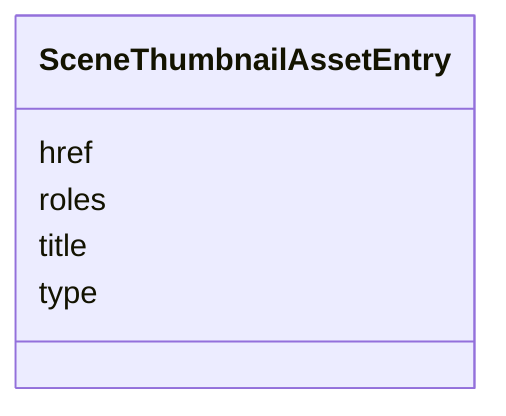

# Class: SceneThumbnailAssetEntry 


_A single STAC Item asset entry produced by Storyboarding (#216) for one_

_variant of one Scene's thumbnail. Always appears as part of a_

_pair in an Item's `assets` map: a large entry under the key_

_`scene-thumbnail-{ULID}` and a small entry under the key_

_`scene-thumbnail-{ULID}-sm`, where `{ULID}` is the owning Scene's_

_identifier (matches SceneProperties.id)._

__

_Why ULID: the owning Scene's id; lets every per-Scene asset be_

_traced back to its Scene without an explicit foreign-key field_

_in the asset payload._

__

_Why pairs: the Storyboarding capture pipeline produces both_

_sizes atomically (800x600 large for inspection; 200x150 small_

_for timeline strips). A single-variant entry is a defect — see_

_schema rule scene-thumbnail-pair-rule-001._

__

_Lifecycle: created when a Scene is captured. Deleted when the_

_Scene is deleted (garbage-collection invariant — see schema_

_rule scene-thumbnail-orphan-rule-001). Both rules are enforced_

_by the debrief-stac audit module; the JSON Schema layer_

_enforces the value shape and key format only (see schema rule_

_scene-thumbnail-key-format-rule-001)._

__

_Supersedes the spec-241 placeholder `item_assets["scene-thumbnail"]`_

_and the `^scene-thumbnail(-.+)?$` patternProperties rule._


URI: [debrief:class/SceneThumbnailAssetEntry](https://debrief.info/schemas/class/SceneThumbnailAssetEntry)





<!-- no inheritance hierarchy -->


## Slots

| Name | Cardinality and Range | Description | Inheritance |
| ---  | --- | --- | --- |
| [href](../slots/href.md) | 1 <br/> [String](../types/String.md) | URI-reference relative to the Item directory; conventionally  | direct |
| [type](../slots/type.md) | 1 <br/> [String](../types/String.md) | Always image/png — Storyboarding capture writes PNGs only | direct |
| [roles](../slots/roles.md) | 1..* <br/> [String](../types/String.md) | Exactly ["thumbnail"] | direct |
| [title](../slots/title.md) | 0..1 <br/> [String](../types/String.md) | Optional human label | direct |


## Identifier and Mapping Information


### Schema Source


* from schema: https://debrief.info/schemas/debrief


## Mappings

| Mapping Type | Mapped Value |
| ---  | ---  |
| self | debrief:SceneThumbnailAssetEntry |
| native | debrief:SceneThumbnailAssetEntry |


## LinkML Source

<!-- TODO: investigate https://stackoverflow.com/questions/37606292/how-to-create-tabbed-code-blocks-in-mkdocs-or-sphinx -->

### Direct

<details>
```yaml
name: SceneThumbnailAssetEntry
description: 'A single STAC Item asset entry produced by Storyboarding (#216) for
  one

  variant of one Scene''s thumbnail. Always appears as part of a

  pair in an Item''s `assets` map: a large entry under the key

  `scene-thumbnail-{ULID}` and a small entry under the key

  `scene-thumbnail-{ULID}-sm`, where `{ULID}` is the owning Scene''s

  identifier (matches SceneProperties.id).


  Why ULID: the owning Scene''s id; lets every per-Scene asset be

  traced back to its Scene without an explicit foreign-key field

  in the asset payload.


  Why pairs: the Storyboarding capture pipeline produces both

  sizes atomically (800x600 large for inspection; 200x150 small

  for timeline strips). A single-variant entry is a defect — see

  schema rule scene-thumbnail-pair-rule-001.


  Lifecycle: created when a Scene is captured. Deleted when the

  Scene is deleted (garbage-collection invariant — see schema

  rule scene-thumbnail-orphan-rule-001). Both rules are enforced

  by the debrief-stac audit module; the JSON Schema layer

  enforces the value shape and key format only (see schema rule

  scene-thumbnail-key-format-rule-001).


  Supersedes the spec-241 placeholder `item_assets["scene-thumbnail"]`

  and the `^scene-thumbnail(-.+)?$` patternProperties rule.'
from_schema: https://debrief.info/schemas/debrief
attributes:
  href:
    name: href
    description: URI-reference relative to the Item directory; conventionally ./scene-thumbnails/scene-{ULID}.png
      (large) or ./scene-thumbnails/scene-{ULID}-sm.png (small).
    from_schema: https://debrief.info/schemas/storyboard
    domain_of:
    - StacLink
    - StacAsset
    - ToolResultAnnotations
    - SceneThumbnailAssetEntry
    range: string
    required: true
  type:
    name: type
    description: Always image/png — Storyboarding capture writes PNGs only.
    from_schema: https://debrief.info/schemas/storyboard
    domain_of:
    - GeoJSONPoint
    - GeoJSONEmptyPoint
    - GeoJSONLineString
    - GeoJSONPolygon
    - GeoJSONMultiPoint
    - GeoJSONMultiLineString
    - GeoJSONMultiPolygon
    - TrackFeature
    - ReferenceLocation
    - SystemState
    - MultiPointFeature
    - MultiPolygonFeature
    - NarrativeEntry
    - CircleAnnotation
    - RectangleAnnotation
    - LineAnnotation
    - TextAnnotation
    - VectorAnnotation
    - PolyAnnotation
    - ToolParameter
    - FileProvEntry
    - StacItem
    - StacCatalog
    - StacLink
    - StacAsset
    - StacItemAssetDefinition
    - StacCollection
    - RawGeoJSONFeature
    - RawGeoJSONFeatureCollection
    - DatasetAxisMetadata
    - DatasetEntry
    - StoryboardFeature
    - SceneFeature
    - SceneThumbnailAssetEntry
    - MCPContentItem
    - MCPParamSchema
    - ToolsUpdateMessage
    range: string
    required: true
    equals_string: image/png
  roles:
    name: roles
    description: Exactly ["thumbnail"]. Storyboarding-derived thumbnails are not declared
      as overview (which is reserved for plot-level overviews of dimensions 600x800).
    from_schema: https://debrief.info/schemas/storyboard
    domain_of:
    - StacProvider
    - StacAsset
    - StacItemAssetDefinition
    - SceneThumbnailAssetEntry
    range: string
    required: true
    multivalued: true
  title:
    name: title
    description: Optional human label. Storyboarding writer emits "Scene thumbnail"
      (large) or "Scene thumbnail (small)" (small).
    from_schema: https://debrief.info/schemas/storyboard
    domain_of:
    - PlotSummary
    - StacItemSummary
    - StacItemProperties
    - StacCatalog
    - StacLink
    - StacAsset
    - StacItemAssetDefinition
    - StacCollection
    - DatasetEntry
    - SceneProperties
    - SceneThumbnailAssetEntry
    range: string
    required: false

```
</details>

### Induced

<details>
```yaml
name: SceneThumbnailAssetEntry
description: 'A single STAC Item asset entry produced by Storyboarding (#216) for
  one

  variant of one Scene''s thumbnail. Always appears as part of a

  pair in an Item''s `assets` map: a large entry under the key

  `scene-thumbnail-{ULID}` and a small entry under the key

  `scene-thumbnail-{ULID}-sm`, where `{ULID}` is the owning Scene''s

  identifier (matches SceneProperties.id).


  Why ULID: the owning Scene''s id; lets every per-Scene asset be

  traced back to its Scene without an explicit foreign-key field

  in the asset payload.


  Why pairs: the Storyboarding capture pipeline produces both

  sizes atomically (800x600 large for inspection; 200x150 small

  for timeline strips). A single-variant entry is a defect — see

  schema rule scene-thumbnail-pair-rule-001.


  Lifecycle: created when a Scene is captured. Deleted when the

  Scene is deleted (garbage-collection invariant — see schema

  rule scene-thumbnail-orphan-rule-001). Both rules are enforced

  by the debrief-stac audit module; the JSON Schema layer

  enforces the value shape and key format only (see schema rule

  scene-thumbnail-key-format-rule-001).


  Supersedes the spec-241 placeholder `item_assets["scene-thumbnail"]`

  and the `^scene-thumbnail(-.+)?$` patternProperties rule.'
from_schema: https://debrief.info/schemas/debrief
attributes:
  href:
    name: href
    description: URI-reference relative to the Item directory; conventionally ./scene-thumbnails/scene-{ULID}.png
      (large) or ./scene-thumbnails/scene-{ULID}-sm.png (small).
    from_schema: https://debrief.info/schemas/storyboard
    alias: href
    owner: SceneThumbnailAssetEntry
    domain_of:
    - StacLink
    - StacAsset
    - ToolResultAnnotations
    - SceneThumbnailAssetEntry
    range: string
    required: true
  type:
    name: type
    description: Always image/png — Storyboarding capture writes PNGs only.
    from_schema: https://debrief.info/schemas/storyboard
    alias: type
    owner: SceneThumbnailAssetEntry
    domain_of:
    - GeoJSONPoint
    - GeoJSONEmptyPoint
    - GeoJSONLineString
    - GeoJSONPolygon
    - GeoJSONMultiPoint
    - GeoJSONMultiLineString
    - GeoJSONMultiPolygon
    - TrackFeature
    - ReferenceLocation
    - SystemState
    - MultiPointFeature
    - MultiPolygonFeature
    - NarrativeEntry
    - CircleAnnotation
    - RectangleAnnotation
    - LineAnnotation
    - TextAnnotation
    - VectorAnnotation
    - PolyAnnotation
    - ToolParameter
    - FileProvEntry
    - StacItem
    - StacCatalog
    - StacLink
    - StacAsset
    - StacItemAssetDefinition
    - StacCollection
    - RawGeoJSONFeature
    - RawGeoJSONFeatureCollection
    - DatasetAxisMetadata
    - DatasetEntry
    - StoryboardFeature
    - SceneFeature
    - SceneThumbnailAssetEntry
    - MCPContentItem
    - MCPParamSchema
    - ToolsUpdateMessage
    range: string
    required: true
    equals_string: image/png
  roles:
    name: roles
    description: Exactly ["thumbnail"]. Storyboarding-derived thumbnails are not declared
      as overview (which is reserved for plot-level overviews of dimensions 600x800).
    from_schema: https://debrief.info/schemas/storyboard
    alias: roles
    owner: SceneThumbnailAssetEntry
    domain_of:
    - StacProvider
    - StacAsset
    - StacItemAssetDefinition
    - SceneThumbnailAssetEntry
    range: string
    required: true
    multivalued: true
  title:
    name: title
    description: Optional human label. Storyboarding writer emits "Scene thumbnail"
      (large) or "Scene thumbnail (small)" (small).
    from_schema: https://debrief.info/schemas/storyboard
    alias: title
    owner: SceneThumbnailAssetEntry
    domain_of:
    - PlotSummary
    - StacItemSummary
    - StacItemProperties
    - StacCatalog
    - StacLink
    - StacAsset
    - StacItemAssetDefinition
    - StacCollection
    - DatasetEntry
    - SceneProperties
    - SceneThumbnailAssetEntry
    range: string
    required: false

```
</details>