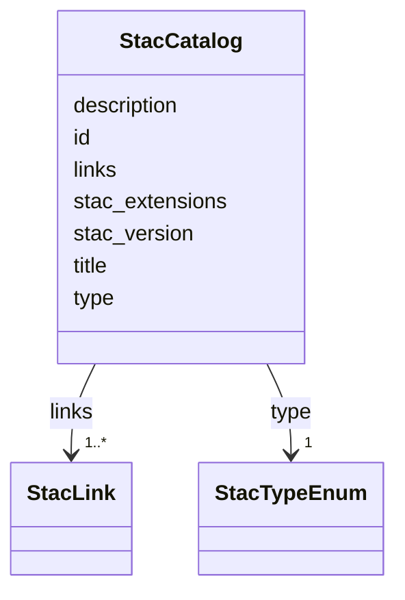

# Class: StacCatalog 


_A flat STAC Catalog (no extent, no summaries). Closes audit §3.1 rows for `apps/vscode/src/types/stac.ts` and `apps/web-shell/src/mocks/stacService.ts`. Persisted to `<store>/<catalog>/catalog.json` for stores not upgraded to STAC 1.1 Collection._


URI: [debrief:class/StacCatalog](https://debrief.info/schemas/class/StacCatalog)





<!-- no inheritance hierarchy -->


## Slots

| Name | Cardinality and Range | Description | Inheritance |
| ---  | --- | --- | --- |
| [type](../slots/type.md) | 1 <br/> [StacTypeEnum](../enums/StacTypeEnum.md) | STAC discriminator — always "Catalog" for flat Catalogs | direct |
| [stac_version](../slots/stac_version.md) | 1 <br/> [String](../types/String.md) | STAC version string ("1 | direct |
| [stac_extensions](../slots/stac_extensions.md) | * <br/> [String](../types/String.md) | Optional STAC extension schema URIs | direct |
| [id](../slots/id.md) | 1 <br/> [String](../types/String.md) | Catalog identifier | direct |
| [title](../slots/title.md) | 0..1 <br/> [String](../types/String.md) | Human-readable catalog title | direct |
| [description](../slots/description.md) | 1 <br/> [String](../types/String.md) | STAC-mandated catalog description | direct |
| [links](../slots/links.md) | 1..* <br/> [StacLink](../classes/StacLink.md) | Catalog navigation links — `self`, `root`, `parent`, and one `item` per child... | direct |


## Identifier and Mapping Information


### Schema Source


* from schema: https://debrief.info/schemas/debrief


## Mappings

| Mapping Type | Mapped Value |
| ---  | ---  |
| self | debrief:StacCatalog |
| native | debrief:StacCatalog |


## LinkML Source

<!-- TODO: investigate https://stackoverflow.com/questions/37606292/how-to-create-tabbed-code-blocks-in-mkdocs-or-sphinx -->

### Direct

<details>
```yaml
name: StacCatalog
description: A flat STAC Catalog (no extent, no summaries). Closes audit §3.1 rows
  for `apps/vscode/src/types/stac.ts` and `apps/web-shell/src/mocks/stacService.ts`.
  Persisted to `<store>/<catalog>/catalog.json` for stores not upgraded to STAC 1.1
  Collection.
from_schema: https://debrief.info/schemas/debrief
attributes:
  type:
    name: type
    description: STAC discriminator — always "Catalog" for flat Catalogs.
    from_schema: https://debrief.info/schemas/stac
    domain_of:
    - GeoJSONPoint
    - GeoJSONEmptyPoint
    - GeoJSONLineString
    - GeoJSONPolygon
    - GeoJSONMultiPoint
    - GeoJSONMultiLineString
    - GeoJSONMultiPolygon
    - TrackFeature
    - ReferenceLocation
    - SystemState
    - MultiPointFeature
    - MultiPolygonFeature
    - NarrativeEntry
    - CircleAnnotation
    - RectangleAnnotation
    - LineAnnotation
    - TextAnnotation
    - VectorAnnotation
    - PolyAnnotation
    - ToolParameter
    - FileProvEntry
    - StacItem
    - StacCatalog
    - StacLink
    - StacAsset
    - StacItemAssetDefinition
    - StacCollection
    - RawGeoJSONFeature
    - RawGeoJSONFeatureCollection
    - DatasetAxisMetadata
    - DatasetEntry
    - StoryboardFeature
    - SceneFeature
    - SceneThumbnailAssetEntry
    - MCPContentItem
    - MCPParamSchema
    - ToolsUpdateMessage
    range: StacTypeEnum
    required: true
    equals_string: Catalog
  stac_version:
    name: stac_version
    description: STAC version string ("1.0.0" or "1.1.0").
    from_schema: https://debrief.info/schemas/stac
    domain_of:
    - StacItem
    - StacCatalog
    - StacCollection
    range: string
    required: true
  stac_extensions:
    name: stac_extensions
    description: Optional STAC extension schema URIs.
    from_schema: https://debrief.info/schemas/stac
    domain_of:
    - StacItem
    - StacCatalog
    - StacCollection
    range: string
    required: false
    multivalued: true
  id:
    name: id
    description: Catalog identifier.
    from_schema: https://debrief.info/schemas/stac
    domain_of:
    - TrackFeature
    - ReferenceLocation
    - SystemState
    - MultiPointFeature
    - MultiPolygonFeature
    - NarrativeEntry
    - CircleAnnotation
    - RectangleAnnotation
    - LineAnnotation
    - TextAnnotation
    - VectorAnnotation
    - PolyAnnotation
    - Tool
    - PlatformRecord
    - PlotSummary
    - StacItemSummary
    - StacItem
    - StacCatalog
    - StacCollection
    - RawGeoJSONFeature
    - StoryboardProperties
    - SceneProperties
    - StoryboardFeature
    - SceneFeature
    - ToolDefinition
    range: string
    required: true
  title:
    name: title
    description: Human-readable catalog title.
    from_schema: https://debrief.info/schemas/stac
    domain_of:
    - PlotSummary
    - StacItemSummary
    - StacItemProperties
    - StacCatalog
    - StacLink
    - StacAsset
    - StacItemAssetDefinition
    - StacCollection
    - DatasetEntry
    - SceneProperties
    - SceneThumbnailAssetEntry
    range: string
    required: false
  description:
    name: description
    description: STAC-mandated catalog description.
    from_schema: https://debrief.info/schemas/stac
    domain_of:
    - ReferenceLocationProperties
    - MultiPointFeatureProperties
    - MultiPolygonFeatureProperties
    - Tool
    - ToolParameter
    - StacProvider
    - StacItemProperties
    - StacCatalog
    - StacAsset
    - StacItemAssetDefinition
    - StacCollection
    - LevelDefinition
    - StoryboardProperties
    - SceneProperties
    - MCPParamSchema
    - MCPToolDefinition
    - ToolDefinition
    range: string
    required: true
  links:
    name: links
    description: Catalog navigation links — `self`, `root`, `parent`, and one `item`
      per child Item.
    from_schema: https://debrief.info/schemas/stac
    domain_of:
    - StacItem
    - StacCatalog
    - StacCollection
    range: StacLink
    required: true
    multivalued: true
    inlined: true
    inlined_as_list: true

```
</details>

### Induced

<details>
```yaml
name: StacCatalog
description: A flat STAC Catalog (no extent, no summaries). Closes audit §3.1 rows
  for `apps/vscode/src/types/stac.ts` and `apps/web-shell/src/mocks/stacService.ts`.
  Persisted to `<store>/<catalog>/catalog.json` for stores not upgraded to STAC 1.1
  Collection.
from_schema: https://debrief.info/schemas/debrief
attributes:
  type:
    name: type
    description: STAC discriminator — always "Catalog" for flat Catalogs.
    from_schema: https://debrief.info/schemas/stac
    alias: type
    owner: StacCatalog
    domain_of:
    - GeoJSONPoint
    - GeoJSONEmptyPoint
    - GeoJSONLineString
    - GeoJSONPolygon
    - GeoJSONMultiPoint
    - GeoJSONMultiLineString
    - GeoJSONMultiPolygon
    - TrackFeature
    - ReferenceLocation
    - SystemState
    - MultiPointFeature
    - MultiPolygonFeature
    - NarrativeEntry
    - CircleAnnotation
    - RectangleAnnotation
    - LineAnnotation
    - TextAnnotation
    - VectorAnnotation
    - PolyAnnotation
    - ToolParameter
    - FileProvEntry
    - StacItem
    - StacCatalog
    - StacLink
    - StacAsset
    - StacItemAssetDefinition
    - StacCollection
    - RawGeoJSONFeature
    - RawGeoJSONFeatureCollection
    - DatasetAxisMetadata
    - DatasetEntry
    - StoryboardFeature
    - SceneFeature
    - SceneThumbnailAssetEntry
    - MCPContentItem
    - MCPParamSchema
    - ToolsUpdateMessage
    range: StacTypeEnum
    required: true
    equals_string: Catalog
  stac_version:
    name: stac_version
    description: STAC version string ("1.0.0" or "1.1.0").
    from_schema: https://debrief.info/schemas/stac
    alias: stac_version
    owner: StacCatalog
    domain_of:
    - StacItem
    - StacCatalog
    - StacCollection
    range: string
    required: true
  stac_extensions:
    name: stac_extensions
    description: Optional STAC extension schema URIs.
    from_schema: https://debrief.info/schemas/stac
    alias: stac_extensions
    owner: StacCatalog
    domain_of:
    - StacItem
    - StacCatalog
    - StacCollection
    range: string
    required: false
    multivalued: true
  id:
    name: id
    description: Catalog identifier.
    from_schema: https://debrief.info/schemas/stac
    alias: id
    owner: StacCatalog
    domain_of:
    - TrackFeature
    - ReferenceLocation
    - SystemState
    - MultiPointFeature
    - MultiPolygonFeature
    - NarrativeEntry
    - CircleAnnotation
    - RectangleAnnotation
    - LineAnnotation
    - TextAnnotation
    - VectorAnnotation
    - PolyAnnotation
    - Tool
    - PlatformRecord
    - PlotSummary
    - StacItemSummary
    - StacItem
    - StacCatalog
    - StacCollection
    - RawGeoJSONFeature
    - StoryboardProperties
    - SceneProperties
    - StoryboardFeature
    - SceneFeature
    - ToolDefinition
    range: string
    required: true
  title:
    name: title
    description: Human-readable catalog title.
    from_schema: https://debrief.info/schemas/stac
    alias: title
    owner: StacCatalog
    domain_of:
    - PlotSummary
    - StacItemSummary
    - StacItemProperties
    - StacCatalog
    - StacLink
    - StacAsset
    - StacItemAssetDefinition
    - StacCollection
    - DatasetEntry
    - SceneProperties
    - SceneThumbnailAssetEntry
    range: string
    required: false
  description:
    name: description
    description: STAC-mandated catalog description.
    from_schema: https://debrief.info/schemas/stac
    alias: description
    owner: StacCatalog
    domain_of:
    - ReferenceLocationProperties
    - MultiPointFeatureProperties
    - MultiPolygonFeatureProperties
    - Tool
    - ToolParameter
    - StacProvider
    - StacItemProperties
    - StacCatalog
    - StacAsset
    - StacItemAssetDefinition
    - StacCollection
    - LevelDefinition
    - StoryboardProperties
    - SceneProperties
    - MCPParamSchema
    - MCPToolDefinition
    - ToolDefinition
    range: string
    required: true
  links:
    name: links
    description: Catalog navigation links — `self`, `root`, `parent`, and one `item`
      per child Item.
    from_schema: https://debrief.info/schemas/stac
    alias: links
    owner: StacCatalog
    domain_of:
    - StacItem
    - StacCatalog
    - StacCollection
    range: StacLink
    required: true
    multivalued: true
    inlined: true
    inlined_as_list: true

```
</details>