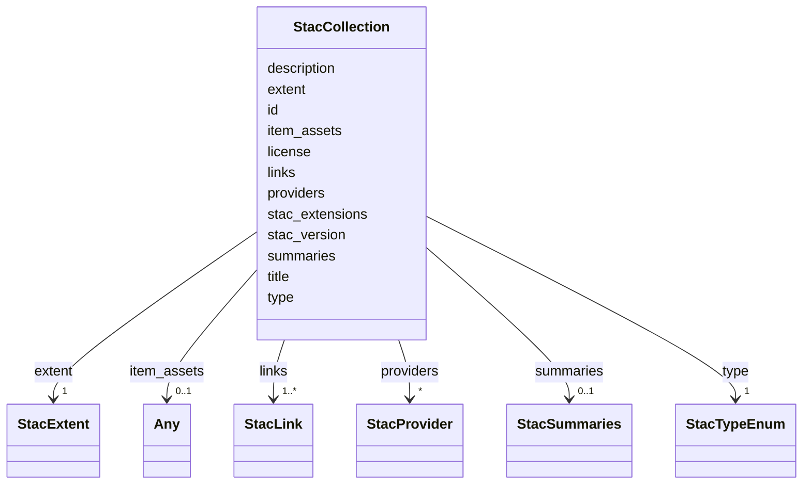

# Class: StacCollection 


_A STAC 1.1 Collection — flat Catalog plus license, extent, optional summaries, optional providers, optional item_assets. Closes R4-masked audit row for `apps/vscode/src/types/stac.ts`. Persisted to `<store>/<catalog>/catalog.json` for stores upgraded to STAC 1.1._


URI: [debrief:class/StacCollection](https://debrief.info/schemas/class/StacCollection)





<!-- no inheritance hierarchy -->


## Slots

| Name | Cardinality and Range | Description | Inheritance |
| ---  | --- | --- | --- |
| [type](../slots/type.md) | 1 <br/> [StacTypeEnum](../enums/StacTypeEnum.md) | STAC discriminator — always "Collection" | direct |
| [stac_version](../slots/stac_version.md) | 1 <br/> [String](../types/String.md) | STAC version string (always "1 | direct |
| [stac_extensions](../slots/stac_extensions.md) | * <br/> [String](../types/String.md) | Optional STAC extension schema URIs | direct |
| [id](../slots/id.md) | 1 <br/> [String](../types/String.md) | Collection identifier | direct |
| [title](../slots/title.md) | 0..1 <br/> [String](../types/String.md) | Human-readable collection title | direct |
| [description](../slots/description.md) | 1 <br/> [String](../types/String.md) | STAC-mandated collection description | direct |
| [license](../slots/license.md) | 1 <br/> [String](../types/String.md) | SPDX identifier or "other" (STAC 1 | direct |
| [extent](../slots/extent.md) | 1 <br/> [StacExtent](../classes/StacExtent.md) | Spatial + temporal extent | direct |
| [summaries](../slots/summaries.md) | 0..1 <br/> [StacSummaries](../classes/StacSummaries.md) | Optional pre-aggregated extension summaries (open-record per Research R-002) | direct |
| [providers](../slots/providers.md) | * <br/> [StacProvider](../classes/StacProvider.md) | Organisations involved in producing / hosting this collection (STAC 1 | direct |
| [item_assets](../slots/item_assets.md) | 0..1 <br/> [Any](../classes/Any.md) | Optional Item-asset declarations (STAC 1 | direct |
| [links](../slots/links.md) | 1..* <br/> [StacLink](../classes/StacLink.md) | Collection navigation links — `self`, `root`, `parent`, `item` entries pointi... | direct |


## Identifier and Mapping Information


### Schema Source


* from schema: https://debrief.info/schemas/debrief


## Mappings

| Mapping Type | Mapped Value |
| ---  | ---  |
| self | debrief:StacCollection |
| native | debrief:StacCollection |


## LinkML Source

<!-- TODO: investigate https://stackoverflow.com/questions/37606292/how-to-create-tabbed-code-blocks-in-mkdocs-or-sphinx -->

### Direct

<details>
```yaml
name: StacCollection
description: A STAC 1.1 Collection — flat Catalog plus license, extent, optional summaries,
  optional providers, optional item_assets. Closes R4-masked audit row for `apps/vscode/src/types/stac.ts`.
  Persisted to `<store>/<catalog>/catalog.json` for stores upgraded to STAC 1.1.
from_schema: https://debrief.info/schemas/debrief
attributes:
  type:
    name: type
    description: STAC discriminator — always "Collection".
    from_schema: https://debrief.info/schemas/stac
    domain_of:
    - GeoJSONPoint
    - GeoJSONEmptyPoint
    - GeoJSONLineString
    - GeoJSONPolygon
    - GeoJSONMultiPoint
    - GeoJSONMultiLineString
    - GeoJSONMultiPolygon
    - TrackFeature
    - ReferenceLocation
    - SystemState
    - MultiPointFeature
    - MultiPolygonFeature
    - NarrativeEntry
    - CircleAnnotation
    - RectangleAnnotation
    - LineAnnotation
    - TextAnnotation
    - VectorAnnotation
    - PolyAnnotation
    - ToolParameter
    - FileProvEntry
    - StacItem
    - StacCatalog
    - StacLink
    - StacAsset
    - StacItemAssetDefinition
    - StacCollection
    - RawGeoJSONFeature
    - RawGeoJSONFeatureCollection
    - DatasetAxisMetadata
    - DatasetEntry
    - StoryboardFeature
    - SceneFeature
    - SceneThumbnailAssetEntry
    - MCPContentItem
    - MCPParamSchema
    - ToolsUpdateMessage
    range: StacTypeEnum
    required: true
    equals_string: Collection
  stac_version:
    name: stac_version
    description: STAC version string (always "1.1.0" in current fixtures).
    from_schema: https://debrief.info/schemas/stac
    domain_of:
    - StacItem
    - StacCatalog
    - StacCollection
    range: string
    required: true
  stac_extensions:
    name: stac_extensions
    description: Optional STAC extension schema URIs.
    from_schema: https://debrief.info/schemas/stac
    domain_of:
    - StacItem
    - StacCatalog
    - StacCollection
    range: string
    required: false
    multivalued: true
  id:
    name: id
    description: Collection identifier.
    from_schema: https://debrief.info/schemas/stac
    domain_of:
    - TrackFeature
    - ReferenceLocation
    - SystemState
    - MultiPointFeature
    - MultiPolygonFeature
    - NarrativeEntry
    - CircleAnnotation
    - RectangleAnnotation
    - LineAnnotation
    - TextAnnotation
    - VectorAnnotation
    - PolyAnnotation
    - Tool
    - PlatformRecord
    - PlotSummary
    - StacItemSummary
    - StacItem
    - StacCatalog
    - StacCollection
    - RawGeoJSONFeature
    - StoryboardProperties
    - SceneProperties
    - StoryboardFeature
    - SceneFeature
    - ToolDefinition
    range: string
    required: true
  title:
    name: title
    description: Human-readable collection title.
    from_schema: https://debrief.info/schemas/stac
    domain_of:
    - PlotSummary
    - StacItemSummary
    - StacItemProperties
    - StacCatalog
    - StacLink
    - StacAsset
    - StacItemAssetDefinition
    - StacCollection
    - DatasetEntry
    - SceneProperties
    - SceneThumbnailAssetEntry
    range: string
    required: false
  description:
    name: description
    description: STAC-mandated collection description.
    from_schema: https://debrief.info/schemas/stac
    domain_of:
    - ReferenceLocationProperties
    - MultiPointFeatureProperties
    - MultiPolygonFeatureProperties
    - Tool
    - ToolParameter
    - StacProvider
    - StacItemProperties
    - StacCatalog
    - StacAsset
    - StacItemAssetDefinition
    - StacCollection
    - LevelDefinition
    - StoryboardProperties
    - SceneProperties
    - MCPParamSchema
    - MCPToolDefinition
    - ToolDefinition
    range: string
    required: true
  license:
    name: license
    description: SPDX identifier or "other" (STAC 1.1 mandates this).
    from_schema: https://debrief.info/schemas/stac
    domain_of:
    - StacItemProperties
    - StacCollection
    range: string
    required: true
  extent:
    name: extent
    description: Spatial + temporal extent.
    from_schema: https://debrief.info/schemas/stac
    rank: 1000
    domain_of:
    - StacCollection
    range: StacExtent
    required: true
    inlined: true
  summaries:
    name: summaries
    description: Optional pre-aggregated extension summaries (open-record per Research
      R-002).
    from_schema: https://debrief.info/schemas/stac
    rank: 1000
    domain_of:
    - StacCollection
    range: StacSummaries
    required: false
    inlined: true
  providers:
    name: providers
    description: Organisations involved in producing / hosting this collection (STAC
      1.1 addition).
    from_schema: https://debrief.info/schemas/stac
    domain_of:
    - StacItemProperties
    - StacCollection
    range: StacProvider
    required: false
    multivalued: true
    inlined: true
    inlined_as_list: true
  item_assets:
    name: item_assets
    description: Optional Item-asset declarations (STAC 1.1 addition). Each entry
      is a `StacItemAssetDefinition` (no `href`) — distinct from the concrete `StacAsset`
      shape used by `StacItem.assets[<key>]`. The generator post-processor rewrites
      this to `dict[str, StacItemAssetDefinition]` (Pydantic) / `Record<string, StacItemAssetDefinition>`
      (TypeScript) so the call site narrows correctly.
    from_schema: https://debrief.info/schemas/stac
    rank: 1000
    domain_of:
    - StacCollection
    range: Any
    required: false
  links:
    name: links
    description: Collection navigation links — `self`, `root`, `parent`, `item` entries
      pointing at child Items.
    from_schema: https://debrief.info/schemas/stac
    domain_of:
    - StacItem
    - StacCatalog
    - StacCollection
    range: StacLink
    required: true
    multivalued: true
    inlined: true
    inlined_as_list: true

```
</details>

### Induced

<details>
```yaml
name: StacCollection
description: A STAC 1.1 Collection — flat Catalog plus license, extent, optional summaries,
  optional providers, optional item_assets. Closes R4-masked audit row for `apps/vscode/src/types/stac.ts`.
  Persisted to `<store>/<catalog>/catalog.json` for stores upgraded to STAC 1.1.
from_schema: https://debrief.info/schemas/debrief
attributes:
  type:
    name: type
    description: STAC discriminator — always "Collection".
    from_schema: https://debrief.info/schemas/stac
    alias: type
    owner: StacCollection
    domain_of:
    - GeoJSONPoint
    - GeoJSONEmptyPoint
    - GeoJSONLineString
    - GeoJSONPolygon
    - GeoJSONMultiPoint
    - GeoJSONMultiLineString
    - GeoJSONMultiPolygon
    - TrackFeature
    - ReferenceLocation
    - SystemState
    - MultiPointFeature
    - MultiPolygonFeature
    - NarrativeEntry
    - CircleAnnotation
    - RectangleAnnotation
    - LineAnnotation
    - TextAnnotation
    - VectorAnnotation
    - PolyAnnotation
    - ToolParameter
    - FileProvEntry
    - StacItem
    - StacCatalog
    - StacLink
    - StacAsset
    - StacItemAssetDefinition
    - StacCollection
    - RawGeoJSONFeature
    - RawGeoJSONFeatureCollection
    - DatasetAxisMetadata
    - DatasetEntry
    - StoryboardFeature
    - SceneFeature
    - SceneThumbnailAssetEntry
    - MCPContentItem
    - MCPParamSchema
    - ToolsUpdateMessage
    range: StacTypeEnum
    required: true
    equals_string: Collection
  stac_version:
    name: stac_version
    description: STAC version string (always "1.1.0" in current fixtures).
    from_schema: https://debrief.info/schemas/stac
    alias: stac_version
    owner: StacCollection
    domain_of:
    - StacItem
    - StacCatalog
    - StacCollection
    range: string
    required: true
  stac_extensions:
    name: stac_extensions
    description: Optional STAC extension schema URIs.
    from_schema: https://debrief.info/schemas/stac
    alias: stac_extensions
    owner: StacCollection
    domain_of:
    - StacItem
    - StacCatalog
    - StacCollection
    range: string
    required: false
    multivalued: true
  id:
    name: id
    description: Collection identifier.
    from_schema: https://debrief.info/schemas/stac
    alias: id
    owner: StacCollection
    domain_of:
    - TrackFeature
    - ReferenceLocation
    - SystemState
    - MultiPointFeature
    - MultiPolygonFeature
    - NarrativeEntry
    - CircleAnnotation
    - RectangleAnnotation
    - LineAnnotation
    - TextAnnotation
    - VectorAnnotation
    - PolyAnnotation
    - Tool
    - PlatformRecord
    - PlotSummary
    - StacItemSummary
    - StacItem
    - StacCatalog
    - StacCollection
    - RawGeoJSONFeature
    - StoryboardProperties
    - SceneProperties
    - StoryboardFeature
    - SceneFeature
    - ToolDefinition
    range: string
    required: true
  title:
    name: title
    description: Human-readable collection title.
    from_schema: https://debrief.info/schemas/stac
    alias: title
    owner: StacCollection
    domain_of:
    - PlotSummary
    - StacItemSummary
    - StacItemProperties
    - StacCatalog
    - StacLink
    - StacAsset
    - StacItemAssetDefinition
    - StacCollection
    - DatasetEntry
    - SceneProperties
    - SceneThumbnailAssetEntry
    range: string
    required: false
  description:
    name: description
    description: STAC-mandated collection description.
    from_schema: https://debrief.info/schemas/stac
    alias: description
    owner: StacCollection
    domain_of:
    - ReferenceLocationProperties
    - MultiPointFeatureProperties
    - MultiPolygonFeatureProperties
    - Tool
    - ToolParameter
    - StacProvider
    - StacItemProperties
    - StacCatalog
    - StacAsset
    - StacItemAssetDefinition
    - StacCollection
    - LevelDefinition
    - StoryboardProperties
    - SceneProperties
    - MCPParamSchema
    - MCPToolDefinition
    - ToolDefinition
    range: string
    required: true
  license:
    name: license
    description: SPDX identifier or "other" (STAC 1.1 mandates this).
    from_schema: https://debrief.info/schemas/stac
    alias: license
    owner: StacCollection
    domain_of:
    - StacItemProperties
    - StacCollection
    range: string
    required: true
  extent:
    name: extent
    description: Spatial + temporal extent.
    from_schema: https://debrief.info/schemas/stac
    rank: 1000
    alias: extent
    owner: StacCollection
    domain_of:
    - StacCollection
    range: StacExtent
    required: true
    inlined: true
  summaries:
    name: summaries
    description: Optional pre-aggregated extension summaries (open-record per Research
      R-002).
    from_schema: https://debrief.info/schemas/stac
    rank: 1000
    alias: summaries
    owner: StacCollection
    domain_of:
    - StacCollection
    range: StacSummaries
    required: false
    inlined: true
  providers:
    name: providers
    description: Organisations involved in producing / hosting this collection (STAC
      1.1 addition).
    from_schema: https://debrief.info/schemas/stac
    alias: providers
    owner: StacCollection
    domain_of:
    - StacItemProperties
    - StacCollection
    range: StacProvider
    required: false
    multivalued: true
    inlined: true
    inlined_as_list: true
  item_assets:
    name: item_assets
    description: Optional Item-asset declarations (STAC 1.1 addition). Each entry
      is a `StacItemAssetDefinition` (no `href`) — distinct from the concrete `StacAsset`
      shape used by `StacItem.assets[<key>]`. The generator post-processor rewrites
      this to `dict[str, StacItemAssetDefinition]` (Pydantic) / `Record<string, StacItemAssetDefinition>`
      (TypeScript) so the call site narrows correctly.
    from_schema: https://debrief.info/schemas/stac
    rank: 1000
    alias: item_assets
    owner: StacCollection
    domain_of:
    - StacCollection
    range: Any
    required: false
  links:
    name: links
    description: Collection navigation links — `self`, `root`, `parent`, `item` entries
      pointing at child Items.
    from_schema: https://debrief.info/schemas/stac
    alias: links
    owner: StacCollection
    domain_of:
    - StacItem
    - StacCatalog
    - StacCollection
    range: StacLink
    required: true
    multivalued: true
    inlined: true
    inlined_as_list: true

```
</details>