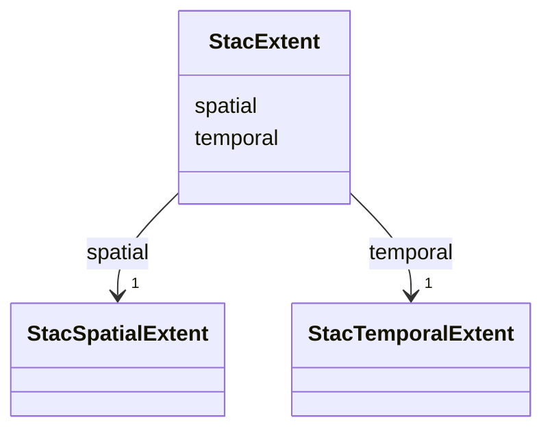

# Class: StacExtent 


_Spatial + temporal extent on a Collection. Closes R4-masked audit row for `apps/vscode/src/types/stac.ts`._


URI: [debrief:class/StacExtent](https://debrief.info/schemas/class/StacExtent)





<!-- no inheritance hierarchy -->


## Slots

| Name | Cardinality and Range | Description | Inheritance |
| ---  | --- | --- | --- |
| [spatial](../slots/spatial.md) | 1 <br/> [StacSpatialExtent](../classes/StacSpatialExtent.md) | Spatial extent — one or more bounding boxes | direct |
| [temporal](../slots/temporal.md) | 1 <br/> [StacTemporalExtent](../classes/StacTemporalExtent.md) | Temporal extent — one or more start/end intervals | direct |


## Usages

| used by | used in | type | used |
| ---  | --- | --- | --- |
| [StacCollection](../classes/StacCollection.md) | [extent](../slots/extent.md) | range | [StacExtent](../classes/StacExtent.md) |


## Identifier and Mapping Information


### Schema Source


* from schema: https://debrief.info/schemas/debrief


## Mappings

| Mapping Type | Mapped Value |
| ---  | ---  |
| self | debrief:StacExtent |
| native | debrief:StacExtent |


## LinkML Source

<!-- TODO: investigate https://stackoverflow.com/questions/37606292/how-to-create-tabbed-code-blocks-in-mkdocs-or-sphinx -->

### Direct

<details>
```yaml
name: StacExtent
description: Spatial + temporal extent on a Collection. Closes R4-masked audit row
  for `apps/vscode/src/types/stac.ts`.
from_schema: https://debrief.info/schemas/debrief
attributes:
  spatial:
    name: spatial
    description: Spatial extent — one or more bounding boxes.
    from_schema: https://debrief.info/schemas/stac
    rank: 1000
    domain_of:
    - StacExtent
    - SessionState
    - SessionFile
    range: StacSpatialExtent
    required: true
    inlined: true
  temporal:
    name: temporal
    description: Temporal extent — one or more start/end intervals.
    from_schema: https://debrief.info/schemas/stac
    rank: 1000
    domain_of:
    - StacExtent
    - SessionState
    - SessionFile
    range: StacTemporalExtent
    required: true
    inlined: true

```
</details>

### Induced

<details>
```yaml
name: StacExtent
description: Spatial + temporal extent on a Collection. Closes R4-masked audit row
  for `apps/vscode/src/types/stac.ts`.
from_schema: https://debrief.info/schemas/debrief
attributes:
  spatial:
    name: spatial
    description: Spatial extent — one or more bounding boxes.
    from_schema: https://debrief.info/schemas/stac
    rank: 1000
    alias: spatial
    owner: StacExtent
    domain_of:
    - StacExtent
    - SessionState
    - SessionFile
    range: StacSpatialExtent
    required: true
    inlined: true
  temporal:
    name: temporal
    description: Temporal extent — one or more start/end intervals.
    from_schema: https://debrief.info/schemas/stac
    rank: 1000
    alias: temporal
    owner: StacExtent
    domain_of:
    - StacExtent
    - SessionState
    - SessionFile
    range: StacTemporalExtent
    required: true
    inlined: true

```
</details>