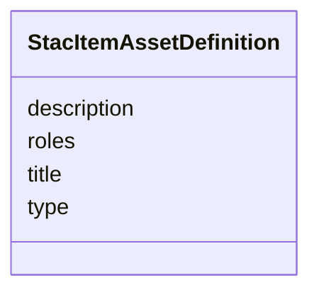

# Class: StacItemAssetDefinition 


_Item Asset Definition Object — declares the shape of an asset that child Items in a Collection are expected to carry. Distinct from `StacAsset` because it does NOT carry an `href`; the asset URI lives on the concrete Item assets that conform to this template (see STAC 1.1 Item Asset Definition spec)._

_Open-record per Article XV.2 — same boundary-loose semantics as `StacAsset` so item-asset declarations may carry extension keys. The generator post-processes this class with Pydantic `extra='allow'` and TypeScript `[key: string]: unknown`._


URI: [debrief:class/StacItemAssetDefinition](https://debrief.info/schemas/class/StacItemAssetDefinition)





<!-- no inheritance hierarchy -->


## Slots

| Name | Cardinality and Range | Description | Inheritance |
| ---  | --- | --- | --- |
| [type](../slots/type.md) | 0..1 <br/> [String](../types/String.md) | IANA media type expected on child Item assets | direct |
| [title](../slots/title.md) | 0..1 <br/> [String](../types/String.md) | Human-readable asset title | direct |
| [description](../slots/description.md) | 0..1 <br/> [String](../types/String.md) | Asset description | direct |
| [roles](../slots/roles.md) | * <br/> [String](../types/String.md) | Asset roles expected on child Item assets | direct |


## Identifier and Mapping Information


### Schema Source


* from schema: https://debrief.info/schemas/debrief


## Mappings

| Mapping Type | Mapped Value |
| ---  | ---  |
| self | debrief:StacItemAssetDefinition |
| native | debrief:StacItemAssetDefinition |


## LinkML Source

<!-- TODO: investigate https://stackoverflow.com/questions/37606292/how-to-create-tabbed-code-blocks-in-mkdocs-or-sphinx -->

### Direct

<details>
```yaml
name: StacItemAssetDefinition
description: 'Item Asset Definition Object — declares the shape of an asset that child
  Items in a Collection are expected to carry. Distinct from `StacAsset` because it
  does NOT carry an `href`; the asset URI lives on the concrete Item assets that conform
  to this template (see STAC 1.1 Item Asset Definition spec).

  Open-record per Article XV.2 — same boundary-loose semantics as `StacAsset` so item-asset
  declarations may carry extension keys. The generator post-processes this class with
  Pydantic `extra=''allow''` and TypeScript `[key: string]: unknown`.'
from_schema: https://debrief.info/schemas/debrief
attributes:
  type:
    name: type
    description: IANA media type expected on child Item assets.
    from_schema: https://debrief.info/schemas/stac
    domain_of:
    - GeoJSONPoint
    - GeoJSONEmptyPoint
    - GeoJSONLineString
    - GeoJSONPolygon
    - GeoJSONMultiPoint
    - GeoJSONMultiLineString
    - GeoJSONMultiPolygon
    - TrackFeature
    - ReferenceLocation
    - SystemState
    - MultiPointFeature
    - MultiPolygonFeature
    - NarrativeEntry
    - CircleAnnotation
    - RectangleAnnotation
    - LineAnnotation
    - TextAnnotation
    - VectorAnnotation
    - PolyAnnotation
    - ToolParameter
    - FileProvEntry
    - StacItem
    - StacCatalog
    - StacLink
    - StacAsset
    - StacItemAssetDefinition
    - StacCollection
    - RawGeoJSONFeature
    - RawGeoJSONFeatureCollection
    - DatasetAxisMetadata
    - DatasetEntry
    - StoryboardFeature
    - SceneFeature
    - SceneThumbnailAssetEntry
    - MCPContentItem
    - MCPParamSchema
    - ToolsUpdateMessage
    range: string
    required: false
  title:
    name: title
    description: Human-readable asset title.
    from_schema: https://debrief.info/schemas/stac
    domain_of:
    - PlotSummary
    - StacItemSummary
    - StacItemProperties
    - StacCatalog
    - StacLink
    - StacAsset
    - StacItemAssetDefinition
    - StacCollection
    - DatasetEntry
    - SceneProperties
    - SceneThumbnailAssetEntry
    range: string
    required: false
  description:
    name: description
    description: Asset description.
    from_schema: https://debrief.info/schemas/stac
    domain_of:
    - ReferenceLocationProperties
    - MultiPointFeatureProperties
    - MultiPolygonFeatureProperties
    - Tool
    - ToolParameter
    - StacProvider
    - StacItemProperties
    - StacCatalog
    - StacAsset
    - StacItemAssetDefinition
    - StacCollection
    - LevelDefinition
    - StoryboardProperties
    - SceneProperties
    - MCPParamSchema
    - MCPToolDefinition
    - ToolDefinition
    range: string
    required: false
  roles:
    name: roles
    description: Asset roles expected on child Item assets.
    from_schema: https://debrief.info/schemas/stac
    domain_of:
    - StacProvider
    - StacAsset
    - StacItemAssetDefinition
    - SceneThumbnailAssetEntry
    range: string
    required: false
    multivalued: true

```
</details>

### Induced

<details>
```yaml
name: StacItemAssetDefinition
description: 'Item Asset Definition Object — declares the shape of an asset that child
  Items in a Collection are expected to carry. Distinct from `StacAsset` because it
  does NOT carry an `href`; the asset URI lives on the concrete Item assets that conform
  to this template (see STAC 1.1 Item Asset Definition spec).

  Open-record per Article XV.2 — same boundary-loose semantics as `StacAsset` so item-asset
  declarations may carry extension keys. The generator post-processes this class with
  Pydantic `extra=''allow''` and TypeScript `[key: string]: unknown`.'
from_schema: https://debrief.info/schemas/debrief
attributes:
  type:
    name: type
    description: IANA media type expected on child Item assets.
    from_schema: https://debrief.info/schemas/stac
    alias: type
    owner: StacItemAssetDefinition
    domain_of:
    - GeoJSONPoint
    - GeoJSONEmptyPoint
    - GeoJSONLineString
    - GeoJSONPolygon
    - GeoJSONMultiPoint
    - GeoJSONMultiLineString
    - GeoJSONMultiPolygon
    - TrackFeature
    - ReferenceLocation
    - SystemState
    - MultiPointFeature
    - MultiPolygonFeature
    - NarrativeEntry
    - CircleAnnotation
    - RectangleAnnotation
    - LineAnnotation
    - TextAnnotation
    - VectorAnnotation
    - PolyAnnotation
    - ToolParameter
    - FileProvEntry
    - StacItem
    - StacCatalog
    - StacLink
    - StacAsset
    - StacItemAssetDefinition
    - StacCollection
    - RawGeoJSONFeature
    - RawGeoJSONFeatureCollection
    - DatasetAxisMetadata
    - DatasetEntry
    - StoryboardFeature
    - SceneFeature
    - SceneThumbnailAssetEntry
    - MCPContentItem
    - MCPParamSchema
    - ToolsUpdateMessage
    range: string
    required: false
  title:
    name: title
    description: Human-readable asset title.
    from_schema: https://debrief.info/schemas/stac
    alias: title
    owner: StacItemAssetDefinition
    domain_of:
    - PlotSummary
    - StacItemSummary
    - StacItemProperties
    - StacCatalog
    - StacLink
    - StacAsset
    - StacItemAssetDefinition
    - StacCollection
    - DatasetEntry
    - SceneProperties
    - SceneThumbnailAssetEntry
    range: string
    required: false
  description:
    name: description
    description: Asset description.
    from_schema: https://debrief.info/schemas/stac
    alias: description
    owner: StacItemAssetDefinition
    domain_of:
    - ReferenceLocationProperties
    - MultiPointFeatureProperties
    - MultiPolygonFeatureProperties
    - Tool
    - ToolParameter
    - StacProvider
    - StacItemProperties
    - StacCatalog
    - StacAsset
    - StacItemAssetDefinition
    - StacCollection
    - LevelDefinition
    - StoryboardProperties
    - SceneProperties
    - MCPParamSchema
    - MCPToolDefinition
    - ToolDefinition
    range: string
    required: false
  roles:
    name: roles
    description: Asset roles expected on child Item assets.
    from_schema: https://debrief.info/schemas/stac
    alias: roles
    owner: StacItemAssetDefinition
    domain_of:
    - StacProvider
    - StacAsset
    - StacItemAssetDefinition
    - SceneThumbnailAssetEntry
    range: string
    required: false
    multivalued: true

```
</details>