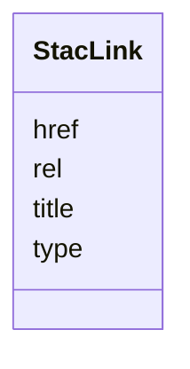

# Class: StacLink 


_A single link entry within `links[]`. Used by StacItem, StacCatalog, and StacCollection. Closes R4-masked audit row for `apps/vscode/src/types/stac.ts`._


URI: [debrief:class/StacLink](https://debrief.info/schemas/class/StacLink)





<!-- no inheritance hierarchy -->


## Slots

| Name | Cardinality and Range | Description | Inheritance |
| ---  | --- | --- | --- |
| [rel](../slots/rel.md) | 1 <br/> [String](../types/String.md) | Link relation (`self`, `root`, `parent`, `item`, `child`, `derived_from`, etc | direct |
| [href](../slots/href.md) | 1 <br/> [String](../types/String.md) | URI (relative or absolute) to the linked resource | direct |
| [type](../slots/type.md) | 0..1 <br/> [String](../types/String.md) | IANA media type of the linked resource | direct |
| [title](../slots/title.md) | 0..1 <br/> [String](../types/String.md) | Human-readable link title | direct |


## Usages

| used by | used in | type | used |
| ---  | --- | --- | --- |
| [StacItem](../classes/StacItem.md) | [links](../slots/links.md) | range | [StacLink](../classes/StacLink.md) |
| [StacCatalog](../classes/StacCatalog.md) | [links](../slots/links.md) | range | [StacLink](../classes/StacLink.md) |
| [StacCollection](../classes/StacCollection.md) | [links](../slots/links.md) | range | [StacLink](../classes/StacLink.md) |


## Identifier and Mapping Information


### Schema Source


* from schema: https://debrief.info/schemas/debrief


## Mappings

| Mapping Type | Mapped Value |
| ---  | ---  |
| self | debrief:StacLink |
| native | debrief:StacLink |


## LinkML Source

<!-- TODO: investigate https://stackoverflow.com/questions/37606292/how-to-create-tabbed-code-blocks-in-mkdocs-or-sphinx -->

### Direct

<details>
```yaml
name: StacLink
description: A single link entry within `links[]`. Used by StacItem, StacCatalog,
  and StacCollection. Closes R4-masked audit row for `apps/vscode/src/types/stac.ts`.
from_schema: https://debrief.info/schemas/debrief
attributes:
  rel:
    name: rel
    description: Link relation (`self`, `root`, `parent`, `item`, `child`, `derived_from`,
      etc.).
    from_schema: https://debrief.info/schemas/stac
    rank: 1000
    domain_of:
    - StacLink
    range: string
    required: true
  href:
    name: href
    description: URI (relative or absolute) to the linked resource.
    from_schema: https://debrief.info/schemas/stac
    rank: 1000
    domain_of:
    - StacLink
    - StacAsset
    - ToolResultAnnotations
    - SceneThumbnailAssetEntry
    range: string
    required: true
  type:
    name: type
    description: IANA media type of the linked resource.
    from_schema: https://debrief.info/schemas/stac
    domain_of:
    - GeoJSONPoint
    - GeoJSONEmptyPoint
    - GeoJSONLineString
    - GeoJSONPolygon
    - GeoJSONMultiPoint
    - GeoJSONMultiLineString
    - GeoJSONMultiPolygon
    - TrackFeature
    - ReferenceLocation
    - SystemState
    - MultiPointFeature
    - MultiPolygonFeature
    - NarrativeEntry
    - CircleAnnotation
    - RectangleAnnotation
    - LineAnnotation
    - TextAnnotation
    - VectorAnnotation
    - PolyAnnotation
    - ToolParameter
    - FileProvEntry
    - StacItem
    - StacCatalog
    - StacLink
    - StacAsset
    - StacItemAssetDefinition
    - StacCollection
    - RawGeoJSONFeature
    - RawGeoJSONFeatureCollection
    - DatasetAxisMetadata
    - DatasetEntry
    - StoryboardFeature
    - SceneFeature
    - SceneThumbnailAssetEntry
    - MCPContentItem
    - MCPParamSchema
    - ToolsUpdateMessage
    range: string
    required: false
  title:
    name: title
    description: Human-readable link title.
    from_schema: https://debrief.info/schemas/stac
    domain_of:
    - PlotSummary
    - StacItemSummary
    - StacItemProperties
    - StacCatalog
    - StacLink
    - StacAsset
    - StacItemAssetDefinition
    - StacCollection
    - DatasetEntry
    - SceneProperties
    - SceneThumbnailAssetEntry
    range: string
    required: false

```
</details>

### Induced

<details>
```yaml
name: StacLink
description: A single link entry within `links[]`. Used by StacItem, StacCatalog,
  and StacCollection. Closes R4-masked audit row for `apps/vscode/src/types/stac.ts`.
from_schema: https://debrief.info/schemas/debrief
attributes:
  rel:
    name: rel
    description: Link relation (`self`, `root`, `parent`, `item`, `child`, `derived_from`,
      etc.).
    from_schema: https://debrief.info/schemas/stac
    rank: 1000
    alias: rel
    owner: StacLink
    domain_of:
    - StacLink
    range: string
    required: true
  href:
    name: href
    description: URI (relative or absolute) to the linked resource.
    from_schema: https://debrief.info/schemas/stac
    rank: 1000
    alias: href
    owner: StacLink
    domain_of:
    - StacLink
    - StacAsset
    - ToolResultAnnotations
    - SceneThumbnailAssetEntry
    range: string
    required: true
  type:
    name: type
    description: IANA media type of the linked resource.
    from_schema: https://debrief.info/schemas/stac
    alias: type
    owner: StacLink
    domain_of:
    - GeoJSONPoint
    - GeoJSONEmptyPoint
    - GeoJSONLineString
    - GeoJSONPolygon
    - GeoJSONMultiPoint
    - GeoJSONMultiLineString
    - GeoJSONMultiPolygon
    - TrackFeature
    - ReferenceLocation
    - SystemState
    - MultiPointFeature
    - MultiPolygonFeature
    - NarrativeEntry
    - CircleAnnotation
    - RectangleAnnotation
    - LineAnnotation
    - TextAnnotation
    - VectorAnnotation
    - PolyAnnotation
    - ToolParameter
    - FileProvEntry
    - StacItem
    - StacCatalog
    - StacLink
    - StacAsset
    - StacItemAssetDefinition
    - StacCollection
    - RawGeoJSONFeature
    - RawGeoJSONFeatureCollection
    - DatasetAxisMetadata
    - DatasetEntry
    - StoryboardFeature
    - SceneFeature
    - SceneThumbnailAssetEntry
    - MCPContentItem
    - MCPParamSchema
    - ToolsUpdateMessage
    range: string
    required: false
  title:
    name: title
    description: Human-readable link title.
    from_schema: https://debrief.info/schemas/stac
    alias: title
    owner: StacLink
    domain_of:
    - PlotSummary
    - StacItemSummary
    - StacItemProperties
    - StacCatalog
    - StacLink
    - StacAsset
    - StacItemAssetDefinition
    - StacCollection
    - DatasetEntry
    - SceneProperties
    - SceneThumbnailAssetEntry
    range: string
    required: false

```
</details>