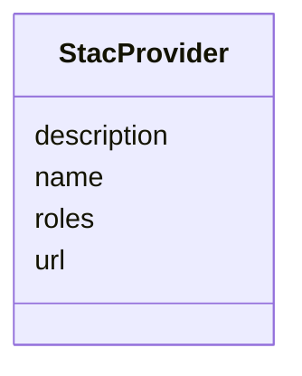

# Class: StacProvider 


_STAC provider entry. Captures organisations involved in producing or hosting the asset. STAC 1.1 spec — present in every live preview/workspace/samples/local-store/ item.json under `properties.providers`. Captured explicitly (rather than as a wildcard) because the shape is stable in the STAC spec._


URI: [debrief:class/StacProvider](https://debrief.info/schemas/class/StacProvider)





<!-- no inheritance hierarchy -->


## Slots

| Name | Cardinality and Range | Description | Inheritance |
| ---  | --- | --- | --- |
| [name](../slots/name.md) | 1 <br/> [String](../types/String.md) | Organization or person responsible for providing the data | direct |
| [description](../slots/description.md) | 0..1 <br/> [String](../types/String.md) | Optional human-readable description | direct |
| [roles](../slots/roles.md) | * <br/> [String](../types/String.md) | Roles played by this provider — "licensor", "producer", "processor", or "host... | direct |
| [url](../slots/url.md) | 0..1 <br/> [String](../types/String.md) | Provider homepage / contact URL | direct |


## Usages

| used by | used in | type | used |
| ---  | --- | --- | --- |
| [StacItemProperties](../classes/StacItemProperties.md) | [providers](../slots/providers.md) | range | [StacProvider](../classes/StacProvider.md) |
| [StacCollection](../classes/StacCollection.md) | [providers](../slots/providers.md) | range | [StacProvider](../classes/StacProvider.md) |


## Identifier and Mapping Information


### Schema Source


* from schema: https://debrief.info/schemas/debrief


## Mappings

| Mapping Type | Mapped Value |
| ---  | ---  |
| self | debrief:StacProvider |
| native | debrief:StacProvider |


## LinkML Source

<!-- TODO: investigate https://stackoverflow.com/questions/37606292/how-to-create-tabbed-code-blocks-in-mkdocs-or-sphinx -->

### Direct

<details>
```yaml
name: StacProvider
description: STAC provider entry. Captures organisations involved in producing or
  hosting the asset. STAC 1.1 spec — present in every live preview/workspace/samples/local-store/
  item.json under `properties.providers`. Captured explicitly (rather than as a wildcard)
  because the shape is stable in the STAC spec.
from_schema: https://debrief.info/schemas/debrief
attributes:
  name:
    name: name
    description: Organization or person responsible for providing the data.
    from_schema: https://debrief.info/schemas/stac
    domain_of:
    - SegmentMetadata
    - SensorData
    - TUAData
    - PointMetadataEntry
    - ReferenceLocationProperties
    - Tool
    - ToolParameter
    - PlatformRecord
    - StacProvider
    - LevelDefinition
    - DatasetSeries
    - StoryboardProperties
    - MCPToolDefinition
    - ToolDefinition
    range: string
    required: true
  description:
    name: description
    description: Optional human-readable description.
    from_schema: https://debrief.info/schemas/stac
    domain_of:
    - ReferenceLocationProperties
    - MultiPointFeatureProperties
    - MultiPolygonFeatureProperties
    - Tool
    - ToolParameter
    - StacProvider
    - StacItemProperties
    - StacCatalog
    - StacAsset
    - StacItemAssetDefinition
    - StacCollection
    - LevelDefinition
    - StoryboardProperties
    - SceneProperties
    - MCPParamSchema
    - MCPToolDefinition
    - ToolDefinition
    range: string
    required: false
  roles:
    name: roles
    description: Roles played by this provider — "licensor", "producer", "processor",
      or "host".
    from_schema: https://debrief.info/schemas/stac
    rank: 1000
    domain_of:
    - StacProvider
    - StacAsset
    - StacItemAssetDefinition
    - SceneThumbnailAssetEntry
    range: string
    required: false
    multivalued: true
  url:
    name: url
    description: Provider homepage / contact URL.
    from_schema: https://debrief.info/schemas/stac
    rank: 1000
    domain_of:
    - StacProvider
    range: string
    required: false

```
</details>

### Induced

<details>
```yaml
name: StacProvider
description: STAC provider entry. Captures organisations involved in producing or
  hosting the asset. STAC 1.1 spec — present in every live preview/workspace/samples/local-store/
  item.json under `properties.providers`. Captured explicitly (rather than as a wildcard)
  because the shape is stable in the STAC spec.
from_schema: https://debrief.info/schemas/debrief
attributes:
  name:
    name: name
    description: Organization or person responsible for providing the data.
    from_schema: https://debrief.info/schemas/stac
    alias: name
    owner: StacProvider
    domain_of:
    - SegmentMetadata
    - SensorData
    - TUAData
    - PointMetadataEntry
    - ReferenceLocationProperties
    - Tool
    - ToolParameter
    - PlatformRecord
    - StacProvider
    - LevelDefinition
    - DatasetSeries
    - StoryboardProperties
    - MCPToolDefinition
    - ToolDefinition
    range: string
    required: true
  description:
    name: description
    description: Optional human-readable description.
    from_schema: https://debrief.info/schemas/stac
    alias: description
    owner: StacProvider
    domain_of:
    - ReferenceLocationProperties
    - MultiPointFeatureProperties
    - MultiPolygonFeatureProperties
    - Tool
    - ToolParameter
    - StacProvider
    - StacItemProperties
    - StacCatalog
    - StacAsset
    - StacItemAssetDefinition
    - StacCollection
    - LevelDefinition
    - StoryboardProperties
    - SceneProperties
    - MCPParamSchema
    - MCPToolDefinition
    - ToolDefinition
    range: string
    required: false
  roles:
    name: roles
    description: Roles played by this provider — "licensor", "producer", "processor",
      or "host".
    from_schema: https://debrief.info/schemas/stac
    rank: 1000
    alias: roles
    owner: StacProvider
    domain_of:
    - StacProvider
    - StacAsset
    - StacItemAssetDefinition
    - SceneThumbnailAssetEntry
    range: string
    required: false
    multivalued: true
  url:
    name: url
    description: Provider homepage / contact URL.
    from_schema: https://debrief.info/schemas/stac
    rank: 1000
    alias: url
    owner: StacProvider
    domain_of:
    - StacProvider
    range: string
    required: false

```
</details>