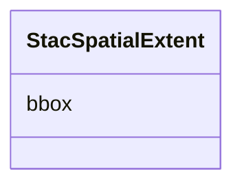

# Class: StacSpatialExtent 


_Spatial extent on a Collection. The wire shape is `{ "bbox": [[west, south, east, north], ...] }` — a list of bounding-box arrays. LinkML emits a flat `list[float]` / `number[]` which the post-processor in `shared/schemas/scripts/generate.py` rewrites to nested list-of-lists per Research R-011 (same precedent as GeoJSON coordinates)._


URI: [debrief:class/StacSpatialExtent](https://debrief.info/schemas/class/StacSpatialExtent)





<!-- no inheritance hierarchy -->


## Slots

| Name | Cardinality and Range | Description | Inheritance |
| ---  | --- | --- | --- |
| [bbox](../slots/bbox.md) | 1..* <br/> [Float](../types/Float.md) | List of bounding-box arrays `[[w, s, e, n],  | direct |


## Usages

| used by | used in | type | used |
| ---  | --- | --- | --- |
| [StacExtent](../classes/StacExtent.md) | [spatial](../slots/spatial.md) | range | [StacSpatialExtent](../classes/StacSpatialExtent.md) |


## Identifier and Mapping Information


### Schema Source


* from schema: https://debrief.info/schemas/debrief


## Mappings

| Mapping Type | Mapped Value |
| ---  | ---  |
| self | debrief:StacSpatialExtent |
| native | debrief:StacSpatialExtent |


## LinkML Source

<!-- TODO: investigate https://stackoverflow.com/questions/37606292/how-to-create-tabbed-code-blocks-in-mkdocs-or-sphinx -->

### Direct

<details>
```yaml
name: StacSpatialExtent
description: 'Spatial extent on a Collection. The wire shape is `{ "bbox": [[west,
  south, east, north], ...] }` — a list of bounding-box arrays. LinkML emits a flat
  `list[float]` / `number[]` which the post-processor in `shared/schemas/scripts/generate.py`
  rewrites to nested list-of-lists per Research R-011 (same precedent as GeoJSON coordinates).'
from_schema: https://debrief.info/schemas/debrief
attributes:
  bbox:
    name: bbox
    description: List of bounding-box arrays `[[w, s, e, n], ...]`. Each inner array
      is 4-element 2D or 6-element 3D.
    from_schema: https://debrief.info/schemas/stac
    domain_of:
    - TrackFeature
    - SystemStateProperties
    - MultiPointFeature
    - MultiPolygonFeature
    - PlotSummary
    - StacItemSummary
    - StacItem
    - StacSpatialExtent
    - RawGeoJSONFeature
    - RawGeoJSONFeatureCollection
    range: float
    required: true
    multivalued: true

```
</details>

### Induced

<details>
```yaml
name: StacSpatialExtent
description: 'Spatial extent on a Collection. The wire shape is `{ "bbox": [[west,
  south, east, north], ...] }` — a list of bounding-box arrays. LinkML emits a flat
  `list[float]` / `number[]` which the post-processor in `shared/schemas/scripts/generate.py`
  rewrites to nested list-of-lists per Research R-011 (same precedent as GeoJSON coordinates).'
from_schema: https://debrief.info/schemas/debrief
attributes:
  bbox:
    name: bbox
    description: List of bounding-box arrays `[[w, s, e, n], ...]`. Each inner array
      is 4-element 2D or 6-element 3D.
    from_schema: https://debrief.info/schemas/stac
    alias: bbox
    owner: StacSpatialExtent
    domain_of:
    - TrackFeature
    - SystemStateProperties
    - MultiPointFeature
    - MultiPolygonFeature
    - PlotSummary
    - StacItemSummary
    - StacItem
    - StacSpatialExtent
    - RawGeoJSONFeature
    - RawGeoJSONFeatureCollection
    range: float
    required: true
    multivalued: true

```
</details>