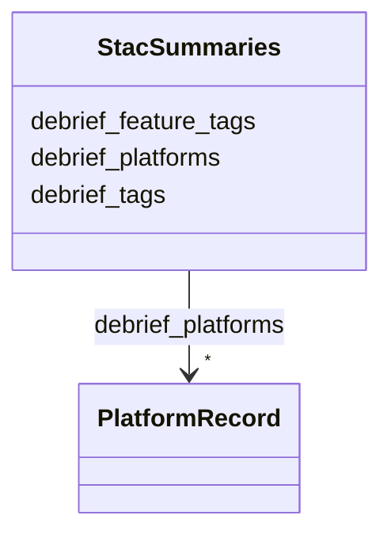

# Class: StacSummaries 


_Pre-aggregated extension summaries on a Collection. Closes R4-masked audit row for `apps/vscode/src/types/stac.ts`. Carries the debrief: extension summary fields plus open-record additional keys (Article XV.2 exception)._


URI: [debrief:class/StacSummaries](https://debrief.info/schemas/class/StacSummaries)





<!-- no inheritance hierarchy -->


## Slots

| Name | Cardinality and Range | Description | Inheritance |
| ---  | --- | --- | --- |
| [debrief_platforms](../slots/debrief_platforms.md) | * <br/> [PlatformRecord](../classes/PlatformRecord.md) | Aggregated per-platform metadata across all Items in the Collection | direct |
| [debrief_tags](../slots/debrief_tags.md) | * <br/> [String](../types/String.md) | Aggregated plot-level tags across all Items in the Collection | direct |
| [debrief_feature_tags](../slots/debrief_feature_tags.md) | * <br/> [String](../types/String.md) | Aggregated feature-level tags across all Items in the Collection | direct |


## Usages

| used by | used in | type | used |
| ---  | --- | --- | --- |
| [StacCollection](../classes/StacCollection.md) | [summaries](../slots/summaries.md) | range | [StacSummaries](../classes/StacSummaries.md) |


## Identifier and Mapping Information


### Schema Source


* from schema: https://debrief.info/schemas/debrief


## Mappings

| Mapping Type | Mapped Value |
| ---  | ---  |
| self | debrief:StacSummaries |
| native | debrief:StacSummaries |


## LinkML Source

<!-- TODO: investigate https://stackoverflow.com/questions/37606292/how-to-create-tabbed-code-blocks-in-mkdocs-or-sphinx -->

### Direct

<details>
```yaml
name: StacSummaries
description: 'Pre-aggregated extension summaries on a Collection. Closes R4-masked
  audit row for `apps/vscode/src/types/stac.ts`. Carries the debrief: extension summary
  fields plus open-record additional keys (Article XV.2 exception).'
from_schema: https://debrief.info/schemas/debrief
attributes:
  debrief_platforms:
    name: debrief_platforms
    description: Aggregated per-platform metadata across all Items in the Collection.
      Same shape as StacExtensionProperties.platforms. Disk key is `debrief:platforms`
      (colon syntax preserved via slot_uri).
    from_schema: https://debrief.info/schemas/stac
    rank: 1000
    slot_uri: debrief:platforms
    domain_of:
    - StacSummaries
    range: PlatformRecord
    required: false
    multivalued: true
    inlined: true
    inlined_as_list: true
  debrief_tags:
    name: debrief_tags
    description: Aggregated plot-level tags across all Items in the Collection. Disk
      key is `debrief:tags`.
    from_schema: https://debrief.info/schemas/stac
    rank: 1000
    slot_uri: debrief:tags
    domain_of:
    - StacSummaries
    range: string
    required: false
    multivalued: true
  debrief_feature_tags:
    name: debrief_feature_tags
    description: Aggregated feature-level tags across all Items in the Collection.
      Disk key is `debrief:feature_tags`.
    from_schema: https://debrief.info/schemas/stac
    rank: 1000
    slot_uri: debrief:feature_tags
    domain_of:
    - StacSummaries
    range: string
    required: false
    multivalued: true

```
</details>

### Induced

<details>
```yaml
name: StacSummaries
description: 'Pre-aggregated extension summaries on a Collection. Closes R4-masked
  audit row for `apps/vscode/src/types/stac.ts`. Carries the debrief: extension summary
  fields plus open-record additional keys (Article XV.2 exception).'
from_schema: https://debrief.info/schemas/debrief
attributes:
  debrief_platforms:
    name: debrief_platforms
    description: Aggregated per-platform metadata across all Items in the Collection.
      Same shape as StacExtensionProperties.platforms. Disk key is `debrief:platforms`
      (colon syntax preserved via slot_uri).
    from_schema: https://debrief.info/schemas/stac
    rank: 1000
    slot_uri: debrief:platforms
    alias: debrief_platforms
    owner: StacSummaries
    domain_of:
    - StacSummaries
    range: PlatformRecord
    required: false
    multivalued: true
    inlined: true
    inlined_as_list: true
  debrief_tags:
    name: debrief_tags
    description: Aggregated plot-level tags across all Items in the Collection. Disk
      key is `debrief:tags`.
    from_schema: https://debrief.info/schemas/stac
    rank: 1000
    slot_uri: debrief:tags
    alias: debrief_tags
    owner: StacSummaries
    domain_of:
    - StacSummaries
    range: string
    required: false
    multivalued: true
  debrief_feature_tags:
    name: debrief_feature_tags
    description: Aggregated feature-level tags across all Items in the Collection.
      Disk key is `debrief:feature_tags`.
    from_schema: https://debrief.info/schemas/stac
    rank: 1000
    slot_uri: debrief:feature_tags
    alias: debrief_feature_tags
    owner: StacSummaries
    domain_of:
    - StacSummaries
    range: string
    required: false
    multivalued: true

```
</details>