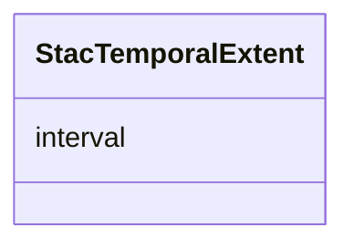

# Class: StacTemporalExtent 


_Temporal extent on a Collection. The wire shape is `{ "interval": [[start, end], ...] }` — a list of `[start_iso, end_iso]` pairs (either side may be null per STAC spec). LinkML emits a flat `list[string]` which the post-processor rewrites to nested list-of-lists per Research R-011._


URI: [debrief:class/StacTemporalExtent](https://debrief.info/schemas/class/StacTemporalExtent)





<!-- no inheritance hierarchy -->


## Slots

| Name | Cardinality and Range | Description | Inheritance |
| ---  | --- | --- | --- |
| [interval](../slots/interval.md) | 1..* <br/> [String](../types/String.md) | List of `[start_datetime, end_datetime]` pairs | direct |


## Usages

| used by | used in | type | used |
| ---  | --- | --- | --- |
| [StacExtent](../classes/StacExtent.md) | [temporal](../slots/temporal.md) | range | [StacTemporalExtent](../classes/StacTemporalExtent.md) |


## Identifier and Mapping Information


### Schema Source


* from schema: https://debrief.info/schemas/debrief


## Mappings

| Mapping Type | Mapped Value |
| ---  | ---  |
| self | debrief:StacTemporalExtent |
| native | debrief:StacTemporalExtent |


## LinkML Source

<!-- TODO: investigate https://stackoverflow.com/questions/37606292/how-to-create-tabbed-code-blocks-in-mkdocs-or-sphinx -->

### Direct

<details>
```yaml
name: StacTemporalExtent
description: 'Temporal extent on a Collection. The wire shape is `{ "interval": [[start,
  end], ...] }` — a list of `[start_iso, end_iso]` pairs (either side may be null
  per STAC spec). LinkML emits a flat `list[string]` which the post-processor rewrites
  to nested list-of-lists per Research R-011.'
from_schema: https://debrief.info/schemas/debrief
attributes:
  interval:
    name: interval
    description: List of `[start_datetime, end_datetime]` pairs. Either side may be
      null (unbounded).
    from_schema: https://debrief.info/schemas/stac
    rank: 1000
    domain_of:
    - StacTemporalExtent
    range: string
    required: true
    multivalued: true

```
</details>

### Induced

<details>
```yaml
name: StacTemporalExtent
description: 'Temporal extent on a Collection. The wire shape is `{ "interval": [[start,
  end], ...] }` — a list of `[start_iso, end_iso]` pairs (either side may be null
  per STAC spec). LinkML emits a flat `list[string]` which the post-processor rewrites
  to nested list-of-lists per Research R-011.'
from_schema: https://debrief.info/schemas/debrief
attributes:
  interval:
    name: interval
    description: List of `[start_datetime, end_datetime]` pairs. Either side may be
      null (unbounded).
    from_schema: https://debrief.info/schemas/stac
    rank: 1000
    alias: interval
    owner: StacTemporalExtent
    domain_of:
    - StacTemporalExtent
    range: string
    required: true
    multivalued: true

```
</details>