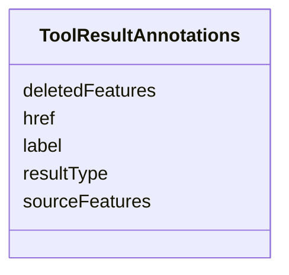

# Class: ToolResultAnnotations 


_Annotations for MCP tool result content items. All results MUST include resultType, sourceFeatures, and label. Deletions MUST include deletedFeatures. Artifacts MUST include href._

__


URI: [debrief:class/ToolResultAnnotations](https://debrief.info/schemas/class/ToolResultAnnotations)





<!-- no inheritance hierarchy -->


## Slots

| Name | Cardinality and Range | Description | Inheritance |
| ---  | --- | --- | --- |
| [resultType](../slots/resultType.md) | 1 <br/> [String](../types/String.md) | Hierarchical result type (e | direct |
| [sourceFeatures](../slots/sourceFeatures.md) | 1..* <br/> [String](../types/String.md) | IDs of input features used to generate this result | direct |
| [label](../slots/label.md) | 1 <br/> [String](../types/String.md) | Human-readable description of the result | direct |
| [href](../slots/href.md) | 0..1 <br/> [String](../types/String.md) | Relative path to artifact file (REQUIRED for artifacts) | direct |
| [deletedFeatures](../slots/deletedFeatures.md) | 1..* <br/> [String](../types/String.md) | IDs of features removed (REQUIRED for deletions) | direct |


## Identifier and Mapping Information


### Schema Source


* from schema: https://debrief.info/schemas/debrief


## Mappings

| Mapping Type | Mapped Value |
| ---  | ---  |
| self | debrief:ToolResultAnnotations |
| native | debrief:ToolResultAnnotations |


## LinkML Source

<!-- TODO: investigate https://stackoverflow.com/questions/37606292/how-to-create-tabbed-code-blocks-in-mkdocs-or-sphinx -->

### Direct

<details>
```yaml
name: ToolResultAnnotations
description: 'Annotations for MCP tool result content items. All results MUST include
  resultType, sourceFeatures, and label. Deletions MUST include deletedFeatures. Artifacts
  MUST include href.

  '
from_schema: https://debrief.info/schemas/debrief
attributes:
  resultType:
    name: resultType
    description: Hierarchical result type (e.g., mutation/track/smoothed)
    from_schema: https://debrief.com/schemas/tool-result
    rank: 1000
    slot_uri: debrief:resultType
    domain_of:
    - ToolResultAnnotations
    range: string
    required: true
    pattern: ^(mutation|addition|deletion|artifact)/[a-z_]+/[a-z_]+$
  sourceFeatures:
    name: sourceFeatures
    description: IDs of input features used to generate this result
    from_schema: https://debrief.com/schemas/tool-result
    rank: 1000
    slot_uri: debrief:sourceFeatures
    domain_of:
    - ToolResultAnnotations
    range: string
    required: true
    multivalued: true
    minimum_cardinality: 1
  label:
    name: label
    description: Human-readable description of the result
    from_schema: https://debrief.com/schemas/tool-result
    slot_uri: debrief:label
    domain_of:
    - VertexMetadata
    - PositionStyleOverride
    - SensorContact
    - TUASolution
    - MultiPointFeatureProperties
    - MultiPolygonFeatureProperties
    - CircleAnnotationProperties
    - RectangleAnnotationProperties
    - LineAnnotationProperties
    - VectorAnnotationProperties
    - PolyAnnotationProperties
    - ToolResultAnnotations
    - DatasetAxisMetadata
    range: string
    required: true
  href:
    name: href
    description: Relative path to artifact file (REQUIRED for artifacts)
    from_schema: https://debrief.com/schemas/tool-result
    slot_uri: debrief:href
    domain_of:
    - StacLink
    - StacAsset
    - ToolResultAnnotations
    - SceneThumbnailAssetEntry
    range: string
  deletedFeatures:
    name: deletedFeatures
    description: IDs of features removed (REQUIRED for deletions)
    from_schema: https://debrief.com/schemas/tool-result
    rank: 1000
    slot_uri: debrief:deletedFeatures
    domain_of:
    - ToolResultAnnotations
    range: string
    multivalued: true
    minimum_cardinality: 1

```
</details>

### Induced

<details>
```yaml
name: ToolResultAnnotations
description: 'Annotations for MCP tool result content items. All results MUST include
  resultType, sourceFeatures, and label. Deletions MUST include deletedFeatures. Artifacts
  MUST include href.

  '
from_schema: https://debrief.info/schemas/debrief
attributes:
  resultType:
    name: resultType
    description: Hierarchical result type (e.g., mutation/track/smoothed)
    from_schema: https://debrief.com/schemas/tool-result
    rank: 1000
    slot_uri: debrief:resultType
    alias: resultType
    owner: ToolResultAnnotations
    domain_of:
    - ToolResultAnnotations
    range: string
    required: true
    pattern: ^(mutation|addition|deletion|artifact)/[a-z_]+/[a-z_]+$
  sourceFeatures:
    name: sourceFeatures
    description: IDs of input features used to generate this result
    from_schema: https://debrief.com/schemas/tool-result
    rank: 1000
    slot_uri: debrief:sourceFeatures
    alias: sourceFeatures
    owner: ToolResultAnnotations
    domain_of:
    - ToolResultAnnotations
    range: string
    required: true
    multivalued: true
    minimum_cardinality: 1
  label:
    name: label
    description: Human-readable description of the result
    from_schema: https://debrief.com/schemas/tool-result
    slot_uri: debrief:label
    alias: label
    owner: ToolResultAnnotations
    domain_of:
    - VertexMetadata
    - PositionStyleOverride
    - SensorContact
    - TUASolution
    - MultiPointFeatureProperties
    - MultiPolygonFeatureProperties
    - CircleAnnotationProperties
    - RectangleAnnotationProperties
    - LineAnnotationProperties
    - VectorAnnotationProperties
    - PolyAnnotationProperties
    - ToolResultAnnotations
    - DatasetAxisMetadata
    range: string
    required: true
  href:
    name: href
    description: Relative path to artifact file (REQUIRED for artifacts)
    from_schema: https://debrief.com/schemas/tool-result
    slot_uri: debrief:href
    alias: href
    owner: ToolResultAnnotations
    domain_of:
    - StacLink
    - StacAsset
    - ToolResultAnnotations
    - SceneThumbnailAssetEntry
    range: string
  deletedFeatures:
    name: deletedFeatures
    description: IDs of features removed (REQUIRED for deletions)
    from_schema: https://debrief.com/schemas/tool-result
    rank: 1000
    slot_uri: debrief:deletedFeatures
    alias: deletedFeatures
    owner: ToolResultAnnotations
    domain_of:
    - ToolResultAnnotations
    range: string
    multivalued: true
    minimum_cardinality: 1

```
</details>