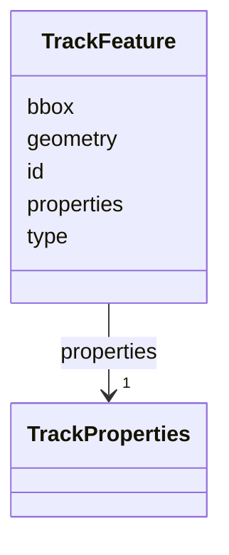

# Class: TrackFeature 


_GeoJSON Feature representing a vessel track_


URI: [debrief:class/TrackFeature](https://debrief.info/schemas/class/TrackFeature)





<!-- no inheritance hierarchy -->


## Slots

| Name | Cardinality and Range | Description | Inheritance |
| ---  | --- | --- | --- |
| [type](../slots/type.md) | 1 <br/> [String](../types/String.md) | GeoJSON type discriminator | direct |
| [id](../slots/id.md) | 1 <br/> [String](../types/String.md) | Unique identifier (UUID recommended) | direct |
| [geometry](../slots/geometry.md) | 1 <br/> [String](../types/String.md)&nbsp;or&nbsp;<br />[GeoJSONLineString](../classes/GeoJSONLineString.md)&nbsp;or&nbsp;<br />[GeoJSONMultiLineString](../classes/GeoJSONMultiLineString.md) | Track path as LineString (simple) or MultiLineString (compound) | direct |
| [properties](../slots/properties.md) | 1 <br/> [TrackProperties](../classes/TrackProperties.md) | Track metadata | direct |
| [bbox](../slots/bbox.md) | 4..* <br/> [Float](../types/Float.md) | Bounding box [minLon, minLat, maxLon, maxLat] | direct |


## Identifier and Mapping Information


### Schema Source


* from schema: https://debrief.info/schemas/debrief


## Mappings

| Mapping Type | Mapped Value |
| ---  | ---  |
| self | debrief:TrackFeature |
| native | debrief:TrackFeature |


## LinkML Source

<!-- TODO: investigate https://stackoverflow.com/questions/37606292/how-to-create-tabbed-code-blocks-in-mkdocs-or-sphinx -->

### Direct

<details>
```yaml
name: TrackFeature
description: GeoJSON Feature representing a vessel track
from_schema: https://debrief.info/schemas/debrief
attributes:
  type:
    name: type
    description: GeoJSON type discriminator
    from_schema: https://debrief.info/schemas/geojson
    domain_of:
    - GeoJSONPoint
    - GeoJSONEmptyPoint
    - GeoJSONLineString
    - GeoJSONPolygon
    - GeoJSONMultiPoint
    - GeoJSONMultiLineString
    - GeoJSONMultiPolygon
    - TrackFeature
    - ReferenceLocation
    - SystemState
    - MultiPointFeature
    - MultiPolygonFeature
    - NarrativeEntry
    - CircleAnnotation
    - RectangleAnnotation
    - LineAnnotation
    - TextAnnotation
    - VectorAnnotation
    - PolyAnnotation
    - ToolParameter
    - FileProvEntry
    - StacItem
    - StacCatalog
    - StacLink
    - StacAsset
    - StacItemAssetDefinition
    - StacCollection
    - RawGeoJSONFeature
    - RawGeoJSONFeatureCollection
    - DatasetAxisMetadata
    - DatasetEntry
    - StoryboardFeature
    - SceneFeature
    - SceneThumbnailAssetEntry
    - MCPContentItem
    - MCPParamSchema
    - ToolsUpdateMessage
    range: string
    required: true
    equals_string: Feature
  id:
    name: id
    description: Unique identifier (UUID recommended)
    from_schema: https://debrief.info/schemas/geojson
    rank: 1000
    domain_of:
    - TrackFeature
    - ReferenceLocation
    - SystemState
    - MultiPointFeature
    - MultiPolygonFeature
    - NarrativeEntry
    - CircleAnnotation
    - RectangleAnnotation
    - LineAnnotation
    - TextAnnotation
    - VectorAnnotation
    - PolyAnnotation
    - Tool
    - PlatformRecord
    - PlotSummary
    - StacItemSummary
    - StacItem
    - StacCatalog
    - StacCollection
    - RawGeoJSONFeature
    - StoryboardProperties
    - SceneProperties
    - StoryboardFeature
    - SceneFeature
    - ToolDefinition
    required: true
  geometry:
    name: geometry
    description: Track path as LineString (simple) or MultiLineString (compound)
    from_schema: https://debrief.info/schemas/geojson
    rank: 1000
    domain_of:
    - TrackFeature
    - ReferenceLocation
    - SystemState
    - MultiPointFeature
    - MultiPolygonFeature
    - InputFeatureState
    - NarrativeEntry
    - CircleAnnotation
    - RectangleAnnotation
    - LineAnnotation
    - TextAnnotation
    - VectorAnnotation
    - PolyAnnotation
    - StacItem
    - RawGeoJSONFeature
    - StoryboardFeature
    - SceneFeature
    required: true
    any_of:
    - range: GeoJSONLineString
    - range: GeoJSONMultiLineString
  properties:
    name: properties
    description: Track metadata
    from_schema: https://debrief.info/schemas/geojson
    rank: 1000
    domain_of:
    - TrackFeature
    - ReferenceLocation
    - SystemState
    - MultiPointFeature
    - MultiPolygonFeature
    - InputFeatureState
    - NarrativeEntry
    - CircleAnnotation
    - RectangleAnnotation
    - LineAnnotation
    - TextAnnotation
    - VectorAnnotation
    - PolyAnnotation
    - StacItem
    - RawGeoJSONFeature
    - StoryboardFeature
    - SceneFeature
    range: TrackProperties
    required: true
  bbox:
    name: bbox
    description: Bounding box [minLon, minLat, maxLon, maxLat]
    from_schema: https://debrief.info/schemas/geojson
    rank: 1000
    domain_of:
    - TrackFeature
    - SystemStateProperties
    - MultiPointFeature
    - MultiPolygonFeature
    - PlotSummary
    - StacItemSummary
    - StacItem
    - StacSpatialExtent
    - RawGeoJSONFeature
    - RawGeoJSONFeatureCollection
    range: float
    multivalued: true
    minimum_cardinality: 4
    maximum_cardinality: 4

```
</details>

### Induced

<details>
```yaml
name: TrackFeature
description: GeoJSON Feature representing a vessel track
from_schema: https://debrief.info/schemas/debrief
attributes:
  type:
    name: type
    description: GeoJSON type discriminator
    from_schema: https://debrief.info/schemas/geojson
    alias: type
    owner: TrackFeature
    domain_of:
    - GeoJSONPoint
    - GeoJSONEmptyPoint
    - GeoJSONLineString
    - GeoJSONPolygon
    - GeoJSONMultiPoint
    - GeoJSONMultiLineString
    - GeoJSONMultiPolygon
    - TrackFeature
    - ReferenceLocation
    - SystemState
    - MultiPointFeature
    - MultiPolygonFeature
    - NarrativeEntry
    - CircleAnnotation
    - RectangleAnnotation
    - LineAnnotation
    - TextAnnotation
    - VectorAnnotation
    - PolyAnnotation
    - ToolParameter
    - FileProvEntry
    - StacItem
    - StacCatalog
    - StacLink
    - StacAsset
    - StacItemAssetDefinition
    - StacCollection
    - RawGeoJSONFeature
    - RawGeoJSONFeatureCollection
    - DatasetAxisMetadata
    - DatasetEntry
    - StoryboardFeature
    - SceneFeature
    - SceneThumbnailAssetEntry
    - MCPContentItem
    - MCPParamSchema
    - ToolsUpdateMessage
    range: string
    required: true
    equals_string: Feature
  id:
    name: id
    description: Unique identifier (UUID recommended)
    from_schema: https://debrief.info/schemas/geojson
    rank: 1000
    alias: id
    owner: TrackFeature
    domain_of:
    - TrackFeature
    - ReferenceLocation
    - SystemState
    - MultiPointFeature
    - MultiPolygonFeature
    - NarrativeEntry
    - CircleAnnotation
    - RectangleAnnotation
    - LineAnnotation
    - TextAnnotation
    - VectorAnnotation
    - PolyAnnotation
    - Tool
    - PlatformRecord
    - PlotSummary
    - StacItemSummary
    - StacItem
    - StacCatalog
    - StacCollection
    - RawGeoJSONFeature
    - StoryboardProperties
    - SceneProperties
    - StoryboardFeature
    - SceneFeature
    - ToolDefinition
    range: string
    required: true
  geometry:
    name: geometry
    description: Track path as LineString (simple) or MultiLineString (compound)
    from_schema: https://debrief.info/schemas/geojson
    rank: 1000
    alias: geometry
    owner: TrackFeature
    domain_of:
    - TrackFeature
    - ReferenceLocation
    - SystemState
    - MultiPointFeature
    - MultiPolygonFeature
    - InputFeatureState
    - NarrativeEntry
    - CircleAnnotation
    - RectangleAnnotation
    - LineAnnotation
    - TextAnnotation
    - VectorAnnotation
    - PolyAnnotation
    - StacItem
    - RawGeoJSONFeature
    - StoryboardFeature
    - SceneFeature
    range: string
    required: true
    any_of:
    - range: GeoJSONLineString
    - range: GeoJSONMultiLineString
  properties:
    name: properties
    description: Track metadata
    from_schema: https://debrief.info/schemas/geojson
    rank: 1000
    alias: properties
    owner: TrackFeature
    domain_of:
    - TrackFeature
    - ReferenceLocation
    - SystemState
    - MultiPointFeature
    - MultiPolygonFeature
    - InputFeatureState
    - NarrativeEntry
    - CircleAnnotation
    - RectangleAnnotation
    - LineAnnotation
    - TextAnnotation
    - VectorAnnotation
    - PolyAnnotation
    - StacItem
    - RawGeoJSONFeature
    - StoryboardFeature
    - SceneFeature
    range: TrackProperties
    required: true
  bbox:
    name: bbox
    description: Bounding box [minLon, minLat, maxLon, maxLat]
    from_schema: https://debrief.info/schemas/geojson
    rank: 1000
    alias: bbox
    owner: TrackFeature
    domain_of:
    - TrackFeature
    - SystemStateProperties
    - MultiPointFeature
    - MultiPolygonFeature
    - PlotSummary
    - StacItemSummary
    - StacItem
    - StacSpatialExtent
    - RawGeoJSONFeature
    - RawGeoJSONFeatureCollection
    range: float
    multivalued: true
    minimum_cardinality: 4
    maximum_cardinality: 4

```
</details>