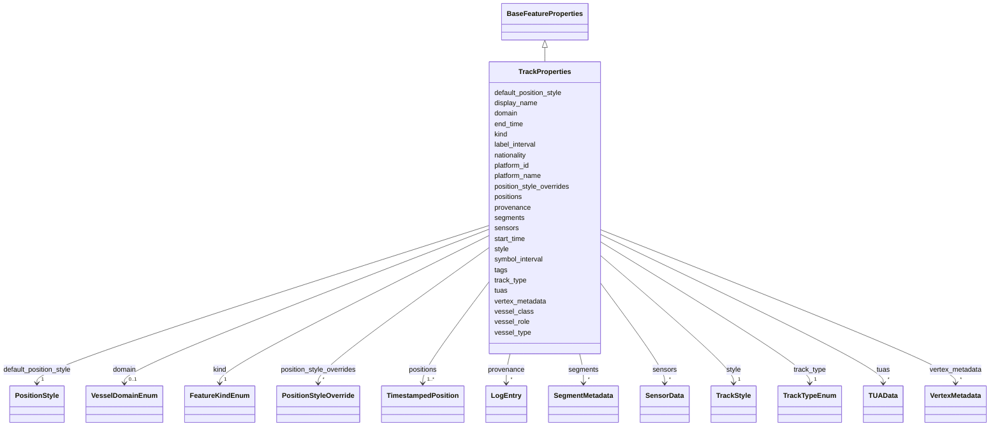

# Class: TrackProperties 


_Properties for a TrackFeature_


URI: [debrief:class/TrackProperties](https://debrief.info/schemas/class/TrackProperties)





## Inheritance
* [BaseFeatureProperties](../classes/BaseFeatureProperties.md)
    * **TrackProperties**


## Slots

| Name | Cardinality and Range | Description | Inheritance |
| ---  | --- | --- | --- |
| [kind](../slots/kind.md) | 1 <br/> [FeatureKindEnum](../enums/FeatureKindEnum.md) | Feature type discriminator | direct |
| [platform_id](../slots/platform_id.md) | 1 <br/> [String](../types/String.md) | Platform/vessel identifier | direct |
| [platform_name](../slots/platform_name.md) | 0..1 <br/> [String](../types/String.md) | Human-readable platform name | direct |
| [track_type](../slots/track_type.md) | 1 <br/> [TrackTypeEnum](../enums/TrackTypeEnum.md) | Type of track | direct |
| [start_time](../slots/start_time.md) | 1 <br/> [datetime](../slots/datetime.md) | Track start time (ISO8601) | direct |
| [end_time](../slots/end_time.md) | 1 <br/> [datetime](../slots/datetime.md) | Track end time (ISO8601) | direct |
| [positions](../slots/positions.md) | 1..* <br/> [TimestampedPosition](../classes/TimestampedPosition.md) | Array of timestamped positions | direct |
| [style](../slots/style.md) | 1 <br/> [TrackStyle](../classes/TrackStyle.md) | Composite styling for track line and position markers | direct |
| [default_position_style](../slots/default_position_style.md) | 1 <br/> [PositionStyle](../classes/PositionStyle.md) | Default styling applied to all positions | direct |
| [symbol_interval](../slots/symbol_interval.md) | 0..1 <br/> [String](../types/String.md) | ISO 8601 duration for interval-based symbol display | direct |
| [label_interval](../slots/label_interval.md) | 0..1 <br/> [String](../types/String.md) | ISO 8601 duration for interval-based label display | direct |
| [position_style_overrides](../slots/position_style_overrides.md) | * <br/> [PositionStyleOverride](../classes/PositionStyleOverride.md) | Parallel array of per-position style overrides | direct |
| [segments](../slots/segments.md) | * <br/> [SegmentMetadata](../classes/SegmentMetadata.md) | Per-segment metadata for compound tracks | direct |
| [sensors](../slots/sensors.md) | * <br/> [SensorData](../classes/SensorData.md) | Embedded sensor data associated with this track | direct |
| [tuas](../slots/tuas.md) | * <br/> [TUAData](../classes/TUAData.md) | Embedded Target Uncertainty Area data associated with this track | direct |
| [display_name](../slots/display_name.md) | 0..1 <br/> [String](../types/String.md) | Human-readable platform display name override | direct |
| [nationality](../slots/nationality.md) | 0..1 <br/> [String](../types/String.md) | ISO 3166-1 alpha-2 country code override (e | direct |
| [vessel_class](../slots/vessel_class.md) | 0..1 <br/> [String](../types/String.md) | Full vessel classification path override using slash-separated notation (e | direct |
| [vessel_type](../slots/vessel_type.md) | 0..1 <br/> [String](../types/String.md) | Vessel type override (leaf of classification path, e | direct |
| [vessel_role](../slots/vessel_role.md) | 0..1 <br/> [String](../types/String.md) | Vessel role override (parent of leaf in classification path, e | direct |
| [domain](../slots/domain.md) | 0..1 <br/> [VesselDomainEnum](../enums/VesselDomainEnum.md) | Vessel domain override | direct |
| [tags](../slots/tags.md) | * <br/> [String](../types/String.md) | Free-text labels assigned to this feature by the analyst | [BaseFeatureProperties](../classes/BaseFeatureProperties.md) |
| [provenance](../slots/provenance.md) | * <br/> [LogEntry](../classes/LogEntry.md) | PROV-aligned provenance records (append-only log of tool operations) | [BaseFeatureProperties](../classes/BaseFeatureProperties.md) |
| [vertex_metadata](../slots/vertex_metadata.md) | * <br/> [VertexMetadata](../classes/VertexMetadata.md) | Sparse list of per-vertex metadata, keyed by `path` | [BaseFeatureProperties](../classes/BaseFeatureProperties.md) |


## Usages

| used by | used in | type | used |
| ---  | --- | --- | --- |
| [TrackFeature](../classes/TrackFeature.md) | [properties](../slots/properties.md) | range | [TrackProperties](../classes/TrackProperties.md) |


## Identifier and Mapping Information


### Schema Source


* from schema: https://debrief.info/schemas/debrief


## Mappings

| Mapping Type | Mapped Value |
| ---  | ---  |
| self | debrief:TrackProperties |
| native | debrief:TrackProperties |


## LinkML Source

<!-- TODO: investigate https://stackoverflow.com/questions/37606292/how-to-create-tabbed-code-blocks-in-mkdocs-or-sphinx -->

### Direct

<details>
```yaml
name: TrackProperties
description: Properties for a TrackFeature
from_schema: https://debrief.info/schemas/debrief
is_a: BaseFeatureProperties
attributes:
  kind:
    name: kind
    description: Feature type discriminator
    from_schema: https://debrief.info/schemas/geojson
    domain_of:
    - BaseFeatureProperties
    - TrackProperties
    - ReferenceLocationProperties
    - SystemStateProperties
    - MultiPointFeatureProperties
    - MultiPolygonFeatureProperties
    - NarrativeEntryProperties
    - CircleAnnotationProperties
    - RectangleAnnotationProperties
    - LineAnnotationProperties
    - TextAnnotationProperties
    - VectorAnnotationProperties
    - PolyAnnotationProperties
    - SelectionRequirement
    - SystemRecordProperties
    - StoryboardProperties
    - SceneProperties
    - MCPSelectionRequirement
    range: FeatureKindEnum
    required: true
    equals_string: TRACK
  platform_id:
    name: platform_id
    description: Platform/vessel identifier
    from_schema: https://debrief.info/schemas/geojson
    rank: 1000
    domain_of:
    - TrackProperties
    required: true
  platform_name:
    name: platform_name
    description: Human-readable platform name
    from_schema: https://debrief.info/schemas/geojson
    rank: 1000
    domain_of:
    - TrackProperties
  track_type:
    name: track_type
    description: Type of track
    from_schema: https://debrief.info/schemas/geojson
    rank: 1000
    domain_of:
    - TrackProperties
    range: TrackTypeEnum
    required: true
  start_time:
    name: start_time
    description: Track start time (ISO8601)
    from_schema: https://debrief.info/schemas/geojson
    domain_of:
    - SegmentMetadata
    - TrackProperties
    - SystemStateProperties
    range: datetime
    required: true
  end_time:
    name: end_time
    description: Track end time (ISO8601)
    from_schema: https://debrief.info/schemas/geojson
    domain_of:
    - SegmentMetadata
    - TrackProperties
    - SystemStateProperties
    range: datetime
    required: true
  positions:
    name: positions
    description: Array of timestamped positions
    from_schema: https://debrief.info/schemas/geojson
    domain_of:
    - SegmentMetadata
    - TrackProperties
    range: TimestampedPosition
    required: true
    multivalued: true
    minimum_cardinality: 2
  style:
    name: style
    description: Composite styling for track line and position markers
    from_schema: https://debrief.info/schemas/geojson
    domain_of:
    - SegmentMetadata
    - TrackProperties
    - ReferenceLocationProperties
    - MultiPointFeatureProperties
    - MultiPolygonFeatureProperties
    - NarrativeEntryProperties
    - CircleAnnotationProperties
    - RectangleAnnotationProperties
    - LineAnnotationProperties
    - TextAnnotationProperties
    - VectorAnnotationProperties
    - PolyAnnotationProperties
    range: TrackStyle
    required: true
  default_position_style:
    name: default_position_style
    description: Default styling applied to all positions
    from_schema: https://debrief.info/schemas/geojson
    rank: 1000
    domain_of:
    - TrackProperties
    range: PositionStyle
    required: true
  symbol_interval:
    name: symbol_interval
    description: ISO 8601 duration for interval-based symbol display. E.g., "PT5M"
      = every 5 minutes, "PT1H" = every hour. Null means no interval-based symbols.
    from_schema: https://debrief.info/schemas/geojson
    rank: 1000
    domain_of:
    - TrackProperties
    range: string
    pattern: ^P(T[0-9]+[HMS])+$|^P[0-9]+D(T[0-9]+[HMS]+)?$
  label_interval:
    name: label_interval
    description: ISO 8601 duration for interval-based label display. Null means no
      interval-based labels.
    from_schema: https://debrief.info/schemas/geojson
    rank: 1000
    domain_of:
    - TrackProperties
    range: string
    pattern: ^P(T[0-9]+[HMS])+$|^P[0-9]+D(T[0-9]+[HMS]+)?$
  position_style_overrides:
    name: position_style_overrides
    description: Parallel array of per-position style overrides. Same length as positions
      array. Use null entries for positions without custom styling.
    from_schema: https://debrief.info/schemas/geojson
    rank: 1000
    domain_of:
    - TrackProperties
    range: PositionStyleOverride
    multivalued: true
  segments:
    name: segments
    description: Per-segment metadata for compound tracks. When present, geometry
      MUST be MultiLineString and segments[i] describes coordinates[i]. When absent,
      geometry is LineString and the flat positions array is used.
    from_schema: https://debrief.info/schemas/geojson
    rank: 1000
    domain_of:
    - TrackProperties
    range: SegmentMetadata
    multivalued: true
    inlined: true
    inlined_as_list: true
  sensors:
    name: sensors
    description: Embedded sensor data associated with this track. Each sensor contains
      named metadata and an array of contact measurements.
    from_schema: https://debrief.info/schemas/geojson
    rank: 1000
    domain_of:
    - TrackProperties
    range: SensorData
    multivalued: true
    inlined: true
    inlined_as_list: true
  tuas:
    name: tuas
    description: Embedded Target Uncertainty Area data associated with this track.
      Each TUA entry is a named collection of time-indexed solutions.
    from_schema: https://debrief.info/schemas/geojson
    rank: 1000
    domain_of:
    - TrackProperties
    range: TUAData
    multivalued: true
    inlined: true
    inlined_as_list: true
  display_name:
    name: display_name
    description: Human-readable platform display name override. When set, overrides
      the registry-derived name for this track.
    from_schema: https://debrief.info/schemas/geojson
    rank: 1000
    domain_of:
    - TrackProperties
    required: false
  nationality:
    name: nationality
    description: ISO 3166-1 alpha-2 country code override (e.g., GB, US). When set,
      overrides the registry-derived nationality.
    from_schema: https://debrief.info/schemas/geojson
    rank: 1000
    domain_of:
    - TrackProperties
    - PlatformRecord
    required: false
    pattern: ^[A-Z]{2}$
  vessel_class:
    name: vessel_class
    description: Full vessel classification path override using slash-separated notation
      (e.g., surface/warship/frigate/type23). When set, overrides registry-derived
      path.
    from_schema: https://debrief.info/schemas/geojson
    rank: 1000
    domain_of:
    - TrackProperties
    - PlatformRecord
    required: false
    pattern: ^[a-z0-9-]+(/[a-z0-9-]+){0,3}$
  vessel_type:
    name: vessel_type
    description: Vessel type override (leaf of classification path, e.g., type23).
      When set, overrides the registry-derived type.
    from_schema: https://debrief.info/schemas/geojson
    rank: 1000
    domain_of:
    - TrackProperties
    - PlatformRecord
    required: false
    pattern: ^[a-z0-9-]+$
  vessel_role:
    name: vessel_role
    description: Vessel role override (parent of leaf in classification path, e.g.,
      frigate). When set, overrides the registry-derived role.
    from_schema: https://debrief.info/schemas/geojson
    rank: 1000
    domain_of:
    - TrackProperties
    - PlatformRecord
    required: false
    pattern: ^[a-z0-9-]+$
  domain:
    name: domain
    description: Vessel domain override. When set, overrides the registry-derived
      domain.
    from_schema: https://debrief.info/schemas/geojson
    rank: 1000
    domain_of:
    - TrackProperties
    - PlatformRecord
    range: VesselDomainEnum
    required: false

```
</details>

### Induced

<details>
```yaml
name: TrackProperties
description: Properties for a TrackFeature
from_schema: https://debrief.info/schemas/debrief
is_a: BaseFeatureProperties
attributes:
  kind:
    name: kind
    description: Feature type discriminator
    from_schema: https://debrief.info/schemas/geojson
    alias: kind
    owner: TrackProperties
    domain_of:
    - BaseFeatureProperties
    - TrackProperties
    - ReferenceLocationProperties
    - SystemStateProperties
    - MultiPointFeatureProperties
    - MultiPolygonFeatureProperties
    - NarrativeEntryProperties
    - CircleAnnotationProperties
    - RectangleAnnotationProperties
    - LineAnnotationProperties
    - TextAnnotationProperties
    - VectorAnnotationProperties
    - PolyAnnotationProperties
    - SelectionRequirement
    - SystemRecordProperties
    - StoryboardProperties
    - SceneProperties
    - MCPSelectionRequirement
    range: FeatureKindEnum
    required: true
    equals_string: TRACK
  platform_id:
    name: platform_id
    description: Platform/vessel identifier
    from_schema: https://debrief.info/schemas/geojson
    rank: 1000
    alias: platform_id
    owner: TrackProperties
    domain_of:
    - TrackProperties
    range: string
    required: true
  platform_name:
    name: platform_name
    description: Human-readable platform name
    from_schema: https://debrief.info/schemas/geojson
    rank: 1000
    alias: platform_name
    owner: TrackProperties
    domain_of:
    - TrackProperties
    range: string
  track_type:
    name: track_type
    description: Type of track
    from_schema: https://debrief.info/schemas/geojson
    rank: 1000
    alias: track_type
    owner: TrackProperties
    domain_of:
    - TrackProperties
    range: TrackTypeEnum
    required: true
  start_time:
    name: start_time
    description: Track start time (ISO8601)
    from_schema: https://debrief.info/schemas/geojson
    alias: start_time
    owner: TrackProperties
    domain_of:
    - SegmentMetadata
    - TrackProperties
    - SystemStateProperties
    range: datetime
    required: true
  end_time:
    name: end_time
    description: Track end time (ISO8601)
    from_schema: https://debrief.info/schemas/geojson
    alias: end_time
    owner: TrackProperties
    domain_of:
    - SegmentMetadata
    - TrackProperties
    - SystemStateProperties
    range: datetime
    required: true
  positions:
    name: positions
    description: Array of timestamped positions
    from_schema: https://debrief.info/schemas/geojson
    alias: positions
    owner: TrackProperties
    domain_of:
    - SegmentMetadata
    - TrackProperties
    range: TimestampedPosition
    required: true
    multivalued: true
    minimum_cardinality: 2
  style:
    name: style
    description: Composite styling for track line and position markers
    from_schema: https://debrief.info/schemas/geojson
    alias: style
    owner: TrackProperties
    domain_of:
    - SegmentMetadata
    - TrackProperties
    - ReferenceLocationProperties
    - MultiPointFeatureProperties
    - MultiPolygonFeatureProperties
    - NarrativeEntryProperties
    - CircleAnnotationProperties
    - RectangleAnnotationProperties
    - LineAnnotationProperties
    - TextAnnotationProperties
    - VectorAnnotationProperties
    - PolyAnnotationProperties
    range: TrackStyle
    required: true
  default_position_style:
    name: default_position_style
    description: Default styling applied to all positions
    from_schema: https://debrief.info/schemas/geojson
    rank: 1000
    alias: default_position_style
    owner: TrackProperties
    domain_of:
    - TrackProperties
    range: PositionStyle
    required: true
  symbol_interval:
    name: symbol_interval
    description: ISO 8601 duration for interval-based symbol display. E.g., "PT5M"
      = every 5 minutes, "PT1H" = every hour. Null means no interval-based symbols.
    from_schema: https://debrief.info/schemas/geojson
    rank: 1000
    alias: symbol_interval
    owner: TrackProperties
    domain_of:
    - TrackProperties
    range: string
    pattern: ^P(T[0-9]+[HMS])+$|^P[0-9]+D(T[0-9]+[HMS]+)?$
  label_interval:
    name: label_interval
    description: ISO 8601 duration for interval-based label display. Null means no
      interval-based labels.
    from_schema: https://debrief.info/schemas/geojson
    rank: 1000
    alias: label_interval
    owner: TrackProperties
    domain_of:
    - TrackProperties
    range: string
    pattern: ^P(T[0-9]+[HMS])+$|^P[0-9]+D(T[0-9]+[HMS]+)?$
  position_style_overrides:
    name: position_style_overrides
    description: Parallel array of per-position style overrides. Same length as positions
      array. Use null entries for positions without custom styling.
    from_schema: https://debrief.info/schemas/geojson
    rank: 1000
    alias: position_style_overrides
    owner: TrackProperties
    domain_of:
    - TrackProperties
    range: PositionStyleOverride
    multivalued: true
  segments:
    name: segments
    description: Per-segment metadata for compound tracks. When present, geometry
      MUST be MultiLineString and segments[i] describes coordinates[i]. When absent,
      geometry is LineString and the flat positions array is used.
    from_schema: https://debrief.info/schemas/geojson
    rank: 1000
    alias: segments
    owner: TrackProperties
    domain_of:
    - TrackProperties
    range: SegmentMetadata
    multivalued: true
    inlined: true
    inlined_as_list: true
  sensors:
    name: sensors
    description: Embedded sensor data associated with this track. Each sensor contains
      named metadata and an array of contact measurements.
    from_schema: https://debrief.info/schemas/geojson
    rank: 1000
    alias: sensors
    owner: TrackProperties
    domain_of:
    - TrackProperties
    range: SensorData
    multivalued: true
    inlined: true
    inlined_as_list: true
  tuas:
    name: tuas
    description: Embedded Target Uncertainty Area data associated with this track.
      Each TUA entry is a named collection of time-indexed solutions.
    from_schema: https://debrief.info/schemas/geojson
    rank: 1000
    alias: tuas
    owner: TrackProperties
    domain_of:
    - TrackProperties
    range: TUAData
    multivalued: true
    inlined: true
    inlined_as_list: true
  display_name:
    name: display_name
    description: Human-readable platform display name override. When set, overrides
      the registry-derived name for this track.
    from_schema: https://debrief.info/schemas/geojson
    rank: 1000
    alias: display_name
    owner: TrackProperties
    domain_of:
    - TrackProperties
    range: string
    required: false
  nationality:
    name: nationality
    description: ISO 3166-1 alpha-2 country code override (e.g., GB, US). When set,
      overrides the registry-derived nationality.
    from_schema: https://debrief.info/schemas/geojson
    rank: 1000
    alias: nationality
    owner: TrackProperties
    domain_of:
    - TrackProperties
    - PlatformRecord
    range: string
    required: false
    pattern: ^[A-Z]{2}$
  vessel_class:
    name: vessel_class
    description: Full vessel classification path override using slash-separated notation
      (e.g., surface/warship/frigate/type23). When set, overrides registry-derived
      path.
    from_schema: https://debrief.info/schemas/geojson
    rank: 1000
    alias: vessel_class
    owner: TrackProperties
    domain_of:
    - TrackProperties
    - PlatformRecord
    range: string
    required: false
    pattern: ^[a-z0-9-]+(/[a-z0-9-]+){0,3}$
  vessel_type:
    name: vessel_type
    description: Vessel type override (leaf of classification path, e.g., type23).
      When set, overrides the registry-derived type.
    from_schema: https://debrief.info/schemas/geojson
    rank: 1000
    alias: vessel_type
    owner: TrackProperties
    domain_of:
    - TrackProperties
    - PlatformRecord
    range: string
    required: false
    pattern: ^[a-z0-9-]+$
  vessel_role:
    name: vessel_role
    description: Vessel role override (parent of leaf in classification path, e.g.,
      frigate). When set, overrides the registry-derived role.
    from_schema: https://debrief.info/schemas/geojson
    rank: 1000
    alias: vessel_role
    owner: TrackProperties
    domain_of:
    - TrackProperties
    - PlatformRecord
    range: string
    required: false
    pattern: ^[a-z0-9-]+$
  domain:
    name: domain
    description: Vessel domain override. When set, overrides the registry-derived
      domain.
    from_schema: https://debrief.info/schemas/geojson
    rank: 1000
    alias: domain
    owner: TrackProperties
    domain_of:
    - TrackProperties
    - PlatformRecord
    range: VesselDomainEnum
    required: false
  tags:
    name: tags
    description: Free-text labels assigned to this feature by the analyst
    from_schema: https://debrief.info/schemas/common
    rank: 1000
    alias: tags
    owner: TrackProperties
    domain_of:
    - BaseFeatureProperties
    - VertexMetadata
    - StacExtensionProperties
    - StacItemSummary
    range: string
    required: false
    multivalued: true
  provenance:
    name: provenance
    description: PROV-aligned provenance records (append-only log of tool operations)
    from_schema: https://debrief.info/schemas/common
    rank: 1000
    alias: provenance
    owner: TrackProperties
    domain_of:
    - BaseFeatureProperties
    - SystemStateProperties
    - SystemRecordProperties
    range: LogEntry
    multivalued: true
    inlined: true
    inlined_as_list: true
  vertex_metadata:
    name: vertex_metadata
    description: 'Sparse list of per-vertex metadata, keyed by `path`. Empty arrays
      MUST be omitted from the serialised feature (FR-010). Duplicate `path` values
      MUST be rejected by validators (contract §Cross-cutting #3). Every concrete
      subclass of `BaseFeatureProperties` gains this slot by inheritance — see spec
      #192, contracts/vertex-metadata-slot.md.'
    from_schema: https://debrief.info/schemas/common
    rank: 1000
    alias: vertex_metadata
    owner: TrackProperties
    domain_of:
    - BaseFeatureProperties
    range: VertexMetadata
    required: false
    multivalued: true
    inlined: true
    inlined_as_list: true

```
</details>