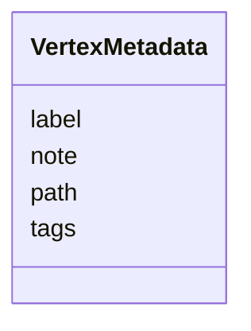

# Class: VertexMetadata 


_Optional, sparse per-vertex annotation attached to a feature. One entry corresponds to one vertex of the parent feature's geometry, identified by the structured `path` slot following the `selectionPath` convention (research note R-008). Carrying any of label/tags/note triggers persistence; an entry with all three absent MUST be omitted on write (the writer's flush function prunes). Path shape depends on parent geometry:_

_  Track       -> "positions/<int>"_

_  Polygon     -> "rings/<int>/vertices/<int>"_

_  LineString  -> "vertices/<int>"_

_  MultiPoint  -> "vertices/<int>"_

_  Point       -> "vertex/0"_


URI: [debrief:class/VertexMetadata](https://debrief.info/schemas/class/VertexMetadata)





<!-- no inheritance hierarchy -->


## Slots

| Name | Cardinality and Range | Description | Inheritance |
| ---  | --- | --- | --- |
| [path](../slots/path.md) | 1 <br/> [String](../types/String.md) | Structured vertex address following the selectionPath convention | direct |
| [label](../slots/label.md) | 0..1 <br/> [String](../types/String.md) | Free-text short label | direct |
| [tags](../slots/tags.md) | * <br/> [String](../types/String.md) | Free-text tag list | direct |
| [note](../slots/note.md) | 0..1 <br/> [String](../types/String.md) | Free-text long note | direct |


## Usages

| used by | used in | type | used |
| ---  | --- | --- | --- |
| [BaseFeatureProperties](../classes/BaseFeatureProperties.md) | [vertex_metadata](../slots/vertex_metadata.md) | range | [VertexMetadata](../classes/VertexMetadata.md) |
| [TrackProperties](../classes/TrackProperties.md) | [vertex_metadata](../slots/vertex_metadata.md) | range | [VertexMetadata](../classes/VertexMetadata.md) |
| [ReferenceLocationProperties](../classes/ReferenceLocationProperties.md) | [vertex_metadata](../slots/vertex_metadata.md) | range | [VertexMetadata](../classes/VertexMetadata.md) |
| [MultiPointFeatureProperties](../classes/MultiPointFeatureProperties.md) | [vertex_metadata](../slots/vertex_metadata.md) | range | [VertexMetadata](../classes/VertexMetadata.md) |
| [MultiPolygonFeatureProperties](../classes/MultiPolygonFeatureProperties.md) | [vertex_metadata](../slots/vertex_metadata.md) | range | [VertexMetadata](../classes/VertexMetadata.md) |
| [NarrativeEntryProperties](../classes/NarrativeEntryProperties.md) | [vertex_metadata](../slots/vertex_metadata.md) | range | [VertexMetadata](../classes/VertexMetadata.md) |
| [CircleAnnotationProperties](../classes/CircleAnnotationProperties.md) | [vertex_metadata](../slots/vertex_metadata.md) | range | [VertexMetadata](../classes/VertexMetadata.md) |
| [RectangleAnnotationProperties](../classes/RectangleAnnotationProperties.md) | [vertex_metadata](../slots/vertex_metadata.md) | range | [VertexMetadata](../classes/VertexMetadata.md) |
| [LineAnnotationProperties](../classes/LineAnnotationProperties.md) | [vertex_metadata](../slots/vertex_metadata.md) | range | [VertexMetadata](../classes/VertexMetadata.md) |
| [TextAnnotationProperties](../classes/TextAnnotationProperties.md) | [vertex_metadata](../slots/vertex_metadata.md) | range | [VertexMetadata](../classes/VertexMetadata.md) |
| [VectorAnnotationProperties](../classes/VectorAnnotationProperties.md) | [vertex_metadata](../slots/vertex_metadata.md) | range | [VertexMetadata](../classes/VertexMetadata.md) |
| [PolyAnnotationProperties](../classes/PolyAnnotationProperties.md) | [vertex_metadata](../slots/vertex_metadata.md) | range | [VertexMetadata](../classes/VertexMetadata.md) |
| [StoryboardProperties](../classes/StoryboardProperties.md) | [vertex_metadata](../slots/vertex_metadata.md) | range | [VertexMetadata](../classes/VertexMetadata.md) |
| [SceneProperties](../classes/SceneProperties.md) | [vertex_metadata](../slots/vertex_metadata.md) | range | [VertexMetadata](../classes/VertexMetadata.md) |


## Identifier and Mapping Information


### Schema Source


* from schema: https://debrief.info/schemas/debrief


## Mappings

| Mapping Type | Mapped Value |
| ---  | ---  |
| self | debrief:VertexMetadata |
| native | debrief:VertexMetadata |


## LinkML Source

<!-- TODO: investigate https://stackoverflow.com/questions/37606292/how-to-create-tabbed-code-blocks-in-mkdocs-or-sphinx -->

### Direct

<details>
```yaml
name: VertexMetadata
description: "Optional, sparse per-vertex annotation attached to a feature. One entry\
  \ corresponds to one vertex of the parent feature's geometry, identified by the\
  \ structured `path` slot following the `selectionPath` convention (research note\
  \ R-008). Carrying any of label/tags/note triggers persistence; an entry with all\
  \ three absent MUST be omitted on write (the writer's flush function prunes). Path\
  \ shape depends on parent geometry:\n  Track       -> \"positions/<int>\"\n  Polygon\
  \     -> \"rings/<int>/vertices/<int>\"\n  LineString  -> \"vertices/<int>\"\n \
  \ MultiPoint  -> \"vertices/<int>\"\n  Point       -> \"vertex/0\""
from_schema: https://debrief.info/schemas/debrief
attributes:
  path:
    name: path
    description: Structured vertex address following the selectionPath convention.
      The class-level regex accepts the union of all per-geometry path shapes; the
      writer additionally checks that the path matches the parent geometry's specific
      shape at flush time. Acts as the identity for an entry within a feature's `vertex_metadata`
      list — duplicates MUST be rejected by validators.
    from_schema: https://debrief.info/schemas/common
    rank: 1000
    identifier: true
    domain_of:
    - VertexMetadata
    - ResultTypePath
    range: string
    required: true
    pattern: ^(positions/[0-9]+|rings/[0-9]+/vertices/[0-9]+|vertices/[0-9]+|vertex/0)$
  label:
    name: label
    description: Free-text short label.
    from_schema: https://debrief.info/schemas/common
    rank: 1000
    domain_of:
    - VertexMetadata
    - PositionStyleOverride
    - SensorContact
    - TUASolution
    - MultiPointFeatureProperties
    - MultiPolygonFeatureProperties
    - CircleAnnotationProperties
    - RectangleAnnotationProperties
    - LineAnnotationProperties
    - VectorAnnotationProperties
    - PolyAnnotationProperties
    - ToolResultAnnotations
    - DatasetAxisMetadata
    range: string
    required: false
  tags:
    name: tags
    description: Free-text tag list. Order is not significant.
    from_schema: https://debrief.info/schemas/common
    domain_of:
    - BaseFeatureProperties
    - VertexMetadata
    - StacExtensionProperties
    - StacItemSummary
    range: string
    required: false
    multivalued: true
  note:
    name: note
    description: Free-text long note.
    from_schema: https://debrief.info/schemas/common
    rank: 1000
    domain_of:
    - VertexMetadata
    range: string
    required: false

```
</details>

### Induced

<details>
```yaml
name: VertexMetadata
description: "Optional, sparse per-vertex annotation attached to a feature. One entry\
  \ corresponds to one vertex of the parent feature's geometry, identified by the\
  \ structured `path` slot following the `selectionPath` convention (research note\
  \ R-008). Carrying any of label/tags/note triggers persistence; an entry with all\
  \ three absent MUST be omitted on write (the writer's flush function prunes). Path\
  \ shape depends on parent geometry:\n  Track       -> \"positions/<int>\"\n  Polygon\
  \     -> \"rings/<int>/vertices/<int>\"\n  LineString  -> \"vertices/<int>\"\n \
  \ MultiPoint  -> \"vertices/<int>\"\n  Point       -> \"vertex/0\""
from_schema: https://debrief.info/schemas/debrief
attributes:
  path:
    name: path
    description: Structured vertex address following the selectionPath convention.
      The class-level regex accepts the union of all per-geometry path shapes; the
      writer additionally checks that the path matches the parent geometry's specific
      shape at flush time. Acts as the identity for an entry within a feature's `vertex_metadata`
      list — duplicates MUST be rejected by validators.
    from_schema: https://debrief.info/schemas/common
    rank: 1000
    identifier: true
    alias: path
    owner: VertexMetadata
    domain_of:
    - VertexMetadata
    - ResultTypePath
    range: string
    required: true
    pattern: ^(positions/[0-9]+|rings/[0-9]+/vertices/[0-9]+|vertices/[0-9]+|vertex/0)$
  label:
    name: label
    description: Free-text short label.
    from_schema: https://debrief.info/schemas/common
    rank: 1000
    alias: label
    owner: VertexMetadata
    domain_of:
    - VertexMetadata
    - PositionStyleOverride
    - SensorContact
    - TUASolution
    - MultiPointFeatureProperties
    - MultiPolygonFeatureProperties
    - CircleAnnotationProperties
    - RectangleAnnotationProperties
    - LineAnnotationProperties
    - VectorAnnotationProperties
    - PolyAnnotationProperties
    - ToolResultAnnotations
    - DatasetAxisMetadata
    range: string
    required: false
  tags:
    name: tags
    description: Free-text tag list. Order is not significant.
    from_schema: https://debrief.info/schemas/common
    alias: tags
    owner: VertexMetadata
    domain_of:
    - BaseFeatureProperties
    - VertexMetadata
    - StacExtensionProperties
    - StacItemSummary
    range: string
    required: false
    multivalued: true
  note:
    name: note
    description: Free-text long note.
    from_schema: https://debrief.info/schemas/common
    rank: 1000
    alias: note
    owner: VertexMetadata
    domain_of:
    - VertexMetadata
    range: string
    required: false

```
</details>