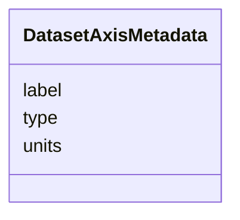

# Class: DatasetAxisMetadata 


_Axis label and type metadata for a dataset chart_


URI: [debrief:class/DatasetAxisMetadata](https://debrief.info/schemas/class/DatasetAxisMetadata)





<!-- no inheritance hierarchy -->


## Slots

| Name | Cardinality and Range | Description | Inheritance |
| ---  | --- | --- | --- |
| [label](../slots/label.md) | 1 <br/> [String](../types/String.md) | Human-readable axis label (e | direct |
| [type](../slots/type.md) | 1 <br/> [String](../types/String.md) | Axis data type (temporal, quantitative) | direct |
| [units](../slots/units.md) | 0..1 <br/> [String](../types/String.md) | Units for the axis values (e | direct |


## Usages

| used by | used in | type | used |
| ---  | --- | --- | --- |
| [DatasetMetadata](../classes/DatasetMetadata.md) | [xAxis](../slots/xAxis.md) | range | [DatasetAxisMetadata](../classes/DatasetAxisMetadata.md) |
| [DatasetMetadata](../classes/DatasetMetadata.md) | [yAxis](../slots/yAxis.md) | range | [DatasetAxisMetadata](../classes/DatasetAxisMetadata.md) |


## Identifier and Mapping Information


### Schema Source


* from schema: https://debrief.info/schemas/debrief


## Mappings

| Mapping Type | Mapped Value |
| ---  | ---  |
| self | debrief:DatasetAxisMetadata |
| native | debrief:DatasetAxisMetadata |


## LinkML Source

<!-- TODO: investigate https://stackoverflow.com/questions/37606292/how-to-create-tabbed-code-blocks-in-mkdocs-or-sphinx -->

### Direct

<details>
```yaml
name: DatasetAxisMetadata
description: Axis label and type metadata for a dataset chart
from_schema: https://debrief.info/schemas/debrief
attributes:
  label:
    name: label
    description: Human-readable axis label (e.g., "Time", "Range")
    from_schema: https://debrief.com/schemas/tool-result
    domain_of:
    - PositionStyleOverride
    - SensorContact
    - TUASolution
    - MultiPointFeatureProperties
    - MultiPolygonFeatureProperties
    - CircleAnnotationProperties
    - RectangleAnnotationProperties
    - LineAnnotationProperties
    - VectorAnnotationProperties
    - PolyAnnotationProperties
    - ToolResultAnnotations
    - DatasetAxisMetadata
    range: string
    required: true
  type:
    name: type
    description: Axis data type (temporal, quantitative)
    from_schema: https://debrief.com/schemas/tool-result
    domain_of:
    - GeoJSONPoint
    - GeoJSONEmptyPoint
    - GeoJSONLineString
    - GeoJSONPolygon
    - GeoJSONMultiPoint
    - GeoJSONMultiLineString
    - GeoJSONMultiPolygon
    - TrackFeature
    - ReferenceLocation
    - SystemState
    - MultiPointFeature
    - MultiPolygonFeature
    - NarrativeEntry
    - CircleAnnotation
    - RectangleAnnotation
    - LineAnnotation
    - TextAnnotation
    - VectorAnnotation
    - PolyAnnotation
    - ToolParameter
    - FileProvEntry
    - StacItem
    - StacCatalog
    - StacLink
    - StacAsset
    - StacItemAssetDefinition
    - StacCollection
    - RawGeoJSONFeature
    - RawGeoJSONFeatureCollection
    - DatasetAxisMetadata
    - DatasetEntry
    - StoryboardFeature
    - SceneFeature
    - SceneThumbnailAssetEntry
    - MCPContentItem
    - MCPParamSchema
    - ToolsUpdateMessage
    range: string
    required: true
  units:
    name: units
    description: Units for the axis values (e.g., "m", "°")
    from_schema: https://debrief.com/schemas/tool-result
    rank: 1000
    domain_of:
    - DatasetAxisMetadata
    range: string

```
</details>

### Induced

<details>
```yaml
name: DatasetAxisMetadata
description: Axis label and type metadata for a dataset chart
from_schema: https://debrief.info/schemas/debrief
attributes:
  label:
    name: label
    description: Human-readable axis label (e.g., "Time", "Range")
    from_schema: https://debrief.com/schemas/tool-result
    alias: label
    owner: DatasetAxisMetadata
    domain_of:
    - PositionStyleOverride
    - SensorContact
    - TUASolution
    - MultiPointFeatureProperties
    - MultiPolygonFeatureProperties
    - CircleAnnotationProperties
    - RectangleAnnotationProperties
    - LineAnnotationProperties
    - VectorAnnotationProperties
    - PolyAnnotationProperties
    - ToolResultAnnotations
    - DatasetAxisMetadata
    range: string
    required: true
  type:
    name: type
    description: Axis data type (temporal, quantitative)
    from_schema: https://debrief.com/schemas/tool-result
    alias: type
    owner: DatasetAxisMetadata
    domain_of:
    - GeoJSONPoint
    - GeoJSONEmptyPoint
    - GeoJSONLineString
    - GeoJSONPolygon
    - GeoJSONMultiPoint
    - GeoJSONMultiLineString
    - GeoJSONMultiPolygon
    - TrackFeature
    - ReferenceLocation
    - SystemState
    - MultiPointFeature
    - MultiPolygonFeature
    - NarrativeEntry
    - CircleAnnotation
    - RectangleAnnotation
    - LineAnnotation
    - TextAnnotation
    - VectorAnnotation
    - PolyAnnotation
    - ToolParameter
    - FileProvEntry
    - StacItem
    - StacCatalog
    - StacLink
    - StacAsset
    - StacItemAssetDefinition
    - StacCollection
    - RawGeoJSONFeature
    - RawGeoJSONFeatureCollection
    - DatasetAxisMetadata
    - DatasetEntry
    - StoryboardFeature
    - SceneFeature
    - SceneThumbnailAssetEntry
    - MCPContentItem
    - MCPParamSchema
    - ToolsUpdateMessage
    range: string
    required: true
  units:
    name: units
    description: Units for the axis values (e.g., "m", "°")
    from_schema: https://debrief.com/schemas/tool-result
    rank: 1000
    alias: units
    owner: DatasetAxisMetadata
    domain_of:
    - DatasetAxisMetadata
    range: string

```
</details>