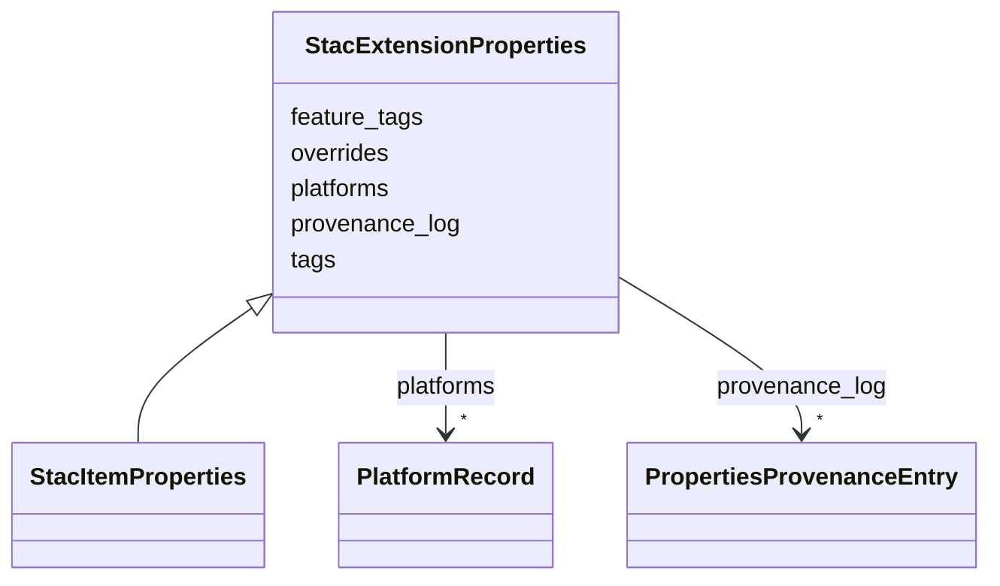

# Class: StacExtensionProperties 


_Extension properties added to STAC item.properties under the debrief: namespace. All properties are optional — existing items without extension properties remain valid. These properties enable filtering, searching, and colour-coding in the Discovery UI._

__


URI: [debrief:class/StacExtensionProperties](https://debrief.info/schemas/class/StacExtensionProperties)





<!-- no inheritance hierarchy -->


## Slots

| Name | Cardinality and Range | Description | Inheritance |
| ---  | --- | --- | --- |
| [platforms](../slots/platforms.md) | * <br/> [PlatformRecord](../classes/PlatformRecord.md) | Fully-resolved per-platform metadata array | direct |
| [tags](../slots/tags.md) | * <br/> [String](../types/String.md) | Plot-level tags — free-text labels applied to the entire plot by the analyst | direct |
| [feature_tags](../slots/feature_tags.md) | * <br/> [String](../types/String.md) | Union of all feature-level tags from the plot's GeoJSON features | direct |
| [overrides](../slots/overrides.md) | * <br/> [String](../types/String.md) | Flat list of field names on item | direct |
| [provenance_log](../slots/provenance_log.md) | * <br/> [PropertiesProvenanceEntry](../classes/PropertiesProvenanceEntry.md) | Per-commit provenance entries written by the Properties Panel | direct |


## Identifier and Mapping Information


### Schema Source


* from schema: https://debrief.info/schemas/debrief


## Mappings

| Mapping Type | Mapped Value |
| ---  | ---  |
| self | debrief:StacExtensionProperties |
| native | debrief:StacExtensionProperties |


## LinkML Source

<!-- TODO: investigate https://stackoverflow.com/questions/37606292/how-to-create-tabbed-code-blocks-in-mkdocs-or-sphinx -->

### Direct

<details>
```yaml
name: StacExtensionProperties
description: 'Extension properties added to STAC item.properties under the debrief:
  namespace. All properties are optional — existing items without extension properties
  remain valid. These properties enable filtering, searching, and colour-coding in
  the Discovery UI.

  '
from_schema: https://debrief.info/schemas/debrief
attributes:
  platforms:
    name: platforms
    description: 'Fully-resolved per-platform metadata array. Each entry represents
      one platform in the plot with merged registry + override data.

      '
    from_schema: https://debrief.info/schemas/stac-extension
    rank: 1000
    slot_uri: debrief:platforms
    domain_of:
    - StacExtensionProperties
    - StacItemSummary
    range: PlatformRecord
    required: false
    multivalued: true
    inlined: true
    inlined_as_list: true
  tags:
    name: tags
    description: 'Plot-level tags — free-text labels applied to the entire plot by
      the analyst. Trimmed non-empty strings with no duplicates.

      '
    from_schema: https://debrief.info/schemas/stac-extension
    slot_uri: debrief:tags
    domain_of:
    - BaseFeatureProperties
    - StacExtensionProperties
    - StacItemSummary
    range: string
    required: false
    multivalued: true
  feature_tags:
    name: feature_tags
    description: 'Union of all feature-level tags from the plot''s GeoJSON features.
      Aggregated at item level for discoverability. Authoritative per-feature tags
      remain in each GeoJSON feature''s properties.

      '
    from_schema: https://debrief.info/schemas/stac-extension
    rank: 1000
    slot_uri: debrief:feature_tags
    domain_of:
    - StacExtensionProperties
    - StacItemSummary
    range: string
    required: false
    multivalued: true
  overrides:
    name: overrides
    description: 'Flat list of field names on item.properties that the analyst has
      overridden via the Properties Panel. Auto-derivation routines (e.g. stacService.updateTemporalMetadata)
      MUST skip any field whose name appears here. Sorted alphabetically on write;
      deduplicated.

      '
    from_schema: https://debrief.info/schemas/stac-extension
    rank: 1000
    slot_uri: debrief:overrides
    domain_of:
    - StacExtensionProperties
    range: string
    required: false
    multivalued: true
  provenance_log:
    name: provenance_log
    description: 'Per-commit provenance entries written by the Properties Panel. Bounded
      at 500 entries per item; overflow rotates to sibling provenance_log_archive.jsonl
      in the item directory. Append-only (Article III.3 — audit trail immutable).

      '
    from_schema: https://debrief.info/schemas/stac-extension
    rank: 1000
    slot_uri: debrief:provenance_log
    domain_of:
    - StacExtensionProperties
    range: PropertiesProvenanceEntry
    required: false
    multivalued: true
    inlined: true
    inlined_as_list: true

```
</details>

### Induced

<details>
```yaml
name: StacExtensionProperties
description: 'Extension properties added to STAC item.properties under the debrief:
  namespace. All properties are optional — existing items without extension properties
  remain valid. These properties enable filtering, searching, and colour-coding in
  the Discovery UI.

  '
from_schema: https://debrief.info/schemas/debrief
attributes:
  platforms:
    name: platforms
    description: 'Fully-resolved per-platform metadata array. Each entry represents
      one platform in the plot with merged registry + override data.

      '
    from_schema: https://debrief.info/schemas/stac-extension
    rank: 1000
    slot_uri: debrief:platforms
    alias: platforms
    owner: StacExtensionProperties
    domain_of:
    - StacExtensionProperties
    - StacItemSummary
    range: PlatformRecord
    required: false
    multivalued: true
    inlined: true
    inlined_as_list: true
  tags:
    name: tags
    description: 'Plot-level tags — free-text labels applied to the entire plot by
      the analyst. Trimmed non-empty strings with no duplicates.

      '
    from_schema: https://debrief.info/schemas/stac-extension
    slot_uri: debrief:tags
    alias: tags
    owner: StacExtensionProperties
    domain_of:
    - BaseFeatureProperties
    - StacExtensionProperties
    - StacItemSummary
    range: string
    required: false
    multivalued: true
  feature_tags:
    name: feature_tags
    description: 'Union of all feature-level tags from the plot''s GeoJSON features.
      Aggregated at item level for discoverability. Authoritative per-feature tags
      remain in each GeoJSON feature''s properties.

      '
    from_schema: https://debrief.info/schemas/stac-extension
    rank: 1000
    slot_uri: debrief:feature_tags
    alias: feature_tags
    owner: StacExtensionProperties
    domain_of:
    - StacExtensionProperties
    - StacItemSummary
    range: string
    required: false
    multivalued: true
  overrides:
    name: overrides
    description: 'Flat list of field names on item.properties that the analyst has
      overridden via the Properties Panel. Auto-derivation routines (e.g. stacService.updateTemporalMetadata)
      MUST skip any field whose name appears here. Sorted alphabetically on write;
      deduplicated.

      '
    from_schema: https://debrief.info/schemas/stac-extension
    rank: 1000
    slot_uri: debrief:overrides
    alias: overrides
    owner: StacExtensionProperties
    domain_of:
    - StacExtensionProperties
    range: string
    required: false
    multivalued: true
  provenance_log:
    name: provenance_log
    description: 'Per-commit provenance entries written by the Properties Panel. Bounded
      at 500 entries per item; overflow rotates to sibling provenance_log_archive.jsonl
      in the item directory. Append-only (Article III.3 — audit trail immutable).

      '
    from_schema: https://debrief.info/schemas/stac-extension
    rank: 1000
    slot_uri: debrief:provenance_log
    alias: provenance_log
    owner: StacExtensionProperties
    domain_of:
    - StacExtensionProperties
    range: PropertiesProvenanceEntry
    required: false
    multivalued: true
    inlined: true
    inlined_as_list: true

```
</details>