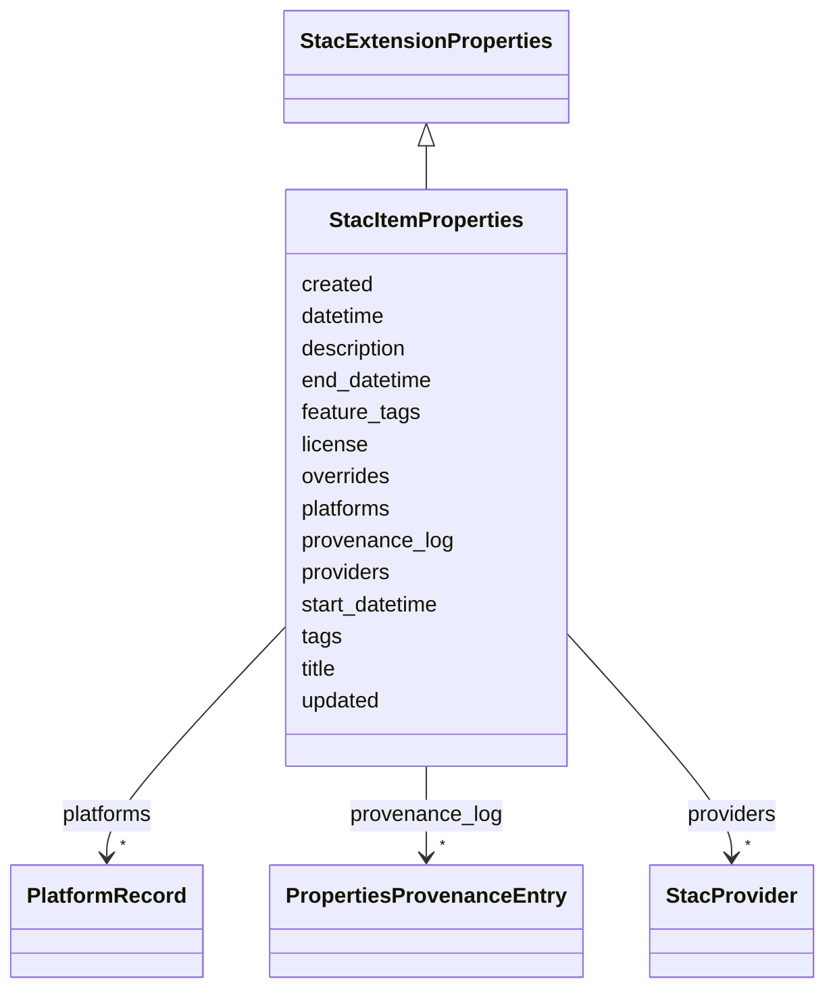

# Class: StacItemProperties 


_STAC Item `properties` block. Carries STAC-spec core fields (`datetime`, `start_datetime?`, `end_datetime?`, `title?`, `description?`, `license?`, `providers?`, `created?`, `updated?`) and mixes in `StacExtensionProperties` from stac-extension.yaml for the `debrief:*` extension fields (Research R-003)._

_Open-record per Article XV.2 — the generator post-processor at `shared/schemas/scripts/generate.py` adds Pydantic `model_config = ConfigDict(extra='allow', ...)` and TypeScript `[key: string]: unknown` so additional `<extension>:<key>` keys (`processing:*`, `proj:*`, future extensions) pass through without rejection. Consumers narrow per extension via per-extension Zod / type-guard helpers (the pattern already established for `debrief:platforms`)._


URI: [debrief:class/StacItemProperties](https://debrief.info/schemas/class/StacItemProperties)





## Inheritance
* **StacItemProperties** [ [StacExtensionProperties](../classes/StacExtensionProperties.md)]


## Slots

| Name | Cardinality and Range | Description | Inheritance |
| ---  | --- | --- | --- |
| [datetime](../slots/datetime.md) | 1 <br/> [String](../types/String.md) | Item datetime per STAC spec (ISO 8601) | direct |
| [start_datetime](../slots/start_datetime.md) | 0..1 <br/> [String](../types/String.md) | ISO 8601 range start | direct |
| [end_datetime](../slots/end_datetime.md) | 0..1 <br/> [String](../types/String.md) | ISO 8601 range end | direct |
| [title](../slots/title.md) | 0..1 <br/> [String](../types/String.md) | Human-readable plot title | direct |
| [description](../slots/description.md) | 0..1 <br/> [String](../types/String.md) | Human-readable plot description | direct |
| [license](../slots/license.md) | 0..1 <br/> [String](../types/String.md) | SPDX identifier or "other" (STAC 1 | direct |
| [providers](../slots/providers.md) | * <br/> [StacProvider](../classes/StacProvider.md) | Organisations involved in producing / hosting this plot | direct |
| [created](../slots/created.md) | 0..1 <br/> [String](../types/String.md) | Processing-time creation timestamp (ISO 8601) | direct |
| [updated](../slots/updated.md) | 0..1 <br/> [String](../types/String.md) | Processing-time last-update timestamp (ISO 8601) | direct |
| [platforms](../slots/platforms.md) | * <br/> [PlatformRecord](../classes/PlatformRecord.md) | Fully-resolved per-platform metadata array | [StacExtensionProperties](../classes/StacExtensionProperties.md) |
| [tags](../slots/tags.md) | * <br/> [String](../types/String.md) | Plot-level tags — free-text labels applied to the entire plot by the analyst | [StacExtensionProperties](../classes/StacExtensionProperties.md) |
| [feature_tags](../slots/feature_tags.md) | * <br/> [String](../types/String.md) | Union of all feature-level tags from the plot's GeoJSON features | [StacExtensionProperties](../classes/StacExtensionProperties.md) |
| [overrides](../slots/overrides.md) | * <br/> [String](../types/String.md) | Flat list of field names on item | [StacExtensionProperties](../classes/StacExtensionProperties.md) |
| [provenance_log](../slots/provenance_log.md) | * <br/> [PropertiesProvenanceEntry](../classes/PropertiesProvenanceEntry.md) | Per-commit provenance entries written by the Properties Panel | [StacExtensionProperties](../classes/StacExtensionProperties.md) |


## Usages

| used by | used in | type | used |
| ---  | --- | --- | --- |
| [StacItem](../classes/StacItem.md) | [properties](../slots/properties.md) | range | [StacItemProperties](../classes/StacItemProperties.md) |


## Identifier and Mapping Information


### Schema Source


* from schema: https://debrief.info/schemas/debrief


## Mappings

| Mapping Type | Mapped Value |
| ---  | ---  |
| self | debrief:StacItemProperties |
| native | debrief:StacItemProperties |


## LinkML Source

<!-- TODO: investigate https://stackoverflow.com/questions/37606292/how-to-create-tabbed-code-blocks-in-mkdocs-or-sphinx -->

### Direct

<details>
```yaml
name: StacItemProperties
description: 'STAC Item `properties` block. Carries STAC-spec core fields (`datetime`,
  `start_datetime?`, `end_datetime?`, `title?`, `description?`, `license?`, `providers?`,
  `created?`, `updated?`) and mixes in `StacExtensionProperties` from stac-extension.yaml
  for the `debrief:*` extension fields (Research R-003).

  Open-record per Article XV.2 — the generator post-processor at `shared/schemas/scripts/generate.py`
  adds Pydantic `model_config = ConfigDict(extra=''allow'', ...)` and TypeScript `[key:
  string]: unknown` so additional `<extension>:<key>` keys (`processing:*`, `proj:*`,
  future extensions) pass through without rejection. Consumers narrow per extension
  via per-extension Zod / type-guard helpers (the pattern already established for
  `debrief:platforms`).'
from_schema: https://debrief.info/schemas/debrief
mixins:
- StacExtensionProperties
attributes:
  datetime:
    name: datetime
    description: Item datetime per STAC spec (ISO 8601). May be null when start_datetime
      + end_datetime are set; the live fixtures always carry a non-null value so it
      is modelled as required string.
    from_schema: https://debrief.info/schemas/stac
    domain_of:
    - PlotSummary
    - StacItemSummary
    - StacItemProperties
    range: string
    required: true
  start_datetime:
    name: start_datetime
    description: ISO 8601 range start. Required when datetime is null.
    from_schema: https://debrief.info/schemas/stac
    domain_of:
    - StacItemSummary
    - StacItemProperties
    range: string
    required: false
  end_datetime:
    name: end_datetime
    description: ISO 8601 range end. Required when datetime is null.
    from_schema: https://debrief.info/schemas/stac
    domain_of:
    - StacItemSummary
    - StacItemProperties
    range: string
    required: false
  title:
    name: title
    description: Human-readable plot title.
    from_schema: https://debrief.info/schemas/stac
    domain_of:
    - PlotSummary
    - StacItemSummary
    - StacItemProperties
    - StacCatalog
    - StacLink
    - StacAsset
    - StacItemAssetDefinition
    - StacCollection
    - DatasetEntry
    - SceneProperties
    - SceneThumbnailAssetEntry
    range: string
    required: false
  description:
    name: description
    description: Human-readable plot description.
    from_schema: https://debrief.info/schemas/stac
    domain_of:
    - ReferenceLocationProperties
    - MultiPointFeatureProperties
    - MultiPolygonFeatureProperties
    - Tool
    - ToolParameter
    - StacProvider
    - StacItemProperties
    - StacCatalog
    - StacAsset
    - StacItemAssetDefinition
    - StacCollection
    - LevelDefinition
    - StoryboardProperties
    - SceneProperties
    - MCPParamSchema
    - MCPToolDefinition
    - ToolDefinition
    range: string
    required: false
  license:
    name: license
    description: SPDX identifier or "other" (STAC 1.1 addition).
    from_schema: https://debrief.info/schemas/stac
    rank: 1000
    domain_of:
    - StacItemProperties
    - StacCollection
    range: string
    required: false
  providers:
    name: providers
    description: Organisations involved in producing / hosting this plot. STAC 1.1
      addition; present on every live preview/workspace/samples item.
    from_schema: https://debrief.info/schemas/stac
    rank: 1000
    domain_of:
    - StacItemProperties
    - StacCollection
    range: StacProvider
    required: false
    multivalued: true
    inlined: true
    inlined_as_list: true
  created:
    name: created
    description: Processing-time creation timestamp (ISO 8601).
    from_schema: https://debrief.info/schemas/stac
    rank: 1000
    domain_of:
    - StacItemProperties
    range: string
    required: false
  updated:
    name: updated
    description: Processing-time last-update timestamp (ISO 8601).
    from_schema: https://debrief.info/schemas/stac
    rank: 1000
    domain_of:
    - StacItemProperties
    range: string
    required: false

```
</details>

### Induced

<details>
```yaml
name: StacItemProperties
description: 'STAC Item `properties` block. Carries STAC-spec core fields (`datetime`,
  `start_datetime?`, `end_datetime?`, `title?`, `description?`, `license?`, `providers?`,
  `created?`, `updated?`) and mixes in `StacExtensionProperties` from stac-extension.yaml
  for the `debrief:*` extension fields (Research R-003).

  Open-record per Article XV.2 — the generator post-processor at `shared/schemas/scripts/generate.py`
  adds Pydantic `model_config = ConfigDict(extra=''allow'', ...)` and TypeScript `[key:
  string]: unknown` so additional `<extension>:<key>` keys (`processing:*`, `proj:*`,
  future extensions) pass through without rejection. Consumers narrow per extension
  via per-extension Zod / type-guard helpers (the pattern already established for
  `debrief:platforms`).'
from_schema: https://debrief.info/schemas/debrief
mixins:
- StacExtensionProperties
attributes:
  datetime:
    name: datetime
    description: Item datetime per STAC spec (ISO 8601). May be null when start_datetime
      + end_datetime are set; the live fixtures always carry a non-null value so it
      is modelled as required string.
    from_schema: https://debrief.info/schemas/stac
    alias: datetime
    owner: StacItemProperties
    domain_of:
    - PlotSummary
    - StacItemSummary
    - StacItemProperties
    range: string
    required: true
  start_datetime:
    name: start_datetime
    description: ISO 8601 range start. Required when datetime is null.
    from_schema: https://debrief.info/schemas/stac
    alias: start_datetime
    owner: StacItemProperties
    domain_of:
    - StacItemSummary
    - StacItemProperties
    range: string
    required: false
  end_datetime:
    name: end_datetime
    description: ISO 8601 range end. Required when datetime is null.
    from_schema: https://debrief.info/schemas/stac
    alias: end_datetime
    owner: StacItemProperties
    domain_of:
    - StacItemSummary
    - StacItemProperties
    range: string
    required: false
  title:
    name: title
    description: Human-readable plot title.
    from_schema: https://debrief.info/schemas/stac
    alias: title
    owner: StacItemProperties
    domain_of:
    - PlotSummary
    - StacItemSummary
    - StacItemProperties
    - StacCatalog
    - StacLink
    - StacAsset
    - StacItemAssetDefinition
    - StacCollection
    - DatasetEntry
    - SceneProperties
    - SceneThumbnailAssetEntry
    range: string
    required: false
  description:
    name: description
    description: Human-readable plot description.
    from_schema: https://debrief.info/schemas/stac
    alias: description
    owner: StacItemProperties
    domain_of:
    - ReferenceLocationProperties
    - MultiPointFeatureProperties
    - MultiPolygonFeatureProperties
    - Tool
    - ToolParameter
    - StacProvider
    - StacItemProperties
    - StacCatalog
    - StacAsset
    - StacItemAssetDefinition
    - StacCollection
    - LevelDefinition
    - StoryboardProperties
    - SceneProperties
    - MCPParamSchema
    - MCPToolDefinition
    - ToolDefinition
    range: string
    required: false
  license:
    name: license
    description: SPDX identifier or "other" (STAC 1.1 addition).
    from_schema: https://debrief.info/schemas/stac
    rank: 1000
    alias: license
    owner: StacItemProperties
    domain_of:
    - StacItemProperties
    - StacCollection
    range: string
    required: false
  providers:
    name: providers
    description: Organisations involved in producing / hosting this plot. STAC 1.1
      addition; present on every live preview/workspace/samples item.
    from_schema: https://debrief.info/schemas/stac
    rank: 1000
    alias: providers
    owner: StacItemProperties
    domain_of:
    - StacItemProperties
    - StacCollection
    range: StacProvider
    required: false
    multivalued: true
    inlined: true
    inlined_as_list: true
  created:
    name: created
    description: Processing-time creation timestamp (ISO 8601).
    from_schema: https://debrief.info/schemas/stac
    rank: 1000
    alias: created
    owner: StacItemProperties
    domain_of:
    - StacItemProperties
    range: string
    required: false
  updated:
    name: updated
    description: Processing-time last-update timestamp (ISO 8601).
    from_schema: https://debrief.info/schemas/stac
    rank: 1000
    alias: updated
    owner: StacItemProperties
    domain_of:
    - StacItemProperties
    range: string
    required: false
  platforms:
    name: platforms
    description: 'Fully-resolved per-platform metadata array. Each entry represents
      one platform in the plot with merged registry + override data.

      '
    from_schema: https://debrief.info/schemas/stac-extension
    rank: 1000
    slot_uri: debrief:platforms
    alias: platforms
    owner: StacItemProperties
    domain_of:
    - StacExtensionProperties
    - StacItemSummary
    range: PlatformRecord
    required: false
    multivalued: true
    inlined: true
    inlined_as_list: true
  tags:
    name: tags
    description: 'Plot-level tags — free-text labels applied to the entire plot by
      the analyst. Trimmed non-empty strings with no duplicates.

      '
    from_schema: https://debrief.info/schemas/stac-extension
    slot_uri: debrief:tags
    alias: tags
    owner: StacItemProperties
    domain_of:
    - BaseFeatureProperties
    - StacExtensionProperties
    - StacItemSummary
    range: string
    required: false
    multivalued: true
  feature_tags:
    name: feature_tags
    description: 'Union of all feature-level tags from the plot''s GeoJSON features.
      Aggregated at item level for discoverability. Authoritative per-feature tags
      remain in each GeoJSON feature''s properties.

      '
    from_schema: https://debrief.info/schemas/stac-extension
    rank: 1000
    slot_uri: debrief:feature_tags
    alias: feature_tags
    owner: StacItemProperties
    domain_of:
    - StacExtensionProperties
    - StacItemSummary
    range: string
    required: false
    multivalued: true
  overrides:
    name: overrides
    description: 'Flat list of field names on item.properties that the analyst has
      overridden via the Properties Panel. Auto-derivation routines (e.g. stacService.updateTemporalMetadata)
      MUST skip any field whose name appears here. Sorted alphabetically on write;
      deduplicated.

      '
    from_schema: https://debrief.info/schemas/stac-extension
    rank: 1000
    slot_uri: debrief:overrides
    alias: overrides
    owner: StacItemProperties
    domain_of:
    - StacExtensionProperties
    range: string
    required: false
    multivalued: true
  provenance_log:
    name: provenance_log
    description: 'Per-commit provenance entries written by the Properties Panel. Bounded
      at 500 entries per item; overflow rotates to sibling provenance_log_archive.jsonl
      in the item directory. Append-only (Article III.3 — audit trail immutable).

      '
    from_schema: https://debrief.info/schemas/stac-extension
    rank: 1000
    slot_uri: debrief:provenance_log
    alias: provenance_log
    owner: StacItemProperties
    domain_of:
    - StacExtensionProperties
    range: PropertiesProvenanceEntry
    required: false
    multivalued: true
    inlined: true
    inlined_as_list: true

```
</details>